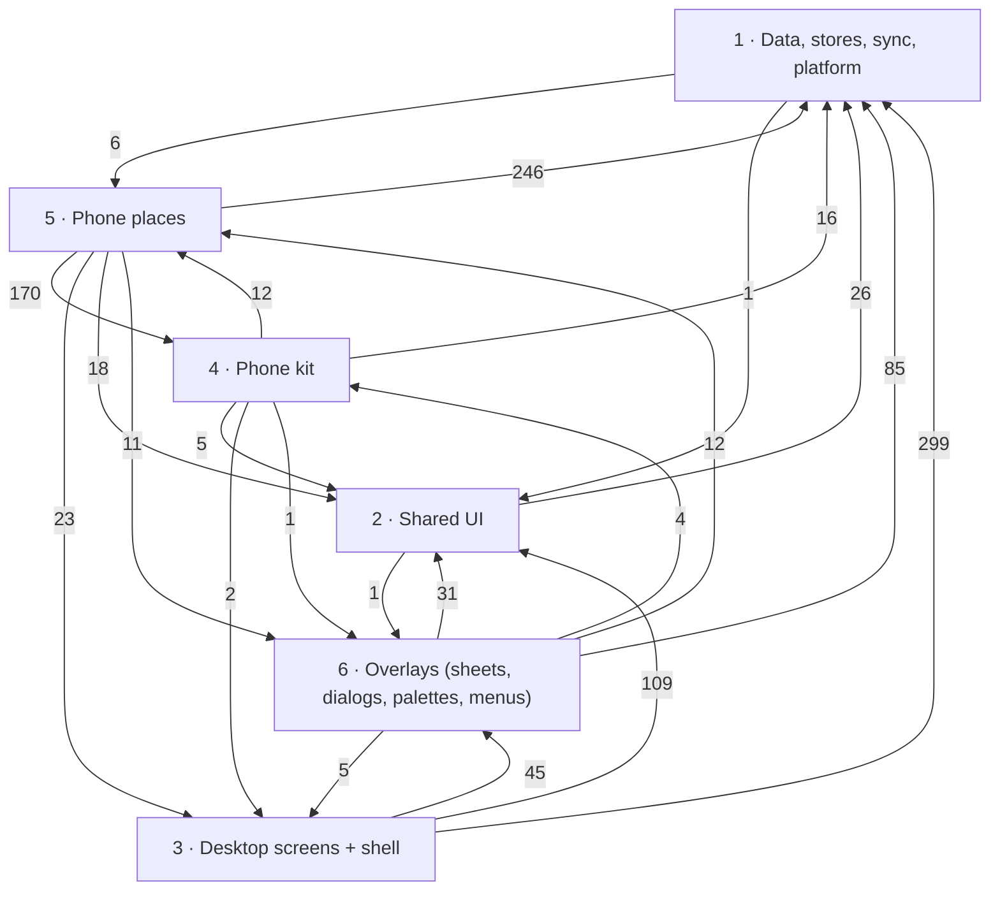

# Needt — component inventory (for the port)

Generated 09.10.26 from the live sources — every top-level symbol that `index-dev.html`, `mobile-dev.html`, `app-dev.html` (via `app-boot.js`) and `auth.html` actually reach (reachability over a Babel reference graph; dead code was pruned to `_archive/port-prune/`). Line numbers are for the sources as of this pass. Read with `PORT.md` (data model, sync, platform, phone rules) and `SCREENS.md`.

**How to read a row.** *Kind*: component · hook · store (a stateful object other code subscribes to) · helper (a function). *Props / args*: the destructured props of a component, the parameters of a function. *Owns*: React state it keeps (`state:`), `needtSync` / localStorage keys it reads or writes (`keys:`), window events it listens to or fires (`events:`), and the first sentence of its doc comment. *Uses*: what it reaches in other files (bare globals and `window.*`) — these become imports. *Target*: suggested module in the ported codebase (Next.js + React + Tailwind, TypeScript; drop the `C2_ / WK_ / Pk…` prefixes that only avoid global clashes). Constants that are plain data are listed per file below each table.

## Layers and how they depend on each other

Arrows point from a layer to what it uses; the number is how many distinct cross-file references go that way (the arrows a port must turn into imports). Anything pointing *down* to 1 is fine; the arrows pointing *up* (data → UI, kit → places, shared UI → screens) are the couplings to cut first — see the table under the graph.

**Upward / sideways references** (a lower layer reaching a higher one, or desktop ⇄ phone):

| From (layer · file:line · symbol) | Reaches (layer · file · symbol) |
| --- | --- |
| over · `Chat.jsx:639` ChatTasksCard | desk · `HomeToday.jsx` HdCheck |
| over · `Chat.jsx:675` ChatChanges | desk · `HomeToday.jsx` HdCheck |
| ui · `paywall.jsx:228` openPaywall | over · `paywall-sheet.jsx` PwHost |
| over · `ctx.jsx:35` cxItems | desk · `sidebar-kit.jsx` skHide |
| over · `ctx.jsx:35` cxItems | desk · `sidebar-kit.jsx` skShow |
| over · `ctx.jsx:89` CxProjectEdit | desk · `work.jsx` NewProjectSheet |
| data · `states.jsx:217` stBannerSpecs | ui · `paywall.jsx` openPaywall |
| place · `MobileAuth.jsx:458` MaPlaceGlyph | desk · `Sidebar.jsx` PlaceGlyph |
| data · `Mobile.jsx:145` mbCalData | desk · `calendar2.jsx` c2Own |
| data · `Mobile.jsx:145` mbCalData | desk · `calendar2.jsx` c2Day |
| kit · `nav-a.jsx:129` NvaGlyph | desk · `Sidebar.jsx` PlaceGlyph |
| kit · `nav-a.jsx:129` NvaGlyph | place · `MobileAuth.jsx` MaPlaceGlyph |
| kit · `nav-a.jsx:314` NeedtNavA | place · `mobile-v2-plates.jsx` PkPlaces |
| data · `phone-kit.jsx:267` pkDay | place · `Mobile.jsx` MB_TODAY |
| data · `phone-kit.jsx:267` pkDay | place · `Mobile.jsx` mbDayKey |
| data · `phone-kit.jsx:267` pkDay | place · `Mobile.jsx` mbAtKey |
| data · `phone-kit.jsx:267` pkDay | place · `Mobile.jsx` mbDueDay |
| data · `phone-kit.jsx:267` pkDay | place · `Mobile.jsx` mbAt |
| data · `phone-kit.jsx:267` pkDay | place · `Mobile.jsx` mbDue |
| kit · `phone-kit.jsx:381` pkTaskPull | place · `Mobile.jsx` mbDue |
| kit · `phone-kit.jsx:381` pkTaskPull | place · `Mobile.jsx` mbAt |
| kit · `phone-kit.jsx:381` pkTaskPull | place · `Mobile.jsx` mbTime |
| kit · `phone-kit.jsx:480` PkGlyph | over · `popovers.jsx` Art |
| kit · `phone-kit.jsx:480` PkGlyph | desk · `Sidebar.jsx` PlaceGlyph |
| kit · `phone-kit.jsx:692` PkTaskRow | place · `Mobile.jsx` mbAt |
| kit · `phone-kit.jsx:692` PkTaskRow | place · `Mobile.jsx` mbTime |
| kit · `phone-kit.jsx:692` PkTaskRow | place · `Mobile.jsx` mbDue |
| kit · `phone-kit.jsx:692` PkTaskRow | place · `Mobile.jsx` mbDur |
| kit · `phone-kit.jsx:692` PkTaskRow | place · `Mobile.jsx` mbPName |
| kit · `phone-kit.jsx:692` PkTaskRow | place · `Mobile.jsx` mbHue |
| kit · `phone-kit.jsx:1396` PkHueTile | place · `Mobile.jsx` MbmPinMark |
| place · `mobile-v2-plates.jsx:209` V2pWeek | desk · `calendar2.jsx` C2_TODAY |
| place · `mobile-v2-plates.jsx:209` V2pWeek | desk · `calendar2.jsx` C2_LONG |
| place · `mobile-v2-plates.jsx:234` V2pMonth | desk · `calendar2.jsx` C2_RANGE |
| place · `mobile-v2-plates.jsx:234` V2pMonth | desk · `calendar2.jsx` C2_TODAY |
| place · `mobile-v2-plates.jsx:273` V2pCalendar | desk · `calendar2.jsx` C2_RANGE |
| place · `mobile-v2-plates.jsx:273` V2pCalendar | desk · `calendar2.jsx` C2_TODAY |
| place · `mobile-v2-plates.jsx:273` V2pCalendar | desk · `calendar2.jsx` C2_NOW |
| place · `mobile-v2-plates.jsx:273` V2pCalendar | desk · `calendar2.jsx` c2Time |
| place · `mobile-v2-plates.jsx:273` V2pCalendar | desk · `calendar2.jsx` c2Dur |
| place · `mobile-v2-plates.jsx:273` V2pCalendar | desk · `calendar2.jsx` C2_SOURCE_NAME |
| place · `mobile-v2-plates.jsx:273` V2pCalendar | desk · `calendar2.jsx` c2Hue |
| place · `mobile-v2-plates.jsx:273` V2pCalendar | desk · `calendar2.jsx` C2_LONG |
| place · `mobile-v2-plates.jsx:273` V2pCalendar | desk · `calendar2.jsx` c2Range |
| over · `phone-overlays.jsx:68` PkTaskSheet | place · `Mobile.jsx` mbAt |
| over · `phone-overlays.jsx:68` PkTaskSheet | place · `Mobile.jsx` mbDueDay |
| over · `phone-overlays.jsx:68` PkTaskSheet | place · `Mobile.jsx` mbPName |
| over · `phone-overlays.jsx:68` PkTaskSheet | place · `Mobile.jsx` MB_TODAY |
| over · `phone-overlays.jsx:68` PkTaskSheet | place · `Mobile.jsx` mbHue |
| over · `phone-overlays.jsx:68` PkTaskSheet | place · `Mobile.jsx` mbDue |
| over · `phone-overlays.jsx:68` PkTaskSheet | place · `Mobile.jsx` mbTime |
| over · `phone-overlays.jsx:68` PkTaskSheet | place · `Mobile.jsx` mbDur |
| over · `phone-overlays.jsx:198` PkComposer | place · `Mobile.jsx` mbHue |
| over · `phone-overlays.jsx:280` PkAsk | place · `Mobile.jsx` mbUseStates |
| over · `phone-overlays.jsx:280` PkAsk | place · `Mobile.jsx` MB_ASK |
| over · `phone-overlays.jsx:280` PkAsk | place · `Mobile.jsx` MbStGlyph |
| place · `phone-docs.jsx:1588` PdDocs | desk · `places.jsx` SHARED |
| place · `phone-docs.jsx:1588` PdDocs | desk · `places.jsx` TrashScreen |
| place · `phone-places.jsx:602` PplShared | desk · `places.jsx` TrashScreen |
| place · `phone-places.jsx:602` PplShared | desk · `places.jsx` SHARED |
| place · `phone-settings.jsx:227` psSidebarNow | desk · `sidebar-kit.jsx` SK_PLACES |
| place · `phone-settings.jsx:528` PsSidebar | desk · `sidebar-kit.jsx` SK_PLACES |
| place · `phone-settings.jsx:565` PsData | desk · `import.jsx` needtImport |

### File dependency graph

```mermaid
flowchart LR
  subgraph D["1 · Data, stores, sync, platform"]
    cssvar_js["cssvar.js"]
    sync_js["sync.js"]
    platform_js["platform.js"]
    Data_js["Data.js"]
    connections_data_js["connections-data.js"]
    needt_lazy_js["needt-lazy.js"]
    stores_jsx["stores.jsx"]
    settings_kit_jsx["settings-kit.jsx"]
    ColumnsView_jsx["ColumnsView.jsx"]
    doc_style_jsx["doc-style.jsx"]
    states_jsx["states.jsx"]
    app_boot_js["app-boot.js"]
  end
  subgraph U["2 · Shared UI"]
    needt_icons_js["needt-icons.js"]
    brand_icons_js["brand-icons.js"]
    motion_js["motion.js"]
    AiOrb_jsx["AiOrb.jsx"]
    app_icon_jsx["app-icon.jsx"]
    Drag_jsx["Drag.jsx"]
    Miniature_jsx["Miniature.jsx"]
    scenes_jsx["scenes.jsx"]
    paywall_jsx["paywall.jsx"]
    task_jsx["task.jsx"]
    ExposureWordmark_jsx["ExposureWordmark.jsx"]
    Drift_jsx["Drift.jsx"]
    Habits_jsx["Habits.jsx"]
    docs_kit_jsx["docs-kit.jsx"]
  end
  subgraph S["3 · Desktop screens + shell"]
    Brief_jsx["Brief.jsx"]
    sidebar_kit_jsx["sidebar-kit.jsx"]
    Sidebar_jsx["Sidebar.jsx"]
    focus_jsx["focus.jsx"]
    HomeToday_jsx["HomeToday.jsx"]
    TodayScreen_jsx["TodayScreen.jsx"]
    SettingsScreen_jsx["SettingsScreen.jsx"]
    AuthScreen_jsx["AuthScreen.jsx"]
    DocsScreen_jsx["DocsScreen.jsx"]
    MailScreen_jsx["MailScreen.jsx"]
    import_jsx["import.jsx"]
    places_jsx["places.jsx"]
    topbar_jsx["topbar.jsx"]
    work_jsx["work.jsx"]
    calendar2_jsx["calendar2.jsx"]
    connections_jsx["connections.jsx"]
    App_jsx["App.jsx"]
  end
  subgraph K["4 · Phone kit"]
    ios_frame_jsx["ios-frame.jsx"]
    nav_a_jsx["nav-a.jsx"]
    mobile_nav_jsx["mobile-nav.jsx"]
    phone_kit_jsx["phone-kit.jsx"]
    phone_drag_jsx["phone-drag.jsx"]
  end
  subgraph P["5 · Phone places"]
    MobileAuth_jsx["MobileAuth.jsx"]
    Mobile_jsx["Mobile.jsx"]
    mobile_v2_plates_jsx["mobile-v2-plates.jsx"]
    phone_tasks_jsx["phone-tasks.jsx"]
    phone_docs_jsx["phone-docs.jsx"]
    phone_mail_jsx["phone-mail.jsx"]
    phone_habits_jsx["phone-habits.jsx"]
    phone_places_jsx["phone-places.jsx"]
    phone_settings_jsx["phone-settings.jsx"]
  end
  subgraph O["6 · Overlays (sheets, dialogs, palettes, menus)"]
    Notifications_jsx["Notifications.jsx"]
    Chat_jsx["Chat.jsx"]
    Composer_jsx["Composer.jsx"]
    AgentCursor_jsx["AgentCursor.jsx"]
    popovers_jsx["popovers.jsx"]
    paywall_sheet_jsx["paywall-sheet.jsx"]
    ctx_jsx["ctx.jsx"]
    Help_jsx["Help.jsx"]
    Bug_jsx["Bug.jsx"]
    search_jsx["search.jsx"]
    Dialogs_jsx["Dialogs.jsx"]
    phone_overlays_jsx["phone-overlays.jsx"]
  end
  App_jsx --> AgentCursor_jsx
  App_jsx --> AuthScreen_jsx
  App_jsx --> Bug_jsx
  App_jsx --> Chat_jsx
  App_jsx --> Composer_jsx
  App_jsx --> Data_js
  App_jsx --> Dialogs_jsx
  App_jsx --> DocsScreen_jsx
  App_jsx --> Drag_jsx
  App_jsx --> Drift_jsx
  App_jsx --> Help_jsx
  App_jsx --> MailScreen_jsx
  App_jsx --> Notifications_jsx
  App_jsx --> SettingsScreen_jsx
  App_jsx --> Sidebar_jsx
  App_jsx --> TodayScreen_jsx
  App_jsx --> calendar2_jsx
  App_jsx --> connections_jsx
  App_jsx --> ctx_jsx
  App_jsx --> places_jsx
  App_jsx --> search_jsx
  App_jsx --> settings_kit_jsx
  App_jsx --> sidebar_kit_jsx
  App_jsx --> states_jsx
  App_jsx --> stores_jsx
  App_jsx --> sync_js
  App_jsx --> topbar_jsx
  App_jsx --> work_jsx
  AuthScreen_jsx --> Composer_jsx
  AuthScreen_jsx --> Data_js
  AuthScreen_jsx --> ExposureWordmark_jsx
  AuthScreen_jsx --> Sidebar_jsx
  AuthScreen_jsx --> app_icon_jsx
  AuthScreen_jsx --> paywall_sheet_jsx
  AuthScreen_jsx --> popovers_jsx
  AuthScreen_jsx --> scenes_jsx
  AuthScreen_jsx --> settings_kit_jsx
  AuthScreen_jsx --> sidebar_kit_jsx
  AuthScreen_jsx --> states_jsx
  AuthScreen_jsx --> stores_jsx
  Brief_jsx --> AiOrb_jsx
  Chat_jsx --> AiOrb_jsx
  Chat_jsx --> Data_js
  Chat_jsx --> HomeToday_jsx
  Chat_jsx --> calendar2_jsx
  Chat_jsx --> doc_style_jsx
  Chat_jsx --> motion_js
  Chat_jsx --> paywall_jsx
  Chat_jsx --> platform_js
  Chat_jsx --> popovers_jsx
  Chat_jsx --> scenes_jsx
  Chat_jsx --> states_jsx
  Chat_jsx --> stores_jsx
  Chat_jsx --> sync_js
  ColumnsView_jsx --> Data_js
  Composer_jsx --> ColumnsView_jsx
  Composer_jsx --> motion_js
  Data_js --> stores_jsx
  Data_js --> sync_js
  Dialogs_jsx --> Data_js
  Dialogs_jsx --> calendar2_jsx
  Dialogs_jsx --> platform_js
  Dialogs_jsx --> stores_jsx
  Dialogs_jsx --> task_jsx
  DocsScreen_jsx --> Data_js
  DocsScreen_jsx --> Sidebar_jsx
  DocsScreen_jsx --> brand_icons_js
  DocsScreen_jsx --> cssvar_js
  DocsScreen_jsx --> doc_style_jsx
  DocsScreen_jsx --> docs_kit_jsx
  DocsScreen_jsx --> import_jsx
  DocsScreen_jsx --> motion_js
  DocsScreen_jsx --> paywall_jsx
  DocsScreen_jsx --> platform_js
  DocsScreen_jsx --> popovers_jsx
  DocsScreen_jsx --> sidebar_kit_jsx
  DocsScreen_jsx --> stores_jsx
  DocsScreen_jsx --> sync_js
  Drift_jsx --> cssvar_js
  Habits_jsx --> Data_js
  HomeToday_jsx --> Data_js
  HomeToday_jsx --> Sidebar_jsx
  HomeToday_jsx --> calendar2_jsx
  HomeToday_jsx --> paywall_jsx
  HomeToday_jsx --> popovers_jsx
  HomeToday_jsx --> stores_jsx
  HomeToday_jsx --> task_jsx
  HomeToday_jsx --> work_jsx
  MailScreen_jsx --> Data_js
  MailScreen_jsx --> calendar2_jsx
  MailScreen_jsx --> motion_js
  MailScreen_jsx --> platform_js
  MailScreen_jsx --> popovers_jsx
  MailScreen_jsx --> stores_jsx
  MailScreen_jsx --> task_jsx
  Miniature_jsx --> Data_js
  MobileAuth_jsx --> AiOrb_jsx
  MobileAuth_jsx --> Composer_jsx
  MobileAuth_jsx --> Data_js
  MobileAuth_jsx --> ExposureWordmark_jsx
  MobileAuth_jsx --> Mobile_jsx
  MobileAuth_jsx --> Sidebar_jsx
  MobileAuth_jsx --> app_icon_jsx
  MobileAuth_jsx --> brand_icons_js
  MobileAuth_jsx --> paywall_sheet_jsx
  MobileAuth_jsx --> phone_kit_jsx
  MobileAuth_jsx --> popovers_jsx
  MobileAuth_jsx --> scenes_jsx
  MobileAuth_jsx --> settings_kit_jsx
  MobileAuth_jsx --> states_jsx
  MobileAuth_jsx --> stores_jsx
  Mobile_jsx --> ColumnsView_jsx
  Mobile_jsx --> Data_js
  Mobile_jsx --> calendar2_jsx
  Mobile_jsx --> cssvar_js
  Mobile_jsx --> doc_style_jsx
  Mobile_jsx --> docs_kit_jsx
  Mobile_jsx --> states_jsx
  Mobile_jsx --> stores_jsx
  Mobile_jsx --> sync_js
  SettingsScreen_jsx --> App_jsx
  SettingsScreen_jsx --> MailScreen_jsx
  SettingsScreen_jsx --> Miniature_jsx
  SettingsScreen_jsx --> import_jsx
  SettingsScreen_jsx --> paywall_jsx
  SettingsScreen_jsx --> scenes_jsx
  SettingsScreen_jsx --> settings_kit_jsx
  SettingsScreen_jsx --> stores_jsx
  SettingsScreen_jsx --> sync_js
  Sidebar_jsx --> Data_js
  Sidebar_jsx --> calendar2_jsx
  Sidebar_jsx --> ctx_jsx
  Sidebar_jsx --> docs_kit_jsx
  Sidebar_jsx --> focus_jsx
  Sidebar_jsx --> import_jsx
  Sidebar_jsx --> motion_js
  Sidebar_jsx --> paywall_jsx
  Sidebar_jsx --> platform_js
  Sidebar_jsx --> popovers_jsx
  Sidebar_jsx --> sidebar_kit_jsx
  Sidebar_jsx --> stores_jsx
  Sidebar_jsx --> sync_js
  Sidebar_jsx --> work_jsx
  TodayScreen_jsx --> Brief_jsx
  TodayScreen_jsx --> Data_js
  TodayScreen_jsx --> HomeToday_jsx
  calendar2_jsx --> ColumnsView_jsx
  calendar2_jsx --> Data_js
  calendar2_jsx --> Sidebar_jsx
  calendar2_jsx --> motion_js
  calendar2_jsx --> stores_jsx
  calendar2_jsx --> sync_js
  calendar2_jsx --> task_jsx
  calendar2_jsx --> topbar_jsx
  connections_jsx --> brand_icons_js
  connections_jsx --> motion_js
  connections_jsx --> paywall_jsx
  connections_jsx --> platform_js
  connections_jsx --> scenes_jsx
  connections_jsx --> stores_jsx
  connections_jsx --> sync_js
  ctx_jsx --> Data_js
  ctx_jsx --> motion_js
  ctx_jsx --> platform_js
  ctx_jsx --> sidebar_kit_jsx
  ctx_jsx --> stores_jsx
  ctx_jsx --> work_jsx
  doc_style_jsx --> cssvar_js
  docs_kit_jsx --> doc_style_jsx
  docs_kit_jsx --> stores_jsx
  focus_jsx --> ColumnsView_jsx
  focus_jsx --> Data_js
  focus_jsx --> motion_js
  focus_jsx --> scenes_jsx
  focus_jsx --> stores_jsx
  focus_jsx --> sync_js
  import_jsx --> Data_js
  import_jsx --> calendar2_jsx
  import_jsx --> platform_js
  import_jsx --> stores_jsx
  ios_frame_jsx --> cssvar_js
  mobile_nav_jsx --> Data_js
  mobile_nav_jsx --> Mobile_jsx
  mobile_nav_jsx --> stores_jsx
  mobile_v2_plates_jsx --> Data_js
  mobile_v2_plates_jsx --> MobileAuth_jsx
  mobile_v2_plates_jsx --> Mobile_jsx
  mobile_v2_plates_jsx --> calendar2_jsx
  mobile_v2_plates_jsx --> ios_frame_jsx
  mobile_v2_plates_jsx --> mobile_nav_jsx
  mobile_v2_plates_jsx --> nav_a_jsx
  mobile_v2_plates_jsx --> paywall_jsx
  mobile_v2_plates_jsx --> paywall_sheet_jsx
  mobile_v2_plates_jsx --> phone_kit_jsx
  mobile_v2_plates_jsx --> phone_overlays_jsx
  mobile_v2_plates_jsx --> stores_jsx
  mobile_v2_plates_jsx --> sync_js
  nav_a_jsx --> AiOrb_jsx
  nav_a_jsx --> MobileAuth_jsx
  nav_a_jsx --> Sidebar_jsx
  nav_a_jsx --> mobile_nav_jsx
  nav_a_jsx --> mobile_v2_plates_jsx
  nav_a_jsx --> paywall_jsx
  nav_a_jsx --> phone_kit_jsx
  nav_a_jsx --> scenes_jsx
  nav_a_jsx --> stores_jsx
  paywall_jsx --> paywall_sheet_jsx
  paywall_jsx --> scenes_jsx
  paywall_jsx --> sync_js
  paywall_sheet_jsx --> app_icon_jsx
  paywall_sheet_jsx --> paywall_jsx
  paywall_sheet_jsx --> scenes_jsx
  paywall_sheet_jsx --> states_jsx
  paywall_sheet_jsx --> stores_jsx
  phone_docs_jsx --> Data_js
  phone_docs_jsx --> Mobile_jsx
  phone_docs_jsx --> cssvar_js
  phone_docs_jsx --> doc_style_jsx
  phone_docs_jsx --> docs_kit_jsx
  phone_docs_jsx --> nav_a_jsx
  phone_docs_jsx --> phone_kit_jsx
  phone_docs_jsx --> places_jsx
  phone_docs_jsx --> platform_js
  phone_docs_jsx --> popovers_jsx
  phone_docs_jsx --> stores_jsx
  phone_docs_jsx --> sync_js
  phone_drag_jsx --> platform_js
  phone_habits_jsx --> Data_js
  phone_habits_jsx --> Habits_jsx
  phone_habits_jsx --> Mobile_jsx
  phone_habits_jsx --> phone_kit_jsx
  phone_habits_jsx --> platform_js
  phone_habits_jsx --> stores_jsx
  phone_kit_jsx --> Data_js
  phone_kit_jsx --> Mobile_jsx
  phone_kit_jsx --> Sidebar_jsx
  phone_kit_jsx --> nav_a_jsx
  phone_kit_jsx --> platform_js
  phone_kit_jsx --> popovers_jsx
  phone_kit_jsx --> scenes_jsx
  phone_kit_jsx --> states_jsx
  phone_mail_jsx --> Data_js
  phone_mail_jsx --> Mobile_jsx
  phone_mail_jsx --> calendar2_jsx
  phone_mail_jsx --> phone_kit_jsx
  phone_mail_jsx --> platform_js
  phone_mail_jsx --> stores_jsx
  phone_overlays_jsx --> AiOrb_jsx
  phone_overlays_jsx --> Composer_jsx
  phone_overlays_jsx --> Data_js
  phone_overlays_jsx --> Mobile_jsx
  phone_overlays_jsx --> paywall_sheet_jsx
  phone_overlays_jsx --> phone_kit_jsx
  phone_overlays_jsx --> platform_js
  phone_overlays_jsx --> stores_jsx
  phone_places_jsx --> Data_js
  phone_places_jsx --> Mobile_jsx
  phone_places_jsx --> brand_icons_js
  phone_places_jsx --> connections_data_js
  phone_places_jsx --> paywall_jsx
  phone_places_jsx --> phone_kit_jsx
  phone_places_jsx --> places_jsx
  phone_places_jsx --> stores_jsx
  phone_places_jsx --> sync_js
  phone_settings_jsx --> App_jsx
  phone_settings_jsx --> Miniature_jsx
  phone_settings_jsx --> MobileAuth_jsx
  phone_settings_jsx --> brand_icons_js
  phone_settings_jsx --> import_jsx
  phone_settings_jsx --> mobile_v2_plates_jsx
  phone_settings_jsx --> paywall_jsx
  phone_settings_jsx --> phone_kit_jsx
  phone_settings_jsx --> sidebar_kit_jsx
  phone_settings_jsx --> stores_jsx
  phone_settings_jsx --> sync_js
  phone_tasks_jsx --> Data_js
  phone_tasks_jsx --> Mobile_jsx
  phone_tasks_jsx --> phone_drag_jsx
  phone_tasks_jsx --> phone_kit_jsx
  phone_tasks_jsx --> stores_jsx
  places_jsx --> ColumnsView_jsx
  places_jsx --> Data_js
  places_jsx --> DocsScreen_jsx
  places_jsx --> Habits_jsx
  places_jsx --> Sidebar_jsx
  places_jsx --> cssvar_js
  places_jsx --> docs_kit_jsx
  places_jsx --> motion_js
  places_jsx --> paywall_jsx
  places_jsx --> platform_js
  places_jsx --> popovers_jsx
  places_jsx --> scenes_jsx
  places_jsx --> stores_jsx
  places_jsx --> sync_js
  popovers_jsx --> motion_js
  scenes_jsx --> cssvar_js
  sidebar_kit_jsx --> motion_js
  sidebar_kit_jsx --> popovers_jsx
  sidebar_kit_jsx --> sync_js
  states_jsx --> paywall_jsx
  states_jsx --> stores_jsx
  states_jsx --> sync_js
  stores_jsx --> ColumnsView_jsx
  stores_jsx --> Data_js
  stores_jsx --> Mobile_jsx
  stores_jsx --> calendar2_jsx
  stores_jsx --> connections_data_js
  stores_jsx --> doc_style_jsx
  stores_jsx --> states_jsx
  task_jsx --> ColumnsView_jsx
  task_jsx --> Data_js
  topbar_jsx --> HomeToday_jsx
  topbar_jsx --> motion_js
  topbar_jsx --> popovers_jsx
  topbar_jsx --> stores_jsx
  work_jsx --> Data_js
  work_jsx --> HomeToday_jsx
  work_jsx --> MailScreen_jsx
  work_jsx --> Sidebar_jsx
  work_jsx --> calendar2_jsx
  work_jsx --> motion_js
  work_jsx --> popovers_jsx
  work_jsx --> stores_jsx
  work_jsx --> task_jsx
  work_jsx --> topbar_jsx
```

## 1 · Data, stores, sync, platform

### `cssvar.js` → `src/lib/cssVar.ts`

| Symbol | Kind | file:line | Props / args | Owns | Uses (other files) | Target |
| --- | --- | --- | --- | --- | --- | --- |
| `cssVar` | helper | cssvar.js:5 | name, el |  |  | `src/lib/cssVar.ts` |

### `sync.js` → `src/data/sync/sync.ts`

| Symbol | Kind | file:line | Props / args | Owns | Uses (other files) | Target |
| --- | --- | --- | --- | --- | --- | --- |
| `needtSync` | store | sync.js:468 |  |  |  | `src/data/sync/sync.ts` |

### `platform.js` → `src/platform/platform.ts`

| Symbol | Kind | file:line | Props / args | Owns | Uses (other files) | Target |
| --- | --- | --- | --- | --- | --- | --- |
| `needtPlatform` | store | platform.js:173 |  |  |  | `src/platform/platform.ts` |

### `Data.js` → `src/data/model.ts`

| Symbol | Kind | file:line | Props / args | Owns | Uses (other files) | Target |
| --- | --- | --- | --- | --- | --- | --- |
| `NEEDT` | store | Data.js:15 |  | keys: needt.projects.all, needt.tasks, needt.projects, needt.projects.sort, needt.docs, needt.templates · THE DATA — one place where the facts live. | stores: projectStore, habitApi; sync: needtSync | `src/data/model.ts` |

### `connections-data.js` → `src/data/connections.ts`

Data / constants: `cnData`:257

### `needt-lazy.js` → `src/app/lazy.ts (→ next/dynamic)`

| Symbol | Kind | file:line | Props / args | Owns | Uses (other files) | Target |
| --- | --- | --- | --- | --- | --- | --- |
| `needtLazy` | store | needt-lazy.js:123 |  |  |  | `src/app/lazy.ts (→ next/dynamic)` |

### `Composer.jsx` (the part that belongs here; the rest of the file is under 6 · Overlays (sheets, dialogs, palettes, menus))

| Symbol | Kind | file:line | Props / args | Owns | Uses (other files) | Target |
| --- | --- | --- | --- | --- | --- | --- |
| `coParse` | helper | Composer.jsx:71 | text | THE PARSE. One pass per rule over the words not already claimed, so no run of text can mean two things at once — the reason the underline can be trusted. |  | `src/data/parse.ts` |

Data / constants: `CO_PROJECTS`:30, `CO_LABELS`:31

### `paywall.jsx` (the part that belongs here; the rest of the file is under 2 · Shared UI)

| Symbol | Kind | file:line | Props / args | Owns | Uses (other files) | Target |
| --- | --- | --- | --- | --- | --- | --- |
| `pwRaw` | helper | paywall.jsx:52 | k |  | sync: needtSync | `src/data/plan.ts` |
| `pwUseFlag` | helper | paywall.jsx:54 | key | state: on · A flag (dismissed card) as live state: | sync: needtSync | `src/data/plan.ts` |
| `needtPlan` | store | paywall.jsx:59 |  |  | sync: needtSync | `src/data/plan.ts` |
| `useNeedtPlan` | hook | paywall.jsx:69 |  | state: v |  | `src/data/plan.ts` |
| `needtPlanInfo` | helper | paywall.jsx:74 | s |  |  | `src/data/plan.ts` |
| `useNeedtPro` | hook | paywall.jsx:84 |  |  |  | `src/data/plan.ts` |
| `pwStore` | store | paywall.jsx:221 |  |  |  | `src/data/plan.ts` |
| `pwEmit` | helper | paywall.jsx:222 |  |  |  | `src/data/plan.ts` |

### `stores.jsx` → `src/data/stores/index.ts`

| Symbol | Kind | file:line | Props / args | Owns | Uses (other files) | Target |
| --- | --- | --- | --- | --- | --- | --- |
| `makeStore` | store | stores.jsx:5 | initial | STORES — the prototype's shared state for documents and the toast (06.10.26). |  | `src/data/stores/index.ts` |
| `useStore` | hook | stores.jsx:14 | store | state: s |  | `src/data/stores/index.ts` |
| `nsGet` | helper | stores.jsx:26 | k, fb |  |  | `src/data/stores/index.ts` |
| `nsSet` | helper | stores.jsx:27 | k, v, o |  |  | `src/data/stores/index.ts` |
| `nsBind` | helper | stores.jsx:28 | store, key, opts |  |  | `src/data/stores/index.ts` |
| `nsOn` | helper | stores.jsx:29 | key, fn |  |  | `src/data/stores/index.ts` |
| `docStore` | store | stores.jsx:36 |  | ---------- documents ---------- A doc carries the database's names: |  | `src/data/stores/index.ts` |
| `stDocRead` | helper | stores.jsx:41 | d | A doc as read: Data.js's field migration, then the body's old block-level format → spans (doc-style.jsx dxMigrateBody; | Data: NEEDT; doc-style: dxMigrateBody | `src/data/stores/index.ts` |
| `openStore` | store | stores.jsx:51 |  |  |  | `src/data/stores/index.ts` |
| `docs` | store | stores.jsx:52 |  | keys: needt.docs, needt.openDoc | Data: NEEDT | `src/data/stores/index.ts` |
| `useDocs` | hook | stores.jsx:137 |  |  |  | `src/data/stores/index.ts` |
| `useOpenDoc` | hook | stores.jsx:139 |  | The open document, live: |  | `src/data/stores/index.ts` |
| `__docTitle` | helper | stores.jsx:140 |  |  |  | `src/data/stores/index.ts` |
| `settingsLoad` | helper | stores.jsx:163 |  | keys: needt.settings, needt.theme, needt.accent |  | `src/data/stores/index.ts` |
| `settingsStore` | store | stores.jsx:174 |  | ONE settings object for desktop and phone: |  | `src/data/stores/index.ts` |
| `needtSettings` | store | stores.jsx:181 |  |  |  | `src/data/stores/index.ts` |
| `useSettings` | hook | stores.jsx:192 |  | [settings, set(key, value)] — re-renders on any change. |  | `src/data/stores/index.ts` |
| `stRead` | helper | stores.jsx:198 | k | ---------- habits, mail, moodboards (07.10.26) ---------- The database shapes from Data.js, one store each, shared by the desktop and the phone (both pages load this file |  | `src/data/stores/index.ts` |
| `stClone` | helper | stores.jsx:199 | x |  |  | `src/data/stores/index.ts` |
| `stNow` | helper | stores.jsx:200 |  |  |  | `src/data/stores/index.ts` |
| `habitStore` | store | stores.jsx:206 |  | keys: needt.habits | Data: NEEDT | `src/data/stores/index.ts` |
| `habitCheckinStore` | store | stores.jsx:210 |  | keys: needt.habitCheckins, needt.habits |  | `src/data/stores/index.ts` |
| `habitNew` | helper | stores.jsx:216 | p |  | Data: NEEDT | `src/data/stores/index.ts` |
| `habitView` | helper | stores.jsx:220 | h | `done` (the old fourteen-day strip) as a read-only, non-stored view on a found habit, for callers that still read it (ctx.jsx). | Data: NEEDT | `src/data/stores/index.ts` |
| `habitApi` | store | stores.jsx:221 |  |  | Data: NEEDT | `src/data/stores/index.ts` |
| `useHabits` | hook | stores.jsx:254 |  |  | Data: NEEDT | `src/data/stores/index.ts` |
| `mailThreadStore` | store | stores.jsx:265 |  | keys: needt.mail.threads · MAIL — MailThread rows in "needt.mail.threads". | Data: NEEDT | `src/data/stores/index.ts` |
| `mailUnread` | helper | stores.jsx:269 |  |  | Data: NEEDT | `src/data/stores/index.ts` |
| `mailApi` | store | stores.jsx:276 |  |  | Data: NEEDT | `src/data/stores/index.ts` |
| `useMail` | hook | stores.jsx:286 |  |  |  | `src/data/stores/index.ts` |
| `mailOutApi` | store | stores.jsx:306 |  | MAIL OUT (09.10.26) — compose, send, drafts, reply, forward, on the same store and the same MailThread row (mailApi; | Data: NEEDT; connections-data: cnData | `src/data/stores/index.ts` |
| `mailOut` | store | stores.jsx:428 |  |  |  | `src/data/stores/index.ts` |
| `boardLoad` | helper | stores.jsx:435 |  | keys: needt.boards, needt.boardItems, needt.boardMembers · MOODBOARDS — Board / BoardItem / BoardMember rows in "needt.boards", "needt.boardItems", "needt.boardMembers". |  | `src/data/stores/index.ts` |
| `boardStore` | store | stores.jsx:441 |  |  |  | `src/data/stores/index.ts` |
| `boardsView` | store | stores.jsx:459 |  |  | Data: NEEDT | `src/data/stores/index.ts` |
| `prjSeedHue` | helper | stores.jsx:484 | name |  | ColumnsView: cvProject | `src/data/stores/index.ts` |
| `prjSeeded` | helper | stores.jsx:485 |  |  | Data: NEEDT | `src/data/stores/index.ts` |
| `prjOwn` | helper | stores.jsx:486 |  | keys: needt.projects | Data: NEEDT | `src/data/stores/index.ts` |
| `prjLoad` | helper | stores.jsx:487 |  | keys: needt.projects.all | Data: NEEDT | `src/data/stores/index.ts` |
| `prjSortSaved` | helper | stores.jsx:494 |  | keys: needt.projects.sort |  | `src/data/stores/index.ts` |
| `projectStore` | store | stores.jsx:495 |  | keys: needt.projects.all |  | `src/data/stores/index.ts` |
| `useProjects` | hook | stores.jsx:529 |  |  |  | `src/data/stores/index.ts` |
| `projectHue` | helper | stores.jsx:531 | ref | A project's colour, by name or id. | Data: NEEDT; ColumnsView: cvProject | `src/data/stores/index.ts` |
| `projectsSorted` | helper | stores.jsx:539 | list, sort, tasks | The list in the chosen order. |  | `src/data/stores/index.ts` |
| `prjTasks` | helper | stores.jsx:550 |  | The task list a project edit touches: | Mobile: mbTaskStore | `src/data/stores/index.ts` |
| `prjSetTasks` | helper | stores.jsx:551 | f |  | Mobile: mbTaskStore | `src/data/stores/index.ts` |
| `prjDocsSet` | helper | stores.jsx:552 | f |  |  | `src/data/stores/index.ts` |
| `projects` | store | stores.jsx:553 |  |  |  | `src/data/stores/index.ts` |
| `toastStore` | store | stores.jsx:617 |  | ---------- toast ---------- |  | `src/data/stores/index.ts` |
| `toast` | helper | stores.jsx:618 | text, opts |  |  | `src/data/stores/index.ts` |
| `dismiss` | helper | stores.jsx:623 | id |  |  | `src/data/stores/index.ts` |
| `ToastLayer` | component | stores.jsx:630 |  | Craft's toast: a dark pill at the bottom centre that rises in, with one action. |  | `src/data/stores/ToastLayer.tsx` |
| `cnCalOn` | helper | stores.jsx:724 | id, v |  |  | `src/data/stores/index.ts` |
| `connSyncEvents` | helper | stores.jsx:741 | provider, on |  | calendar2: calEvents; Data: NEEDT | `src/data/stores/index.ts` |
| `useCalConnect` | hook | stores.jsx:797 | offline | state: link, skip |  | `src/data/stores/index.ts` |
| `linkSecret` | helper | stores.jsx:847 |  | MCP LINKS / API LINKS (08.10.26, owner, from Craft) — the user's own access points into Needt, listed under Connections → AI tools. |  | `src/data/stores/index.ts` |
| `makeLinkStore` | store | stores.jsx:848 | key, base, seed |  |  | `src/data/stores/index.ts` |
| `useLinks` | hook | stores.jsx:877 | api |  |  | `src/data/stores/index.ts` |

Data / constants: `ST_SYNC`:25, `docSeeded`:48, `openSaved`:50, `SETTINGS_DEFAULTS`:153, `habitSeed`:204, `habitCheckinSeed`:205, `mailLastCount`:270, `boardWarned`:442, `BOARD_TOKEN`:443, `BOARD_EMPTY`:458, `PROJECT_SEEDS`:477, `PROJECT_SWATCHES`:483, `PRJ_TOKEN`:515, `CONN_DEFAULT`:660, `CONN_META`:661, `CONN_CAL`:698, `CONN_SOURCE`:699, `CONN_SAMPLE`:701, `connState`:706, `CN_CAL_SYNC`:719, `connTimers`:729, `CONN_TOKEN`:730, `connections`:750, `CAL_CONNECT_IDS`:796, `CAL_CONNECT_NOTE`:826, `mcpLinks`:871, `apiLinks`:874

### `settings-kit.jsx` → `src/data/appearance.ts`

| Symbol | Kind | file:line | Props / args | Owns | Uses (other files) | Target |
| --- | --- | --- | --- | --- | --- | --- |
| `NEEDT_ACCENT_IDS` | helper | settings-kit.jsx:24 | a |  |  | `src/data/appearance.ts` |

Data / constants: `THEMES`:10, `THEME_CLASS`:16, `ACCENTS`:20

### `ColumnsView.jsx` → `src/data/projects.ts`

| Symbol | Kind | file:line | Props / args | Owns | Uses (other files) | Target |
| --- | --- | --- | --- | --- | --- | --- |
| `cvProject` | helper | ColumnsView.jsx:22 | ref | A project owns a colour and an icon — the same map the grid block uses, resolved from a projectId or a name by the one registry in Data.js. | Data: NEEDT | `src/data/projects.ts` |
| `cvDur` | helper | ColumnsView.jsx:28 | min |  |  | `src/data/projects.ts` |

Data / constants: `RB_NEUTRAL`:13, `RB_PROJECTS`:17

### `doc-style.jsx` → `src/data/docs/richText.ts`

| Symbol | Kind | file:line | Props / args | Owns | Uses (other files) | Target |
| --- | --- | --- | --- | --- | --- | --- |
| `dtRgb` | helper | doc-style.jsx:32 | h |  |  | `src/data/docs/style.ts` |
| `dcStyleField` | helper | doc-style.jsx:36 | doc | A doc's style is one JSON object (the database's Doc.style): |  | `src/data/docs/style.ts` |
| `DtCover` | component | doc-style.jsx:39 | t, style | A cover: an abstract picture from the theme's five colours. |  | `src/data/docs/richText.ts` |
| `dcStyleOf` | helper | doc-style.jsx:148 | doc | The resolved style the page draws with. |  | `src/data/docs/style.ts` |
| `dcPresetOf` | helper | doc-style.jsx:159 | s |  |  | `src/data/docs/style.ts` |
| `dcPageOf` | helper | doc-style.jsx:160 | id |  |  | `src/data/docs/style.ts` |
| `dcFontOf` | helper | doc-style.jsx:161 | id |  |  | `src/data/docs/style.ts` |
| `dcLum` | helper | doc-style.jsx:164 | h | Contrast (WCAG relative luminance). |  | `src/data/docs/style.ts` |
| `dcRatio` | helper | doc-style.jsx:169 | a, b |  |  | `src/data/docs/style.ts` |
| `dcInkFor` | helper | doc-style.jsx:170 | page, text |  |  | `src/data/docs/style.ts` |
| `dcVars` | helper | doc-style.jsx:180 | s | The inline half of a styled page; |  | `src/data/docs/style.ts` |
| `dcSvg` | helper | doc-style.jsx:187 | svg | ---- backdrops ---- |  | `src/data/docs/style.ts` |
| `dcRand` | helper | doc-style.jsx:188 | seed |  |  | `src/data/docs/style.ts` |
| `dcNoise` | helper | doc-style.jsx:189 | seed |  |  | `src/data/docs/style.ts` |
| `dcFbm` | helper | doc-style.jsx:201 | n, x, y |  |  | `src/data/docs/style.ts` |
| `dcHex` | helper | doc-style.jsx:202 | h |  |  | `src/data/docs/style.ts` |
| `dcRamp` | helper | doc-style.jsx:203 | stops, t |  |  | `src/data/docs/style.ts` |
| `dcMarble` | helper | doc-style.jsx:212 | kind |  | cssvar: cssVar | `src/data/docs/style.ts` |
| `dcBackdrop` | helper | doc-style.jsx:258 | id | [light, dark] values for the CSS background shorthand. | cssvar: cssVar | `src/data/docs/style.ts` |
| `dcBdVars` | helper | doc-style.jsx:298 | id |  |  | `src/data/docs/style.ts` |
| `dcAmbientFor` | helper | doc-style.jsx:302 | s | Ambient: the page's own tint on the app ground — only without a backdrop, which already gives the room its atmosphere. |  | `src/data/docs/style.ts` |
| `dcLoadFonts` | helper | doc-style.jsx:309 |  | Fonts: Newsreader and Nunito, linked once. |  | `src/data/docs/style.ts` |
| `DcCover` | component | doc-style.jsx:317 | cover, style | A cover: an uploaded picture (data URL) or one of the drawn arts. |  | `src/data/docs/Cover.tsx` |
| `dcAge` | helper | doc-style.jsx:328 | v |  |  | `src/data/docs/style.ts` |
| `dcSortDefault` | helper | doc-style.jsx:350 | key |  |  | `src/data/docs/style.ts` |
| `dcDirLabel` | helper | doc-style.jsx:351 | key, dir |  |  | `src/data/docs/style.ts` |
| `dcSortDocs` | helper | doc-style.jsx:352 | list, key, dir |  |  | `src/data/docs/style.ts` |
| `dcReadSort` | helper | doc-style.jsx:368 |  |  |  | `src/data/docs/style.ts` |
| `DX_COLOR_IDS` | helper | doc-style.jsx:401 | o, c |  |  | `src/data/docs/richText.ts` |
| `DX_HL_IDS` | helper | doc-style.jsx:402 | o, c |  |  | `src/data/docs/richText.ts` |
| `dxSafeHref` | helper | doc-style.jsx:405 | h | A link the page may hold: |  | `src/data/docs/richText.ts` |
| `dxMarksOf` | helper | doc-style.jsx:413 | sp | The marks of one span, cleaned: |  | `src/data/docs/richText.ts` |
| `dxHasAny` | helper | doc-style.jsx:427 | m |  |  | `src/data/docs/richText.ts` |
| `dxSame` | helper | doc-style.jsx:428 | a, b |  |  | `src/data/docs/richText.ts` |
| `toSpans` | helper | doc-style.jsx:432 | v, fmt | Any rich value → a spans array (always an array). |  | `src/data/docs/richText.ts` |
| `dxNorm` | helper | doc-style.jsx:443 | v | The stored form: merged, no empty spans, a plain string when unmarked. |  | `src/data/docs/richText.ts` |
| `spansToText` | helper | doc-style.jsx:454 | v |  |  | `src/data/docs/richText.ts` |
| `dxCut` | helper | doc-style.jsx:456 | v, a, b | Pieces of the text, keeping marks (raw arrays; |  | `src/data/docs/richText.ts` |
| `sliceSpans` | helper | doc-style.jsx:466 | v, a, b |  |  | `src/data/docs/richText.ts` |
| `concatSpans` | helper | doc-style.jsx:467 |  |  |  | `src/data/docs/richText.ts` |
| `spliceText` | helper | doc-style.jsx:474 | v, start, end, str | Replace [start, end) with plain words; |  | `src/data/docs/richText.ts` |
| `marksIn` | helper | doc-style.jsx:482 | v, start, end | The marks every character in [start, end) shares. |  | `src/data/docs/richText.ts` |
| `applyMark` | helper | doc-style.jsx:501 | v, start, end, mark, value | Set (value), clear (null / false / "" / "default") or toggle (undefined: |  | `src/data/docs/richText.ts` |
| `dxClassOf` | helper | doc-style.jsx:526 | m | Drawing. Classes (docs.css .dx-*): |  | `src/data/docs/richText.ts` |
| `renderSpans` | helper | doc-style.jsx:535 | v, noLinks | Read-only: React nodes (a plain string stays a string). |  | `src/data/docs/richText.ts` |
| `dxEsc` | helper | doc-style.jsx:544 | s |  |  | `src/data/docs/richText.ts` |
| `spansToHtml` | helper | doc-style.jsx:546 | v | For an editor: the same drawing as an HTML string. |  | `src/data/docs/richText.ts` |
| `spansToMarkdown` | helper | doc-style.jsx:557 | v | Markdown for export: **b** *i* ~~s~~ `code` [t](href); |  | `src/data/docs/richText.ts` |
| `dxNodeMarks` | helper | doc-style.jsx:574 | node, root | The DOM of an editor → spans. |  | `src/data/docs/richText.ts` |
| `domToSpans` | helper | doc-style.jsx:598 | root |  |  | `src/data/docs/richText.ts` |
| `dxFromEditor` | helper | doc-style.jsx:609 | el, prev | An editor's text after an input: |  | `src/data/docs/richText.ts` |
| `dxPoint` | helper | doc-style.jsx:622 | root, node, off | Selection ⇄ plain-text offsets inside one editor. |  | `src/data/docs/richText.ts` |
| `dxRangeIn` | helper | doc-style.jsx:628 | root, range | The part of a range inside one editor as { start, end } (clipped to it), or null. |  | `src/data/docs/richText.ts` |
| `dxLocate` | helper | doc-style.jsx:636 | root, off |  |  | `src/data/docs/richText.ts` |
| `dxSelect` | helper | doc-style.jsx:643 | rootA, start, end, rootB | Select [start, end) in one editor, or from (rootA, start) to (rootB, end). |  | `src/data/docs/richText.ts` |
| `dxMigrateBlock` | helper | doc-style.jsx:652 | a | Old block-level format → spans (text kinds only); |  | `src/data/docs/richText.ts` |
| `dxMigrateBody` | helper | doc-style.jsx:667 | body |  |  | `src/data/docs/richText.ts` |
| `dxText` | helper | doc-style.jsx:669 | a | A block's words as plain text (search, outline, summaries). |  | `src/data/docs/richText.ts` |

Data / constants: `DT_THEMES`:15, `DC_DEFAULT`:94, `DC_PAGES`:98, `DC_INK`:109, `DC_TEXTS`:112, `DC_BACKDROPS`:120, `DC_FONTS`:124, `DC_COVER_ARTS`:130, `DC_PRESETS`:132, `DC_GROUND_MAP`:144, `dcMarbleCache`:211, `DC_DIM`:255, `dcBdCache`:256, `DC_MON`:327, `DC_SORTS`:349, `DC_SORT_KEY`:367, `DX_MARKS`:392, `DX_BOOL`:393, `DX_TEXT_KINDS`:394, `DX_COLORS`:396, `DX_HLS`:400

### `docs-kit.jsx` (the part that belongs here; the rest of the file is under 2 · Shared UI)

| Symbol | Kind | file:line | Props / args | Owns | Uses (other files) | Target |
| --- | --- | --- | --- | --- | --- | --- |
| `dcSetStyle` | helper | docs-kit.jsx:40 | doc, patch | Writes style and coverUrl back as the two fields they are. | doc-style: dcStyleOf, dcStyleField; stores: docs | `src/data/docs/seed.ts` |

Data / constants: `DOCS`:13

### `DocsScreen.jsx` (the part that belongs here; the rest of the file is under 3 · Desktop screens + shell)

| Symbol | Kind | file:line | Props / args | Owns | Uses (other files) | Target |
| --- | --- | --- | --- | --- | --- | --- |
| `dcReadCover` | helper | DocsScreen.jsx:6 | file, done | Docs grid, the document editor, Share and the inspector. | cssvar: cssVar | `src/screens/desktop/docs/DocsScreen.tsx` |
| `dcProjectLabel` | helper | DocsScreen.jsx:331 | doc | The folder line on a card: | Data: NEEDT | `src/screens/desktop/docs/DocsScreen.tsx` |
| `dcToMarkdown` | helper | DocsScreen.jsx:391 | list | The whole library as one Markdown file. | doc-style: DX_TEXT_KINDS, spansToMarkdown, dxMigrateBlock | `src/screens/desktop/docs/DocsScreen.tsx` |
| `dcDownload` | helper | DocsScreen.jsx:407 | name, text, type |  |  | `src/screens/desktop/docs/DocsScreen.tsx` |
| `dcShareBlank` | helper | DocsScreen.jsx:751 |  |  |  | `src/screens/desktop/docs/DocsScreen.tsx` |
| `dcShareOf` | helper | DocsScreen.jsx:759 | id |  |  | `src/screens/desktop/docs/DocsScreen.tsx` |
| `dcSharePut` | helper | DocsScreen.jsx:760 | id, patch |  | sync: needtSync | `src/screens/desktop/docs/DocsScreen.tsx` |
| `dcInitials` | helper | DocsScreen.jsx:782 | name |  |  | `src/screens/desktop/docs/DocsScreen.tsx` |
| `dcNameOf` | helper | DocsScreen.jsx:783 | email |  |  | `src/screens/desktop/docs/DocsScreen.tsx` |
| `dcOpenInsert` | helper | DocsScreen.jsx:969 | toggle | One call opens the Insert tab (or closes the panel if Insert is already up). |  | `src/screens/desktop/docs/DocsScreen.tsx` |
| `dcPeople` | helper | DocsScreen.jsx:1234 | doc | People a page can mention: | stores: mailApi | `src/screens/desktop/docs/DocsScreen.tsx` |

Data / constants: `DOC_TASKS`:586, `dcShareAll`:752, `DOC_BID`:1372, `DOC_PH`:1446, `DOC_MARK_KEYS`:1462, `DOC_BLOCK_GAP`:1553

### `calendar2.jsx` (the part that belongs here; the rest of the file is under 3 · Desktop screens + shell)

| Symbol | Kind | file:line | Props / args | Owns | Uses (other files) | Target |
| --- | --- | --- | --- | --- | --- | --- |
| `c2Store` | store | calendar2.jsx:161 |  | User events live in a module store so other places (Mail, Today) can add to the calendar before it is ever opened. | stores: makeStore | `src/data/events.ts` |
| `calEvents` | store | calendar2.jsx:170 |  |  | Data: NEEDT | `src/data/events.ts` |
| `calNext` | helper | calendar2.jsx:182 |  | Next event of today that has not started yet, by the real clock mapped onto the prototype's today. |  | `src/data/events.ts` |
| `c2Titles` | store | calendar2.jsx:230 |  | keys: needt.events.titles · Titles of built-in events renamed from the peek card; | stores: makeStore | `src/data/events.ts` |

Data / constants: `C2_EVENTS`:27

### `states.jsx` → `src/data/states.ts`

| Symbol | Kind | file:line | Props / args | Owns | Uses (other files) | Target |
| --- | --- | --- | --- | --- | --- | --- |
| `stEmpty` | helper | states.jsx:22 |  | STATES (07.10.26) — the screen states the design freeze asks for, openable by hand: |  | `src/data/states.ts` |
| `stEmit` | helper | states.jsx:35 |  | keys: needt.states | sync: needtSync | `src/data/states.ts` |
| `stMapFor` | helper | states.jsx:40 | screen |  |  | `src/data/states.ts` |
| `stArmLoad` | helper | states.jsx:46 | map, force | Loading resolves on its own after 1.2 s unless pinned; |  | `src/data/states.ts` |
| `needtStates` | store | states.jsx:56 |  |  | stores: toast, connections | `src/data/states.ts` |
| `stNoteTask` | helper | states.jsx:160 | id, label |  |  | `src/data/states.ts` |
| `useStStates` | hook | states.jsx:166 | screen |  |  | `src/data/states.ts` |
| `stErrorText` | helper | states.jsx:205 | screen |  |  | `src/data/states.ts` |
| `stBannerSpecs` | helper | states.jsx:217 | screen, st |  | paywall: openPaywall; stores: connections, toast, docs | `src/data/states.ts` |
| `stAgo` | helper | states.jsx:459 | at | ---------- offline indicator (top bar, beside the bell) ---------- |  | `src/data/states.ts` |
| `stLockRules` | helper | states.jsx:502 | st | ---------- locks: trial-ended and AI-off controls ---------- |  | `src/data/states.ts` |

Data / constants: `stDefaults`:23, `stData`:24, `stScreenNow`:31, `stSubs`:32, `stTimers`:33, `stConnLabel`:54, `ST_PATHS`:173, `ST_NAMES`:198, `ST_WHAT`:200, `ST_KIND`:203, `ST_DIFF`:210, `stW`:312, `ST_ROWS`:555

### `App.jsx` (the part that belongs here; the rest of the file is under 3 · Desktop screens + shell)

Data / constants: `NEEDT_KEYS`:41

### `Mobile.jsx` (the part that belongs here; the rest of the file is under 5 · Phone places)

| Symbol | Kind | file:line | Props / args | Owns | Uses (other files) | Target |
| --- | --- | --- | --- | --- | --- | --- |
| `mbUse` | helper | Mobile.jsx:84 | store | state: s |  | `src/data/phone/stores.ts` |
| `mbTaskStore` | store | Mobile.jsx:100 |  |  |  | `src/data/phone/stores.ts` |
| `mbLive` | helper | Mobile.jsx:102 | t |  |  | `src/data/phone/stores.ts` |
| `mbPrefStore` | store | Mobile.jsx:118 |  | keys: needt.settings | stores: needtSettings | `src/data/phone/stores.ts` |
| `mbSetPref` | helper | Mobile.jsx:133 | k, v |  | stores: needtSettings | `src/data/phone/stores.ts` |
| `mbCalData` | helper | Mobile.jsx:145 | tasks, mine, titles |  | calendar2: C2_EVENTS, c2Own, c2Day; Data: NEEDT | `src/data/phone/stores.ts` |
| `mbConnRead` | helper | Mobile.jsx:316 |  | keys: needt.connections | stores: connections | `src/data/phone/stores.ts` |
| `mbConnSet` | helper | Mobile.jsx:324 | id, state | keys: needt.connections | stores: connections | `src/data/phone/stores.ts` |

Data / constants: `mbConnLive`:323, `mbConnTimers`:340

### `phone-kit.jsx` (the part that belongs here; the rest of the file is under 4 · Phone kit)

Data / constants: `pkDay`:267

### `app-boot.js` → `src/app/boot.tsx`

| Symbol | Kind | file:line | Props / args | Owns | Uses (other files) | Target |
| --- | --- | --- | --- | --- | --- | --- |
| `needtApp` | store | app-boot.js:191 |  |  |  | `src/app/boot.tsx` |

## 2 · Shared UI

### `needt-icons.js` → `src/ui/icons.ts`

| Symbol | Kind | file:line | Props / args | Owns | Uses (other files) | Target |
| --- | --- | --- | --- | --- | --- | --- |
| `run` | helper | needt-icons.js:33 | Lu, Si | events: needt-icons |  | `src/ui/icons.ts` |

Data / constants: `REACT_ICONS`:21, `COLLECTION`:22, `LOCAL`:32

### `brand-icons.js` → `src/ui/brand/BrandIcon.tsx`

Data / constants: `BrandIcon`:103

### `motion.js` → `src/ui/motion/useExit.ts`

| Symbol | Kind | file:line | Props / args | Owns | Uses (other files) | Target |
| --- | --- | --- | --- | --- | --- | --- |
| `useExit` | hook | motion.js:8 | open, ms | state: mounted, leaving |  | `src/ui/motion/useExit.ts` |

### `AiOrb.jsx` → `src/ui/brand/AiOrb.tsx`

| Symbol | Kind | file:line | Props / args | Owns | Uses (other files) | Target |
| --- | --- | --- | --- | --- | --- | --- |
| `aiOrbCalm` | helper | AiOrb.jsx:27 |  |  |  | `src/ui/brand/AiOrb.tsx` |
| `aiOrbMotion` | helper | AiOrb.jsx:38 | film, glow |  |  | `src/ui/brand/AiOrb.tsx` |
| `AiOrb` | component | AiOrb.jsx:89 | size, tile, label, className, active |  |  | `src/ui/brand/AiOrb.tsx` |

Data / constants: `aiOrbSeq`:26, `AI_ORB_TURN`:28, `AI_ORB_BREATHE`:28, `AI_ORB_EASE`:29, `AI_ORB_GLOW_LOOP`:32

### `app-icon.jsx` → `src/ui/brand/AppIcon.tsx`

| Symbol | Kind | file:line | Props / args | Owns | Uses (other files) | Target |
| --- | --- | --- | --- | --- | --- | --- |
| `NeedtAppIcon` | component | app-icon.jsx:10 | size, className, label | app-icon.jsx — the Needt app icon in the UI (08.10.26). |  | `src/ui/brand/NeedtAppIcon.tsx` |

### `Drag.jsx` → `src/ui/drag/drag.ts`

| Symbol | Kind | file:line | Props / args | Owns | Uses (other files) | Target |
| --- | --- | --- | --- | --- | --- | --- |
| `snapTime` | helper | Drag.jsx:45 | t |  |  | `src/ui/drag/drag.ts` |
| `hhmmOf` | helper | Drag.jsx:46 | t |  |  | `src/ui/drag/drag.ts` |
| `dragCalm` | helper | Drag.jsx:49 |  |  |  | `src/ui/drag/drag.ts` |
| `scrollerAt` | helper | Drag.jsx:53 | x, y | The nearest thing that scrolls under the pointer. |  | `src/ui/drag/drag.ts` |
| `dragListOf` | helper | Drag.jsx:66 | el | The sortable list around a source: |  | `src/ui/drag/drag.ts` |
| `targetAt` | helper | Drag.jsx:83 | x, y |  |  | `src/ui/drag/drag.ts` |
| `sameOver` | helper | Drag.jsx:99 | a, b |  |  | `src/ui/drag/drag.ts` |
| `DRAG_SAYS` | helper | Drag.jsx:100 | o |  |  | `src/ui/drag/drag.ts` |
| `useDrag` | hook | Drag.jsx:102 | onDrop | state: drag |  | `src/ui/drag/drag.ts` |
| `DragGhost` | helper | Drag.jsx:422 |  | The lifted item lives in its own layer (see useDrag), so nothing is drawn here any more — kept so App's <DragGhost /> needs no change. |  | `src/ui/drag/drag.ts` |

Data / constants: `SNAP`:42, `THRESHOLD`:43

### `Miniature.jsx` → `src/ui/miniature/Miniature.tsx`

| Symbol | Kind | file:line | Props / args | Owns | Uses (other files) | Target |
| --- | --- | --- | --- | --- | --- | --- |
| `miHue` | helper | Miniature.jsx:22 | name |  | Data: NEEDT | `src/ui/miniature/Miniature.tsx` |
| `MiText` | component | Miniature.jsx:30 | children, size, weight, ink, width | A line of type. Real text is drawn where the screen has text — at this scale it renders as the grey rhythm of a sentence, which is what the eye is actually matching again |  | `src/ui/miniature/Miniature.tsx` |
| `MiTile` | component | Miniature.jsx:38 | hue, size | The project tile, at miniature scale: |  | `src/ui/miniature/Miniature.tsx` |
| `MiCard` | component | Miniature.jsx:45 | title, meta, hue, wide |  |  | `src/ui/miniature/Miniature.tsx` |
| `MiRail` | component | Miniature.jsx:57 |  | The rail. Present in every miniature, because it is present in every screen and it is the first thing the eye uses to recognise the product. |  | `src/ui/miniature/Miniature.tsx` |
| `MiHeader` | component | Miniature.jsx:84 | title, tabs, on |  |  | `src/ui/miniature/Miniature.tsx` |
| `MiDay` | component | Miniature.jsx:103 |  | The five grounds |  | `src/ui/miniature/Miniature.tsx` |
| `MiColumns` | component | Miniature.jsx:128 |  |  |  | `src/ui/miniature/Miniature.tsx` |
| `MiGrid` | component | Miniature.jsx:146 |  |  |  | `src/ui/miniature/Miniature.tsx` |
| `MiProse` | component | Miniature.jsx:175 |  |  |  | `src/ui/miniature/Miniature.tsx` |
| `MiCanvas` | component | Miniature.jsx:196 |  |  |  | `src/ui/miniature/Miniature.tsx` |
| `MiDayNight` | component | Miniature.jsx:235 |  | The Time theme's face (08.10.26): |  | `src/ui/miniature/Miniature.tsx` |
| `MiAuto` | component | Miniature.jsx:248 |  |  |  | `src/ui/miniature/Miniature.tsx` |
| `Miniature` | component | Miniature.jsx:257 | kind, theme, width, height, half, diagonal |  |  | `src/ui/miniature/Miniature.tsx` |

Data / constants: `MI_W`:19, `MI_H`:20, `MI_KINDS`:218, `MI_TITLES`:219, `MI_TABS`:220

### `scenes.jsx` → `src/ui/sky/sky.tsx`

| Symbol | Kind | file:line | Props / args | Owns | Uses (other files) | Target |
| --- | --- | --- | --- | --- | --- | --- |
| `pxNoise` | helper | scenes.jsx:101 | x, y |  |  | `src/ui/sky/sky.tsx` |
| `pxNoiseAxis` | helper | scenes.jsx:111 | idx, wt, n, step, off, stride | One axis of pxNoise for samples p = k * step + off (k = 0 … n-1): |  | `src/ui/sky/sky.tsx` |
| `pxHash` | helper | scenes.jsx:117 | a, b, c |  |  | `src/ui/sky/sky.tsx` |
| `pxTok` | helper | scenes.jsx:122 | n | Mood colours are tokens in themes.css (--sky-*), read once through cssvar.js. | cssvar: cssVar | `src/ui/sky/sky.tsx` |
| `pxHex` | helper | scenes.jsx:123 | h |  |  | `src/ui/sky/sky.tsx` |
| `pxMoodTok` | helper | scenes.jsx:127 | k, extra | top / mid / low: the sky gradient (low = the horizon). |  | `src/ui/sky/sky.tsx` |
| `pxLerp` | helper | scenes.jsx:152 | a, b, t |  |  | `src/ui/sky/sky.tsx` |
| `pxSmooth` | helper | scenes.jsx:153 | t |  |  | `src/ui/sky/sky.tsx` |
| `pxPack` | helper | scenes.jsx:158 | r, g, b | Opaque RGBA packed for an Int32 view (little-endian), rounded and clamped (promo light biases can overshoot), as the Uint8ClampedArray writes were. |  | `src/ui/sky/sky.tsx` |
| `pxCss` | helper | scenes.jsx:159 | c, a |  |  | `src/ui/sky/sky.tsx` |
| `pxDayKey` | helper | scenes.jsx:163 | date |  |  | `src/ui/sky/sky.tsx` |
| `pxMoodName` | helper | scenes.jsx:167 | date, dark |  |  | `src/ui/sky/sky.tsx` |
| `pxPalette` | helper | scenes.jsx:174 | date, dark, pin |  |  | `src/ui/sky/sky.tsx` |
| `pxApplyVars` | helper | scenes.jsx:199 | el, p | Inherited by everything on the sky. |  | `src/ui/sky/sky.tsx` |
| `pxGrain` | helper | scenes.jsx:225 |  |  |  | `src/ui/sky/sky.tsx` |
| `pxDriftSpeed` | helper | scenes.jsx:271 | W |  |  | `src/ui/sky/sky.tsx` |
| `pxHorizonOf` | helper | scenes.jsx:325 | opt |  |  | `src/ui/sky/sky.tsx` |
| `pxStart` | helper | scenes.jsx:332 | root, canvas, dotCanvas, opt |  |  | `src/ui/sky/sky.tsx` |
| `pxEnsureCss` | helper | scenes.jsx:1452 |  |  |  | `src/ui/sky/sky.tsx` |
| `PxSky` | component | scenes.jsx:1462 | variant, intensity, interactive, horizon, meadow, clouds, scene, radius, mood, dark, parked, engine, fps, className, style, children | Components |  | `src/ui/sky/Sky.tsx` |
| `GlassCard` | component | scenes.jsx:1495 | props |  |  | `src/ui/sky/GlassCard.tsx` |
| `PxBadge` | component | scenes.jsx:1513 | tone, className, style, children |  |  | `src/ui/sky/Badge.tsx` |
| `PxDots` | component | scenes.jsx:1519 | count, index, onPick, label, names, className, style | Pill progress: the current step is a long pill, the rest small dots. |  | `src/ui/sky/Dots.tsx` |

Data / constants: `PX_PERM`:84, `PX_VAL`:85, `PX_GRID`:96, `PX_MOOD_HEX`:133, `PX_ALIAS`:141, `PX_LIGHT`:144, `PX_DARK`:145, `PX_MOOD`:146, `pxMoodPin`:162, `pxDayShift`:162, `pxHorizonPin`:162, `pxCloudPin`:162, `pxGrainUrl`:224, `PX_PITCH`:242, `PX_NL`:242, `PX_STAMPS`:243, `PX_SEA`:264, `PX_NS`:270, `PX_MORPH`:272, `PX_PROMO`:279, `PX_PROMO_SEL`:280, `PX_BANK2`:283, `PX_SEEDS`:284, `pxLive`:285, `pxStats`:288, `__pxStats`:289, `PX_REST_MS`:297, `pxRest`:298, `PX_CSS`:1376, `pxCssDone`:1451, `PX_GLASS_OWN`:1494

### `paywall.jsx` → `src/ui/paywall/pro.tsx`

| Symbol | Kind | file:line | Props / args | Owns | Uses (other files) | Target |
| --- | --- | --- | --- | --- | --- | --- |
| `pwMoney` | helper | paywall.jsx:30 | n |  |  | `src/ui/paywall/pro.tsx` |
| `pwEnsureCss` | helper | paywall.jsx:212 |  |  |  | `src/ui/paywall/pro.tsx` |
| `openPaywall` | helper | paywall.jsx:228 | opts | openPaywall() — plain openPaywall("Plan my day") — from a locked feature: | paywall-sheet: PwHost | `src/ui/paywall/pro.tsx` |
| `closePaywall` | helper | paywall.jsx:242 |  |  |  | `src/ui/paywall/pro.tsx` |
| `ProBadge` | component | paywall.jsx:254 | size, locked, className, title | Pro gating (08.10.26) One set of pieces for every place a Pro feature shows up: |  | `src/ui/paywall/ProBadge.tsx` |
| `ProUpsell` | component | paywall.jsx:264 | id, title, line, cta, feature, className | state: hidden, leaving |  | `src/ui/paywall/ProUpsell.tsx` |
| `ProLimit` | component | paywall.jsx:289 | used, max, noun, feature, className |  |  | `src/ui/paywall/ProLimit.tsx` |
| `PwPromoCard` | component | paywall.jsx:303 |  | state: hidden, leaving | scenes: PxSky, PxBadge | `src/ui/paywall/PromoCard.tsx` |

Data / constants: `pwNS`:25, `PwIcon`:26, `NEEDT_PRICING`:29, `PW_DERIVED`:31, `needtPrice`:36, `PW_PLAN_KEY`:49, `PW_TRIAL_LEFT`:50, `pwPlanSubs`:51, `PW_FREE`:87, `PW_PRO`:88, `PW_CSS`:96, `pwCssDone`:211, `pwRoot`:223, `PW_UPSELL_KEY`:263, `PW_PROMO_KEY`:302

### `task.jsx` → `src/ui/task/Task.tsx`

| Symbol | Kind | file:line | Props / args | Owns | Uses (other files) | Target |
| --- | --- | --- | --- | --- | --- | --- |
| `tkPad` | helper | task.jsx:31 | n |  |  | `src/ui/task/Task.tsx` |
| `tkClock` | helper | task.jsx:33 | h | "09:00" from a decimal hour, to the minute. |  | `src/ui/task/Task.tsx` |
| `tkDur` | helper | task.jsx:35 | min | "45 min", "1 h 30" — the list's short form; |  | `src/ui/task/Task.tsx` |
| `tkDurLong` | helper | task.jsx:36 | min |  |  | `src/ui/task/Task.tsx` |
| `tkNeutral` | helper | task.jsx:40 |  | The neutral a block wears when it has no project (ColumnsView.jsx RB_NEUTRAL, so cvProject and the rows agree). | ColumnsView: RB_NEUTRAL | `src/ui/task/Task.tsx` |
| `taskView` | helper | task.jsx:44 | t | THE MAPPING. Pure: a task (database fields, Data.js) — or a calendar item ({ day, at, len, title, project, event }) — in, plain labels out. | Data: NEEDT | `src/ui/task/Task.tsx` |
| `tkOpenSource` | helper | task.jsx:80 | src | Opening the message a task came from. |  | `src/ui/task/Task.tsx` |
| `useCheckTick` | hook | task.jsx:101 | on, key | state: tick · The tick reward plays on a real toggle only, never on mount: |  | `src/ui/task/Task.tsx` |
| `TaskCheck` | component | task.jsx:117 | on, onClick, hue, touch, size | THE CHECKBOX. Craft's, measured 06.10.26: |  | `src/ui/task/TaskCheck.tsx` |
| `tkSourceIcon` | helper | task.jsx:139 | v, desk | The source mark: an icon (a Mail one opens the message). |  | `src/ui/task/Task.tsx` |
| `tkDeskMeta` | helper | task.jsx:151 | v, late, hot, hideProject | Desk meta (07.10.26): |  | `src/ui/task/Task.tsx` |
| `tkLineMeta` | helper | task.jsx:172 | v, late, hideProject, gap | Inline meta: time · duration · source · project, one quiet line (phone, and the label row of a card). |  | `src/ui/task/Task.tsx` |
| `TkPartRing` | component | task.jsx:188 | done, total | Parts: a small progress ring and "1/2" in readable grey (tertiary, ≥ 4.5:1 on both grounds) — the old counter sat at --text-muted and was missed. |  | `src/ui/task/Task.tsx` |
| `tkCount` | helper | task.jsx:197 | v |  |  | `src/ui/task/Task.tsx` |
| `tkValue` | helper | task.jsx:202 | v |  |  | `src/ui/task/Task.tsx` |
| `TkRow` | component | task.jsx:205 | task, v, onToggle, onOpen, dragProps, late, phase, back, hideProject, density, compact, stacked, style, className | state: hot · ROW |  | `src/ui/task/Task.tsx` |
| `TkCard` | component | task.jsx:293 | task, v, onToggle, onOpen, late, density, label, note, children, className, style | CARD | Data: NEEDT | `src/ui/task/Task.tsx` |
| `TkBlock` | component | task.jsx:353 | task, v, box, lit, selected, style, events, className | The caller owns placement: |  | `src/ui/task/Task.tsx` |
| `taskToggle` | helper | task.jsx:388 | onToggle, t, update | CLOSING (07.10.26). One way to tick a task from any screen: | Data: NEEDT | `src/ui/task/Task.tsx` |
| `Task` | component | task.jsx:403 | props | THE COMPONENT. Common props: |  | `src/ui/task/Task.tsx` |

Data / constants: `TkNS`:26, `TK_SRC_ICON`:29, `TK_SRC_NAME`:30

### `ExposureWordmark.jsx` → `src/ui/brand/ExposureWordmark.tsx`

| Symbol | Kind | file:line | Props / args | Owns | Uses (other files) | Target |
| --- | --- | --- | --- | --- | --- | --- |
| `ewSmoothstep` | helper | ExposureWordmark.jsx:65 | x |  |  | `src/ui/brand/ExposureWordmark.tsx` |
| `ewClamp` | helper | ExposureWordmark.jsx:66 | v, lo, hi |  |  | `src/ui/brand/ExposureWordmark.tsx` |
| `ewEaseOutCubic` | helper | ExposureWordmark.jsx:67 | t |  |  | `src/ui/brand/ExposureWordmark.tsx` |
| `ewEaseOutExpo` | helper | ExposureWordmark.jsx:68 | t |  |  | `src/ui/brand/ExposureWordmark.tsx` |
| `ewBreatheAt` | helper | ExposureWordmark.jsx:70 | ms, index |  |  | `src/ui/brand/ExposureWordmark.tsx` |
| `ewPulseAt` | helper | ExposureWordmark.jsx:78 | ms, index |  |  | `src/ui/brand/ExposureWordmark.tsx` |
| `ExposureWordmark` | component | ExposureWordmark.jsx:88 | size, word, busy, mode, style, className | state: onScreen, awake, calm, developing |  | `src/ui/brand/ExposureWordmark.tsx` |

Data / constants: `EW_RADIUS`:58, `EW_MAX`:59, `EW_MIN_SIZE`:60, `EW_SPRING`:61, `EW_BREATHE`:62, `EW_PULSE`:63

### `Drift.jsx` → `src/theme/drift.ts`

| Symbol | Kind | file:line | Props / args | Owns | Uses (other files) | Target |
| --- | --- | --- | --- | --- | --- | --- |
| `placeFromTz` | helper | Drift.jsx:69 | tzOverride |  |  | `src/theme/drift.ts` |
| `sunTimes` | helper | Drift.jsx:82 | date, lat, lon | NOAA general solar position. |  | `src/theme/drift.ts` |
| `hexRgb` | helper | Drift.jsx:123 | h |  |  | `src/theme/drift.ts` |
| `mixHex` | helper | Drift.jsx:124 | a, b, t |  |  | `src/theme/drift.ts` |
| `smooth` | helper | Drift.jsx:128 | t |  |  | `src/theme/drift.ts` |
| `paletteVars` | helper | Drift.jsx:132 | p, pure | The inline overrides for one reading. |  | `src/theme/drift.ts` |
| `fmtHour` | helper | Drift.jsx:147 | h |  |  | `src/theme/drift.ts` |
| `timeThemeAt` | helper | Drift.jsx:155 | date, place | The whole Time theme for one moment. |  | `src/theme/drift.ts` |
| `useDrift` | hook | Drift.jsx:207 | theme | state: now, at, os, shownClass · THE HOOK — what the shell wears: |  | `src/theme/drift.ts` |
| `normalizeTheme` | helper | Drift.jsx:277 | v | Stored and URL theme names from before the four: |  | `src/theme/drift.ts` |

Data / constants: `TZ_PLACES`:18, `TIME_PALETTES`:113

### `Habits.jsx` → `src/ui/habits/habits.tsx`

| Symbol | Kind | file:line | Props / args | Owns | Uses (other files) | Target |
| --- | --- | --- | --- | --- | --- | --- |
| `hbApi` | store | Habits.jsx:29 |  | THE STORE lives in stores.jsx (07.10.26), shared with the phone: |  | `src/ui/habits/habits.tsx` |
| `hbDays` | helper | Habits.jsx:31 | h |  | Data: NEEDT | `src/ui/habits/habits.tsx` |
| `hbHue` | helper | Habits.jsx:32 | h |  | Data: NEEDT | `src/ui/habits/habits.tsx` |
| `hbOnToday` | helper | Habits.jsx:33 | h |  | Data: NEEDT | `src/ui/habits/habits.tsx` |
| `HabitStrip` | component | Habits.jsx:38 | done, hue, onToggle | The strip is fourteen cells: |  | `src/ui/habits/habits.tsx` |
| `StreakChip` | component | Habits.jsx:56 | compact |  | Data: NEEDT | `src/ui/habits/habits.tsx` |
| `HabitTodayCard` | component | Habits.jsx:83 | h, menu, i | TODAY (08.10.26) — the main block of the Habits screen. | Data: NEEDT | `src/ui/habits/habits.tsx` |
| `HabitToday` | component | Habits.jsx:120 | menu | state: all |  | `src/ui/habits/HabitToday.tsx` |
| `hbToday` | helper | Habits.jsx:159 |  |  | Data: NEEDT | `src/ui/habits/habits.tsx` |
| `hbKeptOn` | helper | Habits.jsx:163 | h, idx, d, back |  | Data: NEEDT | `src/ui/habits/habits.tsx` |
| `HabitMonths` | component | Habits.jsx:168 | live, pick, onToggleToday |  | Data: NEEDT | `src/ui/habits/habits.tsx` |
| `hbUseNow` | helper | Habits.jsx:216 |  | state: now · TIME LEFT — two quiet counters: |  | `src/ui/habits/habits.tsx` |
| `HabitLeft` | component | Habits.jsx:221 |  |  |  | `src/ui/habits/HabitLeft.tsx` |
| `HabitRail` | component | Habits.jsx:248 |  | state: pick | Data: NEEDT | `src/ui/habits/HabitRail.tsx` |

Data / constants: `HbNS`:19, `hbUseHabits`:30, `HB_MONTHS`:150, `HB_MONTH_LONG`:158

### `docs-kit.jsx` → `src/ui/docs/docsKit.tsx`

| Symbol | Kind | file:line | Props / args | Owns | Uses (other files) | Target |
| --- | --- | --- | --- | --- | --- | --- |
| `dtAmbient` | helper | docs-kit.jsx:29 | t | The ambient tint on the app's ground, written as a style element so the shell's own writes to <html> can never wipe it. |  | `src/ui/docs/docsKit.tsx` |
| `docText` | helper | docs-kit.jsx:50 | doc |  | doc-style: spansToText | `src/ui/docs/docsKit.tsx` |
| `MiniBlock` | component | docs-kit.jsx:53 | b | A block in miniature. | doc-style: dxMigrateBlock, DX_TEXT_KINDS, renderSpans; stores: docs | `src/ui/docs/MiniBlock.tsx` |
| `MiniDoc` | component | docs-kit.jsx:94 | doc, width, scale, title |  |  | `src/ui/docs/MiniDoc.tsx` |
| `DocMiniature` | component | docs-kit.jsx:102 | doc, rows |  |  | `src/ui/docs/DocMiniature.tsx` |
| `DocThumb` | component | docs-kit.jsx:109 | doc, w, h | A page in miniature: the page's ground as a frame, the white sheet inside it. | doc-style: dcStyleOf, dcBdVars, dcVars, DcCover | `src/ui/docs/DocThumb.tsx` |

### `states.jsx` (the part that belongs here; the rest of the file is under 1 · Data, stores, sync, platform)

| Symbol | Kind | file:line | Props / args | Owns | Uses (other files) | Target |
| --- | --- | --- | --- | --- | --- | --- |
| `StGlyph` | component | states.jsx:188 | name, size |  |  | `src/ui/states/Glyph.tsx` |
| `StBanner` | component | states.jsx:258 | tone, icon, title, body, actions, diff, onDismiss, compact | state: busy, diffOpen · ---------- banner ---------- |  | `src/ui/states/states.ts` |
| `StBannerStack` | component | states.jsx:302 | screen, st |  |  | `src/ui/states/BannerStack.tsx` |
| `StBar` | component | states.jsx:309 | w, h, r, style | ---------- skeletons ---------- |  | `src/ui/states/states.ts` |
| `StSkeleton` | component | states.jsx:313 | p |  |  | `src/ui/states/Skeleton.tsx` |
| `StError` | component | states.jsx:379 | text, screen, onRetry | ---------- error ---------- |  | `src/ui/states/Error.tsx` |
| `StAvatar` | component | states.jsx:392 | name, size | ---------- no access ---------- |  | `src/ui/states/states.ts` |
| `StNoAccess` | component | states.jsx:397 | title, kind, owner | state: asked |  | `src/ui/states/states.ts` |
| `StScreenLayer` | component | states.jsx:423 | screen, st | ---------- the body layer App puts over the routed screen ---------- | stores: docs | `src/ui/states/ScreenLayer.tsx` |
| `StSettingsLayer` | component | states.jsx:436 |  | state: host · Settings is a sheet, not a route: |  | `src/ui/states/SettingsLayer.tsx` |
| `StOfflineIndicator` | component | states.jsx:463 |  | state: open |  | `src/ui/states/OfflineIndicator.tsx` |
| `StLocks` | component | states.jsx:512 | screen | state: tip |  | `src/ui/states/Locks.tsx` |
| `StChip` | component | states.jsx:562 | props |  |  | `src/ui/states/states.ts` |
| `StSwitcher` | component | states.jsx:569 | screen | state: open |  | `src/ui/states/Switcher.tsx` |

## 3 · Desktop screens + shell

### `Brief.jsx` → `src/screens/desktop/home/Brief.tsx (only ?form=prose|canvas)`

| Symbol | Kind | file:line | Props / args | Owns | Uses (other files) | Target |
| --- | --- | --- | --- | --- | --- | --- |
| `Typed` | component | Brief.jsx:20 | text, color, speed, onDone | state: n · Written by Needt, character by character, the way it actually arrives. |  | `src/screens/desktop/home/Brief.tsx (only ?form=prose|canvas)` |
| `AuthorMark` | component | Brief.jsx:36 | author |  | AiOrb: AiOrb | `src/screens/desktop/home/Brief.tsx (only ?form=prose|canvas)` |
| `Body` | component | Brief.jsx:48 | o, typing, onTyped |  |  | `src/screens/desktop/home/Brief.tsx (only ?form=prose|canvas)` |
| `Editable` | component | Brief.jsx:234 | html, placeholder, tag, style, onCommit, onSlash, onEnter, onEmptyBackspace | One editable block. It is uncontrolled while the caret is in it — writing back on every keystroke would move the caret to the end of the line — and reconciles with its ob |  | `src/screens/desktop/home/Brief.tsx (only ?form=prose|canvas)` |
| `SlashMenu` | component | Brief.jsx:273 | at, onPick, onClose |  |  | `src/screens/desktop/home/Brief.tsx (only ?form=prose|canvas)` |
| `BriefSelectionBar` | component | Brief.jsx:296 | scope | state: rect · The mark bar. It appears over a selection and nowhere else, carries only what applies to a run of words, and is the one pill-radius surface the system allows besides the |  | `src/screens/desktop/home/Brief.tsx (only ?form=prose|canvas)` |
| `ProseBrief` | component | Brief.jsx:334 | objects, onToggleItem, marks, timeline, onEdit, onAdd, onRemove, onCloseWeek | state: slash · THE PROSE VIEW — the same brief written rather than arranged. | AiOrb: AiOrb | `src/screens/desktop/home/Brief.tsx (only ?form=prose|canvas)` |
| `Brief` | component | Brief.jsx:483 | form, onForm, marks, timeline | state: objects, ownForm, tool, editing, draft, typedDone, selected, held | AiOrb: AiOrb | `src/screens/desktop/home/Brief.tsx` |

Data / constants: `AUTHORS`:12, `TOOLS`:180, `SEED`:195, `LOG`:216, `PROSE_BLOCKS`:262

### `sidebar-kit.jsx` → `src/ui/desktop/shell/sidebarKit.tsx`

| Symbol | Kind | file:line | Props / args | Owns | Uses (other files) | Target |
| --- | --- | --- | --- | --- | --- | --- |
| `skMerge` | helper | sidebar-kit.jsx:34 | saved | Saved prefs keep their order and choices; |  | `src/ui/desktop/shell/sidebarKit.tsx` |
| `skStore` | store | sidebar-kit.jsx:43 |  | keys: needt.sidebar · One tiny store: the sidebar, the dialog and the context menus all read it. | sync: needtSync | `src/ui/desktop/shell/sidebarKit.tsx` |
| `useSidebarPrefs` | hook | sidebar-kit.jsx:57 |  | state: s |  | `src/ui/desktop/shell/sidebarKit.tsx` |
| `skPlace` | helper | sidebar-kit.jsx:62 | id |  |  | `src/ui/desktop/shell/sidebarKit.tsx` |
| `skShow` | helper | sidebar-kit.jsx:63 | id |  |  | `src/ui/desktop/shell/sidebarKit.tsx` |
| `skFold` | helper | sidebar-kit.jsx:64 | id, shut |  |  | `src/ui/desktop/shell/sidebarKit.tsx` |
| `skHide` | helper | sidebar-kit.jsx:65 | id |  |  | `src/ui/desktop/shell/sidebarKit.tsx` |
| `SidebarToggle` | component | sidebar-kit.jsx:68 | hidden | state: open · ---------- the toggle: | motion: useExit | `src/ui/desktop/shell/SidebarToggle.tsx` |
| `SkCheck` | component | sidebar-kit.jsx:108 | on, onClick | ---------- Customize Sidebar ---------- |  | `src/ui/desktop/shell/sidebarKit.tsx` |
| `SkList` | component | sidebar-kit.jsx:119 | rows, label, onToggle, onMove, art | state: drag · Drag to reorder: HTML5 drag, the list reorders live under the cursor and every row slides to its new place (FLIP, 200 ms). | popovers: Art | `src/ui/desktop/shell/sidebarKit.tsx` |
| `CustomizeSidebar` | component | sidebar-kit.jsx:153 | open, onClose |  | motion: useExit | `src/ui/desktop/shell/CustomizeSidebar.tsx` |
| `SidebarSwitcher` | component | sidebar-kit.jsx:199 | value | state: pos |  | `src/ui/desktop/shell/SidebarSwitcher.tsx` |
| `DocPanelToggle` | component | sidebar-kit.jsx:227 |  | ---------- the right toggle: |  | `src/ui/desktop/shell/DocPanelToggle.tsx` |

Data / constants: `SkNS`:7, `SK_PLACES`:10, `SK_SECTIONS`:23, `SK_DEFAULT`:26, `SK_KEY`:40, `skSwLast`:198

### `Sidebar.jsx` → `src/ui/desktop/shell/Sidebar.tsx`

| Symbol | Kind | file:line | Props / args | Owns | Uses (other files) | Target |
| --- | --- | --- | --- | --- | --- | --- |
| `PinnedFace` | component | Sidebar.jsx:6 | id | Pinned rows wear the page's own face (ground + first lines) once the docs module is loaded; | stores: docs; docs-kit: DOCS, DocThumb | `src/ui/desktop/shell/Sidebar.tsx` |
| `sbPlanLine` | helper | Sidebar.jsx:22 | s |  | paywall: needtPlan | `src/ui/desktop/shell/Sidebar.tsx` |
| `sbPlanPill` | helper | Sidebar.jsx:31 | s | The pill beside the name (08.10.26, owner: | paywall: needtPlan | `src/ui/desktop/shell/Sidebar.tsx` |
| `SbProPill` | component | Sidebar.jsx:37 |  |  | paywall: ProBadge | `src/ui/desktop/shell/Sidebar.tsx` |
| `sbAcctAt` | helper | Sidebar.jsx:40 | el |  |  | `src/ui/desktop/shell/Sidebar.tsx` |
| `SbAcctRow` | component | Sidebar.jsx:46 | icon, label, kbd, onClick, soon |  |  | `src/ui/desktop/shell/Sidebar.tsx` |
| `AccountMenu` | component | Sidebar.jsx:56 | onSettings, theme, onTheme | state: open | motion: useExit; paywall: needtPlanInfo, openPaywall; platform: needtPlatform; stores: toast | `src/ui/desktop/shell/Sidebar.tsx` |
| `FocusControl` | component | Sidebar.jsx:156 | focus | Focus. Not a screen — a pill that knows whether a session is running. | focus: focusUi | `src/ui/desktop/shell/Sidebar.tsx` |
| `sbUseProjects` | helper | Sidebar.jsx:192 |  |  | stores: useProjects, useStore | `src/ui/desktop/shell/Sidebar.tsx` |
| `sbUseLive` | helper | Sidebar.jsx:198 |  | events: needt-mail-count, needt-events · Live badges for Mail and Calendar (07.10.26): |  | `src/ui/desktop/shell/Sidebar.tsx` |
| `sbLiveRead` | helper | Sidebar.jsx:217 |  |  | stores: mailUnread; calendar2: calNext | `src/ui/desktop/shell/Sidebar.tsx` |
| `tint` | helper | Sidebar.jsx:236 | c, n | Place glyphs: small filled duotone pictures in the token hues, drawn for Needt (no SF Symbols). |  | `src/ui/desktop/shell/Sidebar.tsx` |
| `PlaceGlyph` | component | Sidebar.jsx:237 | id |  | popovers: VIOLET, Art; sidebar-kit: skPlace | `src/ui/desktop/shell/PlaceGlyph.tsx` |
| `PlaceTile` | component | Sidebar.jsx:304 | p, active, onClick, progress, urgent, wide | state: rested | stores: connections | `src/ui/desktop/shell/Sidebar.tsx` |
| `SbHeadBtn` | component | Sidebar.jsx:346 | label, onClick, children, on, btnRef | ---------- Craft-style sections (07.10.26) ---------- A section header is a full-width row: |  | `src/ui/desktop/shell/Sidebar.tsx` |
| `SbSectionHead` | component | Sidebar.jsx:354 | id, title, shut, addLabel, onAdd, addOpen, addRef |  | sidebar-kit: skFold | `src/ui/desktop/shell/Sidebar.tsx` |
| `SbFold` | component | Sidebar.jsx:368 | shut, children |  |  | `src/ui/desktop/shell/Sidebar.tsx` |
| `SbRow` | component | Sidebar.jsx:375 | icon, label, current, onClick, trailing, hoverTrailing | A nav row: 32px, radius 10, 14px, 16px icon — the one sidebar rhythm (styles/shell.css "Sidebar rhythm"); |  | `src/ui/desktop/shell/Sidebar.tsx` |
| `SbPinPop` | component | Sidebar.jsx:393 | anchor, onClose | state: q, i · Pin a doc — Craft's "Star a Doc": | stores: useDocs, docs, toast | `src/ui/desktop/shell/Sidebar.tsx` |
| `sbOpenCtx` | helper | Sidebar.jsx:441 | e | "…" on a project row opens the same menu a right-click does (ctx.jsx). |  | `src/ui/desktop/shell/Sidebar.tsx` |
| `sbTilesWanted` | helper | Sidebar.jsx:454 |  |  | stores: needtSettings; sidebar-kit: skPlace | `src/ui/desktop/shell/Sidebar.tsx` |
| `sbTilesApplied` | helper | Sidebar.jsx:462 |  |  |  | `src/ui/desktop/shell/Sidebar.tsx` |
| `sbTilesPlaces` | helper | Sidebar.jsx:465 | want, places | The setting as sidebar prefs: |  | `src/ui/desktop/shell/Sidebar.tsx` |
| `sbTilesPending` | helper | Sidebar.jsx:470 |  | A list not applied yet (null when there is none, or it is applied). |  | `src/ui/desktop/shell/Sidebar.tsx` |
| `sbApplyTiles` | helper | Sidebar.jsx:474 | setPrefs |  | sync: needtSync | `src/ui/desktop/shell/Sidebar.tsx` |
| `sbUseTileSetting` | helper | Sidebar.jsx:483 | setPrefs | events: needt-settings · A passive effect, declared after useSidebarPrefs: |  | `src/ui/desktop/shell/Sidebar.tsx` |
| `Sidebar` | component | Sidebar.jsx:492 | screen, onScreen, theme, onTheme, onOpenPalette, onSettings, tasks, onCapture, onTask, dragProps, drag, focus, onStartFocus, onStopFocus, selectedDate, onSelect | state: pinOpen, projSheet · events: needt-icons, needt-connections | sidebar-kit: useSidebarPrefs, skPlace, SidebarSwitcher; stores: useDocs, useOpenDoc, projectsSorted, projectHue, connections, docs +2; Data: NEEDT; popovers: RichMenu; ctx: needtOpenProject; work: NewProjectSheet … | `src/ui/desktop/shell/Sidebar.tsx` |
| `PageAddButton` | component | Sidebar.jsx:659 | items, onClick, label, width, prompt, small | PageAddButton (07.10.26) — the page header's own "+", one build for every screen: | popovers: RichMenu | `src/ui/desktop/shell/PageAddButton.tsx` |
| `pageNew` | helper | Sidebar.jsx:671 | screen, what | Open a place and ask it for its new thing (the screens listen for needt-new). |  | `src/ui/desktop/shell/Sidebar.tsx` |

Data / constants: `NS`:1, `SB_USER`:20, `sbUsePlan`:21, `SB_THEMES`:44, `sbNoProjects`:191, `SB_TILE_SHORT`:303, `SB_TILES_MAX`:452, `SB_TILES_APPLIED`:453

### `focus.jsx` → `src/screens/desktop/focus/FocusWindow.tsx`

| Symbol | Kind | file:line | Props / args | Owns | Uses (other files) | Target |
| --- | --- | --- | --- | --- | --- | --- |
| `fcUseUi` | helper | focus.jsx:35 |  | state: s |  | `src/screens/desktop/focus/FocusWindow.tsx` |
| `fcSet` | helper | focus.jsx:48 | k, v |  | stores: needtSettings | `src/screens/desktop/focus/FocusWindow.tsx` |
| `fcGet` | helper | focus.jsx:49 | k, d |  | stores: needtSettings | `src/screens/desktop/focus/FocusWindow.tsx` |
| `fcPlanned` | helper | focus.jsx:50 | f |  |  | `src/screens/desktop/focus/FocusWindow.tsx` |
| `fcClock` | helper | focus.jsx:51 | sec |  |  | `src/screens/desktop/focus/FocusWindow.tsx` |
| `fcDur` | helper | focus.jsx:55 | min |  | ColumnsView: cvDur | `src/screens/desktop/focus/FocusWindow.tsx` |
| `fcHue` | helper | focus.jsx:56 | t |  | ColumnsView: cvProject | `src/screens/desktop/focus/FocusWindow.tsx` |
| `fcOpenTasks` | helper | focus.jsx:60 | tasks |  |  | `src/screens/desktop/focus/FocusWindow.tsx` |
| `fcTaskOf` | helper | focus.jsx:61 | tasks, f |  |  | `src/screens/desktop/focus/FocusWindow.tsx` |
| `fcDay` | helper | focus.jsx:72 | d |  |  | `src/screens/desktop/focus/FocusWindow.tsx` |
| `fcLogRead` | helper | focus.jsx:73 |  |  |  | `src/screens/desktop/focus/FocusWindow.tsx` |
| `fcLogAdd` | helper | focus.jsx:74 | row |  | sync: needtSync | `src/screens/desktop/focus/FocusWindow.tsx` |
| `fcStats` | helper | focus.jsx:75 |  |  |  | `src/screens/desktop/focus/FocusWindow.tsx` |
| `fcFinish` | helper | focus.jsx:88 | f, how, tasks, onStop | End a session: the summary first (so the window knows what it is showing), then App's stop. |  | `src/screens/desktop/focus/FocusWindow.tsx` |
| `FcGlyph` | component | focus.jsx:114 | name, size |  |  | `src/screens/desktop/focus/FocusWindow.tsx` |
| `FocusWindow` | component | focus.jsx:126 | tasks, focus, onStart, onStop | ---------- the window ---------- | motion: useExit; scenes: PxSky | `src/screens/desktop/focus/FocusWindow.tsx` |
| `FcHead` | component | focus.jsx:209 | kicker, title, sub, action, actionLabel, actionGlyph, onAction | Header shared by the three views: |  | `src/screens/desktop/focus/FocusWindow.tsx` |
| `FcSeg` | component | focus.jsx:226 | items, value, onChange, label, icons |  |  | `src/screens/desktop/focus/FocusWindow.tsx` |
| `FcSetup` | component | focus.jsx:240 | tasks, preset, note, onStart, onClose | state: purpose, len, custom, taskId, sound, hide · ---------- setup ---------- | scenes: GlassCard; Data: NEEDT | `src/screens/desktop/focus/FocusWindow.tsx` |
| `FcRun` | component | focus.jsx:335 | tasks, focus, onStop, onMinimise | state: sound · ---------- running ---------- | scenes: GlassCard | `src/screens/desktop/focus/FocusWindow.tsx` |
| `fcEndsAt` | helper | focus.jsx:389 | leftSec |  |  | `src/screens/desktop/focus/FocusWindow.tsx` |
| `FcTaskCard` | component | focus.jsx:397 | task, Glass | state: notes · The task in the session: |  | `src/screens/desktop/focus/FocusWindow.tsx` |
| `FcEnd` | component | focus.jsx:438 | tasks, summary, onStart | ---------- end ---------- | scenes: GlassCard | `src/screens/desktop/focus/FocusWindow.tsx` |

Data / constants: `FcNS`:22, `fcUi`:26, `fcWasRunning`:42, `FC_LENGTHS`:45, `FC_SOUNDS`:46, `FC_RULE`:47, `FC_LOG`:71, `FC_GLYPHS`:103, `focusUi`:488

### `HomeToday.jsx` → `src/screens/desktop/home/HomeToday.tsx`

| Symbol | Kind | file:line | Props / args | Owns | Uses (other files) | Target |
| --- | --- | --- | --- | --- | --- | --- |
| `HD_PART` | helper | HomeToday.jsx:13 | at |  |  | `src/screens/desktop/home/HomeToday.tsx` |
| `hdDur` | helper | HomeToday.jsx:14 | min |  |  | `src/screens/desktop/home/HomeToday.tsx` |
| `hdAt` | helper | HomeToday.jsx:17 | t | Task fields come in the database's names (Data.js); | Data: NEEDT | `src/screens/desktop/home/HomeToday.tsx` |
| `hdDue` | helper | HomeToday.jsx:18 | t |  | Data: NEEDT | `src/screens/desktop/home/HomeToday.tsx` |
| `hdTime` | helper | HomeToday.jsx:19 | at |  |  | `src/screens/desktop/home/HomeToday.tsx` |
| `HdCapped` | component | HomeToday.jsx:33 | list, render, cap | state: all |  | `src/screens/desktop/home/Capped.tsx` |
| `HdFold` | component | HomeToday.jsx:52 | title, count, open, onToggle, action, tone, note, children | Craft's section: a chevron that folds, the name, a quiet count, an action. |  | `src/screens/desktop/home/Fold.tsx` |
| `hdUseHabits` | helper | HomeToday.jsx:72 |  | Habits read the shared store (stores.jsx), so a habit added on the Habits screen is a chip here at once, and ticking it here ticks it there. | stores: useHabits; Data: NEEDT | `src/screens/desktop/home/HomeToday.tsx` |
| `hdToggleHabit` | helper | HomeToday.jsx:73 | id, on |  | stores: habitApi | `src/screens/desktop/home/HomeToday.tsx` |
| `hdHabitOn` | helper | HomeToday.jsx:74 | h |  | Data: NEEDT | `src/screens/desktop/home/HomeToday.tsx` |
| `hdHabitTip` | helper | HomeToday.jsx:75 | h |  | Data: NEEDT | `src/screens/desktop/home/HomeToday.tsx` |
| `hdClock` | helper | HomeToday.jsx:86 | h |  |  | `src/screens/desktop/home/HomeToday.tsx` |
| `HdCard` | component | HomeToday.jsx:91 | hue, className, children, title, label, pad | The summary card: the Tasks mini-card frame (a hue-tinted 5px frame around a raised plate), only holding a number or an action instead of a project. |  | `src/screens/desktop/home/HomeToday.tsx` |
| `hdCardLabel` | helper | HomeToday.jsx:101 | text, right |  |  | `src/screens/desktop/home/HomeToday.tsx` |
| `HdProgressCard` | component | HomeToday.jsx:108 | done, total, mins, closed, empty |  | work: Ring | `src/screens/desktop/home/HomeToday.tsx` |
| `HdNextUp` | component | HomeToday.jsx:131 | t, after, moreLate, onFocus, onDone, onSkip, onOpen, canSkip | NEXT UP. One task, picked so the next action never needs deciding: | task: Task | `src/screens/desktop/home/HomeToday.tsx` |
| `HdStreakCard` | component | HomeToday.jsx:150 | n |  | popovers: Art | `src/screens/desktop/home/HomeToday.tsx` |
| `HdHabitsCard` | component | HomeToday.jsx:166 |  | Habits read the shared store (stores.jsx), so a habit added on the Habits screen is a chip here at once, and ticking it here ticks it there. |  | `src/screens/desktop/home/HomeToday.tsx` |
| `hdUsePro` | helper | HomeToday.jsx:193 |  | PRO (08.10.26, paywall.jsx): | paywall: useNeedtPro | `src/screens/desktop/home/HomeToday.tsx` |
| `HdProPill` | component | HomeToday.jsx:194 | pro |  | paywall: ProBadge | `src/screens/desktop/home/HomeToday.tsx` |
| `HdPlanButton` | component | HomeToday.jsx:195 | pro, canPlan, onPlan, primary, size |  | paywall: openPaywall | `src/screens/desktop/home/HomeToday.tsx` |
| `HdEmptyDay` | component | HomeToday.jsx:208 | onNew, onPlan, pro, canPlan | NOTHING PLANNED. The calm empty day: | popovers: Art | `src/screens/desktop/home/HomeToday.tsx` |
| `HdDayClosed` | component | HomeToday.jsx:224 | count, mins, habits, lateN, onPlan, onUndo | DAY CLOSED. Not a celebration — a calm stop across the full width: | popovers: Art | `src/screens/desktop/home/HomeToday.tsx` |
| `hdEventsOn` | helper | HomeToday.jsx:245 | day | Today's timed events (Event rows: | Data: NEEDT; calendar2: C2_EVENTS, calEvents | `src/screens/desktop/home/HomeToday.tsx` |
| `HdSchedule` | component | HomeToday.jsx:255 | tasks, onOpen | state: allRows · events: needt-events · TODAY'S SCHEDULE. A compact agenda of events and timed tasks with the now line where 14:20 falls. | stores: projectHue | `src/screens/desktop/home/HomeToday.tsx` |
| `HdInboxCard` | component | HomeToday.jsx:321 | list, total, onCheck, onOpen, phase | INBOX in the rail: how many have no time yet, and the first three. | task: Task | `src/screens/desktop/home/HomeToday.tsx` |
| `hdHm` | helper | HomeToday.jsx:343 | s | WEEK AHEAD — what fits (08.10.26). |  | `src/screens/desktop/home/HomeToday.tsx` |
| `hdCapacity` | helper | HomeToday.jsx:344 |  |  | stores: needtSettings | `src/screens/desktop/home/HomeToday.tsx` |
| `hdHours` | helper | HomeToday.jsx:349 | min |  |  | `src/screens/desktop/home/HomeToday.tsx` |
| `HdWeekStats` | component | HomeToday.jsx:352 | tasksN, doneN, plannedMin, capMin, overdueN | Week ahead stats (the compact block beside Next up). | work: Ring | `src/screens/desktop/home/HomeToday.tsx` |
| `HdWeekLoad` | component | HomeToday.jsx:394 | days, cap, pro | WEEK LOAD (rail, Week ahead). | paywall: openPaywall | `src/screens/desktop/home/HomeToday.tsx` |
| `HomeToday` | component | HomeToday.jsx:453 | tasks, onOpen, onToggle, dragProps | state: tab, fold, leaving, back, skipped | Data: NEEDT; task: taskToggle, Task; stores: toast, docs; Sidebar: PageAddButton, pageNew; paywall: ProUpsell, NEEDT_PRICING | `src/screens/desktop/home/HomeToday.tsx` |

Data / constants: `HdNS`:10, `HdCheck`:27, `HD_CAP`:32, `HD_NOW`:85, `HD_WEEK`:87

### `TodayScreen.jsx` → `src/screens/desktop/home/TodayScreen.tsx`

| Symbol | Kind | file:line | Props / args | Owns | Uses (other files) | Target |
| --- | --- | --- | --- | --- | --- | --- |
| `WeekStrip` | component | TodayScreen.jsx:26 | selected, onSelect |  |  | `src/screens/desktop/home/TodayScreen.tsx` |
| `TodayScreen` | component | TodayScreen.jsx:38 | tasks, onOpen, onToggle, form, onForm, brief, dragProps, drag | state: selected | Data: NEEDT; HomeToday: HomeToday; Brief: Brief | `src/screens/desktop/home/TodayScreen.tsx` |

Data / constants: `WEEK`:3, `DAY`:15, `PLACED`:16

### `SettingsScreen.jsx` → `src/screens/desktop/settings/SettingsScreen.tsx`

| Symbol | Kind | file:line | Props / args | Owns | Uses (other files) | Target |
| --- | --- | --- | --- | --- | --- | --- |
| `ThemePicture` | component | SettingsScreen.jsx:20 | id, width | Time (08.10.26): the same mini screen cut on the diagonal — Light up top left, Dark down bottom right, a sun/moon on the cut and an "Auto" clock hint — so it reads as the | Miniature: Miniature; settings-kit: THEME_CLASS | `src/screens/desktop/settings/SettingsScreen.tsx` |
| `SGroup` | component | SettingsScreen.jsx:30 | title, hint, children, menu | ---------- Craft-pattern primitives ---------- Measured from Craft's settings sheet (06.10.26): |  | `src/screens/desktop/settings/SettingsScreen.tsx` |
| `SRow` | component | SettingsScreen.jsx:43 | title, desc, children, tone, onClick, lead, expanded |  |  | `src/screens/desktop/settings/SettingsScreen.tsx` |
| `SSelect` | component | SettingsScreen.jsx:61 | value, options, onChange, width | Craft's select: a 32px pill on fill-3 with a hairline, value at 13, the up-down chevron at the right. |  | `src/screens/desktop/settings/SettingsScreen.tsx` |
| `SBtn` | component | SettingsScreen.jsx:72 | children, tone, onClick, icon |  |  | `src/screens/desktop/settings/SettingsScreen.tsx` |
| `Kbd` | component | SettingsScreen.jsx:87 | k |  |  | `src/screens/desktop/settings/SettingsScreen.tsx` |
| `SProPill` | component | SettingsScreen.jsx:104 | locked |  | paywall: ProBadge | `src/screens/desktop/settings/SettingsScreen.tsx` |
| `ThemeTile` | component | SettingsScreen.jsx:105 | id, label, active, onPick, pro |  | paywall: openPaywall | `src/screens/desktop/settings/SettingsScreen.tsx` |
| `AccentSwatch` | component | SettingsScreen.jsx:123 | id, label, active, onPick, locked | One accent. The swatch carries its own data-accent, so it shows the accent as it will be in the current theme (light values on light, dark on dark) and the ring around th | paywall: openPaywall | `src/screens/desktop/settings/SettingsScreen.tsx` |
| `AccentCard` | component | SettingsScreen.jsx:133 | accent, onAccent, pro |  | settings-kit: ACCENTS; paywall: openPaywall | `src/screens/desktop/settings/SettingsScreen.tsx` |
| `TimeNow` | component | SettingsScreen.jsx:164 | day | The Time card's live reading: |  | `src/screens/desktop/settings/SettingsScreen.tsx` |
| `MeAvatar` | component | SettingsScreen.jsx:178 | size | The person's face: initials on a quiet disc, the plan badge on its corner. |  | `src/screens/desktop/settings/SettingsScreen.tsx` |
| `NAV_FLAT` | helper | SettingsScreen.jsx:194 | x |  |  | `src/screens/desktop/settings/SettingsScreen.tsx` |
| `MIN` | helper | SettingsScreen.jsx:198 | a |  |  | `src/screens/desktop/settings/SettingsScreen.tsx` |
| `SettingsScreen` | component | SettingsScreen.jsx:200 | theme, onTheme, accent, onAccent, day, onBack, onSignOut, aura, onAura | state: section, closing, saved, advOpen | MailScreen: useConnections; paywall: useNeedtPlan, needtPlanInfo, needtPrice, NEEDT_PRICING, openPaywall, needtPlan; stores: useSettings; scenes: PxSky, PxBadge; settings-kit: THEMES; App: NEEDT_KEYS … | `src/screens/desktop/settings/SettingsScreen.tsx` |

Data / constants: `ME`:12, `PRO_FEATURES`:95, `FREE_ACCENT`:132, `NAV`:188, `TITLES`:195, `TRIAL_TERMS`:197

### `AuthScreen.jsx` → `src/screens/desktop/auth/AuthScreen.tsx`

| Symbol | Kind | file:line | Props / args | Owns | Uses (other files) | Target |
| --- | --- | --- | --- | --- | --- | --- |
| `AxStyle` | component | AuthScreen.jsx:28 |  |  |  | `src/screens/desktop/auth/AuthScreen.tsx` |
| `GlyphApple` | component | AuthScreen.jsx:32 |  | Own glyphs, deliberately plain: |  | `src/screens/desktop/auth/AuthScreen.tsx` |
| `GlyphGoogle` | component | AuthScreen.jsx:40 |  |  |  | `src/screens/desktop/auth/AuthScreen.tsx` |
| `AxRaised` | component | AuthScreen.jsx:48 | children, onClick, glyph, disabled |  |  | `src/screens/desktop/auth/AuthScreen.tsx` |
| `AxField` | component | AuthScreen.jsx:56 | value, onChange, placeholder, type, invalid, autoFocus, onEnter, trailing, label | state: focus · A 44px field: white, a hairline ring, the accent ring only while focused. |  | `src/screens/desktop/auth/AuthScreen.tsx` |
| `AxError` | component | AuthScreen.jsx:69 | children |  |  | `src/screens/desktop/auth/AuthScreen.tsx` |
| `PwAxStyle` | component | AuthScreen.jsx:102 |  |  | scenes: pxEnsureCss | `src/screens/desktop/auth/AuthScreen.tsx` |
| `PwAxFallbackScene` | component | AuthScreen.jsx:103 | children |  |  | `src/screens/desktop/auth/AuthScreen.tsx` |
| `PwAxFallbackGlass` | component | AuthScreen.jsx:106 | children, width, pad, style, className |  |  | `src/screens/desktop/auth/AuthScreen.tsx` |
| `pwAxScene` | helper | AuthScreen.jsx:109 |  |  | scenes: PxSky | `src/screens/desktop/auth/AuthScreen.tsx` |
| `pwAxPrint` | helper | AuthScreen.jsx:110 |  |  | scenes: GlassCard | `src/screens/desktop/auth/AuthScreen.tsx` |
| `PwAxPrint` | component | AuthScreen.jsx:112 | at, caption, width, delay, children | A glass card with mini UI on it, placed around the form. |  | `src/screens/desktop/auth/AuthScreen.tsx` |
| `PwAxCollage` | component | AuthScreen.jsx:122 |  |  | paywall-sheet: PwMiniTask, PwMiniEvent, PwMiniHabit, PwDateCard, PwMoodPrint | `src/screens/desktop/auth/AuthScreen.tsx` |
| `AuthScreen` | component | AuthScreen.jsx:146 | mode, onMode, onDone, seed, embedded | state: mail, pass, show, busy, refused, touched, withPass, netErr · SIGN IN / SIGN UP | states: useStStates, needtStates, StGlyph; app-icon: NeedtAppIcon; ExposureWordmark: ExposureWordmark; stores: toast | `src/screens/desktop/auth/AuthScreen.tsx` |
| `obStepIx` | helper | AuthScreen.jsx:453 | id |  |  | `src/screens/desktop/auth/AuthScreen.tsx` |
| `obWeekday` | helper | AuthScreen.jsx:481 | d, form |  | Data: NEEDT | `src/screens/desktop/auth/AuthScreen.tsx` |
| `obHour` | helper | AuthScreen.jsx:482 | v |  | Data: NEEDT | `src/screens/desktop/auth/AuthScreen.tsx` |
| `needtFirstTask` | helper | AuthScreen.jsx:483 | parsed, prefs, tasks |  | Data: NEEDT | `src/screens/desktop/auth/AuthScreen.tsx` |
| `obDetectZone` | helper | AuthScreen.jsx:489 |  |  |  | `src/screens/desktop/auth/AuthScreen.tsx` |
| `ObSelect` | component | AuthScreen.jsx:497 | value, options, onChange, label, invalid, wide |  |  | `src/screens/desktop/auth/AuthScreen.tsx` |
| `ObDay` | component | AuthScreen.jsx:511 | slot, task, minutes, compact | The mini day: working hours as a ruler, events and timed tasks as blocks, the new task picked out (selection look: | Data: NEEDT | `src/screens/desktop/auth/AuthScreen.tsx` |
| `ObTheme` | component | AuthScreen.jsx:543 | theme, onTheme | The theme, as a small switch in the corner (it was a whole step). | settings-kit: THEMES | `src/screens/desktop/auth/AuthScreen.tsx` |
| `AxRow` | component | AuthScreen.jsx:561 | art, title, sub, on, onClick, delay, multi, status, note, cal, compact | Craft's rich row: illustration, title, one line; | popovers: Art | `src/screens/desktop/auth/AuthScreen.tsx` |
| `PwAxStepArt` | component | AuthScreen.jsx:588 | id, uses, cals, hours, first |  | paywall-sheet: PwMiniTask, PwMiniEvent, PwMiniHabit, PwDateCard; Data: NEEDT; scenes: PxBadge | `src/screens/desktop/auth/AuthScreen.tsx` |
| `obSbPlaces` | helper | AuthScreen.jsx:653 |  |  | sidebar-kit: SK_PLACES | `src/screens/desktop/auth/AuthScreen.tsx` |
| `obSbPlace` | helper | AuthScreen.jsx:654 | id |  | sidebar-kit: skPlace | `src/screens/desktop/auth/AuthScreen.tsx` |
| `obSbStart` | helper | AuthScreen.jsx:657 | S |  |  | `src/screens/desktop/auth/AuthScreen.tsx` |
| `ObSbGlyph` | component | AuthScreen.jsx:665 | id, art |  | Sidebar: PlaceGlyph; popovers: Art | `src/screens/desktop/auth/AuthScreen.tsx` |
| `ObSbTile` | component | AuthScreen.jsx:671 | id, picked, over, back, land, drag, onDown, onPick, slot, label | One tile, drawn like Sidebar.jsx's PlaceTile (same .sb-place ground). |  | `src/screens/desktop/auth/AuthScreen.tsx` |
| `ObSidebarGame` | component | AuthScreen.jsx:688 | order, onOrder | state: pick, ghost, fx, say | scenes: PxSky | `src/screens/desktop/auth/AuthScreen.tsx` |
| `OnboardingScreen` | component | AuthScreen.jsx:804 | onDone, theme, onTheme, embedded, seed | state: i, dir, uses, start, end, tz, tiles, first | Data: NEEDT; stores: needtSettings, useCalConnect, CAL_CONNECT_NOTE; states: useStStates, StGlyph; Composer: coParse, Composer; app-icon: NeedtAppIcon; ExposureWordmark: ExposureWordmark … | `src/screens/desktop/auth/OnboardingScreen.tsx` |

Data / constants: `AX_CSS`:13, `PW_AX_CSS`:79, `STEPS`:446, `OB_SKY`:454, `PW_AX_HEAD`:456, `USES`:464, `CALS`:469, `OB_NOW`:480, `OB_TIMES`:487, `OB_ZONES`:488, `OB_USE_ROWS`:583, `OB_SB_N`:652, `OB_SB_SHORT`:656

### `DocsScreen.jsx` → `src/screens/desktop/docs/DocsScreen.tsx`

| Symbol | Kind | file:line | Props / args | Owns | Uses (other files) | Target |
| --- | --- | --- | --- | --- | --- | --- |
| `DcSep` | component | DocsScreen.jsx:22 | kind, style, className | The separator: under the title and for every divider block. |  | `src/screens/desktop/docs/DocsScreen.tsx` |
| `DcPop` | component | DocsScreen.jsx:34 | trigger, width, children, label | state: open, pos · A popover hung to the LEFT of the inspector, top-aligned with its trigger, kept inside the window. | motion: useExit | `src/screens/desktop/docs/DocsScreen.tsx` |
| `DcSplit` | component | DocsScreen.jsx:70 | l, d, size, round, inner | A swatch split on the diagonal: |  | `src/screens/desktop/docs/DocsScreen.tsx` |
| `DcMiniPage` | component | DocsScreen.jsx:78 | s, title, h, pad, radius, lines, glyph | A page in miniature on its backdrop: | doc-style: dcFontOf, dcVars, DcCover | `src/screens/desktop/docs/DocsScreen.tsx` |
| `DcBackdrop` | component | DocsScreen.jsx:91 | id, style, className, children, frame | The backdrop as a surface: | doc-style: dcBdVars | `src/screens/desktop/docs/DocsScreen.tsx` |
| `DcLabel` | component | DocsScreen.jsx:100 | children, action, first | Section label and row, Craft's inspector rhythm: |  | `src/screens/desktop/docs/DocsScreen.tsx` |
| `DcRow` | component | DocsScreen.jsx:107 | label, children, onClick, last, row, sub, badge |  |  | `src/screens/desktop/docs/DocsScreen.tsx` |
| `DcSeg` | component | DocsScreen.jsx:119 | items, value, onChange, tall, attr | Segmented control: equal cells on a recessed track, the chosen one raised. |  | `src/screens/desktop/docs/DocsScreen.tsx` |
| `DcGallery` | component | DocsScreen.jsx:136 | doc, s, close | The gallery of complete styles: | doc-style: dcPresetOf, dcStyleField, DC_PRESETS, DC_DEFAULT; stores: docs, toast | `src/screens/desktop/docs/DocsScreen.tsx` |
| `DcSwatchGrid` | component | DocsScreen.jsx:173 | children, cols |  |  | `src/screens/desktop/docs/DocsScreen.tsx` |
| `DcProPill` | component | DocsScreen.jsx:183 | pro |  | paywall: ProBadge | `src/screens/desktop/docs/DocsScreen.tsx` |
| `DcStylePanel` | component | DocsScreen.jsx:184 |  |  | stores: useOpenDoc, docs, toast; paywall: useNeedtPro, openPaywall; doc-style: dcStyleOf, dcPageOf, DC_TEXTS, DC_BACKDROPS, dcPresetOf, DC_PAGES +5; docs-kit: dcSetStyle; platform: needtPlatform | `src/screens/desktop/docs/DocsScreen.tsx` |
| `DocMeta` | component | DocsScreen.jsx:332 | doc |  |  | `src/screens/desktop/docs/DocsScreen.tsx` |
| `DocCard` | component | DocsScreen.jsx:344 | doc, onOpen, masonry | Craft's card: the document's backdrop is the frame, its page sits inside in its own colour (cover strip on top when it has one) and runs off the bottom edge, so the card | doc-style: dcStyleOf, dcFontOf, dcBdVars, dcVars, DcCover; stores: docs; docs-kit: DocMiniature | `src/screens/desktop/docs/DocCard.tsx` |
| `SortMenuItems` | component | DocsScreen.jsx:375 | sorts, value, onChange | Sort rows for a Craft-style ⋯ menu: | doc-style: dcDirLabel, dcSortDefault | `src/screens/desktop/docs/DocsScreen.tsx` |
| `DocList` | component | DocsScreen.jsx:415 | docs, onOpen, sort, dir, onSort |  | doc-style: dcSortDefault; docs-kit: DocThumb, docText | `src/screens/desktop/docs/DocsScreen.tsx` |
| `DropMenu` | component | DocsScreen.jsx:454 | trigger, width, align, children | state: open · A menu hung under its trigger, closed by a click anywhere else. | motion: useExit | `src/screens/desktop/docs/DocsScreen.tsx` |
| `DocsScreen` | component | DocsScreen.jsx:476 | onOpenDoc | state: view, sortState, daily | doc-style: dcReadSort, DC_SORT_KEY, dcSortDocs, dcSortDefault, DC_SORTS; sync: needtSync; stores: useDocs, toast, docs; Sidebar: PageAddButton; import: needtImport; popovers: Art | `src/screens/desktop/docs/DocsScreen.tsx` |
| `outlineOf` | helper | DocsScreen.jsx:549 | doc | The outline is the page's own headings, under its title. | doc-style: dxText | `src/screens/desktop/docs/DocsScreen.tsx` |
| `PanelHead` | component | DocsScreen.jsx:560 | title, children |  |  | `src/screens/desktop/docs/DocsScreen.tsx` |
| `PanelOutline` | component | DocsScreen.jsx:569 | doc, at, onAt |  |  | `src/screens/desktop/docs/DocsScreen.tsx` |
| `PanelTasks` | component | DocsScreen.jsx:595 |  | state: tasks, showDone · The tasks this page holds are the same tasks Workspace and Today hold: |  | `src/screens/desktop/docs/DocsScreen.tsx` |
| `PanelFiles` | component | DocsScreen.jsx:626 |  |  |  | `src/screens/desktop/docs/DocsScreen.tsx` |
| `PanelFind` | component | DocsScreen.jsx:653 |  | state: mode, q, r, cased, i · Find counts in the page itself; |  | `src/screens/desktop/docs/DocsScreen.tsx` |
| `DocPanel` | component | DocsScreen.jsx:705 | onBack | state: tab, at · Opening a document trades the app's places for the document's own: | stores: useOpenDoc; docs-kit: DocThumb; sidebar-kit: SidebarSwitcher | `src/screens/desktop/docs/DocPanel.tsx` |
| `useDocShare` | hook | DocsScreen.jsx:765 | id | events: needt-docshare |  | `src/screens/desktop/docs/DocsScreen.tsx` |
| `useAiTools` | hook | DocsScreen.jsx:771 |  | state: v · events: needt-connections · The AI tools that are connected right now, live. | stores: connections | `src/screens/desktop/docs/DocsScreen.tsx` |
| `DcAiTile` | component | DocsScreen.jsx:777 | id, size |  | brand-icons: BrandIcon | `src/screens/desktop/docs/DocsScreen.tsx` |
| `DcSelect` | component | DocsScreen.jsx:786 | value, onChange, label, options, plain | A native select (keyboard and screen readers for free) on the app's look. |  | `src/screens/desktop/docs/DocsScreen.tsx` |
| `DcDialog` | component | DocsScreen.jsx:797 | open, onClose, label, width, children |  | motion: useExit | `src/screens/desktop/docs/DocsScreen.tsx` |
| `DocShareSheet` | component | DocsScreen.jsx:813 | open, onClose | state: tab, email, role, published · keys: needt.connections.tab | stores: useOpenDoc, toast; platform: needtPlatform; docs-kit: DocThumb; sync: needtSync | `src/screens/desktop/docs/DocsScreen.tsx` |
| `useDocInspector` | hook | DocsScreen.jsx:970 |  | state: v · events: needt-docpanel, needt-doc-tab |  | `src/screens/desktop/docs/DocsScreen.tsx` |
| `DocTopRight` | component | DocsScreen.jsx:981 |  | state: share |  | `src/screens/desktop/docs/DocTopRight.tsx` |
| `InsertRow` | component | DocsScreen.jsx:996 | icon, label, last |  |  | `src/screens/desktop/docs/DocsScreen.tsx` |
| `InsertPanel` | component | DocsScreen.jsx:1006 |  | Insert tab: every block, grouped, Craft's rows. |  | `src/screens/desktop/docs/DocsScreen.tsx` |
| `PanelRow` | component | DocsScreen.jsx:1030 | label, value, last |  |  | `src/screens/desktop/docs/DocsScreen.tsx` |
| `Eyebrow` | component | DocsScreen.jsx:1039 | children, action, first |  |  | `src/screens/desktop/docs/DocsScreen.tsx` |
| `Tile` | component | DocsScreen.jsx:1042 | on, onClick, children, style, label, tall, className | A tile in a grid of choices: |  | `src/screens/desktop/docs/DocsScreen.tsx` |
| `Joined` | component | DocsScreen.jsx:1049 | items, value, onChange |  |  | `src/screens/desktop/docs/DocsScreen.tsx` |
| `FormatPanel` | component | DocsScreen.jsx:1063 |  | state: style, group, deco, ink, list, align, font |  | `src/screens/desktop/docs/DocsScreen.tsx` |
| `FontRow` | component | DocsScreen.jsx:1107 | value, onChange |  |  | `src/screens/desktop/docs/DocsScreen.tsx` |
| `InfoLine` | component | DocsScreen.jsx:1118 | icon, label, value, last |  |  | `src/screens/desktop/docs/DocsScreen.tsx` |
| `ActionLine` | component | DocsScreen.jsx:1127 | icon, label, keys, danger, off, onClick |  |  | `src/screens/desktop/docs/DocsScreen.tsx` |
| `InfoPanel` | component | DocsScreen.jsx:1136 |  | state: tab, review, done | stores: useOpenDoc | `src/screens/desktop/docs/DocsScreen.tsx` |
| `Block` | component | DocsScreen.jsx:1201 | children, style | state: hot, menu · A block answers the hand: |  | `src/screens/desktop/docs/DocsScreen.tsx` |
| `DocComments` | component | DocsScreen.jsx:1244 | b, onChange | state: open, reply · A block's comment thread (fmt.comments): | stores: toast | `src/screens/desktop/docs/DocsScreen.tsx` |
| `SelectionBar` | component | DocsScreen.jsx:1293 | at, onMark, onMode, people, onMention, onComment, onTask | state: url, note, who · Selecting text raises a bar over it. | doc-style: dxSafeHref, DX_COLORS, DX_HLS; stores: toast | `src/screens/desktop/docs/DocsScreen.tsx` |
| `newDocBlock` | helper | DocsScreen.jsx:1373 | kind, text, extra |  |  | `src/screens/desktop/docs/DocsScreen.tsx` |
| `SEED_BLOCKS` | helper | DocsScreen.jsx:1375 |  |  |  | `src/screens/desktop/docs/DocsScreen.tsx` |
| `docFmtOf` | helper | DocsScreen.jsx:1394 | a | The store's short arrays ⇄ the editor's blocks. |  | `src/screens/desktop/docs/DocsScreen.tsx` |
| `docEmpty` | helper | DocsScreen.jsx:1395 | t |  | doc-style: spansToText | `src/screens/desktop/docs/DocsScreen.tsx` |
| `bodyToBlocks` | helper | DocsScreen.jsx:1396 | body |  | doc-style: dxMigrateBlock, DX_TEXT_KINDS, dxNorm | `src/screens/desktop/docs/DocsScreen.tsx` |
| `blocksToBody` | helper | DocsScreen.jsx:1411 | blocks |  | doc-style: spansToText, DX_TEXT_KINDS, dxNorm | `src/screens/desktop/docs/DocsScreen.tsx` |
| `docDateLabel` | helper | DocsScreen.jsx:1430 | iso |  |  | `src/screens/desktop/docs/DocsScreen.tsx` |
| `blocksForDoc` | helper | DocsScreen.jsx:1438 | doc | The launch brief keeps its richer demo (a task card, a suggestion) while its body is still the short one it shipped with. | docs-kit: DOCS | `src/screens/desktop/docs/DocsScreen.tsx` |
| `SLASH_ITEMS` | helper | DocsScreen.jsx:1445 | {…} |  |  | `src/screens/desktop/docs/DocsScreen.tsx` |
| `docFocusEnd` | helper | DocsScreen.jsx:1450 | el |  |  | `src/screens/desktop/docs/DocsScreen.tsx` |
| `DocEd` | helper | DocsScreen.jsx:1463 | b, as, cls, api |  | doc-style: spansToHtml, dxFromEditor | `src/screens/desktop/docs/DocsScreen.tsx` |
| `DocBlockCard` | component | DocsScreen.jsx:1485 | art, children, meta |  |  | `src/screens/desktop/docs/DocsScreen.tsx` |
| `DocPageBlock` | component | DocsScreen.jsx:1494 | b, api |  | docs-kit: MiniBlock; popovers: Art; stores: docs | `src/screens/desktop/docs/DocsScreen.tsx` |
| `DocSlashMenu` | component | DocsScreen.jsx:1555 | at, leaving, onPick, onClose, onPanel | state: q, i | popovers: Art | `src/screens/desktop/docs/DocsScreen.tsx` |
| `DocTitle` | component | DocsScreen.jsx:1604 | doc, onEnter | state: init · The title is the page's first line: | stores: docs | `src/screens/desktop/docs/DocsScreen.tsx` |
| `DocumentScreen` | component | DocsScreen.jsx:1613 | onBack | state: tab, rail, panelOpen, narrowDoc, bdLayers, sel, blocks, loaded · events: needt-docpanel, needt:doc-insert, needt-inspector, needt-doc-insert | stores: useOpenDoc, docs, toast; doc-style: dcStyleOf, dcFontOf, dcLoadFonts, dcAmbientFor, dxRangeIn, marksIn +9; docs-kit: dtAmbient, dcSetStyle; motion: useExit; Data: NEEDT | `src/screens/desktop/docs/DocumentScreen.tsx` |

Data / constants: `DC_PRO_FEATURE`:182, `ROUND_CLS`:474, `BLOCKS`:552, `DC_AI_TOOLS`:747, `DC_AI_LEVELS`:748, `DC_SHARE_KEY`:749, `DC_SHARE_SEED`:750, `INKS`:1061, `LAUNCH_LEAD`:1374, `ED_CSS`:1447, `PH_ALWAYS`:1448

### `MailScreen.jsx` → `src/screens/desktop/mail/MailScreen.tsx`

| Symbol | Kind | file:line | Props / args | Owns | Uses (other files) | Target |
| --- | --- | --- | --- | --- | --- | --- |
| `mlDay` | helper | MailScreen.jsx:21 | m | THE THREADS (07.10.26) are MailThread rows — the seed lives in Data.js (NEEDT.mail), the live list in stores.jsx (window.mailApi, localStorage "needt.mail.threads"), shar | Data: NEEDT | `src/screens/desktop/mail/MailScreen.tsx` |
| `mlTime` | helper | MailScreen.jsx:22 | m |  | Data: NEEDT | `src/screens/desktop/mail/MailScreen.tsx` |
| `useConnections` | hook | MailScreen.jsx:29 |  | state: v · events: needt-connections · CONNECTIONS — the store lives in stores.jsx (08.10.26) so the phone and onboarding share it: | stores: connections | `src/screens/desktop/mail/MailScreen.tsx` |
| `MlSpinner` | component | MailScreen.jsx:39 | size |  |  | `src/screens/desktop/mail/MailScreen.tsx` |
| `MlConnBanner` | component | MailScreen.jsx:45 | id | Outlook is down: say what is missing, from when, and fix it in place. | motion: useExit; stores: connections | `src/screens/desktop/mail/MailScreen.tsx` |
| `MlAvatar` | component | MailScreen.jsx:69 | name, size |  |  | `src/screens/desktop/mail/MailScreen.tsx` |
| `MlRow` | component | MailScreen.jsx:75 | m, active, onClick, made | state: hot |  | `src/screens/desktop/mail/MailScreen.tsx` |
| `mailStore` | store | MailScreen.jsx:107 |  | The open thread is screen state (which row is showing), kept in a small module store so the right-click "Open" works before the screen mounts. | stores: makeStore | `src/screens/desktop/mail/MailScreen.tsx` |
| `mlPatch` | helper | MailScreen.jsx:108 | id, p |  | stores: mailApi | `src/screens/desktop/mail/MailScreen.tsx` |
| `mlMakeTask` | helper | MailScreen.jsx:112 | id, when | "Make a task" makes a real task, and the task remembers where it came from: | stores: mailApi, toast; Data: NEEDT | `src/screens/desktop/mail/MailScreen.tsx` |
| `mlToCalendar` | helper | MailScreen.jsx:129 | id | Tomorrow 10:00, 30 min — an Event row (source "needt"). | stores: mailApi, toast; calendar2: calEvents; Data: NEEDT | `src/screens/desktop/mail/MailScreen.tsx` |
| `MlRecipients` | component | MailScreen.jsx:145 | label, list, onChange, auto, fieldRef, end | state: q, hi, focus · THE COMPOSER (09.10.26) — New message / Reply / Reply all / Forward / a draft, one floating window at the bottom right (Craft, Superhuman): | stores: mailOut | `src/screens/desktop/mail/MailScreen.tsx` |
| `ML_CO_TITLE` | helper | MailScreen.jsx:195 | d |  |  | `src/screens/desktop/mail/MailScreen.tsx` |
| `MlComposer` | component | MailScreen.jsx:196 | start, onClose | state: d, cc, err | stores: mailOut, toast; popovers: RichMenu; platform: needtPlatform | `src/screens/desktop/mail/MailScreen.tsx` |
| `mailEdge` | helper | MailScreen.jsx:306 | kind |  | stores: mailApi | `src/data/mail.ts` |
| `MlEmpty` | component | MailScreen.jsx:332 | tab, onTab, onCompose |  | popovers: Art | `src/screens/desktop/mail/MailScreen.tsx` |
| `MailScreen` | component | MailScreen.jsx:348 |  | state: tab, co, narrow, reading · events: needt-mail | stores: useStore, useMail, mailOut, toast; popovers: RichMenu; task: Task; Data: NEEDT | `src/screens/desktop/mail/MailScreen.tsx` |

Data / constants: `MlNS`:7, `ACCTS`:25, `ML_SPIN_CSS`:38, `ML_EMPTY`:324, `ML_CSS`:331, `ML_TABS`:347

### `import.jsx` → `src/data/import.ts`

| Symbol | Kind | file:line | Props / args | Owns | Uses (other files) | Target |
| --- | --- | --- | --- | --- | --- | --- |
| `imMdBlocks` | helper | import.jsx:8 | text |  |  | `src/data/import.ts` |
| `imHtmlBlocks` | helper | import.jsx:22 | html |  |  | `src/data/import.ts` |
| `imCsv` | helper | import.jsx:35 | text |  |  | `src/data/import.ts` |
| `imTasks` | helper | import.jsx:50 | rows | A CSV of tasks: the header names the columns (title/name/task, due/date, project, estimate/minutes); | stores: projectStore; Data: NEEDT | `src/data/import.ts` |
| `imIcs` | helper | import.jsx:66 | text | VEVENTs onto the prototype's calendar: | Data: NEEDT | `src/data/import.ts` |
| `imPages` | helper | import.jsx:85 | files, parse |  | stores: docs, toast | `src/data/import.ts` |
| `imAddTasks` | helper | import.jsx:93 | list |  | stores: toast | `src/data/import.ts` |
| `needtImport` | helper | import.jsx:101 | kind |  | platform: needtPlatform; calendar2: calEvents; stores: toast | `src/data/import.ts` |

Data / constants: `IM_ACCEPT`:6

### `places.jsx` → `src/screens/desktop/places/places.tsx`

| Symbol | Kind | file:line | Props / args | Owns | Uses (other files) | Target |
| --- | --- | --- | --- | --- | --- | --- |
| `PlaceHeader` | component | places.jsx:6 | art, title, meta, actions, add |  | popovers: Art | `src/screens/desktop/places/places.tsx` |
| `PlSceneHeader` | component | places.jsx:19 | variant, kicker, title, meta, actions, prints, add | Sky header (07.10.26): | scenes: PxSky, GlassCard; docs-kit: DocThumb | `src/screens/desktop/places/places.tsx` |
| `PlEmpty` | component | places.jsx:60 | art, title, line, action | Empty place: the place's picture, one line, one action. | popovers: Art | `src/screens/desktop/places/places.tsx` |
| `plUseProjectNames` | helper | places.jsx:74 |  | Projects for pickers and boards: | stores: useProjects | `src/screens/desktop/places/places.tsx` |
| `plHue` | helper | places.jsx:79 | name |  | stores: projectHue; ColumnsView: cvProject | `src/screens/desktop/places/places.tsx` |
| `PlHabitSheet` | component | places.jsx:84 | open, habit, onClose | state: f · A Craft sheet: portalled, a scrim behind, Esc or a click outside closes. | motion: useExit; Data: NEEDT; stores: habitApi, toast; popovers: Art | `src/screens/desktop/places/places.tsx` |
| `PlHabitMenu` | component | places.jsx:164 | h, onRename |  | popovers: RichMenu; stores: habitApi | `src/screens/desktop/places/places.tsx` |
| `plUsePro` | helper | places.jsx:180 |  |  | paywall: useNeedtPro | `src/screens/desktop/places/places.tsx` |
| `HabitsScreen` | component | places.jsx:181 |  | state: sheet · events: needt-new | stores: useHabits; Data: NEEDT; paywall: openPaywall, ProLimit; Sidebar: PageAddButton; Habits: HabitToday, HabitRail, HabitLeft | `src/screens/desktop/places/HabitsScreen.tsx` |
| `plLoad` | helper | places.jsx:236 | k |  |  | `src/screens/desktop/places/places.tsx` |
| `plUseStore` | store | places.jsx:238 | store | state: v |  | `src/screens/desktop/places/places.tsx` |
| `plTplStore` | store | places.jsx:245 |  | keys: needt.templates · Templates: the built-in set plus the user's own ("needt.templates"); |  | `src/screens/desktop/places/places.tsx` |
| `plFromTemplate` | helper | places.jsx:253 | t | A template card makes a real page: | stores: docs, toast | `src/screens/desktop/places/places.tsx` |
| `TemplatesScreen` | component | places.jsx:260 |  | No "+" here (07.10.26, owner): | DocsScreen: DocCard | `src/screens/desktop/places/TemplatesScreen.tsx` |
| `plAgo` | helper | places.jsx:284 | ts | trashedAt is a timestamp; | Data: NEEDT | `src/screens/desktop/places/places.tsx` |
| `plTasksNow` | helper | places.jsx:294 |  | Deleted tasks land here too (07.10.26): |  | `src/screens/desktop/places/places.tsx` |
| `plTrashedOf` | helper | places.jsx:295 | l |  | Data: NEEDT | `src/screens/desktop/places/places.tsx` |
| `plSetTasks` | helper | places.jsx:296 | fn |  |  | `src/screens/desktop/places/places.tsx` |
| `plTaskApi` | store | places.jsx:297 |  |  | Data: NEEDT; stores: toast | `src/screens/desktop/places/places.tsx` |
| `plUseTrashedTasks` | helper | places.jsx:312 |  | App re-publishes window.__app after each render; |  | `src/screens/desktop/places/places.tsx` |
| `PlTrashRow` | component | places.jsx:324 | i, thumb, title, meta, ctx, id, onRestore, onDestroy |  |  | `src/screens/desktop/places/places.tsx` |
| `plUseTrashedBoards` | helper | places.jsx:338 |  | Moodboards deleted from the Moodboards screen (Board.trashedAt). | stores: boardStore; Data: NEEDT | `src/screens/desktop/places/places.tsx` |
| `TrashScreen` | component | places.jsx:339 |  |  | stores: useDocs, docStore, boardStore, boardsView, toast, docs; Data: NEEDT; popovers: Art; docs-kit: DocThumb | `src/screens/desktop/places/TrashScreen.tsx` |
| `plSharedStore` | store | places.jsx:400 |  |  |  | `src/screens/desktop/places/places.tsx` |
| `SharedScreen` | component | places.jsx:402 |  | Shared has nothing to create (no "+", 07.10.26): | DocsScreen: DocCard; stores: docs | `src/screens/desktop/places/SharedScreen.tsx` |
| `__edgeDataPlaces` | helper | places.jsx:1499 | kind |  | stores: habitApi | `src/screens/desktop/places/places.tsx` |

Data / constants: `PlNS`:3, `PL_CSS`:56, `PL_QUOTAS`:80, `PL_FREE_HABITS`:179, `PL_FREE_BOARDS`:179, `TEMPLATES`:228, `plMk`:237, `SHARED`:395, `MoodboardsScreen`:438

### `topbar.jsx` → `src/ui/desktop/shell/TopBar.tsx`

| Symbol | Kind | file:line | Props / args | Owns | Uses (other files) | Target |
| --- | --- | --- | --- | --- | --- | --- |
| `useAnchored` | hook | topbar.jsx:9 | open, align, gap | state: at · A panel anchored under its trigger, portalled so nothing clips it. |  | `src/ui/desktop/shell/TopBar.tsx` |
| `useAway` | hook | topbar.jsx:19 | open, refs, close |  |  | `src/ui/desktop/shell/TopBar.tsx` |
| `Dot` | component | topbar.jsx:28 | show |  |  | `src/ui/desktop/shell/TopBar.tsx` |
| `iconBtn` | helper | topbar.jsx:32 | on | Background only when open, so .tb-icon:hover (TB_CSS) can show through. |  | `src/ui/desktop/shell/TopBar.tsx` |
| `Seg2` | component | topbar.jsx:54 | value, options, onChange | ---------- segmented control, Craft's: |  | `src/ui/desktop/shell/Seg2.tsx` |
| `EmptyNotes` | component | topbar.jsx:67 |  |  |  | `src/ui/desktop/shell/TopBar.tsx` |
| `NotesPanel` | component | topbar.jsx:84 | notes, setNotes, close | state: tab, more, rem, showDone | stores: toast; popovers: Art; HomeToday: HdCheck | `src/ui/desktop/shell/TopBar.tsx` |
| `WhatsNew` | component | topbar.jsx:164 | open, onClose |  | motion: useExit; popovers: Art | `src/ui/desktop/shell/TopBar.tsx` |
| `TopIcons` | component | topbar.jsx:198 |  | state: which, notes, seenNew, news · events: needt-whats-new | motion: useExit; stores: toast | `src/ui/desktop/shell/TopIcons.tsx` |

Data / constants: `TbNS`:5, `panelBox`:34, `TB_CSS`:38, `NOTES`:41, `REMINDERS`:47, `TB_HELP`:155

### `work.jsx` → `src/screens/desktop/work/WorkScreen.tsx`

| Symbol | Kind | file:line | Props / args | Owns | Uses (other files) | Target |
| --- | --- | --- | --- | --- | --- | --- |
| `dayOf` | helper | work.jsx:9 | t |  | Data: NEEDT | `src/screens/desktop/work/WorkScreen.tsx` |
| `wkAt` | helper | work.jsx:11 | t |  | Data: NEEDT | `src/screens/desktop/work/WorkScreen.tsx` |
| `wkByTime` | helper | work.jsx:12 | a, b |  |  | `src/screens/desktop/work/WorkScreen.tsx` |
| `wkProjectStore` | store | work.jsx:17 |  |  |  | `src/screens/desktop/work/WorkScreen.tsx` |
| `wkSetTasks` | helper | work.jsx:32 | f |  |  | `src/screens/desktop/work/WorkScreen.tsx` |
| `NewProjectSheet` | component | work.jsx:36 | open, onClose, onCreate, taken, initial, title, cta | state: name, hue · New Project — a small sheet: | motion: useExit | `src/screens/desktop/work/NewProjectSheet.tsx` |
| `Ring` | component | work.jsx:70 | pct, hue, size |  |  | `src/screens/desktop/work/Ring.tsx` |
| `ProjectCard` | component | work.jsx:82 | p, tasks, onToggle, onOpen, onPick, i | state: hot · A card is the project's overview; | task: Task | `src/screens/desktop/work/WorkScreen.tsx` |
| `WkMiniCard` | component | work.jsx:113 | name, hue, open, total, selected, onPick, i, none | state: hot · Compact project card for the Tasks screen (07.10.26): |  | `src/screens/desktop/work/WorkScreen.tsx` |
| `WkMore` | component | work.jsx:142 | label, children | state: open · ⋯ menu (Craft-style): | motion: useExit | `src/screens/desktop/work/WorkScreen.tsx` |
| `wkMins` | helper | work.jsx:160 | m |  |  | `src/screens/desktop/work/WorkScreen.tsx` |
| `WkProjectPage` | component | work.jsx:161 | p, tasks, onBack, onToggle, onOpen, dragProps | state: fold, draft | stores: toast, projects; HomeToday: HdFold, HdCapped; task: Task | `src/screens/desktop/work/WorkScreen.tsx` |
| `WkEmpty` | component | work.jsx:245 | art, title, line, cta, icon, onClick |  | popovers: Art | `src/screens/desktop/work/WorkScreen.tsx` |
| `WorkScreen` | component | work.jsx:259 | tasks, onToggle, onOpen, dragProps, mode | state: tab, fold, sheet, pview, openP, pf · events: needt-project-open, needt-new · One component, two places (07.10.26): | Data: NEEDT; task: taskToggle, Task; stores: needtSettings, projects, toast; HomeToday: HdFold, HdCapped; Sidebar: PageAddButton; topbar: Seg2 | `src/screens/desktop/work/WorkScreen.tsx` |
| `__edgeData` | helper | work.jsx:524 | kind |  | stores: docStore; MailScreen: mailEdge; calendar2: calEvents | `src/screens/desktop/work/WorkScreen.tsx` |

Data / constants: `WkNS`:6, `WK_TODAY`:10, `WK_SWATCHES`:16, `wkUseProjects`:18, `wkProjectHue`:19, `wkProjectsSorted`:20, `WK_EMPTY`:238

### `calendar2.jsx` → `src/screens/desktop/calendar/CalendarCraft.tsx`

| Symbol | Kind | file:line | Props / args | Owns | Uses (other files) | Target |
| --- | --- | --- | --- | --- | --- | --- |
| `c2Ev` | helper | calendar2.jsx:25 | id, day, at, len, title, cal | Synced events (the work Google calendar and the personal Apple one), in the database's Event shape: | Data: NEEDT | `src/screens/desktop/calendar/CalendarCraft.tsx` |
| `c2Day` | helper | calendar2.jsx:36 | t |  | Data: NEEDT | `src/screens/desktop/calendar/CalendarCraft.tsx` |
| `c2Hue` | helper | calendar2.jsx:37 | p |  | ColumnsView: cvProject | `src/screens/desktop/calendar/CalendarCraft.tsx` |
| `c2VEnd` | helper | calendar2.jsx:43 | b |  |  | `src/screens/desktop/calendar/CalendarCraft.tsx` |
| `c2Lay` | helper | calendar2.jsx:46 | list | Overlap clusters for one day: |  | `src/screens/desktop/calendar/CalendarCraft.tsx` |
| `c2End` | helper | calendar2.jsx:74 | b |  |  | `src/screens/desktop/calendar/CalendarCraft.tsx` |
| `c2Slot` | helper | calendar2.jsx:75 | at |  |  | `src/screens/desktop/calendar/CalendarCraft.tsx` |
| `c2PlaceCluster` | helper | calendar2.jsx:77 | cl, inner, cap | One cluster at width `inner`: |  | `src/screens/desktop/calendar/CalendarCraft.tsx` |
| `c2Place` | helper | calendar2.jsx:112 | list, W, cap |  |  | `src/screens/desktop/calendar/CalendarCraft.tsx` |
| `c2AgendaFold` | helper | calendar2.jsx:141 | rows, cap | Agenda (Days) density: |  | `src/screens/desktop/calendar/CalendarCraft.tsx` |
| `c2Time` | helper | calendar2.jsx:153 | h |  |  | `src/screens/desktop/calendar/CalendarCraft.tsx` |
| `c2Load` | helper | calendar2.jsx:155 |  | keys: needt.events | Data: NEEDT | `src/screens/desktop/calendar/CalendarCraft.tsx` |
| `c2Block` | helper | calendar2.jsx:165 | e |  | Data: NEEDT | `src/screens/desktop/calendar/CalendarCraft.tsx` |
| `c2Own` | helper | calendar2.jsx:168 | e | The user's own events (source "needt") can be deleted here; |  | `src/screens/desktop/calendar/CalendarCraft.tsx` |
| `c2FreeSlot` | helper | calendar2.jsx:191 | blocks | First half hour today, from now on, where a 60-min event touches nothing. |  | `src/screens/desktop/calendar/CalendarCraft.tsx` |
| `c2PosStyle` | helper | calendar2.jsx:199 | pos |  |  | `src/screens/desktop/calendar/CalendarCraft.tsx` |
| `C2Draft` | component | calendar2.jsx:207 | d, onSave, onCancel, pos | state: title · The draft: an empty block where you clicked, its title typed in place. |  | `src/screens/desktop/calendar/CalendarCraft.tsx` |
| `c2Dur` | helper | calendar2.jsx:227 | min |  |  | `src/screens/desktop/calendar/CalendarCraft.tsx` |
| `c2Range` | helper | calendar2.jsx:228 | b |  |  | `src/screens/desktop/calendar/CalendarCraft.tsx` |
| `C2Block` | component | calendar2.jsx:235 | b, pos, peek, hover, dragProps | state: hot · A block on the grid: this file places it (lanes, cascade, lift on hover) and Task (task.jsx, layout "block") draws it. | task: Task | `src/screens/desktop/calendar/CalendarCraft.tsx` |
| `C2Peek` | component | calendar2.jsx:259 | b, rect, leaving, onEnter, onLeave, onOpen, onDone, onRename, onDelete, onClose | state: y, editing, val | task: taskView | `src/screens/desktop/calendar/CalendarCraft.tsx` |
| `c2MoreLabel` | helper | calendar2.jsx:310 | m | "+N" — what did not fit in a half hour. |  | `src/screens/desktop/calendar/CalendarCraft.tsx` |
| `C2MoreChip` | component | calendar2.jsx:311 | m, onPick, style, on |  |  | `src/screens/desktop/calendar/CalendarCraft.tsx` |
| `C2MoreRow` | component | calendar2.jsx:317 | m, onPick |  |  | `src/screens/desktop/calendar/CalendarCraft.tsx` |
| `C2SlotList` | component | calendar2.jsx:328 | m, onPick | The slot list: every task and event that touches the half hour. | task: taskView | `src/screens/desktop/calendar/CalendarCraft.tsx` |
| `C2SlotPop` | component | calendar2.jsx:349 | m, rect, leaving, onPick, onClose, kbd | state: y |  | `src/screens/desktop/calendar/CalendarCraft.tsx` |
| `useC2Slot` | hook | calendar2.jsx:374 |  | state: slot · The popover's state for a view: | motion: useExit | `src/screens/desktop/calendar/CalendarCraft.tsx` |
| `WeekView` | component | calendar2.jsx:383 | blocks, onOpen, draft, onSlot, onSave, onCancel, onDelete, onDone, onRename, days, dragProps | state: colW, peek | motion: useExit | `src/screens/desktop/calendar/CalendarCraft.tsx` |
| `c2LoadN` | helper | calendar2.jsx:483 |  | keys: needt.cal.days |  | `src/screens/desktop/calendar/CalendarCraft.tsx` |
| `C2Row` | component | calendar2.jsx:486 | b, onOpen, stacked, compact, dragProps | An agenda row: Task's "agenda" row (time, rail, title, duration, where). | task: Task | `src/screens/desktop/calendar/CalendarCraft.tsx` |
| `c2Up15` | helper | calendar2.jsx:505 | h | AGENDA DROP (09.10.26) — the Agenda is a drop target like the week grid, through Drag.jsx's attributes (no drop logic of its own): |  | `src/screens/desktop/calendar/CalendarCraft.tsx` |
| `c2Down15` | helper | calendar2.jsx:505 | h | AGENDA DROP (09.10.26) — the Agenda is a drop target like the week grid, through Drag.jsx's attributes (no drop logic of its own): |  | `src/screens/desktop/calendar/CalendarCraft.tsx` |
| `c2EndOf` | helper | calendar2.jsx:506 | r |  |  | `src/screens/desktop/calendar/CalendarCraft.tsx` |
| `c2AtOf` | helper | calendar2.jsx:507 | r |  |  | `src/screens/desktop/calendar/CalendarCraft.tsx` |
| `c2GapTime` | helper | calendar2.jsx:509 | a, b | The time a drop between a (above) and b (below) takes. |  | `src/screens/desktop/calendar/CalendarCraft.tsx` |
| `C2Gap` | component | calendar2.jsx:518 | d, at |  |  | `src/screens/desktop/calendar/CalendarCraft.tsx` |
| `c2WithGaps` | helper | calendar2.jsx:522 | rows, d, draw | Rows with the gaps between the timed ones. |  | `src/screens/desktop/calendar/CalendarCraft.tsx` |
| `DaysView` | component | calendar2.jsx:535 | blocks, loose, onOpen, dragProps | state: n, start, gw, carryAt · keys: needt.cal.days | sync: needtSync; Data: NEEDT; stores: toast; topbar: Seg2 | `src/screens/desktop/calendar/CalendarCraft.tsx` |
| `CalendarCraft` | component | calendar2.jsx:623 | tasks, onOpen, dragProps | state: view, hideDone, narrow, from, draft · events: needt-new | stores: needtSettings, toast, useStore; Data: NEEDT; Sidebar: PageAddButton; topbar: Seg2 | `src/screens/desktop/calendar/CalendarCraft.tsx` |

Data / constants: `C2NS`:16, `C2_DAYS`:19, `C2_TODAY`:20, `C2_NOW`:20, `C2_START`:20, `C2_END`:20, `C2_H`:20, `C2_MIN_H`:42, `C2_MINW`:73, `C2_STEP`:73, `C2_NEAR`:73, `C2_SPLIT_MIN`:73, `C2_GUT`:73, `C2_CAP`:73, `C2_SOURCE_NAME`:169, `C2_PEEK_W`:258, `C2_POP_W`:348, `C2_RANGE`:481, `C2_LONG`:482

### `connections.jsx` → `src/screens/desktop/connections/ConnectionsScreen.tsx`

| Symbol | Kind | file:line | Props / args | Owns | Uses (other files) | Target |
| --- | --- | --- | --- | --- | --- | --- |
| `cnSaveState` | helper | connections.jsx:36 | patch |  |  | `src/screens/desktop/connections/ConnectionsScreen.tsx` |
| `cnUseConn` | helper | connections.jsx:128 |  | state: v · events: needt-connections | stores: connections | `src/screens/desktop/connections/ConnectionsScreen.tsx` |
| `CnSpinner` | component | connections.jsx:139 | size |  |  | `src/screens/desktop/connections/ConnectionsScreen.tsx` |
| `CnTile` | component | connections.jsx:143 | id, size |  | brand-icons: BrandIcon | `src/screens/desktop/connections/ConnectionsScreen.tsx` |
| `CnPill` | component | connections.jsx:157 | state |  |  | `src/screens/desktop/connections/ConnectionsScreen.tsx` |
| `CnMenu` | component | connections.jsx:171 | id, items | state: open, at · "…" — portalled under its trigger. | motion: useExit | `src/screens/desktop/connections/ConnectionsScreen.tsx` |
| `CnSheet` | component | connections.jsx:209 | open, onClose, children, label, width, glass | A centred sheet over the page: | motion: useExit | `src/screens/desktop/connections/ConnectionsScreen.tsx` |
| `CnConsent` | component | connections.jsx:227 | id, onAllow, onCancel |  |  | `src/screens/desktop/connections/ConnectionsScreen.tsx` |
| `CnConfirm` | component | connections.jsx:258 | id, onConfirm, onCancel |  |  | `src/screens/desktop/connections/ConnectionsScreen.tsx` |
| `cnCopy` | helper | connections.jsx:276 | text, what | ---------- AI tool setup: | platform: needtPlatform; stores: toast | `src/screens/desktop/connections/ConnectionsScreen.tsx` |
| `CnCopyRow` | component | connections.jsx:280 | value, what, onCopied, attr |  |  | `src/screens/desktop/connections/ConnectionsScreen.tsx` |
| `CnCode` | component | connections.jsx:289 | code, copyText, onCopied |  |  | `src/screens/desktop/connections/ConnectionsScreen.tsx` |
| `CnKey` | component | connections.jsx:298 | apiKey, onMake | state: show |  | `src/screens/desktop/connections/ConnectionsScreen.tsx` |
| `cnSteps` | helper | connections.jsx:318 | id, ctx | The steps are data (connections-data.js cnStepData — the phone reads the same list); |  | `src/screens/desktop/connections/ConnectionsScreen.tsx` |
| `CnSetup` | component | connections.jsx:331 | id, apiKey, onMakeKey, onConnected, onClose, connected | state: phase, why · "Check connection" (08.10.26, owner): |  | `src/screens/desktop/connections/ConnectionsScreen.tsx` |
| `cnHueOf` | helper | connections.jsx:406 | color | A project's colour (var(--hue-…)) as the dot's data-hue name; |  | `src/screens/desktop/connections/ConnectionsScreen.tsx` |
| `CnSyncRow` | component | connections.jsx:407 | title, desc, hue, checked, onChange, attr |  |  | `src/screens/desktop/connections/ConnectionsScreen.tsx` |
| `CnCalSync` | component | connections.jsx:420 | id, onClose |  | stores: CN_CAL_SYNC, useSettings, cnCalOn | `src/screens/desktop/connections/ConnectionsScreen.tsx` |
| `CnLinkTile` | component | connections.jsx:467 | kind, size | ---------- Your MCP / API connections (08.10.26, owner, from Craft) ---------- Under the AI tool cards: |  | `src/screens/desktop/connections/ConnectionsScreen.tsx` |
| `CnPick` | component | connections.jsx:472 | open, anchor, opts, value, onPick, onClose, attr | state: at · One option picker, portalled under its row. | motion: useExit | `src/screens/desktop/connections/ConnectionsScreen.tsx` |
| `CnLRow` | component | connections.jsx:504 | icon, label, value, onClick, open, danger, end, attr, rowRef, href, children | A settings row in the sheet: |  | `src/screens/desktop/connections/ConnectionsScreen.tsx` |
| `CnLinkSheet` | component | connections.jsx:520 | kind, id, onClose | state: editing, draft, urlOpen, pick, confirm, guide | stores: useLinks, toast; brand-icons: BrandIcon | `src/screens/desktop/connections/ConnectionsScreen.tsx` |
| `CnLinkCard` | component | connections.jsx:660 | kind, link, index, onOpen |  | scenes: GlassCard | `src/screens/desktop/connections/ConnectionsScreen.tsx` |
| `cnUsePro` | helper | connections.jsx:679 |  | Pro (08.10.26, paywall.jsx): | paywall: useNeedtPro | `src/screens/desktop/connections/ConnectionsScreen.tsx` |
| `CnProPill` | component | connections.jsx:680 | pro |  | paywall: ProBadge | `src/screens/desktop/connections/ConnectionsScreen.tsx` |
| `CnLinkSection` | component | connections.jsx:682 | kind, needle, onOpen, onNew, pro |  | stores: useLinks | `src/screens/desktop/connections/ConnectionsScreen.tsx` |
| `CnAiPromo` | component | connections.jsx:708 |  | Free, AI tools tab: the whole tab is this one panel. | scenes: GlassCard; paywall: openPaywall | `src/screens/desktop/connections/ConnectionsScreen.tsx` |
| `CnCard` | component | connections.jsx:736 | id, state, sync, busy, index, onConnect, onReconnect, onSync, onDisconnect, onSettings, locked, limit, pro | ---------- a card ---------- | scenes: GlassCard; stores: CN_CAL_SYNC; paywall: openPaywall | `src/screens/desktop/connections/ConnectionsScreen.tsx` |
| `ConnectionsScreen` | component | connections.jsx:790 |  | state: sync, busy, consent, confirm, setup, calSync, linkSheet, tab · keys: needt.connections.sync | sync: needtSync; stores: connections, toast; scenes: PxSky, GlassCard; paywall: openPaywall | `src/screens/desktop/connections/ConnectionsScreen.tsx` |

Data / constants: `cnNS`:9, `cnTabKey`:23, `CN_STATE_KEY`:31, `cnState`:32, `CN_CSS`:41

### `App.jsx` → `src/app/desktop/App.tsx`

| Symbol | Kind | file:line | Props / args | Owns | Uses (other files) | Target |
| --- | --- | --- | --- | --- | --- | --- |
| `TabBar` | component | App.jsx:4 | screen, onScreen, right, left, farRight, onTask, onDoc, due |  | stores: useOpenDoc, __docTitle; states: StOfflineIndicator; topbar: TopIcons | `src/app/desktop/App.tsx` |
| `TodayControls` | component | App.jsx:27 | canPlan | Plan my day, at the head of Home's prose/canvas forms. |  | `src/app/desktop/App.tsx` |
| `KeySheet` | component | App.jsx:71 | open, onClose | The sheet reads the same table the handler does. |  | `src/app/desktop/App.tsx` |
| `patchTask` | helper | App.jsx:115 | t, p | Every task write goes through here, so closing a task closes its parts for every caller (row checkbox, context menu, dialog, the agent). | Data: NEEDT | `src/app/desktop/App.tsx` |
| `coHourOf` | helper | App.jsx:123 | v | "3pm", "15:00", "9:30am", "noon" → decimal hour. |  | `src/app/desktop/App.tsx` |
| `App` | component | App.jsx:135 |  | state: screen, under, theme, accent, tasks, taskOpen, composer, briefForm · keys: needt.theme, needt.accent, needt.settings, needt.tasks, needt.docPanel · events: needt-icons, needt:lazy | Drift: normalizeTheme, useDrift; settings-kit: NEEDT_ACCENT_IDS; stores: needtSettings, useSettings, docs, projects, toast, projectHue +2; sync: needtSync; Data: NEEDT; Drag: useDrag, DragGhost … | `src/app/desktop/App.tsx` |

Data / constants: `TASKS`:2, `GO`:68, `__params`:104, `__root`:704

## 4 · Phone kit

### `ios-frame.jsx` → `src/preview/IOSDevice.tsx (preview frame only — not in the app)`

| Symbol | Kind | file:line | Props / args | Owns | Uses (other files) | Target |
| --- | --- | --- | --- | --- | --- | --- |
| `IOSStatusBar` | component | ios-frame.jsx:21 | dark, time |  | cssvar: cssVar | `src/preview/IOSDevice.tsx (preview frame only — not in the app)` |
| `IOSGlassPill` | component | ios-frame.jsx:53 | children, dark, style |  |  | `src/preview/IOSDevice.tsx (preview frame only — not in the app)` |
| `IOSNavBar` | component | ios-frame.jsx:74 | title, dark, trailingIcon |  | cssvar: cssVar | `src/preview/IOSDevice.tsx (preview frame only — not in the app)` |
| `IOSDevice` | component | ios-frame.jsx:111 | children, width, height, dark, title, keyboard |  |  | `src/preview/IOSDevice.tsx` |
| `IOSKeyboard` | component | ios-frame.jsx:142 | dark |  | cssvar: cssVar | `src/preview/IOSDevice.tsx (preview frame only — not in the app)` |

### `nav-a.jsx` → `src/ui/phone/menu/NavA.tsx`

| Symbol | Kind | file:line | Props / args | Owns | Uses (other files) | Target |
| --- | --- | --- | --- | --- | --- | --- |
| `nvaClamp` | helper | nav-a.jsx:60 | v, a, b |  |  | `src/ui/phone/menu/NavA.tsx` |
| `nvaLerp` | helper | nav-a.jsx:61 | a, b, k |  |  | `src/ui/phone/menu/NavA.tsx` |
| `nvaUnit` | helper | nav-a.jsx:62 | v |  |  | `src/ui/phone/menu/NavA.tsx` |
| `nvaReduced` | helper | nav-a.jsx:63 |  |  |  | `src/ui/phone/menu/NavA.tsx` |
| `NvaOwnGlyph` | component | nav-a.jsx:67 | id | Two places the desktop has no glyph for, drawn the PlaceGlyph way: |  | `src/ui/phone/menu/NavA.tsx` |
| `NvaGlyph` | component | nav-a.jsx:129 | id |  | AiOrb: AiOrb; Sidebar: PlaceGlyph; MobileAuth: MaPlaceGlyph | `src/ui/phone/menu/Glyph.tsx` |
| `nvaStatus` | helper | nav-a.jsx:141 | id, c | What is waiting in a place, in one grey line. |  | `src/ui/phone/menu/NavA.tsx` |
| `nvaBadge` | helper | nav-a.jsx:162 | id, c | The small mark on a top tile. |  | `src/ui/phone/menu/NavA.tsx` |
| `nvaGeom` | helper | nav-a.jsx:174 | fw, fh | Geometry. Everything is laid out in the box's coordinates; |  | `src/ui/phone/menu/NavA.tsx` |
| `nvaShape` | helper | nav-a.jsx:182 | g, p, t |  |  | `src/ui/phone/menu/NavA.tsx` |
| `nvaPillSlot` | helper | nav-a.jsx:204 | g, i | Where icon i sits: in the pill, in the card's tile row, at the handle. |  | `src/ui/phone/menu/NavA.tsx` |
| `nvaTileSlot` | helper | nav-a.jsx:205 | g, i |  |  | `src/ui/phone/menu/NavA.tsx` |
| `nvaStep` | helper | nav-a.jsx:209 | s, target, dt, k, zeta | A plain spring, integrated in small steps. |  | `src/ui/phone/menu/NavA.tsx` |
| `nvaRubber` | helper | nav-a.jsx:220 | x, d | Rubber band: x past the edge, eased so it slows but never stops dead. |  | `src/ui/phone/menu/NavA.tsx` |
| `NvaToggle` | component | nav-a.jsx:222 | on, onChange, label |  |  | `src/ui/phone/menu/NavA.tsx` |
| `nvaPref` | helper | nav-a.jsx:235 | k, fb | The switches live in the one settings object ("needt.settings"), by the keys the apps read: | stores: needtSettings | `src/ui/phone/menu/NavA.tsx` |
| `nvaSetPref` | helper | nav-a.jsx:239 | k, v |  | stores: needtSettings | `src/ui/phone/menu/NavA.tsx` |
| `useNvaPrefs` | hook | nav-a.jsx:240 |  |  | stores: needtSettings | `src/ui/phone/menu/NavA.tsx` |
| `NvaSettings` | component | nav-a.jsx:246 | theme, onTheme, onBack, plan, planInfo, scrollRef, onScroll, onUpgrade, onSignOut |  |  | `src/ui/phone/menu/NavA.tsx` |
| `NeedtNavA` | component | nav-a.jsx:314 | theme, screen, onScreen, tiles, counts, onCompose, frameEl, onTheme, onUpgrade, onSignOut, away, morph | state: mode, hint, holding | mobile-nav: MN_DEFAULT_TILES; paywall: useNeedtPlan, needtPlanInfo; mobile-v2-plates: PkPlaces; scenes: PxSky; phone-kit: pkSkyMood | `src/ui/phone/menu/NeedtNavA.tsx` |
| `nvaSetTrack` | helper | nav-a.jsx:752 | S, px | The track a finger moves along, in px of travel from the pill: |  | `src/ui/phone/menu/NavA.tsx` |
| `nvaTrackOf` | helper | nav-a.jsx:759 | S | Where the springs are now, on the same track (the inverse of the above). |  | `src/ui/phone/menu/NavA.tsx` |
| `nvaFling` | helper | nav-a.jsx:765 | el, v, onFrame | Momentum for the lists: |  | `src/ui/phone/menu/NavA.tsx` |

Data / constants: `NvaNS`:47, `NVA_WORD`:50, `NVA_ORDER`:54, `NVA_GLYPH`:56, `NVA_ADD`:59, `NVA_ADD_GAP`:59

### `mobile-nav.jsx` → `src/ui/phone/menu/tiles.ts`

| Symbol | Kind | file:line | Props / args | Owns | Uses (other files) | Target |
| --- | --- | --- | --- | --- | --- | --- |
| `mnTiles` | helper | mobile-nav.jsx:28 |  |  | stores: needtSettings; Mobile: mbPrefStore | `src/ui/phone/menu/tiles.ts` |
| `mnCounts` | helper | mobile-nav.jsx:41 | info | keys: needt.boards · Live where the stores have it, mock where a prototype has nothing to read. | Mobile: mbTaskStore; Data: NEEDT; stores: habitStore | `src/ui/phone/menu/tiles.ts` |

Data / constants: `MN_FROM_PLACE`:21, `MN_DEFAULT_TILES`:27

### `phone-kit.jsx` → `src/ui/phone/kit.tsx`

| Symbol | Kind | file:line | Props / args | Owns | Uses (other files) | Target |
| --- | --- | --- | --- | --- | --- | --- |
| `pkCx` | helper | phone-kit.jsx:226 | …a |  |  | `src/ui/phone/kit.tsx` |
| `pkReduced` | helper | phone-kit.jsx:227 |  |  |  | `src/ui/phone/kit.tsx` |
| `pkInverse` | helper | phone-kit.jsx:228 | theme |  |  | `src/ui/phone/kit.tsx` |
| `pkClamp` | helper | phone-kit.jsx:229 | v, a, b |  |  | `src/ui/phone/kit.tsx` |
| `usePkInverse` | hook | phone-kit.jsx:231 |  |  |  | `src/ui/phone/kit.tsx` |
| `pkPlateClass` | helper | phone-kit.jsx:236 | theme | The class a plate wears (UX review 08.10.26): |  | `src/ui/phone/kit.tsx` |
| `usePkPlate` | hook | phone-kit.jsx:237 |  |  |  | `src/ui/phone/kit.tsx` |
| `pkSkyMood` | helper | phone-kit.jsx:239 | theme, date | The sky's mood by time of day (see the header). |  | `src/ui/phone/kit.tsx` |
| `usePkSkyMood` | hook | phone-kit.jsx:246 |  | Re-read once a quarter hour while mounted, so a plate left open crosses into golden hour / dusk (one timer per sky host, no frames). |  | `src/ui/phone/kit.tsx` |
| `pkRubber` | helper | phone-kit.jsx:253 | x, d | menu A's spring and rubber band (nav-a.jsx), so every gesture feels the same | nav-a: nvaRubber | `src/ui/phone/kit.tsx` |
| `pkStep` | helper | phone-kit.jsx:254 | s, target, dt, k, zeta |  | nav-a: nvaStep | `src/ui/phone/kit.tsx` |
| `pkOff` | helper | phone-kit.jsx:255 | fn |  |  | `src/ui/phone/kit.tsx` |
| `pkTrack` | helper | phone-kit.jsx:257 | move, end | window pointer tracking for one drag: |  | `src/ui/phone/kit.tsx` |
| `pkStore` | store | phone-kit.jsx:265 |  | Day logic | Mobile: mbTaskStore | `src/ui/phone/kit.tsx` |
| `pkTaskPull` | helper | phone-kit.jsx:381 | tasks, onOpen, onAdd | The pull-down for tasks: | Mobile: mbDue, mbAt, mbTime | `src/ui/phone/kit.tsx` |
| `PkNumber` | component | phone-kit.jsx:393 | value, className, label | Numbers |  | `src/ui/phone/Number.tsx` |
| `PkSkyPlate` | component | phone-kit.jsx:417 | props | A plate whose ground is the sky. | scenes: PxSky | `src/ui/phone/SkyPlate.tsx` |
| `PkSkyBadge` | component | phone-kit.jsx:431 | className | A small window of sky: | scenes: PxSky | `src/ui/phone/SkyBadge.tsx` |
| `PkSweep` | component | phone-kit.jsx:443 | kind | state: on · A one-shot halftone sweep (the sky's dot screen): |  | `src/ui/phone/Sweep.tsx` |
| `pkDotSweep` | helper | phone-kit.jsx:455 | target, kind | Fire the sweep without mounting a component (a screen switch decided in a handler, a done tick in someone else's list). |  | `src/ui/phone/kit.tsx` |
| `PkGlyph` | component | phone-kit.jsx:480 | place, kind, size, tone, className, label |  | nav-a: NvaGlyph; popovers: Art; Sidebar: PlaceGlyph | `src/ui/phone/Glyph.tsx` |
| `PkGlass` | component | phone-kit.jsx:500 | props |  |  | `src/ui/phone/Glass.tsx` |
| `PkButton` | component | phone-kit.jsx:509 | kind, icon, small, block, className, children, type, …rest |  |  | `src/ui/phone/Button.tsx` |
| `PkField` | component | phone-kit.jsx:519 | label, id, value, onChange, placeholder, multiline, rows, grow, className, inputProps |  |  | `src/ui/phone/Field.tsx` |
| `PkEmpty` | component | phone-kit.jsx:533 | title, line, action, sky |  |  | `src/ui/phone/Empty.tsx` |
| `PkSection` | component | phone-kit.jsx:550 | title, count, tone, action, folded, onFold, big, glyph, children, className | Sections and rows |  | `src/ui/phone/Section.tsx` |
| `PkRow` | component | phone-kit.jsx:581 | id, title, meta, time, lead, action, done, late, phase, out, canDone, canLater, onCheck, onOpen, onSwipe, doneLabel, laterLabel, doneIcon, laterIcon, check, lab | state: armed |  | `src/ui/phone/Row.tsx` |
| `PkTaskRow` | component | phone-kit.jsx:692 | t, late, phase, out, canDone, canLater, onCheck, onOpen, onSwipe, hideProject, action | PkRow for a task: since / duration / project as meta, the time on the right. | Mobile: mbAt, mbTime, mbDue, mbDur, mbPName, mbHue | `src/ui/phone/TaskRow.tsx` |
| `usePkExit` | hook | phone-kit.jsx:713 | commit | state: phase, out · A row leaves in steps: |  | `src/ui/phone/kit.tsx` |
| `PkChips` | component | phone-kit.jsx:730 | children, className, label | Chips with blurred edges |  | `src/ui/phone/Chips.tsx` |
| `pkFogLive` | helper | phone-kit.jsx:766 | el | Fog that drifts like the sky The halftone dots in a fog band (the screen's bottom band, menu A's card) drift slowly right → l |  | `src/ui/phone/kit.tsx` |
| `PkBlurLayers` | component | phone-kit.jsx:782 |  | Three stacked backdrop blurs (4 → 10 → 22px), each masked further toward the edge, so content melts into frosted glass (menu A's .nva-fog-blur). |  | `src/ui/phone/kit.tsx` |
| `PkTopBand` | component | phone-kit.jsx:788 | className | The top band alone (PkScreen has one): |  | `src/ui/phone/TopBand.tsx` |
| `PkFog` | component | phone-kit.jsx:791 | fogRef |  |  | `src/ui/phone/Fog.tsx` |
| `PkScreen` | component | phone-kit.jsx:808 | title, compactTitle, sub, right, head, headClass, onPull, screen, scrollRef, tail, className, glyph, glyphKind, children | state: scroller · The screen scaffold |  | `src/ui/phone/Screen.tsx` |
| `PkScrim` | component | phone-kit.jsx:881 | scrimRef, onClick, open | Scrim: the screen behind, blurred harder toward the edges k (0..1) arrives as --pk-scrim-k on the layers (never as opacity on a parent of the blur). |  | `src/ui/phone/Scrim.tsx` |
| `PkPullDown` | component | phone-kit.jsx:892 | scroller, search, onPick, onAdd, placeholder, hint, addLabel | state: open, q, armed · Pull down at the top: | scenes: PxSky | `src/ui/phone/kit.tsx` |
| `pkPillRect` | helper | phone-kit.jsx:1092 | layerEl | Menu A's pill, in the px of a layer that covers the phone's screen (for PkSheet from=…). | nav-a: nvaShape | `src/ui/phone/kit.tsx` |
| `PkSheet` | component | phone-kit.jsx:1109 | open, onClose, title, meta, head, footer, detents, label, className, bodyClass, from, onShut, children | The sheet y = how far the sheet sits below its open position, in px. |  | `src/ui/phone/Sheet.tsx` |
| `pkOwnGesture` | helper | phone-kit.jsx:1363 | pid | A hold that turns into a lift owns the finger from then on: |  | `src/ui/phone/kit.tsx` |
| `PkHold` | component | phone-kit.jsx:1369 | onHold, className, children, data, disabled |  | platform: needtPlatform | `src/ui/phone/Hold.tsx` |
| `PkHueTile` | component | phone-kit.jsx:1396 | icon, hue, glyph, size |  | Mobile: MbmPinMark | `src/ui/phone/HueTile.tsx` |
| `PkActions` | component | phone-kit.jsx:1406 | acts, onClose |  |  | `src/ui/phone/Actions.tsx` |

Data / constants: `PkNS`:223, `PkTheme`:230, `PK_PRIO_ALIAS`:266, `PK_PLACE_HUE`:475, `PK_KIND_HUE`:478, `PK_GLYPH_PX`:479, `PK_GLASS_PASS`:499, `PK_SWIPE`:580, `PK_HOLD_MS`:1358

### `phone-drag.jsx` → `src/ui/phone/drag.ts`

| Symbol | Kind | file:line | Props / args | Owns | Uses (other files) | Target |
| --- | --- | --- | --- | --- | --- | --- |
| `pdReduced` | helper | phone-drag.jsx:37 |  |  |  | `src/ui/phone/drag.ts` |
| `pdTokens` | helper | phone-drag.jsx:41 | container, cr, scale | the tokens a drag moves: |  | `src/ui/phone/drag.ts` |
| `pdCandidates` | helper | phone-drag.jsx:57 | s | Every place the gap may open: |  | `src/ui/phone/drag.ts` |
| `pdShift` | helper | phone-drag.jsx:81 | s, cand |  |  | `src/ui/phone/drag.ts` |
| `pdOver` | helper | phone-drag.jsx:92 | s, cand |  |  | `src/ui/phone/drag.ts` |
| `pdFrame` | helper | phone-drag.jsx:102 | s | one frame of the finger |  | `src/ui/phone/drag.ts` |
| `pdAutoScroll` | helper | phone-drag.jsx:120 |  |  |  | `src/ui/phone/drag.ts` |
| `pdCancelPress` | helper | phone-drag.jsx:136 |  | press → lift |  | `src/ui/phone/drag.ts` |
| `pdLift` | helper | phone-drag.jsx:143 |  |  | platform: needtPlatform | `src/ui/phone/drag.ts` |
| `pdCleanup` | helper | phone-drag.jsx:190 | s | release |  | `src/ui/phone/drag.ts` |
| `pdFly` | helper | phone-drag.jsx:198 | s, dx, dy, done, fade |  |  | `src/ui/phone/drag.ts` |
| `pdSettle` | helper | phone-drag.jsx:213 | container, id, fromClientTop | After the write the list re-renders. |  | `src/ui/phone/drag.ts` |
| `pdEnd` | helper | phone-drag.jsx:229 | commit |  |  | `src/ui/phone/drag.ts` |
| `pdAttach` | helper | phone-drag.jsx:308 | container, get | Attach to one list container; |  | `src/ui/phone/drag.ts` |

Data / constants: `PD_HOLD`:35, `PD_SLOP`:36, `PD`:38, `__pdListening`:267

## 5 · Phone places

### `MobileAuth.jsx` → `src/screens/phone/auth/auth.tsx`

| Symbol | Kind | file:line | Props / args | Owns | Uses (other files) | Target |
| --- | --- | --- | --- | --- | --- | --- |
| `MaField` | component | MobileAuth.jsx:17 | label, hint, error, children |  |  | `src/screens/phone/auth/auth.tsx` |
| `MaInput` | component | MobileAuth.jsx:27 | type, value, defaultValue, onChange, placeholder, autoComplete, invalid, icon | A field on the glass (Plates: |  | `src/screens/phone/auth/auth.tsx` |
| `MaButton` | component | MobileAuth.jsx:38 | children, tone, onClick, wide, disabled, data | Plates buttons, 52px: |  | `src/screens/phone/auth/auth.tsx` |
| `maUseStates` | helper | MobileAuth.jsx:49 | screen | States (states.jsx): sign-in and setup read the same switcher as every screen — offline, the server not answering (load: | states: needtStates | `src/screens/phone/auth/auth.tsx` |
| `MaNote` | component | MobileAuth.jsx:54 | tone, icon, children |  |  | `src/screens/phone/auth/auth.tsx` |
| `MaTile` | component | MobileAuth.jsx:70 | place, kind, brand, icon, hue, size |  | phone-kit: PkGlyph; brand-icons: BrandIcon; popovers: Art | `src/screens/phone/auth/auth.tsx` |
| `PwMaScene` | component | MobileAuth.jsx:84 | variant, children | THE SKY, ON A PHONE (Plates, 08.10.26): | scenes: PxSky | `src/screens/phone/auth/auth.tsx` |
| `PwMaPaper` | component | MobileAuth.jsx:98 | children, className |  |  | `src/screens/phone/auth/auth.tsx` |
| `MaBrand` | component | MobileAuth.jsx:108 | date | The mark, small; the big tight title with its second half quiet. | paywall-sheet: PwDateCard; app-icon: NeedtAppIcon; ExposureWordmark: ExposureWordmark | `src/screens/phone/auth/auth.tsx` |
| `MaHead` | component | MobileAuth.jsx:117 | kicker, a, b, line, className, tile |  |  | `src/screens/phone/auth/auth.tsx` |
| `MbAuth` | component | MobileAuth.jsx:133 | mode, onMode, onDone | state: mail, tried, recover, fresh, freshTried, mailTried, resendIn, sending · Sign in / create account. |  | `src/screens/phone/auth/Auth.tsx` |
| `maWeekday` | helper | MobileAuth.jsx:251 | d, form |  | Data: NEEDT | `src/screens/phone/auth/auth.tsx` |
| `maHour` | helper | MobileAuth.jsx:252 | v |  | Data: NEEDT | `src/screens/phone/auth/auth.tsx` |
| `maFirstTask` | helper | MobileAuth.jsx:253 | parsed, prefs, tasks |  | Data: NEEDT | `src/screens/phone/auth/auth.tsx` |
| `maDetectZone` | helper | MobileAuth.jsx:259 |  |  |  | `src/screens/phone/auth/auth.tsx` |
| `MaSelect` | component | MobileAuth.jsx:267 | value, options, onChange, label, invalid, wide, icon |  |  | `src/screens/phone/auth/auth.tsx` |
| `MaDay` | component | MobileAuth.jsx:282 | slot, task, minutes, compact | The mini day: working hours as a ruler, events and timed tasks as blocks, the new task picked out (selection look: | Data: NEEDT | `src/screens/phone/auth/auth.tsx` |
| `MaThemeIcon` | component | MobileAuth.jsx:315 | id | Each theme its icon (dark is a moon, drawn here: |  | `src/screens/phone/auth/auth.tsx` |
| `MaTheme` | component | MobileAuth.jsx:321 | theme, onTheme |  | settings-kit: THEMES | `src/screens/phone/auth/auth.tsx` |
| `maStepIx` | helper | MobileAuth.jsx:341 | k |  |  | `src/screens/phone/auth/auth.tsx` |
| `MaPick` | component | MobileAuth.jsx:365 | on, multi, glyph, label, sub, note, status, onClick, data | A row with a check at the end — square when several can be picked. |  | `src/screens/phone/auth/auth.tsx` |
| `MaFirstLine` | component | MobileAuth.jsx:384 | onCreate | state: text · The phone's composer line (Mobile.jsx MbComposer's look and parser), standing in the card instead of rising from the bottom. | Composer: coParse | `src/screens/phone/auth/auth.tsx` |
| `maMenuName` | helper | MobileAuth.jsx:435 | id |  |  | `src/screens/phone/auth/auth.tsx` |
| `maMenuValid` | helper | MobileAuth.jsx:436 | v |  |  | `src/screens/phone/auth/auth.tsx` |
| `maMenuStart` | helper | MobileAuth.jsx:441 |  |  | stores: needtSettings; Mobile: mbPrefStore | `src/screens/phone/auth/auth.tsx` |
| `maMenuSave` | helper | MobileAuth.jsx:448 | list | One writer: needtSettings (mbPrefStore is a view of it). | stores: needtSettings; Mobile: mbSetPref | `src/screens/phone/auth/auth.tsx` |
| `maTint` | helper | MobileAuth.jsx:457 | c, n | The desktop's place glyphs (Sidebar.jsx PlaceGlyph). |  | `src/screens/phone/auth/auth.tsx` |
| `MaPlaceGlyph` | component | MobileAuth.jsx:458 | id |  | AiOrb: AiOrb; Sidebar: PlaceGlyph; popovers: VIOLET | `src/screens/phone/auth/PlaceGlyph.tsx` |
| `MaMenuStep` | component | MobileAuth.jsx:513 | tiles, onTiles | state: say, land, nudge, drag |  | `src/screens/phone/auth/auth.tsx` |
| `MbSetup` | component | MobileAuth.jsx:624 | onDone, step, theme, onTheme | state: i, uses, start, end, tz, first, menu · keys: needt.settings | Data: NEEDT; Mobile: mbPrefStore, mbSetPref, mbTaskStore; stores: useCalConnect, CAL_CONNECT_NOTE; Composer: coParse; scenes: PxDots; AiOrb: AiOrb | `src/screens/phone/auth/Setup.tsx` |

Data / constants: `MaNS`:14, `MA_TILE_PLACE`:69, `MA_NOW`:250, `MA_TIMES`:257, `MA_ZONES`:258, `MA_STEPS`:334, `MA_OLD_STEPS`:344, `MA_SKY`:345, `PW_MA_HEAD`:347, `MA_STEP_TILE`:355, `MA_USES`:356, `MA_CALS`:362, `MA_MENU_N`:428, `MA_MENU_DEFAULT`:429, `MA_MENU_PLACES`:430

### `Mobile.jsx` → `src/screens/phone/legacy/mobile.tsx`

| Symbol | Kind | file:line | Props / args | Owns | Uses (other files) | Target |
| --- | --- | --- | --- | --- | --- | --- |
| `mbDur` | helper | Mobile.jsx:39 | min |  |  | `src/screens/phone/legacy/mobile.tsx` |
| `mbTime` | helper | Mobile.jsx:43 | at |  |  | `src/screens/phone/legacy/mobile.tsx` |
| `mbAt` | helper | Mobile.jsx:46 | t | Tasks arrive in the database's names (Data.js); | Data: NEEDT | `src/screens/phone/legacy/mobile.tsx` |
| `mbDue` | helper | Mobile.jsx:47 | t |  | Data: NEEDT | `src/screens/phone/legacy/mobile.tsx` |
| `mbPName` | helper | Mobile.jsx:48 | t |  | Data: NEEDT | `src/screens/phone/legacy/mobile.tsx` |
| `mbDueDay` | helper | Mobile.jsx:49 | t |  | Data: NEEDT | `src/screens/phone/legacy/mobile.tsx` |
| `mbHue` | helper | Mobile.jsx:50 | name |  | ColumnsView: cvProject | `src/screens/phone/legacy/mobile.tsx` |
| `mbDayKey` | helper | Mobile.jsx:51 | t |  | Data: NEEDT | `src/screens/phone/legacy/mobile.tsx` |
| `mbAtKey` | helper | Mobile.jsx:58 | t |  |  | `src/screens/phone/legacy/mobile.tsx` |
| `mbDayName` | helper | Mobile.jsx:59 | d |  | Data: NEEDT | `src/screens/phone/legacy/mobile.tsx` |
| `mbMake` | helper | Mobile.jsx:80 | v | THE PHONE'S DATA (07.10.26) — the desktop's stores and storage keys, so an edit on one screen size shows on the other, and every phone on the sheet reads the same list: | stores: makeStore | `src/screens/phone/legacy/mobile.tsx` |
| `mbBind` | helper | Mobile.jsx:94 | store, key, opts | A store persisted through needtSync (live from other windows), or plainly. | sync: needtSync | `src/screens/phone/legacy/mobile.tsx` |
| `mbSeedTasks` | helper | Mobile.jsx:95 |  |  | Data: NEEDT | `src/screens/phone/legacy/mobile.tsx` |
| `mbTasksLoad` | helper | Mobile.jsx:96 |  | keys: needt.tasks | Data: NEEDT | `src/screens/phone/legacy/mobile.tsx` |
| `mbHabitStore` | store | Mobile.jsx:107 |  | Habits: stores.jsx's tables (Habit + HabitCheckin, "needt.habits" / "needt.habitCheckins"), the same ones the desktop reads. |  | `src/screens/phone/legacy/mobile.tsx` |
| `mbHabitApi` | store | Mobile.jsx:108 |  |  | stores: habitApi | `src/screens/phone/legacy/mobile.tsx` |
| `mbUseHabits` | helper | Mobile.jsx:109 |  |  | stores: habitCheckinStore; Data: NEEDT | `src/screens/phone/legacy/mobile.tsx` |
| `mbHabitHue` | helper | Mobile.jsx:110 | h |  | Data: NEEDT | `src/screens/phone/legacy/mobile.tsx` |
| `mbSameish` | helper | Mobile.jsx:132 | a, b |  |  | `src/screens/phone/legacy/mobile.tsx` |
| `mbEdgeStore` | store | Mobile.jsx:139 |  | A tick on any edge-data swap, so screens that read storage re-render. |  | `src/screens/phone/legacy/mobile.tsx` |
| `mbCx` | helper | Mobile.jsx:141 | …a |  |  | `src/screens/phone/legacy/mobile.tsx` |
| `mbCalFmt` | helper | Mobile.jsx:157 | x |  |  | `src/screens/phone/legacy/mobile.tsx` |
| `mbSwipe` | helper | Mobile.jsx:158 | onStep |  |  | `src/screens/phone/legacy/mobile.tsx` |
| `mbDesk` | helper | Mobile.jsx:187 |  | window.DOCS only counts when DocsScreen.jsx put it there — the design system bundle has a sample list under the same name. | docs-kit: dcSetStyle | `src/screens/phone/legacy/mobile.tsx` |
| `mbDocSeed` | helper | Mobile.jsx:188 |  |  | docs-kit: DOCS | `src/screens/phone/legacy/mobile.tsx` |
| `mbDocStore` | store | Mobile.jsx:190 |  | stores.jsx's docs store when the page has it (mobile.html does), else ours. | stores: docStore | `src/screens/phone/legacy/mobile.tsx` |
| `mbUseDocs` | helper | Mobile.jsx:197 |  |  |  | `src/screens/phone/legacy/mobile.tsx` |
| `mbDocPatch` | helper | Mobile.jsx:198 | id, p |  |  | `src/screens/phone/legacy/mobile.tsx` |
| `mbDcStyleOf` | helper | Mobile.jsx:209 | doc |  | doc-style: dcStyleOf | `src/screens/phone/legacy/mobile.tsx` |
| `mbDcVars` | helper | Mobile.jsx:212 | s | Page colour and ink (themes.css .dt-themed picks L or D) plus the font, as the desktop's sheet sets them. | doc-style: dcVars, dcFontOf | `src/screens/phone/legacy/mobile.tsx` |
| `mbDcBdVars` | helper | Mobile.jsx:217 | id | The backdrop pictures ([light, dark] as --dc-bd-l / --dc-bd-d). | doc-style: dcBdVars | `src/screens/phone/legacy/mobile.tsx` |
| `MbDocCover` | component | Mobile.jsx:219 | cover | A cover: an uploaded picture or one of the drawn arts ("art:<id>"). | doc-style: DcCover | `src/screens/phone/legacy/DocCover.tsx` |
| `MbDocThumb` | component | Mobile.jsx:222 | d | The list thumb: the backdrop (if any) with the page on it, its cover and its ink — the same picture as the desktop card, at 40 × 50. |  | `src/screens/phone/legacy/DocThumb.tsx` |
| `mbDocMeta` | helper | Mobile.jsx:238 | d |  | Data: NEEDT | `src/screens/phone/legacy/mobile.tsx` |
| `MbDocSep` | component | Mobile.jsx:241 | kind, block | The separator under the title and for a divider block: |  | `src/screens/phone/legacy/DocSep.tsx` |
| `MbDocBlock` | component | Mobile.jsx:252 | b, sep | A block as the desktop page draws it (DocsScreen.jsx DocPageBlock), read-only. | doc-style: dxMigrateBlock, renderSpans, DX_TEXT_KINDS, spansToText | `src/screens/phone/legacy/DocBlock.tsx` |
| `MbDoc` | component | Mobile.jsx:287 | id, doc |  | doc-style: dcLoadFonts | `src/screens/phone/legacy/Doc.tsx` |
| `mbUseConn` | helper | Mobile.jsx:330 |  | state: v · events: needt-connections | stores: connections | `src/screens/phone/legacy/mobile.tsx` |
| `mbReconnect` | helper | Mobile.jsx:341 | id, label, say |  |  | `src/screens/phone/legacy/mobile.tsx` |
| `mbTemplates` | helper | Mobile.jsx:362 |  | keys: needt.templates |  | `src/screens/phone/legacy/mobile.tsx` |
| `mbAgo` | helper | Mobile.jsx:368 | ts |  |  | `src/screens/phone/legacy/mobile.tsx` |
| `mbLeft` | helper | Mobile.jsx:377 | ts |  |  | `src/screens/phone/legacy/mobile.tsx` |
| `mbmId` | helper | Mobile.jsx:408 | p | data |  | `src/screens/phone/legacy/mobile.tsx` |
| `mbmHash` | helper | Mobile.jsx:409 | s |  |  | `src/screens/phone/legacy/mobile.tsx` |
| `mbmArt` | helper | Mobile.jsx:412 | a, b, kind, ratio | Seeded "photographs" are drawn, not downloaded: | cssvar: cssVar | `src/screens/phone/legacy/mobile.tsx` |
| `mbmSeed` | helper | Mobile.jsx:426 |  |  |  | `src/screens/phone/legacy/mobile.tsx` |
| `mbmStoreOf` | helper | Mobile.jsx:477 |  | The joined view of the board tables (stores.jsx), seeded with the phone's boards when nothing is stored yet. | stores: boardsView | `src/screens/phone/legacy/mobile.tsx` |
| `useMbmBoards` | hook | Mobile.jsx:484 |  | state: st · [live boards, set(fn over every board, trashed ones included)]. | Data: NEEDT | `src/screens/phone/legacy/mobile.tsx` |
| `mbmPatch` | helper | Mobile.jsx:491 | list, id, fn |  |  | `src/screens/phone/legacy/mobile.tsx` |
| `mbmRole` | helper | Mobile.jsx:493 | b |  |  | `src/screens/phone/legacy/mobile.tsx` |
| `mbmOwner` | helper | Mobile.jsx:499 | b |  |  | `src/screens/phone/legacy/mobile.tsx` |
| `mbmAgo` | helper | Mobile.jsx:500 | ts |  |  | `src/screens/phone/legacy/mobile.tsx` |
| `mbmDay` | helper | Mobile.jsx:507 | ts |  | Data: NEEDT | `src/screens/phone/legacy/mobile.tsx` |
| `mbmInk` | helper | Mobile.jsx:508 | hex |  |  | `src/screens/phone/legacy/mobile.tsx` |
| `mbmHue` | helper | Mobile.jsx:514 | name |  |  | `src/screens/phone/legacy/mobile.tsx` |
| `mbmPins` | helper | Mobile.jsx:518 | name | Pins: the desktop's mock if it has published one, else six of our own, derived from the board's name so the same board always shows the same six. |  | `src/screens/phone/legacy/mobile.tsx` |
| `MbmPinMark` | component | Mobile.jsx:531 | size | small parts |  | `src/screens/phone/legacy/MbmPinMark.tsx` |
| `MbmAvatar` | component | Mobile.jsx:537 | m, size, ring |  |  | `src/screens/phone/legacy/MbmAvatar.tsx` |
| `MbmFaces` | component | Mobile.jsx:546 | members, max |  |  | `src/screens/phone/legacy/MbmFaces.tsx` |
| `MbmMedia` | component | Mobile.jsx:557 | item, radius, big | tiles |  | `src/screens/phone/legacy/MbmMedia.tsx` |
| `MbmCover` | component | Mobile.jsx:605 | items | the boards list |  | `src/screens/phone/legacy/MbmCover.tsx` |
| `mbmParseUrl` | helper | Mobile.jsx:626 | raw |  |  | `src/screens/phone/legacy/mobile.tsx` |
| `mbUseStates` | helper | Mobile.jsx:643 | screen |  | states: needtStates | `src/screens/phone/legacy/mobile.tsx` |
| `MbStGlyph` | component | Mobile.jsx:648 | name, size, fallback |  | states: StGlyph | `src/screens/phone/legacy/StGlyph.tsx` |
| `mbOnKey` | helper | Mobile.jsx:765 | key, fn | A shell asks for something by bumping a counter (composeKey, askKey …). |  | `src/screens/phone/legacy/mobile.tsx` |
| `__edgeData` | helper | Mobile.jsx:746 | kind |  | stores: projectStore, habitApi, mailApi | `src/screens/phone/legacy/mobile.tsx` |

Data / constants: `MbNS`:34, `MB_TODAY`:37, `MB_WEEKDAY`:38, `mbLs`:89, `MB_PREFS_DEFAULT`:117, `MB_CAP_HOME`:144, `MB_CAP_TASKS`:144, `MB_DOCS`:172, `MB_DC_PLAIN`:208, `MB_CONN_DEFAULT`:315, `MB_TEMPLATES`:354, `MB_SHARED`:363, `MB_ASK`:378, `MBM_ME`:403, `MBM_PIN_BOARDS`:528, `MBM_SWATCHES`:624, `MB_ST_DEFAULT`:642

### `mobile-v2-plates.jsx` → `src/screens/phone/shell.tsx`

| Symbol | Kind | file:line | Props / args | Owns | Uses (other files) | Target |
| --- | --- | --- | --- | --- | --- | --- |
| `v2pCx` | helper | mobile-v2-plates.jsx:49 | …a |  |  | `src/screens/phone/shell.tsx` |
| `v2pNotesKey` | helper | mobile-v2-plates.jsx:52 |  | keys: needt.dayNotes. · Notes for the day: a real field, saved per date. | Data: NEEDT | `src/screens/phone/shell.tsx` |
| `V2pNotes` | component | mobile-v2-plates.jsx:53 |  | state: v | sync: needtSync; phone-kit: PkField | `src/screens/phone/shell.tsx` |
| `V2pHome` | component | mobile-v2-plates.jsx:70 | tasks, onOpen, onFocus, say, pull | state: fold, skipped · Help over report: the date, a small progress line, the nearest task with its time and actions, the rest of today as rows, habits folded, then done. | phone-kit: usePkExit, pkDay, PkTaskRow, pkReduced, PkSkyBadge, PkButton +6; Mobile: mbDue, mbAt, mbTime, mbUseHabits, MB_WEEKDAY, mbDur +3; Data: NEEDT | `src/screens/phone/shell.tsx` |
| `v2pDayLoad` | helper | mobile-v2-plates.jsx:198 | n |  |  | `src/screens/phone/shell.tsx` |
| `v2pOverlaps` | helper | mobile-v2-plates.jsx:200 | timed | Timed items of one day that overlap: |  | `src/screens/phone/shell.tsx` |
| `V2pWeek` | component | mobile-v2-plates.jsx:209 | week, selDay, onPick, count |  | phone-kit: usePkPlate; calendar2: C2_TODAY, C2_LONG | `src/screens/phone/shell.tsx` |
| `V2pMonth` | component | mobile-v2-plates.jsx:234 | selDay, onPick, count |  | phone-kit: usePkPlate; calendar2: C2_RANGE, C2_TODAY | `src/screens/phone/shell.tsx` |
| `V2pCalendar` | component | mobile-v2-plates.jsx:273 | tasks, onOpen, pull | state: view, sel, ev, fold · Calendar: the week strip over one day's schedule (Schedule), or the month grid over the picked day's items (Month — picking keeps the month). | stores: useStore; calendar2: c2Store, c2Titles, C2_RANGE, C2_TODAY, C2_NOW, c2Time +5; Mobile: mbUse, mbPrefStore, mbCalData, mbSwipe, mbCalFmt; phone-kit: PkButton, PkSection, PkEmpty, PkScreen, PkSkyPlate; phone-overlays: PkEventSheet | `src/screens/phone/shell.tsx` |
| `V2pScreens` | component | mobile-v2-plates.jsx:434 | theme, screen, composeKey, onSay, onCover, onComposing, shell | state: taskId, composer, snack · The screens with their sheets, in the app's root. | Mobile: mbUse, mbTaskStore, mbLive, mbEdgeStore, mbOnKey; phone-kit: pkTaskPull, pkDay, PkSweep, pkPillRect; phone-overlays: PkComposer, PkTaskSheet, PkSnack | `src/screens/phone/shell.tsx` |
| `v2pResolveTheme` | helper | mobile-v2-plates.jsx:481 | v | Signed out: Sign in → Setup, then Home (MobileAuth.jsx). |  | `src/screens/phone/shell.tsx` |
| `V2pAuth` | component | mobile-v2-plates.jsx:487 | theme, onTheme, onDone | state: stage, mode, choice · keys: needt.accent | MobileAuth: MbSetup, MbAuth; Mobile: mbSetPref | `src/screens/phone/shell.tsx` |
| `v2pInfo` | helper | mobile-v2-plates.jsx:505 | tasks | The live phone: every place in Plates, menu A over it. | Data: NEEDT; stores: mailApi; Mobile: mbConnRead | `src/screens/phone/shell.tsx` |
| `V2pLivePhone` | component | mobile-v2-plates.jsx:518 | theme, onTheme, bare | state: screen, composeKey, ask, paywall, authing, cover, composing, frameEl | Mobile: mbUse, mbTaskStore, mbLive, mbPrefStore; stores: needtSettings; mobile-nav: mnCounts, mnTiles; nav-a: NeedtNavA; phone-overlays: PkAsk, PkPaywall; paywall-sheet: Paywall … | `src/screens/phone/LivePhone.tsx` |

Data / constants: `V2pNS`:39, `PkPlaces`:47, `V2P_BASE`:48, `V2P_WD`:197

### `phone-tasks.jsx` → `src/screens/phone/tasks/tasks.tsx`

| Symbol | Kind | file:line | Props / args | Owns | Uses (other files) | Target |
| --- | --- | --- | --- | --- | --- | --- |
| `ptkCx` | helper | phone-tasks.jsx:36 | …a |  |  | `src/screens/phone/tasks/tasks.tsx` |
| `ptkHueOf` | helper | phone-tasks.jsx:41 | p |  | Mobile: mbHue | `src/screens/phone/tasks/tasks.tsx` |
| `ptkUseProjects` | helper | phone-tasks.jsx:42 |  |  | stores: useProjects | `src/screens/phone/tasks/tasks.tsx` |
| `ptkByDay` | helper | phone-tasks.jsx:45 | a, b | Shared bits | Mobile: mbDayKey, mbAtKey | `src/screens/phone/tasks/tasks.tsx` |
| `ptkByTime` | helper | phone-tasks.jsx:46 | a, b |  | Mobile: mbAtKey | `src/screens/phone/tasks/tasks.tsx` |
| `ptkMins` | helper | phone-tasks.jsx:47 | l |  |  | `src/screens/phone/tasks/tasks.tsx` |
| `ptkAhead` | helper | phone-tasks.jsx:48 | t |  | Mobile: mbDueDay, MB_TODAY | `src/screens/phone/tasks/tasks.tsx` |
| `ptkIso` | helper | phone-tasks.jsx:57 | d | Drag and drop: where a dropped row goes A zone spec: | Data: NEEDT | `src/screens/phone/tasks/tasks.tsx` |
| `ptkHHMM` | helper | phone-tasks.jsx:58 | h |  |  | `src/screens/phone/tasks/tasks.tsx` |
| `ptkUp` | helper | phone-tasks.jsx:60 | h | the phone's times are half hours (mbTime), so a dropped time is too |  | `src/screens/phone/tasks/tasks.tsx` |
| `ptkDown` | helper | phone-tasks.jsx:60 | h | the phone's times are half hours (mbTime), so a dropped time is too |  | `src/screens/phone/tasks/tasks.tsx` |
| `ptkDropWrite` | helper | phone-tasks.jsx:61 | r, specs, say |  | Mobile: mbTaskStore, MB_TODAY, mbAt; Data: NEEDT; phone-kit: pkDay | `src/screens/phone/tasks/tasks.tsx` |
| `PtkZone` | component | phone-tasks.jsx:114 | k, spec, folded, children | The zone around a section: |  | `src/screens/phone/tasks/tasks.tsx` |
| `usePtkDrag` | hook | phone-tasks.jsx:119 | specs, say, busy | state: el · The drag hook (phone-drag.jsx pdAttach), inline so the hook order never depends on load order: | Mobile: mbTaskStore; phone-drag: pdAttach | `src/screens/phone/tasks/tasks.tsx` |
| `usePtkRows` | hook | phone-tasks.jsx:132 | say, strip, onOpen | The row exit and swipes, one copy for both screens. | phone-kit: usePkExit, pkDay, PkTaskRow | `src/screens/phone/tasks/tasks.tsx` |
| `PtkCapped` | component | phone-tasks.jsx:143 | list, render, cap | state: all · A long list shows its first cap rows and one quiet "Show N more". | Mobile: MB_CAP_TASKS | `src/screens/phone/tasks/tasks.tsx` |
| `PtkBar` | component | phone-tasks.jsx:155 | pct, hue |  |  | `src/screens/phone/tasks/tasks.tsx` |
| `PtkRing` | component | phone-tasks.jsx:158 | pct, hue, size |  |  | `src/screens/phone/tasks/tasks.tsx` |
| `PtkTile` | component | phone-tasks.jsx:167 | p, big |  |  | `src/screens/phone/tasks/tasks.tsx` |
| `PtkTasks` | component | phone-tasks.jsx:181 | tasks, onOpen, say, pull | state: tab, fold | Mobile: mbDueDay, MB_TODAY, mbDayName, mbDur; phone-kit: PkNumber, pkDay, PkScreen, PkSection, PkButton, PkEmpty | `src/screens/phone/tasks/tasks.tsx` |
| `PtkProjectRow` | component | phone-tasks.jsx:278 | p, tasks, onPick | Projects |  | `src/screens/phone/tasks/tasks.tsx` |
| `PtkActions` | component | phone-tasks.jsx:295 | open, onClose, title, items |  | phone-kit: PkSheet | `src/screens/phone/tasks/tasks.tsx` |
| `PtkEditSheet` | component | phone-tasks.jsx:308 | open, p, onClose, onSave | state: name, hue | stores: projects; phone-kit: PkSheet, PkButton, PkField | `src/screens/phone/tasks/tasks.tsx` |
| `PtkProjectPage` | component | phone-tasks.jsx:338 | p, tasks, say, onOpen, onBack | state: fold, draft, menu, editing | Mobile: mbDueDay, MB_TODAY, mbTaskStore, mbDur; phone-kit: pkDay, pkTaskPull, PkButton, PkNumber, PkScreen, PkSection +1; stores: projects | `src/screens/phone/tasks/tasks.tsx` |
| `PtkProjects` | component | phone-tasks.jsx:434 | tasks, onOpen, say | state: openId | phone-kit: PkScreen, PkNumber, PkEmpty | `src/screens/phone/tasks/tasks.tsx` |

Data / constants: `PtkNS`:34, `PTK_SWATCHES`:40, `PTK_TABS`:172, `PTK_EMPTY`:173, `ptkLastTab`:179, `PkPlaces`:465

### `phone-docs.jsx` → `src/screens/phone/docs/docs.tsx`

| Symbol | Kind | file:line | Props / args | Owns | Uses (other files) | Target |
| --- | --- | --- | --- | --- | --- | --- |
| `pdCx` | helper | phone-docs.jsx:52 | …a |  |  | `src/screens/phone/docs/docs.tsx` |
| `pdClamp` | helper | phone-docs.jsx:53 | v, a, b |  |  | `src/screens/phone/docs/docs.tsx` |
| `pdReduced` | helper | phone-docs.jsx:54 |  |  |  | `src/screens/phone/docs/docs.tsx` |
| `pdUid` | helper | phone-docs.jsx:56 |  |  |  | `src/screens/phone/docs/docs.tsx` |
| `pdSortLine` | helper | phone-docs.jsx:60 | s |  | doc-style: DC_SORTS | `src/screens/phone/docs/docs.tsx` |
| `pdFind` | helper | phone-docs.jsx:63 | id | Store access: the shared docs store (stores.jsx), else Mobile.jsx's. | stores: docs | `src/screens/phone/docs/docs.tsx` |
| `pdPatch` | helper | phone-docs.jsx:64 | id, p |  | stores: docs; Mobile: mbDocPatch | `src/screens/phone/docs/docs.tsx` |
| `pdSetStyle` | helper | phone-docs.jsx:67 | docIn, patch | Style writes: the desktop's dcSetStyle when the page has it (docs-kit.jsx), else the same rule — style and coverUrl as the two fields they are. | docs-kit: dcSetStyle; doc-style: dcStyleOf, dcStyleField | `src/screens/phone/docs/docs.tsx` |
| `pdApplyPreset` | helper | phone-docs.jsx:79 | docIn, p | A preset: the desktop's DcGallery rule (backdrop, page, text, font together). | doc-style: dcStyleOf, dcStyleField, dcLoadFonts | `src/screens/phone/docs/docs.tsx` |
| `pdReadImage` | helper | phone-docs.jsx:93 | file, done | A picture from a file, scaled to fit 1400 px, as a JPEG data URL (the desktop's dcReadCover rule). | cssvar: cssVar | `src/screens/phone/docs/docs.tsx` |
| `pdText` | helper | phone-docs.jsx:126 | a | a block's words as plain text (its spans' t joined) | doc-style: spansToText | `src/screens/phone/docs/docs.tsx` |
| `pdFmt` | helper | phone-docs.jsx:127 | a |  |  | `src/screens/phone/docs/docs.tsx` |
| `pdArr` | helper | phone-docs.jsx:129 | k, text, x2, fmt | One array in the store's shape: | doc-style: DX_TEXT_KINDS, dxNorm | `src/screens/phone/docs/docs.tsx` |
| `pdWithText` | helper | phone-docs.jsx:138 | a, t |  |  | `src/screens/phone/docs/docs.tsx` |
| `pdWithFmt` | helper | phone-docs.jsx:139 | a, p |  |  | `src/screens/phone/docs/docs.tsx` |
| `pdBlocks` | helper | phone-docs.jsx:140 | body |  | doc-style: dxMigrateBlock | `src/screens/phone/docs/docs.tsx` |
| `pdDateLabel` | helper | phone-docs.jsx:141 | iso |  |  | `src/screens/phone/docs/docs.tsx` |
| `pdToday` | helper | phone-docs.jsx:147 |  |  | Data: NEEDT | `src/screens/phone/docs/docs.tsx` |
| `pdCaret` | helper | phone-docs.jsx:150 | el | Caret: the offset inside a plain-text editable, and putting it back. |  | `src/screens/phone/docs/docs.tsx` |
| `pdPlace` | helper | phone-docs.jsx:157 | el, off |  |  | `src/screens/phone/docs/docs.tsx` |
| `pdEdOf` | helper | phone-docs.jsx:171 | root, id |  |  | `src/screens/phone/docs/docs.tsx` |
| `PdGlyph` | component | phone-docs.jsx:174 | place, kind, size | Glyph tiles (phone-kit PkGlyph when loaded) | phone-kit: PkGlyph; popovers: Art | `src/screens/phone/docs/docs.tsx` |
| `PdThumb` | component | phone-docs.jsx:180 | d | The thumb (list rows, link sheet): | Mobile: mbDcStyleOf, mbDcBdVars; doc-style: dcVars, DcCover | `src/screens/phone/docs/docs.tsx` |
| `PdMiniBlock` | component | phone-docs.jsx:200 | b | The card miniature: | doc-style: dxMigrateBlock, DX_TEXT_KINDS, renderSpans | `src/screens/phone/docs/docs.tsx` |
| `PdMini` | component | phone-docs.jsx:229 | d, width, scale |  | docs-kit: MiniDoc | `src/screens/phone/docs/docs.tsx` |
| `PdCardPage` | component | phone-docs.jsx:239 | d |  | Mobile: mbDcStyleOf, mbDcBdVars, mbDcVars; doc-style: DcCover | `src/screens/phone/docs/docs.tsx` |
| `PdGlass` | component | phone-docs.jsx:253 | icon, label, children, className, onClick, data | A glass round / chip over the screen's top band |  | `src/screens/phone/docs/docs.tsx` |
| `PdMenu` | component | phone-docs.jsx:264 | open, onClose, items, label | The ⋯ menu: a frosted card from the top right over the blurred screen. | phone-kit: PkScrim | `src/screens/phone/docs/docs.tsx` |
| `PdMoveSheet` | component | phone-docs.jsx:299 | doc, open, onClose, onPick | Move to…: No project and the projects | Data: NEEDT; phone-kit: PkSheet | `src/screens/phone/docs/docs.tsx` |
| `PdRows` | component | phone-docs.jsx:321 | rows, label | A list of rows in a sheet (actions, remind, link): |  | `src/screens/phone/docs/docs.tsx` |
| `PdStylePicker` | component | phone-docs.jsx:336 | a, marks, onType, onMark, onColor, onHl | Aa: block type, marks, colour. |  | `src/screens/phone/docs/docs.tsx` |
| `PdContentPicker` | component | phone-docs.jsx:377 | onPick | + Content: coloured tiles |  | `src/screens/phone/docs/docs.tsx` |
| `PdMorePicker` | component | phone-docs.jsx:391 | items | ⋯ in the keyboard bar |  | `src/screens/phone/docs/docs.tsx` |
| `PdColorSheet` | component | phone-docs.jsx:406 | open, onClose, mode, value, onPick | Choose a Color: 6 × 3 rounded swatches (block ink), or the page colours | doc-style: DC_PAGES, DX_HLS; phone-kit: PkSheet | `src/screens/phone/docs/docs.tsx` |
| `pdBgKind` | helper | phone-docs.jsx:430 | s |  |  | `src/screens/phone/docs/docs.tsx` |
| `PdSeg` | component | phone-docs.jsx:431 | items, value, onChange, label, attr |  |  | `src/screens/phone/docs/docs.tsx` |
| `PdSwitch` | component | phone-docs.jsx:442 | on, onChange, label, data |  |  | `src/screens/phone/docs/docs.tsx` |
| `PdBdTile` | component | phone-docs.jsx:449 | id, on, onClick |  | doc-style: DC_BACKDROPS; Mobile: mbDcBdVars | `src/screens/phone/docs/docs.tsx` |
| `PdPageStyleSheet` | component | phone-docs.jsx:458 | doc, open, onClose, onSolid, say |  | Mobile: mbDcStyleOf, mbDcBdVars, mbDcVars; doc-style: DC_PRESETS, DC_COVER_ARTS, dcPageOf, DC_DEFAULT, DcCover, DC_FONTS +1; platform: needtPlatform; phone-kit: PkSheet, PkButton | `src/screens/phone/docs/docs.tsx` |
| `PdRemindSheet` | component | phone-docs.jsx:575 | open, onClose, onPick, text | Remind: a real task from the block, on a day | phone-kit: PkSheet | `src/screens/phone/docs/docs.tsx` |
| `PdLinkSheet` | component | phone-docs.jsx:593 | open, onClose, cur, onPick | Link a page | Mobile: mbUseDocs, mbDocMeta; phone-kit: PkSheet | `src/screens/phone/docs/docs.tsx` |
| `PdUrlSheet` | component | phone-docs.jsx:605 | open, onClose, cur, onApply | state: v · A link on the selected words: | phone-kit: PkSheet | `src/screens/phone/docs/docs.tsx` |
| `PdKeyboard` | component | phone-docs.jsx:626 | onKey | state: layer, shift |  | `src/screens/phone/docs/docs.tsx` |
| `PdEd` | component | phone-docs.jsx:660 | b, api, cls, ph, style, label | One editable spot. | doc-style: dxNorm, domToSpans, spansToText, spansToHtml | `src/screens/phone/docs/docs.tsx` |
| `PdCell` | component | phone-docs.jsx:677 | b, r, c, api, strong | A table cell, editable the same way. |  | `src/screens/phone/docs/docs.tsx` |
| `PdBlock` | component | phone-docs.jsx:691 | b, api, sep, sel, focused, ro, title | A block on the page: its drawing (the desktop's page classes, mb-doc-*), and the handle on its right edge. | Mobile: MbDocSep, MbDocBlock; doc-style: DX_TEXT_KINDS | `src/screens/phone/docs/docs.tsx` |
| `PdDocReader` | component | phone-docs.jsx:785 | doc, readOnly, backLabel, onBack, onGone, under, enter, onCover, say, onOpenDoc, autoEdit, onTrashed | state: blocks, editing, focusId, panel, sel, sheet, colorMode, menu | Mobile: mbDcStyleOf, mbTaskStore, mbDocMeta, mbDcBdVars, mbDcVars, MbDocCover +1; platform: needtPlatform; doc-style: dcLoadFonts, dxSelect, dxFromEditor, sliceSpans, concatSpans, spliceText +5; nav-a: nvaStep; phone-kit: pkDay, PkTopBand, PkFog, PkSheet; stor | `src/screens/phone/docs/docs.tsx` |
| `PdCard` | component | phone-docs.jsx:1561 | d, onOpen, onHold, shared | Docs home: Quick Open, Recents / Shared, the card grid; | Data: NEEDT; Mobile: mbHue | `src/screens/phone/docs/docs.tsx` |
| `PdDocs` | component | phone-docs.jsx:1588 | say, onCover | state: sort, tab, q, open, menu, hold, moving, tpl | Mobile: mbUseDocs, MB_SHARED, mbDocPatch, mbDocMeta, MB_TEMPLATES; places: SHARED, TrashScreen; doc-style: dcReadSort, DC_SORT_KEY, dcSortDefault, spansToText, DX_TEXT_KINDS, dcSortDocs +2; sync: needtSync; stores: docs; phone-kit: PkScreen, PkButton, PkSheet | `src/screens/phone/docs/docs.tsx` |

Data / constants: `PdNS`:50, `pdSeq`:55, `PD_SUB`:59, `PD_TEXT`:109, `PD_TYPES`:110, `PD_CONTENT`:111, `PD_SLASH`:113, `PD_PH`:114, `PD_COLORS`:116, `PD_EMOJI`:119, `PD_BG`:427, `PD_BG_OF`:428, `PD_BG_LIST`:429, `PD_KB`:625, `PD_EDGE`:784, `PkPlaces`:1745

### `phone-mail.jsx` → `src/screens/phone/mail/mail.tsx`

| Symbol | Kind | file:line | Props / args | Owns | Uses (other files) | Target |
| --- | --- | --- | --- | --- | --- | --- |
| `pmlDay` | helper | phone-mail.jsx:41 | m |  | Data: NEEDT | `src/screens/phone/mail/mail.tsx` |
| `pmlTime` | helper | phone-mail.jsx:42 | m |  | Data: NEEDT | `src/screens/phone/mail/mail.tsx` |
| `pmlWhen` | helper | phone-mail.jsx:43 | m |  |  | `src/screens/phone/mail/mail.tsx` |
| `pmlAcct` | helper | phone-mail.jsx:44 | m |  |  | `src/screens/phone/mail/mail.tsx` |
| `pmlInitials` | helper | phone-mail.jsx:45 | name |  |  | `src/screens/phone/mail/mail.tsx` |
| `pmlPatch` | helper | phone-mail.jsx:46 | id, p |  | stores: mailApi | `src/screens/phone/mail/mail.tsx` |
| `pmlUseAll` | helper | phone-mail.jsx:48 |  | every thread, sent and drafts included (the views filter) | Mobile: mbUse; stores: mailApi | `src/screens/phone/mail/mail.tsx` |
| `pmlMakeTask` | helper | phone-mail.jsx:56 | m, archive, when | Make task: the same row MbMailSheet made — an Inbox task that remembers the thread (source), and the thread remembers it (taskId). | Data: NEEDT; Mobile: mbTaskStore | `src/screens/phone/mail/mail.tsx` |
| `pmlUntask` | helper | phone-mail.jsx:67 | m | Take the task back (the desktop's "Task made" toggle). | Mobile: mbTaskStore | `src/screens/phone/mail/mail.tsx` |
| `pmlToCalendar` | helper | phone-mail.jsx:74 | m | Tomorrow 10:00, 30 min — an Event row, as MailScreen.jsx mlToCalendar. | calendar2: calEvents; Data: NEEDT | `src/screens/phone/mail/mail.tsx` |
| `pmlTrash` | helper | phone-mail.jsx:80 | m |  |  | `src/screens/phone/mail/mail.tsx` |
| `pmlUnread` | helper | phone-mail.jsx:84 | m |  |  | `src/screens/phone/mail/mail.tsx` |
| `pmlActions` | helper | phone-mail.jsx:91 | m, say, h | One list of what can be done to a thread — the hold menu and the sheet's ⋯ read it, so both always offer the same things. | calendar2: calEvents | `src/screens/phone/mail/mail.tsx` |
| `pmlArchive` | helper | phone-mail.jsx:108 | m |  |  | `src/screens/phone/mail/mail.tsx` |
| `PmlAvatar` | component | phone-mail.jsx:114 | name, big |  | phone-kit: pkCx | `src/screens/phone/mail/mail.tsx` |
| `PmlOutlook` | component | phone-mail.jsx:119 | conn, say | Outlook down: one quiet line, one action. | phone-kit: PkButton; Mobile: mbReconnect | `src/screens/phone/mail/mail.tsx` |
| `PmlRow` | component | phone-mail.jsx:137 | m, X, onOpen, onHold |  | stores: mailOut; phone-kit: pkCx, PkHold, PkRow | `src/screens/phone/mail/mail.tsx` |
| `PmlThread` | component | phone-mail.jsx:174 | m, open, onClose, conn, say, onActs, onCompose | the thread | phone-kit: PkSheet, PkButton; stores: mailOut | `src/screens/phone/mail/mail.tsx` |
| `PmlRecipients` | component | phone-mail.jsx:241 | label, list, onChange, fieldId, auto, end | state: q, focus · the composer: New message, Reply, Reply all, Forward, a draft | stores: mailOut; phone-kit: pkCx | `src/screens/phone/mail/mail.tsx` |
| `PML_CO_TITLE` | helper | phone-mail.jsx:290 | d |  |  | `src/screens/phone/mail/mail.tsx` |
| `PmlComposer` | component | phone-mail.jsx:291 | co, onClose, say, onSent | state: d, cc, err, acts | stores: mailOut; phone-kit: PkGlass, PkButton, PkSheet, PkField, PkActions; platform: needtPlatform | `src/screens/phone/mail/mail.tsx` |
| `pmlIn` | helper | phone-mail.jsx:390 | v, m |  |  | `src/screens/phone/mail/mail.tsx` |
| `PmlMailbox` | component | phone-mail.jsx:395 | say | state: view, acts, co, openId, readOpen · the mailbox | stores: mailOut, mailApi; Mobile: mbUseConn; phone-kit: usePkExit, PkNumber, PkScreen, PkButton, PkChips, PkGlass +4 | `src/screens/phone/mail/mail.tsx` |

Data / constants: `PML_VIEWS`:389, `PML_EMPTY`:391, `PkPlaces`:495

### `phone-habits.jsx` → `src/screens/phone/habits/habits.tsx`

| Symbol | Kind | file:line | Props / args | Owns | Uses (other files) | Target |
| --- | --- | --- | --- | --- | --- | --- |
| `phbCx` | helper | phone-habits.jsx:33 | …a |  |  | `src/screens/phone/habits/habits.tsx` |
| `phbApi` | store | phone-habits.jsx:39 |  | Habits | stores: habitApi | `src/screens/phone/habits/habits.tsx` |
| `phbHue` | helper | phone-habits.jsx:40 | h |  | Data: NEEDT | `src/screens/phone/habits/habits.tsx` |
| `phbOn` | helper | phone-habits.jsx:41 | h |  | Data: NEEDT | `src/screens/phone/habits/habits.tsx` |
| `phbToday` | helper | phone-habits.jsx:43 |  | The prototype's day (NEEDT.today), at midnight — Habits.jsx's hbToday. | Data: NEEDT | `src/screens/phone/habits/habits.tsx` |
| `phbKeptOn` | helper | phone-habits.jsx:49 | h, idx, d, back | Kept on a day: Habits.jsx's hbKeptOn (one copy, on window) — the last fourteen days from checkins, older days from the desktop's stable walk. | Habits: hbKeptOn | `src/screens/phone/habits/habits.tsx` |
| `PhbTodayRow` | component | phone-habits.jsx:53 | h | One check-in row: the ring in the habit's colour, the name, one quiet line. | Data: NEEDT; phone-kit: PkRow | `src/screens/phone/habits/habits.tsx` |
| `PhbMonths` | component | phone-habits.jsx:77 | h, idx | A habit's last months as dots, sideways. | Data: NEEDT; phone-kit: PkNumber, PkChips | `src/screens/phone/habits/habits.tsx` |
| `phbUseNow` | helper | phone-habits.jsx:142 |  | state: now · Time left: hours today (a dot an hour) and the days of the year (a dot a day) — Habits.jsx's HabitLeft, at phone size. |  | `src/screens/phone/habits/habits.tsx` |
| `PhbLeft` | component | phone-habits.jsx:147 |  |  | phone-kit: PkNumber | `src/screens/phone/habits/habits.tsx` |
| `phbProjects` | helper | phone-habits.jsx:176 |  |  | stores: projects; Data: NEEDT | `src/screens/phone/habits/habits.tsx` |
| `PhbNewSheet` | component | phone-habits.jsx:183 | open, habit, onClose, say | state: f | Data: NEEDT; phone-kit: PkSheet, PkButton, PkField, PkChips | `src/screens/phone/habits/habits.tsx` |
| `PhbSortList` | component | phone-habits.jsx:249 | ids, render, onOrder, onHold, className | state: order, lift · A list you reorder by holding a row: | phone-kit: pkReduced, pkOwnGesture, PK_HOLD_MS; platform: needtPlatform | `src/screens/phone/habits/habits.tsx` |
| `PhbHabits` | component | phone-habits.jsx:330 | say, screen | state: sheet, edit, acts, all | Mobile: mbUseHabits; Data: NEEDT; stores: habitStore; phone-kit: pkReduced, PkNumber, PkScreen, PkButton, PkEmpty, PkSection +1 | `src/screens/phone/habits/habits.tsx` |
| `phbKind` | helper | phone-habits.jsx:444 | it |  |  | `src/screens/phone/habits/habits.tsx` |
| `phbItemName` | helper | phone-habits.jsx:445 | it |  |  | `src/screens/phone/habits/habits.tsx` |
| `phbNow` | helper | phone-habits.jsx:446 |  |  |  | `src/screens/phone/habits/habits.tsx` |
| `PhbBoardCard` | component | phone-habits.jsx:450 | b, onOpen, onHold |  | Mobile: mbmRole, MBM_ME, MbmCover, mbmOwner, MbmPinMark, MbmFaces; phone-kit: PkHold | `src/screens/phone/habits/habits.tsx` |
| `phbBoardHits` | helper | phone-habits.jsx:472 | boards, q | Search across boards: |  | `src/screens/phone/habits/habits.tsx` |
| `phbColumns` | helper | phone-habits.jsx:486 | items | the wall: two columns, each reference into the shorter one |  | `src/screens/phone/habits/habits.tsx` |
| `PhbTileFace` | component | phone-habits.jsx:497 | it |  | Mobile: MbmMedia, MbmPinMark | `src/screens/phone/habits/habits.tsx` |
| `PhbWall` | component | phone-habits.jsx:511 | items, canEdit, onOpen, onHold, onOrder | state: order, lift · Hold a reference: it lifts and follows the finger 1:1; | phone-kit: pkReduced, pkOwnGesture, PK_HOLD_MS; platform: needtPlatform | `src/screens/phone/habits/habits.tsx` |
| `PhbPinterest` | component | phone-habits.jsx:617 | b, role, onSync, onOptions, onOpenPin | state: busy · Pinterest under a board's references | phone-kit: PkSection, PkButton, PkHueTile; Mobile: mbmOwner, mbmAgo, MbmPinMark, mbmPins | `src/screens/phone/habits/habits.tsx` |
| `PhbBoardPage` | component | phone-habits.jsx:659 | b, say, onBack, onItem, onHoldItem, onAdd, onShare, onMore, onOrder, onPatch | one board | Mobile: mbmRole, MBM_ME, MbmAvatar, mbmOwner, MbmFaces; phone-kit: PkButton, PkGlyph, PkGlass, PkScreen, PkEmpty | `src/screens/phone/habits/habits.tsx` |
| `PhbAddSheet` | component | phone-habits.jsx:709 | open, b, onClose, onPick, onSave | state: mode, link, err, sw, hex, note · add: one sheet — pick a kind, then its small form | Mobile: mbmRole, mbmParseUrl, mbmId, mbmHue, mbmInk; phone-kit: PkButton, PkSheet, PkGlass, PkHueTile, PkField | `src/screens/phone/habits/habits.tsx` |
| `PhbItemSheet` | component | phone-habits.jsx:786 | item, b, canEdit, onClose, onSave, onMove, onRemove | state: f · a reference, opened: | phone-kit: PkSheet, PkButton, PkField, PkHueTile; Mobile: mbmDay, MbmMedia, MbmPinMark, mbmHue | `src/screens/phone/habits/habits.tsx` |
| `PhbNameSheet` | component | phone-habits.jsx:848 | ask, onClose, onSave | state: v · name a board (new or rename) | phone-kit: PkSheet, PkButton, PkField | `src/screens/phone/habits/habits.tsx` |
| `PhbShareSheet` | component | phone-habits.jsx:865 | open, b, onClose, onPatch, say, onActs | state: email, role, err · share: invite, roles, the link | phone-kit: PkSheet, PkButton, PkField, PkGlass, PkHueTile; Mobile: mbmRole, mbmOwner, MBM_ME, MbmAvatar, MbmPinMark; platform: needtPlatform | `src/screens/phone/habits/habits.tsx` |
| `PhbPinSheet` | component | phone-habits.jsx:939 | open, current, onClose, onPick | Pinterest: pick one of your boards | phone-kit: PkSheet; Mobile: MBM_PIN_BOARDS, mbmPins | `src/screens/phone/habits/habits.tsx` |
| `PhbBoards` | component | phone-habits.jsx:955 | say, screen | state: openId, item, sheet, acts, name | Mobile: useMbmBoards, mbmRole, mbmPatch, mbmHue, mbmId, MBM_ME; platform: needtPlatform; phone-kit: PkScreen, PkButton, PkEmpty, PkSection, PkActions | `src/screens/phone/habits/habits.tsx` |

Data / constants: `PhbNS`:31, `PHB_MON`:34, `PHB_MON_LONG`:35, `PHB_DAY`:36, `PHB_CAP`:50, `PHB_QUOTAS`:175, `PHB_KINDS`:440, `PHB_SWATCHES`:448, `PkPlaces`:1137

### `phone-places.jsx` → `src/screens/phone/places/places.tsx`

| Symbol | Kind | file:line | Props / args | Owns | Uses (other files) | Target |
| --- | --- | --- | --- | --- | --- | --- |
| `pplCx` | helper | phone-places.jsx:43 | …a |  |  | `src/screens/phone/places/places.tsx` |
| `pplHas` | helper | phone-places.jsx:44 | s, q |  |  | `src/screens/phone/places/places.tsx` |
| `PplRow` | component | phone-places.jsx:48 | lead, title, meta, tone, action, onOpen, data | A calm row: lead · title + status line · one action. |  | `src/screens/phone/places/places.tsx` |
| `PplDocSheet` | component | phone-places.jsx:67 | doc, onClose | A doc, read in a tall sheet (the old phone pushed MbDoc as a screen). | phone-kit: PkSheet, PkButton; Mobile: MbDoc | `src/screens/phone/places/places.tsx` |
| `PplD` | helper | phone-places.jsx:88 |  | The desktop's catalogue (09.10.26): | connections-data: cnData | `src/screens/phone/places/places.tsx` |
| `pplMeta` | helper | phone-places.jsx:89 | id |  |  | `src/screens/phone/places/places.tsx` |
| `PplTile` | component | phone-places.jsx:91 | id, size |  | brand-icons: BrandIcon | `src/screens/phone/places/places.tsx` |
| `PplLinkTile` | component | phone-places.jsx:100 | kind |  |  | `src/screens/phone/places/places.tsx` |
| `PplSwitch` | component | phone-places.jsx:104 | on, onChange, label, data |  |  | `src/screens/phone/places/places.tsx` |
| `PplSyncRow` | component | phone-places.jsx:111 | title, desc, hue, on, onChange, data |  |  | `src/screens/phone/places/places.tsx` |
| `pplSettingSet` | helper | phone-places.jsx:124 | k, x | A setting is written into the one settings object (needtSettings). | stores: needtSettings | `src/screens/phone/places/places.tsx` |
| `PplCalSync` | component | phone-places.jsx:125 | id |  | stores: CN_CAL_SYNC, useSettings, cnCalOn | `src/screens/phone/places/places.tsx` |
| `PplOpts` | component | phone-places.jsx:154 | opts, value, onPick, data | A list of choices on the glass (one is on). |  | `src/screens/phone/places/places.tsx` |
| `PplCopy` | component | phone-places.jsx:167 | value, what, say, shown, data | A value you can copy: | phone-kit: PkButton | `src/screens/phone/places/places.tsx` |
| `PplSetup` | component | phone-places.jsx:177 | id, say, apiKey, onKey, phase | state: show · The setup guide of one AI tool + "Check connection". | phone-kit: PkButton | `src/screens/phone/places/places.tsx` |
| `PplLink` | component | phone-places.jsx:220 | kind, id, draft, setDraft, say | One MCP / API connection: | stores: useLinks; phone-kit: PkField, PkButton | `src/screens/phone/places/places.tsx` |
| `PplConnections` | component | phone-places.jsx:269 | say, onUpgrade | state: tab, chip, q, sync, acct, consent, bye, setup · keys: needt.connections.tab, needt.connections.sync | Mobile: mbUseConn, mbReconnect, mbConnSet; paywall: useNeedtPro; sync: needtSync; phone-kit: PkButton, PkHold, PkGlass, PkChips, PkSection, PkEmpty +2; stores: CN_CAL_SYNC | `src/screens/phone/places/places.tsx` |
| `PplLinkSection` | component | phone-places.jsx:509 | kind, K, onOpen, onNew | Your MCP / API connections: | stores: useLinks; phone-kit: PkSection, PkButton | `src/screens/phone/places/places.tsx` |
| `PplCover` | component | phone-places.jsx:526 | body | The cover: the template's own blocks drawn small — a heading is a bar, a to-do a ring and a line, a bullet a dot and a line. |  | `src/screens/phone/places/places.tsx` |
| `PplTemplates` | component | phone-places.jsx:541 | say | state: doc, peek | Mobile: mbUseDocs, mbTemplates, MbDoc; stores: docs; phone-kit: PkHold, PkButton, PkScreen, PkSection, PkSheet | `src/screens/phone/places/places.tsx` |
| `PplAvatar` | component | phone-places.jsx:592 | name | Shared | Mobile: mbmHue | `src/screens/phone/places/places.tsx` |
| `PplShared` | component | phone-places.jsx:602 | say | state: doc, info | places: TrashScreen, SHARED; Mobile: MB_SHARED; phone-kit: PkScreen, PkHold, PkEmpty, PkSheet, PkButton, PkHueTile | `src/screens/phone/places/places.tsx` |
| `pplBoardsView` | helper | phone-places.jsx:669 |  | Moodboards in Trash: Board.trashedAt in the board tables (stores.jsx boardsView) — the desktop's TrashScreen lists them too. | stores: boardsView | `src/screens/phone/places/places.tsx` |
| `pplUseTrashedBoards` | helper | phone-places.jsx:670 |  | state: l |  | `src/screens/phone/places/places.tsx` |
| `PplTrash` | component | phone-places.jsx:676 | say | state: ask, acts | Mobile: mbUseDocs, mbUse, mbTaskStore, mbDocStore, mbDocPatch, mbAgo +4; phone-kit: PkGlyph, PkScreen, PkButton, PkSection, PkHold, PkEmpty +2; Data: NEEDT | `src/screens/phone/places/places.tsx` |

Data / constants: `PplNS`:41, `PPL_ROLE`:597

### `phone-settings.jsx` → `src/screens/phone/settings/settings.tsx`

| Symbol | Kind | file:line | Props / args | Owns | Uses (other files) | Target |
| --- | --- | --- | --- | --- | --- | --- |
| `psCx` | helper | phone-settings.jsx:34 | …a |  |  | `src/screens/phone/settings/settings.tsx` |
| `psReduced` | helper | phone-settings.jsx:35 |  |  |  | `src/screens/phone/settings/settings.tsx` |
| `psRead` | helper | phone-settings.jsx:38 |  | the one settings object | stores: needtSettings | `src/screens/phone/settings/settings.tsx` |
| `psSet` | helper | phone-settings.jsx:40 | k, v | One writer: needtSettings (mbPrefStore is a view of it). | stores: needtSettings | `src/screens/phone/settings/settings.tsx` |
| `usePsSettings` | hook | phone-settings.jsx:41 |  |  | stores: needtSettings | `src/screens/phone/settings/settings.tsx` |
| `psShell` | helper | phone-settings.jsx:49 | props, kind, arg |  | paywall: openPaywall | `src/screens/phone/settings/settings.tsx` |
| `psResolve` | helper | phone-settings.jsx:59 | v | System / Time resolve to light or dark now (the phone has two looks). | mobile-v2-plates: v2pResolveTheme | `src/screens/phone/settings/settings.tsx` |
| `PsGlyph` | component | phone-settings.jsx:68 | place, icon, hue, size |  | phone-kit: PkGlyph | `src/screens/phone/settings/settings.tsx` |
| `PsSwitch` | component | phone-settings.jsx:78 | on, onChange, label, data |  |  | `src/screens/phone/settings/settings.tsx` |
| `PsSeg` | component | phone-settings.jsx:86 | value, options, onChange, label, data |  |  | `src/screens/phone/settings/settings.tsx` |
| `PsGroup` | component | phone-settings.jsx:98 | title, hint, children, data | A group: an optional label, a glass card of rows, an optional hint. |  | `src/screens/phone/settings/settings.tsx` |
| `PsRow` | component | phone-settings.jsx:111 | glyph, title, desc, value, control, onOpen, chevron, tone, data, out | A row: [glyph] title + desc · value / control · chevron. |  | `src/screens/phone/settings/settings.tsx` |
| `PsPick` | component | phone-settings.jsx:141 | title, desc, value, options, onChange, pick, data, glyph | A setting with a list of values: |  | `src/screens/phone/settings/settings.tsx` |
| `PsPicker` | component | phone-settings.jsx:146 | pick, onClose |  | phone-kit: PkSheet | `src/screens/phone/settings/settings.tsx` |
| `PsProTag` | component | phone-settings.jsx:166 | locked |  |  | `src/screens/phone/settings/settings.tsx` |
| `psPageGlyph` | helper | phone-settings.jsx:185 | id, size |  |  | `src/screens/phone/settings/settings.tsx` |
| `PS_HOURS` | helper | phone-settings.jsx:187 | h |  |  | `src/screens/phone/settings/settings.tsx` |
| `psMin` | helper | phone-settings.jsx:188 | a |  |  | `src/screens/phone/settings/settings.tsx` |
| `psAccents` | helper | phone-settings.jsx:194 |  | settings-kit.jsx's list (window.NEEDT_ACCENTS) where the page loads it; |  | `src/screens/phone/settings/settings.tsx` |
| `psMenuPlaces` | helper | phone-settings.jsx:209 |  |  | MobileAuth: MA_MENU_PLACES | `src/screens/phone/settings/settings.tsx` |
| `psMenuNow` | helper | phone-settings.jsx:213 |  |  | MobileAuth: maMenuStart; stores: needtSettings | `src/screens/phone/settings/settings.tsx` |
| `psMenuSave` | helper | phone-settings.jsx:218 | list |  | MobileAuth: maMenuSave | `src/screens/phone/settings/settings.tsx` |
| `psSidebarNow` | helper | phone-settings.jsx:227 |  | keys: needt.sidebar.v2 | sidebar-kit: SK_PLACES; stores: needtSettings | `src/screens/phone/settings/settings.tsx` |
| `PsAccount` | component | phone-settings.jsx:244 | ctx | the pages | phone-kit: PkButton | `src/screens/phone/settings/settings.tsx` |
| `PsPlan` | component | phone-settings.jsx:277 | ctx |  | paywall: needtPrice, NEEDT_PRICING, needtPlan; phone-kit: PkButton | `src/screens/phone/settings/settings.tsx` |
| `PsGeneral` | component | phone-settings.jsx:327 | ctx |  |  | `src/screens/phone/settings/settings.tsx` |
| `PsThemeTile` | component | phone-settings.jsx:342 | id, word, on, locked, onPick |  | Miniature: Miniature | `src/screens/phone/settings/settings.tsx` |
| `PsAppearance` | component | phone-settings.jsx:352 | ctx |  |  | `src/screens/phone/settings/settings.tsx` |
| `PsDay` | component | phone-settings.jsx:388 | ctx | state: adv |  | `src/screens/phone/settings/settings.tsx` |
| `PsTasks` | component | phone-settings.jsx:425 | ctx |  | stores: projects | `src/screens/phone/settings/settings.tsx` |
| `PsFocus` | component | phone-settings.jsx:443 | ctx |  |  | `src/screens/phone/settings/settings.tsx` |
| `PsAlerts` | component | phone-settings.jsx:462 | ctx |  |  | `src/screens/phone/settings/settings.tsx` |
| `PsMenu` | component | phone-settings.jsx:488 | ctx | state: slots, shake · Menu: the three in the pill. |  | `src/screens/phone/settings/settings.tsx` |
| `PsSidebar` | component | phone-settings.jsx:528 | ctx | state: list · Sidebar (the desktop's): | sidebar-kit: SK_PLACES | `src/screens/phone/settings/settings.tsx` |
| `PsData` | component | phone-settings.jsx:565 | ctx | state: importing, reset | sync: needtSync; phone-kit: PkButton, PkSheet; import: needtImport | `src/screens/phone/settings/settings.tsx` |
| `PsKeys` | component | phone-settings.jsx:604 |  |  | App: NEEDT_KEYS | `src/screens/phone/settings/settings.tsx` |
| `PsAbout` | component | phone-settings.jsx:612 | ctx |  |  | `src/screens/phone/settings/settings.tsx` |
| `psDaySummary` | helper | phone-settings.jsx:627 | v | the main list |  | `src/screens/phone/settings/settings.tsx` |
| `psConnSummary` | helper | phone-settings.jsx:628 |  |  | stores: connections | `src/screens/phone/settings/settings.tsx` |
| `usePsConn` | hook | phone-settings.jsx:636 |  | events: needt-connections |  | `src/screens/phone/settings/settings.tsx` |
| `PsMain` | component | phone-settings.jsx:642 | ctx, open |  | paywall: needtPrice; phone-kit: PkSkyPlate, PkButton; brand-icons: BrandIcon; App: NEEDT_KEYS | `src/screens/phone/settings/settings.tsx` |
| `PsPage` | component | phone-settings.jsx:707 | id, leaving, onBack, children | a drill-in page: over the list, a glass back chip, the large title collapses into the compact one (PkScreen). | phone-kit: PkScreen, PkGlass | `src/screens/phone/settings/settings.tsx` |
| `PsSettings` | component | phone-settings.jsx:722 | props | state: page, leaving, pick · keys: needt.phone.theme · the place | stores: toast; paywall: useNeedtPlan, needtPlanInfo; phone-kit: PkTheme, PkScreen, PkGlyph; sync: needtSync | `src/screens/phone/settings/settings.tsx` |

Data / constants: `PsNS`:32, `PS_PROP`:48, `PS_ME`:62, `PS_GL_PX`:67, `PS_HUE`:169, `PS_PAGES`:170, `PS_ORDER_WORD`:189, `PS_THEMES`:190, `PS_FREE_ACCENT`:191, `PS_PRO`:197, `PS_MENU_N`:208, `PS_GLYPH_OF`:212, `PS_SB_MAX`:226, `PS_SB_GLYPH`:241, `PS_BODY`:623, `PkPlaces`:774

## 6 · Overlays (sheets, dialogs, palettes, menus)

### `Notifications.jsx` → `src/ui/desktop/Notifications.tsx`

| Symbol | Kind | file:line | Props / args | Owns | Uses (other files) | Target |
| --- | --- | --- | --- | --- | --- | --- |
| `NfCard` | component | Notifications.jsx:33 | n, depth, onAct, onClose |  |  | `src/ui/desktop/Notifications.tsx` |
| `Notifications` | component | Notifications.jsx:72 | hidden | state: list |  | `src/ui/desktop/Notifications.tsx` |

Data / constants: `NfNS`:20, `NF_KIND`:23

### `Chat.jsx` → `src/ui/chat/Chat.tsx`

| Symbol | Kind | file:line | Props / args | Owns | Uses (other files) | Target |
| --- | --- | --- | --- | --- | --- | --- |
| `ChatMark` | component | Chat.jsx:33 | size, active | Needt's mark: the AI orb (AiOrb.jsx) — sky colours, not the accent. | AiOrb: AiOrb | `src/ui/chat/Chat.tsx` |
| `chatTipTitle` | helper | Chat.jsx:49 | title |  |  | `src/ui/chat/Chat.tsx` |
| `ChatTip` | component | Chat.jsx:55 | note, leaving, onOpen, onAct, onDismiss, onHold |  | scenes: PxSky | `src/ui/chat/Chat.tsx` |
| `chatQuietNow` | helper | Chat.jsx:95 |  |  | states: needtStates | `src/ui/chat/Chat.tsx` |
| `useChatQuiet` | hook | Chat.jsx:101 |  | state: q | states: needtStates | `src/ui/chat/Chat.tsx` |
| `chatToday` | helper | Chat.jsx:125 |  |  | Data: NEEDT | `src/ui/chat/Chat.tsx` |
| `chatTomorrow` | helper | Chat.jsx:126 |  |  | Data: NEEDT | `src/ui/chat/Chat.tsx` |
| `chatDayName` | helper | Chat.jsx:127 | isoDay |  |  | `src/ui/chat/Chat.tsx` |
| `chatHour` | helper | Chat.jsx:133 | stampStr |  |  | `src/ui/chat/Chat.tsx` |
| `chatHm` | helper | Chat.jsx:134 | h |  | Data: NEEDT | `src/ui/chat/Chat.tsx` |
| `chatMin` | helper | Chat.jsx:135 | t |  |  | `src/ui/chat/Chat.tsx` |
| `chatSlot` | helper | Chat.jsx:137 | isoDay, hour, minutes | "Wed 2 Sep · 10:00–10:30"; |  | `src/ui/chat/Chat.tsx` |
| `chatWas` | helper | Chat.jsx:141 | t | Where the task was: "today 14:00", "due 31 Aug, overdue", "Thu 3 Sep, no time". | Data: NEEDT | `src/ui/chat/Chat.tsx` |
| `chatBusy` | helper | Chat.jsx:151 | isoDay, skip | Busy stretches on a day: | calendar2: calEvents | `src/ui/chat/Chat.tsx` |
| `chatDayBounds` | helper | Chat.jsx:166 |  |  | stores: needtSettings | `src/ui/chat/Chat.tsx` |
| `chatFind` | helper | Chat.jsx:173 | isoDay, minutes, busy, from | First free quarter hour on a day, from `from`, that fits `minutes` inside working hours — or null. |  | `src/ui/chat/Chat.tsx` |
| `chatNowHour` | helper | Chat.jsx:183 |  |  |  | `src/ui/chat/Chat.tsx` |
| `chatChange` | helper | Chat.jsx:184 | t, isoDay, hour, why |  | Data: NEEDT | `src/ui/chat/Chat.tsx` |
| `chatPlanDay` | helper | Chat.jsx:188 |  |  | Data: NEEDT | `src/ui/chat/Chat.tsx` |
| `chatMoveTomorrow` | helper | Chat.jsx:218 | name |  |  | `src/ui/chat/Chat.tsx` |
| `stChatBlock` | helper | Chat.jsx:239 | st | What stops the assistant (states.jsx). |  | `src/ui/chat/Chat.tsx` |
| `chatScreenNow` | helper | Chat.jsx:254 |  |  | states: needtStates | `src/ui/chat/Chat.tsx` |
| `chatScopeLabel` | helper | Chat.jsx:255 | sc |  |  | `src/ui/chat/Chat.tsx` |
| `chatScopes` | helper | Chat.jsx:262 | lastTask | Every scope that makes sense from here, the one that fits best first. |  | `src/ui/chat/Chat.tsx` |
| `chatSameScope` | helper | Chat.jsx:278 | a, b |  |  | `src/ui/chat/Chat.tsx` |
| `chatScopeLine` | helper | Chat.jsx:280 | sc | What the reply says it looked at. |  | `src/ui/chat/Chat.tsx` |
| `CHAT_NAME` | helper | Chat.jsx:316 |  |  | Data: NEEDT | `src/ui/chat/Chat.tsx` |
| `ChatGlyph` | component | Chat.jsx:327 | name, size |  |  | `src/ui/chat/Chat.tsx` |
| `chatUid` | helper | Chat.jsx:336 | p |  |  | `src/ui/chat/Chat.tsx` |
| `chatPad` | helper | Chat.jsx:337 | n |  |  | `src/ui/chat/Chat.tsx` |
| `chatClock` | helper | Chat.jsx:338 | ts |  |  | `src/ui/chat/Chat.tsx` |
| `chatWhen` | helper | Chat.jsx:339 | ts |  |  | `src/ui/chat/Chat.tsx` |
| `chatGreeting` | helper | Chat.jsx:347 |  |  |  | `src/ui/chat/Chat.tsx` |
| `chatTitleOf` | helper | Chat.jsx:351 | msgs |  |  | `src/ui/chat/Chat.tsx` |
| `chatCalm` | helper | Chat.jsx:359 |  |  |  | `src/ui/chat/Chat.tsx` |
| `chatSeed` | helper | Chat.jsx:362 |  | Past chats seed the history on first run, so History is never a blank list. |  | `src/ui/chat/Chat.tsx` |
| `chatLoad` | helper | Chat.jsx:387 |  |  | sync: needtSync | `src/ui/chat/Chat.tsx` |
| `chatSave` | helper | Chat.jsx:397 | list |  | sync: needtSync | `src/ui/chat/Chat.tsx` |
| `chatSuggestions` | helper | Chat.jsx:400 | sc | ---------- context-aware suggestions ---------- |  | `src/ui/chat/Chat.tsx` |
| `chatOpenTasks` | helper | Chat.jsx:421 |  | ---------- the mock model: |  | `src/ui/chat/Chat.tsx` |
| `chatDocFor` | helper | Chat.jsx:422 | sc, chips |  | stores: docs | `src/ui/chat/Chat.tsx` |
| `chatLen` | helper | Chat.jsx:428 | min |  |  | `src/ui/chat/Chat.tsx` |
| `chatTimeline` | helper | Chat.jsx:430 | isoDay, changes | What a day looks like: | calendar2: calEvents | `src/ui/chat/Chat.tsx` |
| `chatFreeWeek` | helper | Chat.jsx:456 |  | Free stretches of ≥ 60 min, next five working days. | Data: NEEDT; stores: needtSettings | `src/ui/chat/Chat.tsx` |
| `chatSearch` | helper | Chat.jsx:477 | q |  | Data: NEEDT; stores: docStore | `src/ui/chat/Chat.tsx` |
| `chatHourFor` | helper | Chat.jsx:486 | min, from |  |  | `src/ui/chat/Chat.tsx` |
| `chatReply` | helper | Chat.jsx:491 | line, sc, chips |  | Data: NEEDT; doc-style: dxText | `src/ui/chat/Chat.tsx` |
| `chatInsertDoc` | helper | Chat.jsx:615 | text, bullets | Insert into doc: the doc editor can take it live (event, cancelable); | stores: docs, toast | `src/ui/chat/Chat.tsx` |
| `ChatCardHead` | component | Chat.jsx:629 | icon, glyph, label, meta | ---------- result cards ---------- |  | `src/ui/chat/Chat.tsx` |
| `ChatTasksCard` | component | Chat.jsx:639 | card, readOnly, onAdd | state: picked, added | HomeToday: HdCheck | `src/ui/chat/Chat.tsx` |
| `ChatChanges` | component | Chat.jsx:675 | changes, scope, readOnly | state: picked, state · PROPOSED CHANGES — what the assistant wants to move, shown before it moves anything. | HomeToday: HdCheck; stores: toast | `src/ui/chat/Chat.tsx` |
| `ChatTimeline` | component | Chat.jsx:736 | card |  |  | `src/ui/chat/Chat.tsx` |
| `ChatDraftCard` | component | Chat.jsx:754 | card, canInsert | state: copied | platform: needtPlatform | `src/ui/chat/Chat.tsx` |
| `ChatDocCard` | component | Chat.jsx:771 | card, canInsert |  | popovers: Art; stores: docs | `src/ui/chat/Chat.tsx` |
| `ChatSlots` | component | Chat.jsx:793 | card |  |  | `src/ui/chat/Chat.tsx` |
| `ChatFound` | component | Chat.jsx:808 | card |  | popovers: Art; stores: docs | `src/ui/chat/Chat.tsx` |
| `ChatOverdue` | component | Chat.jsx:831 | card, readOnly, onPlan |  |  | `src/ui/chat/Chat.tsx` |
| `ChatCards` | component | Chat.jsx:850 | m, readOnly, canInsert, onAdd, onSend |  |  | `src/ui/chat/Chat.tsx` |
| `ChatThinking` | component | Chat.jsx:871 | job | Thinking: the orb works, one shimmering line names the current step, the steps already done sit above it with a tick. |  | `src/ui/chat/Chat.tsx` |
| `Chat` | component | Chat.jsx:885 | onOpenBrief, hidden, open, onOpenChange, dock, narrow | state: stRetrying, ownOpen, inset, chats, chatId, messages, view, draft · events: needt:chat-inset | states: useStStates, StGlyph, needtStates, StSkeleton, StError; paywall: openPaywall, useNeedtPlan, ProBadge, needtPlanInfo; motion: useExit; sync: needtSync; Data: NEEDT; platform: needtPlatform … | `src/ui/chat/Chat.tsx` |

Data / constants: `CHAT_NOTES`:16, `CHAT_KEY_RE`:48, `CHAT_QUIET_SCREENS`:94, `CHAT_DOW`:123, `CHAT_MON`:124, `CHAT_SCOPE_ICON`:252, `CHAT_DAY_SCREENS`:253, `CHAT_KEY`:308, `CHAT_CMDS`:309, `CHAT_KIND_ICON`:315, `CHAT_GLYPHS`:319, `CHAT_SRC`:396

### `Composer.jsx` → `src/ui/composer/Composer.tsx`

| Symbol | Kind | file:line | Props / args | Owns | Uses (other files) | Target |
| --- | --- | --- | --- | --- | --- | --- |
| `coHue` | helper | Composer.jsx:106 | p |  | ColumnsView: cvProject | `src/ui/composer/Composer.tsx` |
| `CoUnderlay` | component | Composer.jsx:114 | text, taken, scroll | THE UNDERLAY. The input's own text is transparent; |  | `src/ui/composer/Composer.tsx` |
| `CoChip` | component | Composer.jsx:141 | tone, glyph, children, quiet, onClear, folder | The sheet's own rules (.cmp-*) live in styles/shell.css. |  | `src/ui/composer/Composer.tsx` |
| `CoMenu2` | component | Composer.jsx:177 | open, kind, current, onPick, onClear | state: last | motion: useExit | `src/ui/composer/Composer.tsx` |
| `CoShelf` | component | Composer.jsx:207 | open, onPick |  |  | `src/ui/composer/Composer.tsx` |
| `CoDrafts` | component | Composer.jsx:236 | drafts, onDrop, onAccept, onCancel |  |  | `src/ui/composer/Composer.tsx` |
| `Composer` | component | Composer.jsx:267 | open, onClose, onCreate, from | state: text, scroll, more, menu, note, files, listening, drafts | motion: useExit | `src/ui/composer/Composer.tsx` |

Data / constants: `CoNS`:27, `CO_DOW`:32, `CO_RULES`:37, `CO_TYPES`:62, `CO_MORE`:155, `CO_PICK`:169, `CO_HEARD`:230, `CO_SEG`:265

### `AgentCursor.jsx` → `src/ui/desktop/AgentCursor.tsx`

| Symbol | Kind | file:line | Props / args | Owns | Uses (other files) | Target |
| --- | --- | --- | --- | --- | --- | --- |
| `acDuration` | helper | AgentCursor.jsx:47 | dist | How long a reach takes, by distance. |  | `src/ui/desktop/AgentCursor.tsx` |
| `acEase` | helper | AgentCursor.jsx:52 | t | The minimum-jerk profile: |  | `src/ui/desktop/AgentCursor.tsx` |
| `acCalm` | helper | AgentCursor.jsx:53 |  |  |  | `src/ui/desktop/AgentCursor.tsx` |
| `acCenter` | helper | AgentCursor.jsx:57 | el |  |  | `src/ui/desktop/AgentCursor.tsx` |
| `AgentCursor` | component | AgentCursor.jsx:62 |  | state: run, held, say, press, phase |  | `src/ui/desktop/AgentCursor.tsx` |

Data / constants: `AC_ARC`:55

### `popovers.jsx` → `src/ui/RichMenu.tsx`

| Symbol | Kind | file:line | Props / args | Owns | Uses (other files) | Target |
| --- | --- | --- | --- | --- | --- | --- |
| `mix` | helper | popovers.jsx:12 | c, n, base |  |  | `src/ui/RichMenu.tsx` |
| `Art` | component | popovers.jsx:14 | name, size |  |  | `src/ui/Art.tsx` |
| `RichRow` | component | popovers.jsx:123 | it, onDone, last, i | state: hot |  | `src/ui/RichMenu.tsx` |
| `SmallRow` | component | popovers.jsx:148 | it, onDone, i | state: hot · Two sizes, by Craft's logic (checked 06.10.26): |  | `src/ui/RichMenu.tsx` |
| `RichMenu` | component | popovers.jsx:160 | trigger, items, width, align, up, block, small, prompt | state: open, at | motion: useExit | `src/ui/RichMenu.tsx` |

Data / constants: `VIOLET`:11

### `paywall-sheet.jsx` → `src/ui/paywall/PaywallSheet.tsx`

| Symbol | Kind | file:line | Props / args | Owns | Uses (other files) | Target |
| --- | --- | --- | --- | --- | --- | --- |
| `PwMiniTask` | component | paywall-sheet.jsx:11 | title, chip, done, style | Mini Needt UI, for prints |  | `src/ui/paywall/MiniTask.tsx` |
| `PwMiniEvent` | component | paywall-sheet.jsx:20 | time, title, hue, style |  |  | `src/ui/paywall/MiniEvent.tsx` |
| `PwMiniHabit` | component | paywall-sheet.jsx:30 | title, streak, days, style |  |  | `src/ui/paywall/MiniHabit.tsx` |
| `PwNoteCard` | component | paywall-sheet.jsx:42 | width, style, className |  | scenes: GlassCard | `src/ui/paywall/PaywallSheet.tsx` |
| `PwDateCard` | component | paywall-sheet.jsx:61 | width, style, className, event |  | scenes: GlassCard | `src/ui/paywall/DateCard.tsx` |
| `PwMoodPrint` | component | paywall-sheet.jsx:77 | width, height, style, className |  | scenes: GlassCard | `src/ui/paywall/MoodPrint.tsx` |
| `pwCycle` | helper | paywall-sheet.jsx:94 | c | cycle names: "monthly" / "annual" (Pro yearly) / "lifetime". |  | `src/ui/paywall/PaywallSheet.tsx` |
| `PwPlans` | component | paywall-sheet.jsx:99 | pick, onPick, phone | 08.10.26 (owner): one Pro card with a Monthly / Yearly switch instead of two cards; | scenes: PxBadge, GlassCard; paywall: NEEDT_PRICING, needtPrice | `src/ui/paywall/PaywallSheet.tsx` |
| `PwFreeLine` | component | paywall-sheet.jsx:139 |  |  | paywall: PW_FREE | `src/ui/paywall/PaywallSheet.tsx` |
| `PwFeatures` | component | paywall-sheet.jsx:148 | phone |  | scenes: GlassCard; paywall: PW_PRO | `src/ui/paywall/PaywallSheet.tsx` |
| `pwCtaFor` | helper | paywall-sheet.jsx:162 | pick |  | paywall: needtPrice | `src/ui/paywall/PaywallSheet.tsx` |
| `PwGo` | component | paywall-sheet.jsx:169 | pick, onCheckout, disabled, status |  |  | `src/ui/paywall/PaywallSheet.tsx` |
| `PwStatus` | component | paywall-sheet.jsx:182 | kind, onRetry, retrying | States (07.10.26): offline — the CTA is off and one quiet line says why; | states: StGlyph | `src/ui/paywall/PaywallSheet.tsx` |
| `PwFeatureLine` | component | paywall-sheet.jsx:198 | feature | Opened from a locked feature: |  | `src/ui/paywall/PaywallSheet.tsx` |
| `PwScene` | component | paywall-sheet.jsx:206 | phone, onClose, feature |  | app-icon: NeedtAppIcon; paywall: NEEDT_PRICING | `src/ui/paywall/PaywallSheet.tsx` |
| `PwSky` | component | paywall-sheet.jsx:248 | phone |  | scenes: PxSky | `src/ui/paywall/PaywallSheet.tsx` |
| `Paywall` | component | paywall-sheet.jsx:253 | open, phone, onClose, onCheckout, cycle, feature | state: pick, leaving, shown, err, retrying | paywall: pwEnsureCss, needtPrice; scenes: pxEnsureCss; states: useStStates, needtStates | `src/ui/paywall/Paywall.tsx` |
| `PwHost` | component | paywall-sheet.jsx:333 |  | state: st · Desktop host: one paywall for the whole window | paywall: pwStore, closePaywall, needtPlan, NEEDT_PRICING; stores: toast | `src/ui/paywall/Host.tsx` |

Data / constants: `pwNS`:7, `PwIcon`:8

### `ctx.jsx` → `src/ui/desktop/ContextMenu.tsx`

| Symbol | Kind | file:line | Props / args | Owns | Uses (other files) | Target |
| --- | --- | --- | --- | --- | --- | --- |
| `cxProjects` | helper | ctx.jsx:10 |  | Live from the one project registry (work.jsx), read at menu time — plus No project. | stores: projectStore, projectHue | `src/ui/desktop/ContextMenu.tsx` |
| `cxNewTab` | helper | ctx.jsx:11 | kind, id |  | stores: toast | `src/ui/desktop/ContextMenu.tsx` |
| `cxEdit` | helper | ctx.jsx:12 | name |  |  | `src/ui/desktop/ContextMenu.tsx` |
| `cxCopy` | helper | ctx.jsx:13 | text |  | platform: needtPlatform; stores: toast | `src/ui/desktop/ContextMenu.tsx` |
| `needtOpenProject` | helper | ctx.jsx:17 | name | A project's own page (08.10.26): |  | `src/ui/desktop/ContextMenu.tsx` |
| `cxTrashTask` | helper | ctx.jsx:26 | app, t | Delete on a task moves it to Trash (trashedAt), never out of the list, and the toast's Undo brings it back. | Data: NEEDT; stores: toast | `src/ui/desktop/ContextMenu.tsx` |
| `cxItems` | helper | ctx.jsx:35 | kind, el, app |  | stores: docs, toast, projects, habitApi; Data: NEEDT; sidebar-kit: skHide, skShow | `src/ui/desktop/ContextMenu.tsx` |
| `CxProjectEdit` | component | ctx.jsx:89 |  | state: name, last · events: needt-project-edit · Edit… — the New Project sheet, filled in: | stores: projects, toast; work: NewProjectSheet | `src/ui/desktop/ContextMenu.tsx` |
| `CtxLayer` | component | ctx.jsx:114 |  | state: menu, last | motion: useExit | `src/ui/desktop/CtxLayer.tsx` |

### `Help.jsx` → `src/ui/desktop/HelpSheet.tsx`

| Symbol | Kind | file:line | Props / args | Owns | Uses (other files) | Target |
| --- | --- | --- | --- | --- | --- | --- |
| `HelpSheet` | component | Help.jsx:34 | open, onClose | state: at |  | `src/ui/desktop/HelpSheet.tsx` |

Data / constants: `HELP`:11

### `Bug.jsx` → `src/ui/desktop/BugSheet.tsx`

| Symbol | Kind | file:line | Props / args | Owns | Uses (other files) | Target |
| --- | --- | --- | --- | --- | --- | --- |
| `BugSheet` | component | Bug.jsx:12 | open, onClose | state: what, meant, sent · REPORT BUG — a report the developer can act on, gathered without asking. |  | `src/ui/desktop/BugSheet.tsx` |

### `search.jsx` → `src/ui/desktop/SearchPalette.tsx`

Data / constants: `SearchPalette`:224, `CommandPalette`:225

### `Dialogs.jsx` → `src/ui/desktop/TaskDialog.tsx`

| Symbol | Kind | file:line | Props / args | Owns | Uses (other files) | Target |
| --- | --- | --- | --- | --- | --- | --- |
| `tdDur` | helper | Dialogs.jsx:38 | min |  |  | `src/ui/desktop/TaskDialog.tsx` |
| `tdPad` | helper | Dialogs.jsx:44 | n |  |  | `src/ui/desktop/TaskDialog.tsx` |
| `tdFromIso` | helper | Dialogs.jsx:45 | s |  |  | `src/ui/desktop/TaskDialog.tsx` |
| `tdIso` | helper | Dialogs.jsx:46 | d |  |  | `src/ui/desktop/TaskDialog.tsx` |
| `tdToday` | helper | Dialogs.jsx:47 |  |  | Data: NEEDT | `src/ui/desktop/TaskDialog.tsx` |
| `tdAdd` | helper | Dialogs.jsx:48 | d, n |  |  | `src/ui/desktop/TaskDialog.tsx` |
| `tdDayName` | helper | Dialogs.jsx:50 | isoDay | "Today", "Tomorrow", "Fri 4 Sep". |  | `src/ui/desktop/TaskDialog.tsx` |
| `tdShort` | helper | Dialogs.jsx:58 | isoDay |  |  | `src/ui/desktop/TaskDialog.tsx` |
| `tdAgo` | helper | Dialogs.jsx:59 | isoStamp |  |  | `src/ui/desktop/TaskDialog.tsx` |
| `tdPrio` | helper | Dialogs.jsx:69 | p |  |  | `src/ui/desktop/TaskDialog.tsx` |
| `tdProjects` | helper | Dialogs.jsx:71 |  | Every project the person can pick: | Data: NEEDT; stores: projectStore | `src/ui/desktop/TaskDialog.tsx` |
| `tdClean` | helper | Dialogs.jsx:80 | html |  |  | `src/ui/desktop/TaskDialog.tsx` |
| `tdEsc` | helper | Dialogs.jsx:92 | s |  |  | `src/ui/desktop/TaskDialog.tsx` |
| `tdNoteHtml` | helper | Dialogs.jsx:93 | t |  |  | `src/ui/desktop/TaskDialog.tsx` |
| `TdRing` | component | Dialogs.jsx:96 | done, total | The ring + "1/3" (same drawing as the task row's counter). |  | `src/ui/desktop/TaskDialog.tsx` |
| `TdChip` | component | Dialogs.jsx:110 | k, glyph, value, empty, open, onOpen, danger, title, dot, children, measure | One chip under the title. |  | `src/ui/desktop/TaskDialog.tsx` |
| `TdCalendar` | component | Dialogs.jsx:128 | value, onPick | state: month · A month grid, quick picks and a time — the date popover's body. |  | `src/ui/desktop/TaskDialog.tsx` |
| `TaskDialog` | component | Dialogs.jsx:155 | open, onClose, task, onChange | state: draft, title, parts, pop, menu, bar, q, drag | Data: NEEDT; stores: needtSettings, toast, docs; task: useCheckTick; calendar2: calEvents; platform: needtPlatform | `src/ui/desktop/TaskDialog.tsx` |
| `CommandPalette` | component | Dialogs.jsx:761 | open, onClose, onScreen, tasks | state: q | Data: NEEDT | `src/ui/desktop/CommandPalette.tsx` |

Data / constants: `TD_PRIO`:23, `TD_PRIO_ALIAS`:24, `TD_DUR`:25, `TD_REPEAT`:26, `TD_CHUNK`:27, `TD_HOURS`:28, `TD_LABELS`:29, `TD_DOW`:30, `TD_MON_LONG`:31, `TD_DRAFT`:32, `TD_TAGS`:79, `PALETTE_DOCS`:759

### `phone-overlays.jsx` → `src/ui/phone/overlays/overlays.tsx`

| Symbol | Kind | file:line | Props / args | Owns | Uses (other files) | Target |
| --- | --- | --- | --- | --- | --- | --- |
| `povCx` | helper | phone-overlays.jsx:34 | …a |  |  | `src/ui/phone/overlays/overlays.tsx` |
| `povPrio` | helper | phone-overlays.jsx:38 | p |  | phone-kit: pkDay | `src/ui/phone/overlays/overlays.tsx` |
| `povPrioLabel` | helper | phone-overlays.jsx:39 | p |  |  | `src/ui/phone/overlays/overlays.tsx` |
| `povProjects` | helper | phone-overlays.jsx:45 |  |  | stores: projects | `src/ui/phone/overlays/overlays.tsx` |
| `povLabels` | helper | phone-overlays.jsx:46 |  |  | Composer: CO_LABELS | `src/ui/phone/overlays/overlays.tsx` |
| `PovFact` | component | phone-overlays.jsx:48 | id, label, value, muted, late, open, onToggle, children |  |  | `src/ui/phone/overlays/overlays.tsx` |
| `PovOpt` | component | phone-overlays.jsx:60 | on, onClick, children, hue |  |  | `src/ui/phone/overlays/overlays.tsx` |
| `PkTaskSheet` | component | phone-overlays.jsx:68 | task, open, onClose, onUpdate, onDelete, onFocus | state: held, flash, fact, newPart | Data: NEEDT; Mobile: mbAt, mbDueDay, mbPName, MB_TODAY, mbHue, mbDue +2; phone-kit: PkButton, PkSheet, PkField, pkDay | `src/ui/phone/overlays/TaskSheet.tsx` |
| `povTitle` | helper | phone-overlays.jsx:196 | s |  |  | `src/ui/phone/overlays/overlays.tsx` |
| `PkComposer` | component | phone-overlays.jsx:198 | open, onClose, onCreate, from, onShut | state: text, pick, files | Composer: coParse; phone-kit: pkDay, PkButton, PkSheet; platform: needtPlatform; Mobile: mbHue; Data: NEEDT | `src/ui/phone/overlays/Composer.tsx` |
| `PkAsk` | component | phone-overlays.jsx:280 | open, onClose | state: msgs, draft · Ask Needt | Mobile: mbUseStates, MB_ASK, MbStGlyph; AiOrb: AiOrb; phone-kit: PkSheet | `src/ui/phone/overlays/Ask.tsx` |
| `PkSnack` | component | phone-overlays.jsx:332 | snack, onDone | The snack: a frosted toast above the pill |  | `src/ui/phone/overlays/Snack.tsx` |
| `PkPaywall` | component | phone-overlays.jsx:352 | open, onClose, onCheckout, feature | The paywall as a sheet, with the sky inside window.Paywall (paywall-sheet.jsx) draws the sky, the plans and the bar; | paywall-sheet: Paywall; phone-kit: PkSheet | `src/ui/phone/overlays/Paywall.tsx` |
| `PkEventSheet` | component | phone-overlays.jsx:376 | open, onClose, title, meta, facts, footer, children | Event detail | phone-kit: PkSheet, PkButton | `src/ui/phone/overlays/EventSheet.tsx` |

Data / constants: `PovNS`:32, `POV_PRIO`:37, `POV_EST`:42, `POV_DAYS`:43, `POV_HOURS`:44, `POV_PICK`:191

## Global couplings the port must replace with imports

### Explicit `window.*` reads

Every `window.X` (and `<window.X>`) a live file reads, where `X` is something the app itself defines (browser APIs excluded). In the port each becomes an `import { X } from "<target>"`; the guards around them (`window.X ? … : fallback`, `typeof X === "function"`) go away with the load-order problem they work around.

| Global | Defined in (file:line) | Target | Read by (file × count) |
| --- | --- | --- | --- |
| `AgentCursor` | AgentCursor.jsx:62 | `src/ui/desktop/AgentCursor.tsx` | App.jsx ×2 |
| `AiOrb` | AiOrb.jsx:89 | `src/ui/brand/AiOrb.tsx` | Brief.jsx ×6, Chat.jsx ×2, MobileAuth.jsx ×4, nav-a.jsx ×2, phone-overlays.jsx ×2 |
| `NeedtAppIcon` | app-icon.jsx:10 | `src/ui/brand/NeedtAppIcon.tsx` | paywall-sheet.jsx ×4, AuthScreen.jsx ×6, MobileAuth.jsx ×2 |
| `App` | App.jsx:135 | `src/app/desktop/App.tsx` | app-boot.js |
| `NEEDT_KEYS` | App.jsx:41 | `src/data/keys.ts` | SettingsScreen.jsx, phone-settings.jsx ×2 |
| `BrandIcon` | brand-icons.js:103 | `src/ui/brand/BrandIcon.tsx` | DocsScreen.jsx, connections.jsx ×2, MobileAuth.jsx ×3, phone-places.jsx, phone-settings.jsx ×3 |
| `BugSheet` | Bug.jsx:12 | `src/ui/desktop/BugSheet.tsx` | App.jsx ×2 |
| `CalendarCraft` | calendar2.jsx:623 | `src/screens/desktop/calendar/CalendarCraft.tsx` | App.jsx ×2 |
| `calEvents` | calendar2.jsx:170 | `src/data/events.ts` | Data.js ×2, Chat.jsx ×6, stores.jsx, HomeToday.jsx ×2, MailScreen.jsx ×3, import.jsx ×3, work.jsx ×3, Dialogs.jsx ×3, App.jsx ×3, phone-mail.jsx ×4 |
| `calNext` | calendar2.jsx:182 | `src/data/events.ts` | Sidebar.jsx ×2 |
| `cvDur` | ColumnsView.jsx:28 | `src/data/projects.ts` | focus.jsx ×2 |
| `cvProject` | ColumnsView.jsx:22 | `src/data/projects.ts` | Composer.jsx ×2, stores.jsx ×4, focus.jsx ×2, places.jsx ×2, calendar2.jsx ×2, Mobile.jsx ×2 |
| `RB_NEUTRAL` | ColumnsView.jsx:13 | `src/data/projects.ts` | task.jsx ×2 |
| `CO_LABELS` | Composer.jsx:31 | `src/data/parse.ts` | phone-overlays.jsx |
| `CO_PROJECTS` | Composer.jsx:30 | `src/data/parse.ts` | phone-overlays.jsx |
| `Composer` | Composer.jsx:267 | `src/ui/composer/Composer.tsx` | AuthScreen.jsx, App.jsx ×2 |
| `coParse` | Composer.jsx:71 | `src/data/parse.ts` | AuthScreen.jsx ×2, MobileAuth.jsx ×6, phone-overlays.jsx ×6 |
| `cnData` | connections-data.js:257 | `src/data/connections.ts` | stores.jsx ×2, connections.jsx, phone-places.jsx |
| `ConnectionsScreen` | connections.jsx:790 | `src/screens/desktop/connections/ConnectionsScreen.tsx` | App.jsx ×2 |
| `cssVar` | cssvar.js:5 | `src/lib/cssVar.ts` | scenes.jsx ×2, ios-frame.jsx ×7, Mobile.jsx |
| `CtxLayer` | ctx.jsx:114 | `src/ui/desktop/CtxLayer.tsx` | App.jsx ×2 |
| `needtOpenProject` | ctx.jsx:17 | `src/ui/desktop/ContextMenu.tsx` | Sidebar.jsx ×2 |
| `NEEDT` | Data.js:15 | `src/data/model.ts` | Data.js ×3, connections-data.js ×2, Miniature.jsx ×2, Chat.jsx ×18, stores.jsx ×35, task.jsx ×7, ctx.jsx ×6, Sidebar.jsx, focus.jsx ×2, HomeToday.jsx ×16, TodayScreen.jsx, AuthScreen.jsx ×10, Habits.jsx ×14, ColumnsView.jsx ×3, DocsScreen.jsx ×3, MailScreen.jsx ×5, import.jsx ×3, places.jsx ×21, work.jsx ×8, calendar2.jsx ×15, search.jsx ×6, Dialogs.jsx ×5, App.jsx ×14, MobileAuth.jsx ×9, Mobile.jsx ×26, mobile-nav.jsx ×5, phone-kit.jsx ×4, mobile-v2-plates.jsx ×6, phone-overlays.jsx ×2, phone-tasks.jsx ×2, phone-docs.jsx ×7, phone-mail.jsx ×4, phone-habits.jsx ×13, phone-places.jsx |
| `CommandPalette` | Dialogs.jsx:761 | `src/ui/desktop/CommandPalette.tsx` | search.jsx |
| `dcBdVars` | doc-style.jsx:298 | `src/data/docs/style.ts` | Mobile.jsx ×2 |
| `DcCover` | doc-style.jsx:317 | `src/data/docs/Cover.tsx` | Mobile.jsx ×2, phone-docs.jsx ×6 |
| `dcFontOf` | doc-style.jsx:161 | `src/data/docs/style.ts` | Mobile.jsx |
| `dcLoadFonts` | doc-style.jsx:309 | `src/data/docs/style.ts` | Mobile.jsx ×2, phone-docs.jsx ×6 |
| `dcStyleOf` | doc-style.jsx:148 | `src/data/docs/style.ts` | Mobile.jsx ×2 |
| `dcVars` | doc-style.jsx:180 | `src/data/docs/style.ts` | Mobile.jsx ×2, phone-docs.jsx ×4 |
| `DX_TEXT_KINDS` | doc-style.jsx:394 | `src/data/docs/richText.ts` | Mobile.jsx ×2 |
| `dxMigrateBlock` | doc-style.jsx:652 | `src/data/docs/richText.ts` | Mobile.jsx ×2 |
| `dxMigrateBody` | doc-style.jsx:667 | `src/data/docs/richText.ts` | stores.jsx |
| `dxText` | doc-style.jsx:669 | `src/data/docs/richText.ts` | Chat.jsx ×2 |
| `renderSpans` | doc-style.jsx:535 | `src/data/docs/richText.ts` | Mobile.jsx ×2 |
| `spansToText` | doc-style.jsx:454 | `src/data/docs/richText.ts` | Mobile.jsx ×2 |
| `dcSetStyle` | docs-kit.jsx:40 | `src/data/docs/seed.ts` | Mobile.jsx, phone-docs.jsx ×2 |
| `DOCS` | docs-kit.jsx:13 | `src/data/docs/seed.ts` | Sidebar.jsx, work.jsx, Mobile.jsx |
| `DocThumb` | docs-kit.jsx:109 | `src/ui/docs/DocThumb.tsx` | Sidebar.jsx ×2, places.jsx ×4, search.jsx ×2 |
| `MiniDoc` | docs-kit.jsx:94 | `src/ui/docs/MiniDoc.tsx` | phone-docs.jsx ×2 |
| `DocCard` | DocsScreen.jsx:344 | `src/screens/desktop/docs/DocCard.tsx` | places.jsx ×2 |
| `DocPanel` | DocsScreen.jsx:705 | `src/screens/desktop/docs/DocPanel.tsx` | App.jsx ×2 |
| `DocTopRight` | DocsScreen.jsx:981 | `src/screens/desktop/docs/DocTopRight.tsx` | App.jsx ×2 |
| `normalizeTheme` | Drift.jsx:277 | `src/theme/drift.ts` | App.jsx ×5 |
| `ExposureWordmark` | ExposureWordmark.jsx:88 | `src/ui/brand/ExposureWordmark.tsx` | MobileAuth.jsx ×2 |
| `focusUi` | focus.jsx:488 | `src/screens/desktop/focus/FocusWindow.tsx` | Sidebar.jsx ×6 |
| `FocusWindow` | focus.jsx:126 | `src/screens/desktop/focus/FocusWindow.tsx` | Sidebar.jsx ×2 |
| `HabitLeft` | Habits.jsx:221 | `src/ui/habits/HabitLeft.tsx` | places.jsx ×2 |
| `HabitRail` | Habits.jsx:248 | `src/ui/habits/HabitRail.tsx` | places.jsx ×2 |
| `HabitToday` | Habits.jsx:120 | `src/ui/habits/HabitToday.tsx` | places.jsx ×2 |
| `hbKeptOn` | Habits.jsx:163 | `src/ui/habits/habits.tsx` | phone-habits.jsx |
| `HelpSheet` | Help.jsx:34 | `src/ui/desktop/HelpSheet.tsx` | App.jsx ×2 |
| `HdCapped` | HomeToday.jsx:33 | `src/screens/desktop/home/Capped.tsx` | work.jsx ×6 |
| `HdCheck` | HomeToday.jsx:27 | `src/screens/desktop/home/HomeToday.tsx` | Chat.jsx ×2, topbar.jsx ×4 |
| `HdFold` | HomeToday.jsx:52 | `src/screens/desktop/home/Fold.tsx` | work.jsx ×2 |
| `HomeToday` | HomeToday.jsx:453 | `src/screens/desktop/home/HomeToday.tsx` | TodayScreen.jsx ×2 |
| `needtImport` | import.jsx:101 | `src/data/import.ts` | Sidebar.jsx ×10, SettingsScreen.jsx ×2, DocsScreen.jsx ×2, phone-settings.jsx ×2 |
| `mailEdge` | MailScreen.jsx:306 | `src/data/mail.ts` | work.jsx ×2 |
| `MailScreen` | MailScreen.jsx:348 | `src/screens/desktop/mail/MailScreen.tsx` | App.jsx ×2 |
| `useConnections` | MailScreen.jsx:29 | `src/screens/desktop/mail/MailScreen.tsx` | SettingsScreen.jsx ×2 |
| `Miniature` | Miniature.jsx:257 | `src/ui/miniature/Miniature.tsx` | SettingsScreen.jsx ×3, phone-settings.jsx |
| `MN_DEFAULT_TILES` | mobile-nav.jsx:27 | `src/ui/phone/menu/tiles.ts` | nav-a.jsx |
| `PkPlaces` | mobile-v2-plates.jsx:47 | `src/screens/phone/shell.tsx` | nav-a.jsx ×2, mobile-v2-plates.jsx ×3, phone-tasks.jsx ×3, phone-docs.jsx ×2, phone-mail.jsx ×2, phone-habits.jsx ×3, phone-places.jsx, phone-settings.jsx ×2 |
| `V2pLivePhone` | mobile-v2-plates.jsx:518 | `src/screens/phone/LivePhone.tsx` | app-boot.js |
| `v2pResolveTheme` | mobile-v2-plates.jsx:481 | `src/screens/phone/shell.tsx` | app-boot.js ×2 |
| `MbmPinMark` | Mobile.jsx:531 | `src/screens/phone/legacy/MbmPinMark.tsx` | phone-kit.jsx |
| `mbPrefStore` | Mobile.jsx:118 | `src/data/phone/stores.ts` | MobileAuth.jsx ×4, mobile-nav.jsx ×2 |
| `mbSetPref` | Mobile.jsx:133 | `src/data/phone/stores.ts` | MobileAuth.jsx ×4 |
| `mbTaskStore` | Mobile.jsx:100 | `src/data/phone/stores.ts` | stores.jsx ×4, MobileAuth.jsx ×4, mobile-nav.jsx ×2, phone-kit.jsx, phone-tasks.jsx ×3 |
| `MaPlaceGlyph` | MobileAuth.jsx:458 | `src/screens/phone/auth/PlaceGlyph.tsx` | nav-a.jsx ×2 |
| `MbAuth` | MobileAuth.jsx:133 | `src/screens/phone/auth/Auth.tsx` | mobile-v2-plates.jsx |
| `MbSetup` | MobileAuth.jsx:624 | `src/screens/phone/auth/Setup.tsx` | mobile-v2-plates.jsx |
| `useExit` | motion.js:8 | `src/ui/motion/useExit.ts` | Chat.jsx ×8, Composer.jsx ×4, popovers.jsx, sidebar-kit.jsx ×2, ctx.jsx, Sidebar.jsx, focus.jsx ×2, DocsScreen.jsx ×5, MailScreen.jsx ×2, places.jsx ×6, topbar.jsx ×3, work.jsx ×3, calendar2.jsx ×2, search.jsx ×2, connections.jsx ×6 |
| `NeedtNavA` | nav-a.jsx:314 | `src/ui/phone/menu/NeedtNavA.tsx` | mobile-v2-plates.jsx |
| `NvaGlyph` | nav-a.jsx:129 | `src/ui/phone/menu/Glyph.tsx` | phone-kit.jsx ×2 |
| `Notifications` | Notifications.jsx:72 | `src/ui/desktop/Notifications.tsx` | App.jsx ×2 |
| `Paywall` | paywall-sheet.jsx:253 | `src/ui/paywall/Paywall.tsx` | mobile-v2-plates.jsx, phone-overlays.jsx |
| `PwDateCard` | paywall-sheet.jsx:61 | `src/ui/paywall/DateCard.tsx` | AuthScreen.jsx ×2, MobileAuth.jsx |
| `PwMiniEvent` | paywall-sheet.jsx:20 | `src/ui/paywall/MiniEvent.tsx` | AuthScreen.jsx ×2 |
| `PwMiniHabit` | paywall-sheet.jsx:30 | `src/ui/paywall/MiniHabit.tsx` | AuthScreen.jsx ×2 |
| `PwMiniTask` | paywall-sheet.jsx:11 | `src/ui/paywall/MiniTask.tsx` | AuthScreen.jsx ×2 |
| `PwMoodPrint` | paywall-sheet.jsx:77 | `src/ui/paywall/MoodPrint.tsx` | AuthScreen.jsx |
| `closePaywall` | paywall.jsx:242 | `src/ui/paywall/pro.tsx` | paywall-sheet.jsx ×2 |
| `NEEDT_PRICING` | paywall.jsx:29 | `src/ui/paywall/pro.tsx` | HomeToday.jsx ×2, SettingsScreen.jsx, phone-settings.jsx |
| `needtPlan` | paywall.jsx:59 | `src/data/plan.ts` | Sidebar.jsx ×4, SettingsScreen.jsx ×4, mobile-v2-plates.jsx ×2, phone-settings.jsx ×4 |
| `needtPlanInfo` | paywall.jsx:74 | `src/data/plan.ts` | Chat.jsx ×2, Sidebar.jsx ×2, SettingsScreen.jsx ×2, nav-a.jsx ×2, phone-settings.jsx ×2 |
| `needtPrice` | paywall.jsx:36 | `src/ui/paywall/pro.tsx` | paywall.jsx, paywall-sheet.jsx ×3, SettingsScreen.jsx, phone-settings.jsx ×2 |
| `openPaywall` | paywall.jsx:228 | `src/ui/paywall/pro.tsx` | Chat.jsx ×4, paywall.jsx ×2, Sidebar.jsx ×2, HomeToday.jsx ×4, SettingsScreen.jsx ×10, DocsScreen.jsx ×2, places.jsx ×6, connections.jsx ×6, states.jsx ×2, phone-settings.jsx ×2 |
| `ProBadge` | paywall.jsx:254 | `src/ui/paywall/ProBadge.tsx` | Chat.jsx, Sidebar.jsx ×2, HomeToday.jsx ×2, SettingsScreen.jsx ×2, DocsScreen.jsx ×2, places.jsx ×4, connections.jsx ×2 |
| `ProLimit` | paywall.jsx:289 | `src/ui/paywall/ProLimit.tsx` | places.jsx ×4 |
| `ProUpsell` | paywall.jsx:264 | `src/ui/paywall/ProUpsell.tsx` | HomeToday.jsx ×2, places.jsx ×2 |
| `PwPromoCard` | paywall.jsx:303 | `src/ui/paywall/PromoCard.tsx` | Sidebar.jsx ×2 |
| `useNeedtPlan` | paywall.jsx:69 | `src/data/plan.ts` | Chat.jsx ×2, Sidebar.jsx, SettingsScreen.jsx, nav-a.jsx, phone-settings.jsx |
| `useNeedtPro` | paywall.jsx:84 | `src/data/plan.ts` | HomeToday.jsx ×2, DocsScreen.jsx ×2, places.jsx ×2, connections.jsx ×2, phone-places.jsx ×2 |
| `__pdListening` | phone-drag.jsx:267 | `src/ui/phone/drag.ts` | phone-drag.jsx |
| `pdAttach` | phone-drag.jsx:308 | `src/ui/phone/drag.ts` | phone-tasks.jsx ×2 |
| `PkGlass` | phone-kit.jsx:500 | `src/ui/phone/Glass.tsx` | phone-settings.jsx ×3 |
| `PkGlyph` | phone-kit.jsx:480 | `src/ui/phone/Glyph.tsx` | MobileAuth.jsx ×2, phone-kit.jsx ×2, phone-docs.jsx ×2, phone-habits.jsx ×2, phone-places.jsx ×2, phone-settings.jsx ×3 |
| `pkPillRect` | phone-kit.jsx:1092 | `src/ui/phone/kit.tsx` | mobile-v2-plates.jsx |
| `pkSkyMood` | phone-kit.jsx:239 | `src/ui/phone/kit.tsx` | nav-a.jsx ×2 |
| `PkTheme` | phone-kit.jsx:230 | `src/ui/phone/kit.tsx` | phone-settings.jsx |
| `__edgeDataPlaces` | places.jsx:1499 | `src/screens/desktop/places/places.tsx` | places.jsx |
| `HabitsScreen` | places.jsx:181 | `src/screens/desktop/places/HabitsScreen.tsx` | App.jsx ×2 |
| `MoodboardsScreen` | places.jsx:438 | `src/screens/desktop/places/places.tsx` | App.jsx ×2 |
| `SHARED` | places.jsx:395 | `src/screens/desktop/places/places.tsx` | places.jsx, phone-docs.jsx ×2, phone-places.jsx |
| `SharedScreen` | places.jsx:402 | `src/screens/desktop/places/SharedScreen.tsx` | App.jsx ×2 |
| `TEMPLATES` | places.jsx:228 | `src/screens/desktop/places/places.tsx` | places.jsx |
| `TemplatesScreen` | places.jsx:260 | `src/screens/desktop/places/TemplatesScreen.tsx` | App.jsx ×2 |
| `TrashScreen` | places.jsx:339 | `src/screens/desktop/places/TrashScreen.tsx` | App.jsx ×2, phone-docs.jsx, phone-places.jsx |
| `needtPlatform` | platform.js:173 | `src/platform/platform.ts` | platform.js, connections-data.js ×2, Chat.jsx ×3, ctx.jsx, Sidebar.jsx, DocsScreen.jsx ×2, MailScreen.jsx, import.jsx, places.jsx ×2, Dialogs.jsx ×2, connections.jsx, phone-kit.jsx, phone-overlays.jsx, phone-drag.jsx, phone-docs.jsx ×5, phone-mail.jsx, phone-habits.jsx ×5, app-boot.js |
| `Art` | popovers.jsx:14 | `src/ui/Art.tsx` | Chat.jsx ×2, sidebar-kit.jsx, Sidebar.jsx ×2, HomeToday.jsx ×3, AuthScreen.jsx ×3, DocsScreen.jsx ×7, MailScreen.jsx, places.jsx ×9, topbar.jsx ×2, work.jsx, search.jsx ×3, MobileAuth.jsx ×2, phone-kit.jsx ×2, phone-docs.jsx ×2 |
| `RichMenu` | popovers.jsx:160 | `src/ui/RichMenu.tsx` | Sidebar.jsx ×4, MailScreen.jsx ×2, places.jsx ×6 |
| `VIOLET` | popovers.jsx:11 | `src/ui/RichMenu.tsx` | Sidebar.jsx, MobileAuth.jsx |
| `__pxStats` | scenes.jsx:289 | `src/ui/sky/sky.tsx` | scenes.jsx |
| `GlassCard` | scenes.jsx:1495 | `src/ui/sky/GlassCard.tsx` | paywall-sheet.jsx ×5, focus.jsx ×3, AuthScreen.jsx, places.jsx, connections.jsx ×4 |
| `PxBadge` | scenes.jsx:1513 | `src/ui/sky/Badge.tsx` | paywall.jsx, paywall-sheet.jsx, SettingsScreen.jsx ×3, AuthScreen.jsx ×3 |
| `PxDots` | scenes.jsx:1519 | `src/ui/sky/Dots.tsx` | AuthScreen.jsx ×2, MobileAuth.jsx ×2 |
| `pxEnsureCss` | scenes.jsx:1452 | `src/ui/sky/sky.tsx` | paywall-sheet.jsx ×2, AuthScreen.jsx ×2 |
| `PxSky` | scenes.jsx:1462 | `src/ui/sky/Sky.tsx` | Chat.jsx, paywall.jsx, paywall-sheet.jsx, focus.jsx, SettingsScreen.jsx ×2, AuthScreen.jsx ×3, places.jsx ×2, connections.jsx, MobileAuth.jsx, nav-a.jsx ×2, phone-kit.jsx ×6 |
| `NEEDT_ACCENT_IDS` | settings-kit.jsx:24 | `src/data/appearance.ts` | App.jsx ×2 |
| `THEMES` | settings-kit.jsx:10 | `src/data/appearance.ts` | AuthScreen.jsx, MobileAuth.jsx |
| `CustomizeSidebar` | sidebar-kit.jsx:153 | `src/ui/desktop/shell/CustomizeSidebar.tsx` | App.jsx ×2 |
| `DocPanelToggle` | sidebar-kit.jsx:227 | `src/ui/desktop/shell/DocPanelToggle.tsx` | App.jsx ×2 |
| `SidebarSwitcher` | sidebar-kit.jsx:199 | `src/ui/desktop/shell/SidebarSwitcher.tsx` | Sidebar.jsx ×2, DocsScreen.jsx ×2 |
| `SidebarToggle` | sidebar-kit.jsx:68 | `src/ui/desktop/shell/SidebarToggle.tsx` | App.jsx ×2 |
| `SK_PLACES` | sidebar-kit.jsx:10 | `src/ui/desktop/shell/sidebarKit.tsx` | AuthScreen.jsx, phone-settings.jsx ×2 |
| `skFold` | sidebar-kit.jsx:64 | `src/ui/desktop/shell/sidebarKit.tsx` | Sidebar.jsx ×3 |
| `skHide` | sidebar-kit.jsx:65 | `src/ui/desktop/shell/sidebarKit.tsx` | ctx.jsx ×2 |
| `skPlace` | sidebar-kit.jsx:62 | `src/ui/desktop/shell/sidebarKit.tsx` | Sidebar.jsx ×6, AuthScreen.jsx ×2 |
| `skShow` | sidebar-kit.jsx:63 | `src/ui/desktop/shell/sidebarKit.tsx` | ctx.jsx ×2 |
| `useSidebarPrefs` | sidebar-kit.jsx:57 | `src/ui/desktop/shell/sidebarKit.tsx` | Sidebar.jsx |
| `PageAddButton` | Sidebar.jsx:659 | `src/ui/desktop/shell/PageAddButton.tsx` | HomeToday.jsx, DocsScreen.jsx, places.jsx ×2, work.jsx ×2, calendar2.jsx |
| `pageNew` | Sidebar.jsx:671 | `src/ui/desktop/shell/Sidebar.tsx` | HomeToday.jsx |
| `PlaceGlyph` | Sidebar.jsx:237 | `src/ui/desktop/shell/PlaceGlyph.tsx` | AuthScreen.jsx ×2, MobileAuth.jsx ×2, nav-a.jsx ×2, phone-kit.jsx ×2 |
| `needtStates` | states.jsx:56 | `src/data/states.ts` | connections-data.js, Chat.jsx ×11, paywall-sheet.jsx ×4, stores.jsx, AuthScreen.jsx ×4, App.jsx, MobileAuth.jsx ×6, Mobile.jsx ×6, phone-kit.jsx |
| `StBannerStack` | states.jsx:302 | `src/ui/states/BannerStack.tsx` | App.jsx |
| `StError` | states.jsx:379 | `src/ui/states/Error.tsx` | Chat.jsx ×2 |
| `StGlyph` | states.jsx:188 | `src/ui/states/Glyph.tsx` | Chat.jsx, paywall-sheet.jsx, AuthScreen.jsx ×8, Mobile.jsx ×2 |
| `StLocks` | states.jsx:512 | `src/ui/states/Locks.tsx` | App.jsx |
| `stNoteTask` | states.jsx:160 | `src/data/states.ts` | App.jsx ×4 |
| `StOfflineIndicator` | states.jsx:463 | `src/ui/states/OfflineIndicator.tsx` | App.jsx ×2 |
| `StScreenLayer` | states.jsx:423 | `src/ui/states/ScreenLayer.tsx` | App.jsx |
| `StSettingsLayer` | states.jsx:436 | `src/ui/states/SettingsLayer.tsx` | App.jsx |
| `StSkeleton` | states.jsx:313 | `src/ui/states/Skeleton.tsx` | needt-lazy.js ×2, Chat.jsx ×2 |
| `StSwitcher` | states.jsx:569 | `src/ui/states/Switcher.tsx` | App.jsx |
| `useStStates` | states.jsx:166 | `src/data/states.ts` | Chat.jsx ×2, App.jsx |
| `__docTitle` | stores.jsx:140 | `src/data/stores/index.ts` | App.jsx ×2 |
| `apiLinks` | stores.jsx:874 | `src/data/stores/index.ts` | connections-data.js |
| `boardStore` | stores.jsx:441 | `src/data/stores/index.ts` | places.jsx ×3 |
| `boardsView` | stores.jsx:459 | `src/data/stores/index.ts` | places.jsx ×2, Mobile.jsx ×2, phone-places.jsx |
| `CAL_CONNECT_NOTE` | stores.jsx:826 | `src/data/stores/index.ts` | AuthScreen.jsx ×2, MobileAuth.jsx ×2 |
| `connections` | stores.jsx:750 | `src/data/stores/index.ts` | connections-data.js ×4, stores.jsx ×6, Sidebar.jsx ×5, DocsScreen.jsx ×2, MailScreen.jsx ×3, places.jsx ×6, connections.jsx ×3, states.jsx ×13, Mobile.jsx ×7, phone-settings.jsx |
| `docs` | stores.jsx:52 | `src/data/stores/index.ts` | Chat.jsx ×14, ctx.jsx, Sidebar.jsx ×7, HomeToday.jsx ×2, docs-kit.jsx ×6, DocsScreen.jsx ×22, import.jsx ×3, places.jsx ×9, search.jsx ×6, Dialogs.jsx ×3, states.jsx ×8, App.jsx ×5, Mobile.jsx ×3, phone-docs.jsx ×19, phone-places.jsx ×2 |
| `docStore` | stores.jsx:36 | `src/data/stores/index.ts` | Chat.jsx ×4, stores.jsx ×6, places.jsx ×5, work.jsx ×2, search.jsx ×2, Mobile.jsx |
| `habitApi` | stores.jsx:221 | `src/data/stores/index.ts` | Data.js ×3, ctx.jsx, HomeToday.jsx ×2, Habits.jsx, places.jsx ×10, states.jsx, App.jsx ×3, Mobile.jsx ×2, phone-habits.jsx |
| `habitCheckinStore` | stores.jsx:210 | `src/data/stores/index.ts` | Mobile.jsx |
| `habitStore` | stores.jsx:206 | `src/data/stores/index.ts` | Mobile.jsx, mobile-nav.jsx ×2, phone-habits.jsx ×3 |
| `mailApi` | stores.jsx:276 | `src/data/stores/index.ts` | DocsScreen.jsx ×3, MailScreen.jsx ×6, search.jsx ×7, Mobile.jsx ×2, mobile-v2-plates.jsx, phone-mail.jsx ×3 |
| `mailOut` | stores.jsx:428 | `src/data/stores/index.ts` | MailScreen.jsx ×16, phone-mail.jsx ×5 |
| `mailUnread` | stores.jsx:269 | `src/data/stores/index.ts` | Sidebar.jsx ×2 |
| `makeStore` | stores.jsx:5 | `src/data/stores/index.ts` | MailScreen.jsx, places.jsx, calendar2.jsx ×2, Mobile.jsx ×2 |
| `mcpLinks` | stores.jsx:871 | `src/data/stores/index.ts` | connections-data.js |
| `needtSettings` | stores.jsx:181 | `src/data/stores/index.ts` | Chat.jsx ×2, Sidebar.jsx, focus.jsx ×3, HomeToday.jsx ×2, AuthScreen.jsx, work.jsx ×3, calendar2.jsx ×6, Dialogs.jsx ×3, App.jsx ×15, MobileAuth.jsx ×3, Mobile.jsx ×2, nav-a.jsx ×5, mobile-nav.jsx, mobile-v2-plates.jsx ×4, phone-places.jsx ×2, phone-settings.jsx ×7, app-boot.js ×2 |
| `PROJECT_SWATCHES` | stores.jsx:483 | `src/data/stores/index.ts` | work.jsx |
| `projectHue` | stores.jsx:531 | `src/data/stores/index.ts` | ctx.jsx ×2, Sidebar.jsx ×2, HomeToday.jsx ×2, places.jsx ×2, work.jsx, App.jsx ×2 |
| `projects` | stores.jsx:553 | `src/data/stores/index.ts` | ctx.jsx ×7, Sidebar.jsx ×2, work.jsx ×5, App.jsx ×3, phone-overlays.jsx, phone-tasks.jsx ×3, phone-habits.jsx, phone-settings.jsx ×2 |
| `projectsSorted` | stores.jsx:539 | `src/data/stores/index.ts` | Sidebar.jsx ×2, work.jsx |
| `projectStore` | stores.jsx:495 | `src/data/stores/index.ts` | Data.js ×2, connections-data.js ×2, ctx.jsx ×2, import.jsx ×2, work.jsx, Dialogs.jsx ×2, Mobile.jsx |
| `toast` | stores.jsx:618 | `src/data/stores/index.ts` | platform.js ×2, Chat.jsx ×12, paywall-sheet.jsx ×4, stores.jsx ×12, ctx.jsx ×8, Sidebar.jsx ×6, HomeToday.jsx ×4, AuthScreen.jsx ×2, DocsScreen.jsx ×15, MailScreen.jsx ×10, import.jsx ×6, places.jsx ×25, topbar.jsx ×4, work.jsx ×2, calendar2.jsx ×9, Dialogs.jsx ×12, connections.jsx ×16, states.jsx ×10, App.jsx ×5, phone-settings.jsx ×2 |
| `ToastLayer` | stores.jsx:630 | `src/data/stores/ToastLayer.tsx` | App.jsx ×2 |
| `useCalConnect` | stores.jsx:797 | `src/data/stores/index.ts` | AuthScreen.jsx, MobileAuth.jsx |
| `useDocs` | stores.jsx:137 | `src/data/stores/index.ts` | Sidebar.jsx ×3, DocsScreen.jsx, places.jsx, search.jsx ×2 |
| `useHabits` | stores.jsx:254 | `src/data/stores/index.ts` | HomeToday.jsx ×2, Habits.jsx, places.jsx ×2 |
| `useLinks` | stores.jsx:877 | `src/data/stores/index.ts` | connections.jsx ×2, phone-places.jsx ×2 |
| `useMail` | stores.jsx:286 | `src/data/stores/index.ts` | MailScreen.jsx |
| `useOpenDoc` | stores.jsx:139 | `src/data/stores/index.ts` | Sidebar.jsx ×2, DocsScreen.jsx ×6, App.jsx ×2 |
| `useProjects` | stores.jsx:529 | `src/data/stores/index.ts` | Sidebar.jsx ×2, places.jsx ×2, work.jsx, phone-tasks.jsx |
| `useSettings` | stores.jsx:192 | `src/data/stores/index.ts` | SettingsScreen.jsx, connections.jsx, App.jsx ×2, phone-places.jsx |
| `useStore` | stores.jsx:14 | `src/data/stores/index.ts` | Sidebar.jsx, MailScreen.jsx, calendar2.jsx ×2, mobile-v2-plates.jsx ×2 |
| `needtSync` | sync.js:468 | `src/data/sync/sync.ts` | sync.js, Data.js ×3, connections-data.js ×4, Chat.jsx ×5, paywall.jsx ×10, stores.jsx, sidebar-kit.jsx, Sidebar.jsx ×2, focus.jsx ×2, SettingsScreen.jsx ×2, DocsScreen.jsx ×14, places.jsx ×6, calendar2.jsx ×6, connections.jsx ×4, states.jsx ×2, App.jsx ×6, Mobile.jsx ×6, mobile-v2-plates.jsx, phone-docs.jsx ×4, phone-places.jsx ×4, phone-settings.jsx ×4 |
| `Task` | task.jsx:403 | `src/ui/task/Task.tsx` | HomeToday.jsx ×4, MailScreen.jsx, work.jsx ×3, calendar2.jsx ×2 |
| `TaskCheck` | task.jsx:117 | `src/ui/task/TaskCheck.tsx` | HomeToday.jsx |
| `taskToggle` | task.jsx:388 | `src/ui/task/Task.tsx` | HomeToday.jsx, work.jsx |
| `taskView` | task.jsx:44 | `src/ui/task/Task.tsx` | calendar2.jsx ×3 |
| `Seg2` | topbar.jsx:54 | `src/ui/desktop/shell/Seg2.tsx` | work.jsx ×2, calendar2.jsx ×4 |
| `TopIcons` | topbar.jsx:198 | `src/ui/desktop/shell/TopIcons.tsx` | App.jsx ×2 |
| `__edgeData` | work.jsx:524 | `src/screens/desktop/work/WorkScreen.tsx` | Mobile.jsx |
| `NewProjectSheet` | work.jsx:36 | `src/screens/desktop/work/NewProjectSheet.tsx` | ctx.jsx, Sidebar.jsx ×2 |
| `Ring` | work.jsx:70 | `src/screens/desktop/work/Ring.tsx` | HomeToday.jsx ×2 |
| `WorkScreen` | work.jsx:259 | `src/screens/desktop/work/WorkScreen.tsx` | App.jsx ×2 |

Read through `window` but defined outside the app sources (design-system bundle, icon shims, test hooks or optional features): `__agent` (Notifications.jsx, Chat.jsx, HomeToday.jsx, App.jsx), `__app` (Chat.jsx, stores.jsx, task.jsx, sidebar-kit.jsx, ctx.jsx, Sidebar.jsx, focus.jsx, HomeToday.jsx, SettingsScreen.jsx, AuthScreen.jsx, Help.jsx, Bug.jsx, DocsScreen.jsx, MailScreen.jsx, import.jsx, places.jsx, topbar.jsx, work.jsx, calendar2.jsx, search.jsx, Dialogs.jsx, connections.jsx, states.jsx, App.jsx), `__chatInset` (Chat.jsx), `__closeDay` (HomeToday.jsx), `__docInspectorTab` (DocsScreen.jsx), `__go` (Notifications.jsx, Chat.jsx), `__LU_LOCAL` (needt-icons.js), `__NEEDT_APP` (app-boot.js), `__NEEDT_LAZY` (needt-lazy.js), `__NEEDT_NO_PREFETCH` (needt-lazy.js), `__needtProjectPending` (work.jsx), `__notify` (Notifications.jsx, Chat.jsx), `__pxProf` (scenes.jsx), `__pxTimeAt` (scenes.jsx, phone-kit.jsx), `cnLabel` (Sidebar.jsx, DocsScreen.jsx), `DcDropMenu` (places.jsx), `DcSortMenuItems` (places.jsx), `HTMLInputElement` (AgentCursor.jsx), `MB_PINS` (Mobile.jsx), `mbApi` (places.jsx, Mobile.jsx), `mbSeed` (places.jsx), `mbStore` (places.jsx, Mobile.jsx), `NEEDT_ACCENTS` (phone-settings.jsx), `NeedtDesignSystem_25d3c8` (Brief.jsx, Notifications.jsx, Chat.jsx, Composer.jsx, paywall.jsx, paywall-sheet.jsx, task.jsx, sidebar-kit.jsx, Sidebar.jsx, focus.jsx, HomeToday.jsx, TodayScreen.jsx, SettingsScreen.jsx, AuthScreen.jsx, Habits.jsx, Help.jsx, Bug.jsx, docs-kit.jsx, DocsScreen.jsx, MailScreen.jsx, places.jsx, topbar.jsx, work.jsx, calendar2.jsx, search.jsx, Dialogs.jsx, connections.jsx, App.jsx, MobileAuth.jsx, Mobile.jsx, nav-a.jsx, phone-kit.jsx, mobile-v2-plates.jsx, phone-overlays.jsx, phone-tasks.jsx, phone-docs.jsx, phone-mail.jsx, phone-habits.jsx, phone-places.jsx, phone-settings.jsx), `NeedtIcons` (needt-icons.js), `needtSettingsSection` (SettingsScreen.jsx), `openInNewTab` (ctx.jsx), `openWhatsNew` (topbar.jsx), `projectSeeds` (work.jsx, Mobile.jsx), `WK_PROJECTS` (import.jsx, places.jsx).

### Implicit cross-file globals (bare names)

Scripts share one global scope, so many files call another file's top-level function by its bare name (no `window.`). Same fix — an import — but nothing in the code marks them. Per reading file:

| File | Bare names it takes from other files (→ defining file) |
| --- | --- |
| Data.js | sync.js: needtSync |
| Chat.jsx | AiOrb.jsx: AiOrb · states.jsx: needtStates, StGlyph · Data.js: NEEDT · stores.jsx: docs, toast · sync.js: needtSync · doc-style.jsx: dxText · popovers.jsx: Art · paywall.jsx: ProBadge |
| paywall.jsx | sync.js: needtSync · paywall-sheet.jsx: PwHost |
| paywall-sheet.jsx | paywall.jsx: NEEDT_PRICING, PW_FREE, PW_PRO, pwEnsureCss, pwStore, closePaywall, needtPlan · states.jsx: useStStates, needtStates |
| stores.jsx | Data.js: NEEDT · doc-style.jsx: dxMigrateBody · ColumnsView.jsx: cvProject · Mobile.jsx: mbTaskStore · calendar2.jsx: calEvents · states.jsx: needtStates |
| task.jsx | ColumnsView.jsx: RB_NEUTRAL · Data.js: NEEDT |
| sidebar-kit.jsx | sync.js: needtSync |
| ctx.jsx | stores.jsx: toast, projects |
| Sidebar.jsx | stores.jsx: docs, connections, needtSettings, projects · paywall.jsx: useNeedtPlan · popovers.jsx: RichMenu · sidebar-kit.jsx: useSidebarPrefs |
| focus.jsx | sync.js: needtSync · scenes.jsx: PxSky, GlassCard · Data.js: NEEDT |
| HomeToday.jsx | Data.js: NEEDT · work.jsx: Ring · task.jsx: Task, taskToggle · calendar2.jsx: C2_EVENTS |
| TodayScreen.jsx | Brief.jsx: Brief |
| Drift.jsx | cssvar.js: cssVar |
| SettingsScreen.jsx | Miniature.jsx: Miniature · settings-kit.jsx: THEME_CLASS, ACCENTS, THEMES |
| AuthScreen.jsx | states.jsx: useStStates, needtStates · ExposureWordmark.jsx: ExposureWordmark · stores.jsx: needtSettings · Data.js: NEEDT · popovers.jsx: Art · sidebar-kit.jsx: SK_PLACES · Composer.jsx: Composer |
| Habits.jsx | Data.js: NEEDT |
| doc-style.jsx | cssvar.js: cssVar |
| docs-kit.jsx | doc-style.jsx: dcStyleOf, dcStyleField, spansToText, dxMigrateBlock, DX_TEXT_KINDS, renderSpans, dcBdVars, dcVars, DcCover · stores.jsx: docs |
| DocsScreen.jsx | cssvar.js: cssVar · doc-style.jsx: dcFontOf, dcVars, DcCover, dcBdVars, dcPresetOf, dcStyleField, DC_PRESETS, DC_DEFAULT, dcStyleOf, dcPageOf, DC_TEXTS, DC_BACKDROPS, DC_PAGES, dcInkFor, DC_COVER_ARTS, dcLoadFonts, DC_FONTS, dcDirLabel, dcSortDefault, DX_TEXT_KINDS, spansToMarkdown, dxMigrateBlock, dcReadSort, DC_SORT_KEY, dcSortDocs, DC_SORTS, dxText, dxSafeHref, DX_COLORS, DX_HLS, spansToText, dxNorm, spansToHtml, dxFromEditor, dcAmbientFor, dxRangeIn, marksIn, dxSelect, applyMark, sliceSpans, spliceText · stores.jsx: docs, toast, connections · docs-kit.jsx: dcSetStyle, DocMiniature, DocThumb, docText, DOCS, MiniBlock, dtAmbient |
| MailScreen.jsx | Data.js: NEEDT · stores.jsx: connections, mailApi, mailOut · platform.js: needtPlatform · task.jsx: Task |
| import.jsx | stores.jsx: docs, toast · Data.js: NEEDT |
| places.jsx | stores.jsx: docs, connections · Data.js: NEEDT · Habits.jsx: HabitToday · DocsScreen.jsx: DocCard · cssvar.js: cssVar · sync.js: needtSync |
| work.jsx | Data.js: NEEDT · task.jsx: Task, taskToggle · stores.jsx: projects, needtSettings · HomeToday.jsx: HdFold |
| calendar2.jsx | Data.js: NEEDT · stores.jsx: toast, needtSettings · task.jsx: Task, taskView · sync.js: needtSync |
| Dialogs.jsx | Data.js: NEEDT · stores.jsx: needtSettings, toast, docs · task.jsx: useCheckTick |
| connections.jsx | stores.jsx: connections, CN_CAL_SYNC, cnCalOn |
| states.jsx | stores.jsx: connections, docs |
| App.jsx | Data.js: NEEDT · stores.jsx: docs, projects · Drift.jsx: useDrift · sync.js: needtSync · Drag.jsx: useDrag, DragGhost · SettingsScreen.jsx: SettingsScreen · TodayScreen.jsx: TodayScreen · DocsScreen.jsx: DocumentScreen, DocsScreen · Sidebar.jsx: Sidebar · Dialogs.jsx: TaskDialog · search.jsx: CommandPalette · Chat.jsx: Chat · Composer.jsx: Composer · AuthScreen.jsx: AuthScreen, OnboardingScreen |
| MobileAuth.jsx | states.jsx: needtStates · phone-kit.jsx: PkGlyph · brand-icons.js: BrandIcon · popovers.jsx: Art · Data.js: NEEDT · stores.jsx: needtSettings, useCalConnect · Mobile.jsx: mbPrefStore · AiOrb.jsx: AiOrb · Sidebar.jsx: PlaceGlyph |
| Mobile.jsx | Data.js: NEEDT · stores.jsx: docStore, connections · sync.js: needtSync · calendar2.jsx: C2_EVENTS, c2Own, c2Day · docs-kit.jsx: DOCS · doc-style.jsx: dcStyleOf |
| nav-a.jsx | Sidebar.jsx: PlaceGlyph · stores.jsx: needtSettings · scenes.jsx: PxSky · phone-kit.jsx: pkSkyMood |
| mobile-nav.jsx | stores.jsx: needtSettings · Mobile.jsx: mbPrefStore |
| phone-kit.jsx | nav-a.jsx: nvaRubber, nvaStep, NvaGlyph, nvaShape · Mobile.jsx: MB_TODAY, mbDayKey, mbAtKey, mbDueDay, mbAt, mbDue, mbTime, mbDur, mbPName, mbHue, MbmPinMark · Data.js: NEEDT · scenes.jsx: PxSky · popovers.jsx: Art · Sidebar.jsx: PlaceGlyph |
| mobile-v2-plates.jsx | phone-kit.jsx: PkField, usePkExit, pkDay, PkTaskRow, pkReduced, PkSkyBadge, PkButton, PkNumber, PkScreen, PkSkyPlate, pkDotSweep, PkEmpty, PkSection, usePkPlate, pkTaskPull, PkSweep, pkPillRect · Mobile.jsx: mbDue, mbAt, mbTime, mbUseHabits, MB_WEEKDAY, mbDur, MB_CAP_HOME, mbHabitHue, mbHabitApi, mbUse, mbPrefStore, mbCalData, mbSwipe, mbCalFmt, mbTaskStore, mbLive, mbEdgeStore, mbOnKey, mbSetPref, mbConnRead · calendar2.jsx: C2_TODAY, C2_LONG, C2_RANGE, c2Store, c2Titles, C2_NOW, c2Time, c2Dur, C2_SOURCE_NAME, c2Hue, c2Range · phone-overlays.jsx: PkEventSheet, PkComposer, PkTaskSheet, PkSnack, PkAsk, PkPaywall · MobileAuth.jsx: MbSetup, MbAuth · mobile-nav.jsx: mnCounts, mnTiles · nav-a.jsx: NeedtNavA · ios-frame.jsx: IOSDevice |
| phone-overlays.jsx | phone-kit.jsx: pkDay, PkButton, PkSheet, PkField · Composer.jsx: coParse · Data.js: NEEDT · Mobile.jsx: mbAt, mbDueDay, mbPName, MB_TODAY, mbHue, mbDue, mbTime, mbDur, mbUseStates, MB_ASK, MbStGlyph |
| phone-tasks.jsx | Mobile.jsx: mbHue, mbDayKey, mbAtKey, mbDueDay, MB_TODAY, mbAt, MB_CAP_TASKS, mbDayName, mbDur · stores.jsx: projects · phone-kit.jsx: pkDay, usePkExit, PkTaskRow, PkNumber, PkScreen, PkSection, PkButton, PkEmpty, PkSheet, PkField, pkTaskPull · phone-drag.jsx: pdAttach |
| phone-drag.jsx | platform.js: needtPlatform |
| phone-docs.jsx | doc-style.jsx: DC_SORTS, dcStyleOf, dcStyleField, spansToText, DX_TEXT_KINDS, dxNorm, dxMigrateBlock, renderSpans, DC_PAGES, DX_HLS, DC_BACKDROPS, DC_PRESETS, DC_COVER_ARTS, dcPageOf, DC_DEFAULT, DC_FONTS, domToSpans, spansToHtml, dxSelect, dxFromEditor, sliceSpans, concatSpans, spliceText, applyMark, marksIn, dxSafeHref, dxRangeIn, dcReadSort, DC_SORT_KEY, dcSortDefault, dcSortDocs, dcDirLabel · stores.jsx: docs · Mobile.jsx: mbDocPatch, mbDcStyleOf, mbDcBdVars, mbDcVars, mbUseDocs, mbDocMeta, MbDocSep, MbDocBlock, mbTaskStore, MbDocCover, mbHue, MB_SHARED, MB_TEMPLATES · docs-kit.jsx: dcSetStyle, MiniDoc · cssvar.js: cssVar · phone-kit.jsx: PkGlyph, PkScrim, PkSheet, PkButton, pkDay, PkTopBand, PkFog, PkScreen · popovers.jsx: Art · platform.js: needtPlatform · nav-a.jsx: nvaStep |
| phone-mail.jsx | stores.jsx: mailApi, mailOut · Mobile.jsx: mbUse, mbTaskStore, mbReconnect, mbUseConn · phone-kit.jsx: pkCx, PkButton, PkHold, PkRow, PkSheet, PkGlass, PkField, PkActions, usePkExit, PkNumber, PkScreen, PkChips, PkEmpty, PkSection · platform.js: needtPlatform |
| phone-habits.jsx | stores.jsx: projects, habitStore · Data.js: NEEDT · Habits.jsx: hbKeptOn · phone-kit.jsx: PkRow, PkNumber, PkChips, PkSheet, PkButton, PkField, pkReduced, pkOwnGesture, PK_HOLD_MS, PkScreen, PkEmpty, PkSection, PkActions, PkHold, PkHueTile, PkGlass · Mobile.jsx: mbUseHabits, MBM_SWATCHES, mbmRole, MBM_ME, MbmCover, mbmOwner, MbmPinMark, MbmFaces, MbmMedia, mbmAgo, mbmPins, MbmAvatar, mbmParseUrl, mbmId, mbmHue, mbmInk, mbmDay, MBM_PIN_BOARDS, useMbmBoards, mbmPatch |
| phone-places.jsx | phone-kit.jsx: PkSheet, PkButton, PkField, PkHold, PkGlass, PkChips, PkSection, PkEmpty, PkScreen, PkHueTile, PkActions · Mobile.jsx: MbDoc, mbUseConn, mbReconnect, mbConnSet, mbUseDocs, mbTemplates, mbmHue, MB_SHARED, mbUse, mbTaskStore, mbDocStore, mbDocPatch, mbAgo, MbDocThumb, MbmCover, mbPName, mbLeft · stores.jsx: needtSettings, CN_CAL_SYNC, cnCalOn, docs, boardsView · places.jsx: TrashScreen |
| phone-settings.jsx | stores.jsx: needtSettings, projects, connections · paywall.jsx: needtPlan · mobile-v2-plates.jsx: v2pResolveTheme · phone-kit.jsx: PkGlyph, PkSheet, PkButton, PkSkyPlate, PkScreen · MobileAuth.jsx: MA_MENU_PLACES, maMenuStart, maMenuSave · sidebar-kit.jsx: SK_PLACES · sync.js: needtSync |

### Other shared channels (keep as an event bus or replace with context)

Window events: `needt-connections` (stores.jsx, Sidebar.jsx, DocsScreen.jsx, MailScreen.jsx, places.jsx, connections.jsx, Mobile.jsx, phone-settings.jsx) · `needt-doc-insert` (DocsScreen.jsx) · `needt-doc-tab` (DocsScreen.jsx) · `needt-docpanel` (DocsScreen.jsx, App.jsx) · `needt-docshare` (DocsScreen.jsx) · `needt-edge` (places.jsx, work.jsx, Mobile.jsx) · `needt-events` (Sidebar.jsx, HomeToday.jsx, calendar2.jsx) · `needt-icons` (needt-icons.js, Sidebar.jsx, App.jsx) · `needt-inspector` (DocsScreen.jsx) · `needt-mail` (task.jsx, ctx.jsx, MailScreen.jsx) · `needt-mail-count` (stores.jsx, Sidebar.jsx) · `needt-new` (Sidebar.jsx, places.jsx, work.jsx, calendar2.jsx) · `needt-project-edit` (ctx.jsx, work.jsx) · `needt-project-open` (ctx.jsx, work.jsx) · `needt-projects` (stores.jsx) · `needt-settings` (stores.jsx, Sidebar.jsx, app-boot.js) · `needt-whats-new` (topbar.jsx) · `needt:chat-inset` (Chat.jsx, DocsScreen.jsx) · `needt:doc-insert` (Chat.jsx, DocsScreen.jsx) · `needt:lazy` (needt-lazy.js, App.jsx) · `needt:upgrade` (phone-places.jsx). Plus the phone shell's cancelable `needt:upgrade` / `needt:theme` / `needt:signout` / `needt:go` (V2pLivePhone in mobile-v2-plates.jsx listens; the names are built as "needt:" + k, PORT §3a) and the needtSync channel `BroadcastChannel("needt-sync")`.

Debug / test hooks that stay on `window` in the prototype on purpose (not product API): `window.__app` (App.jsx — smoke tests drive the desktop through it), `window.__edgeData` (work.jsx / Mobile.jsx — edge-case data sets), `window.measure` (index-dev.html harness), `window.__skyMood` / `__skyClouds` / `__skyHorizon` / `__pxBench` / `__pxState` / `__pxRest` (scenes.jsx — sky debugging and perf scripts, HANDOFF "Daily mood"). Do not port them.

### Data-model helpers no screen calls (kept, listed for the port)

`NEEDT` members that no live screen reads (Data.js keeps them as part of the documented model, PORT.md §2): `DOW`, `calendars`, `blocking`, `stages`, `blockerOf`, `unblocks`, `dateLabel`, `shiftWeek`, `eventMinutes`, `migrateMail`, `migrateBoards`, `toggleTask`, `closeParts`, `isTrashed` (some are used inside Data.js). Port them only if the data layer needs them.

## Not the product: lab pages and archived code

Moved to `_archive/labs/` (pure experiments, linked from no live page; their relative paths are not fixed up, so open them from their old place if you ever need them):

| Page | What it was for | Its own scripts (moved with it) |
| --- | --- | --- |
| `blocks.html` | Object inventory — the grid block / rail designs side by side | blocks-sheets.jsx, Flame.jsx, TaskRow.jsx (+ BlockDesigns.jsx, RichBlock.jsx → _archive/port-prune/removed/) |
| `film.html` | "The film" — the product animated in file-dependency order | film.jsx, animations-v3.jsx |
| `columns.html` | The removed Columns view (a column per day) | columns.jsx (+ the old ColumnsView.jsx → _archive/port-prune/) |
| `rich-block.html` | The rich task block specimen | rich-block.jsx |
| `spec.html` | Developer specification of the old block system (rbShape / Block / CvCard) — superseded by PORT.md + this file | — |
| `motion-lab.html` | Motion prototypes (durations, curves) — the rules live in MOTION.md | — (inline) |
| `composer-lab.html` | Composer visual treatments | — (inline) |
| `accent-studio.html` | The accent colour, six ways | accent-studio.jsx |
| `backgrounds.html` | Sky backgrounds for the special screens, picked behind the sign-in glass card (used scenes.jsx pxMountSky, removed) | — (inline) |
| `exposure-wordmark.html` | Exposure wordmark specimen | — |
| `identity.html` | The mark / identity exploration | — (inline) |
| `icons.html` | Icon pack specimen | — (inline) |

Kept where they are: `app-icons.html`, `app-icons-v2.html` (the app-icon source sheets; "Swing" S1 from v2 is the icon, PORT §5b) and `auth.html` (Sign in / onboarding on their own; loads the same chain as the phone). `mobile-nav.html`, `mobile-v2-plates.html`, `mobile-v2-editorial.html` only redirect to the phone. `CalendarScreen.jsx` (the old 46 px grid, loaded by no page) is in `_archive/port-prune/removed/`. Every symbol and CSS rule this pass removed is listed in `_archive/port-prune/pruned.txt`, with the original files beside it.
