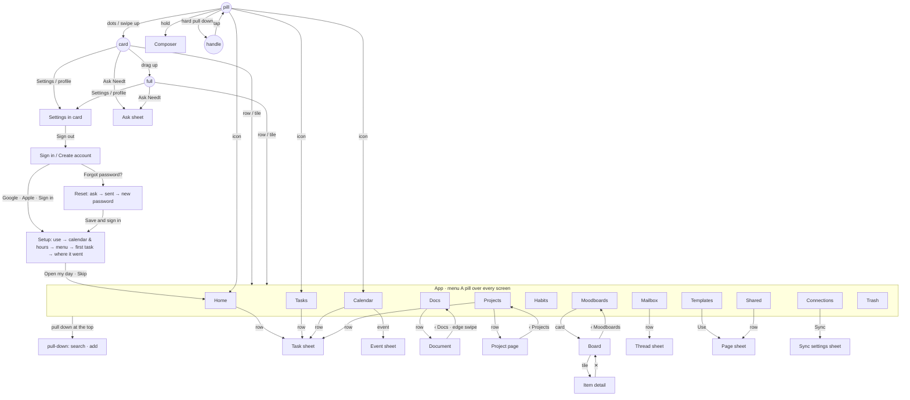

# Screens — files and status (07.10.26)

**Phone navigation:** every tap on every phone screen, what it opens and how you get back — [Phone — transition map](#phone--transition-map) (Plates + menu A, 08.10.26).

**Status rule.** *ready* = the screen has every state through the states system
(`states.jsx`), edge cases handled (`__edgeData`, long / many / empty / one / no
colour, 768 px), and light + dark checked. Anything short of that is
*in progress* with the reason. **Port to code only screens marked ready.**

Light/dark check: all 14 desktop routes rendered in Light and Dark at 1440×900
on 07.10.26 with no page errors (contrast audit; remaining failures are
placeholders, miniature thumbnails and the part-counter grey — PORT §7).
States: every desktop route mounts inside `StBannerStack` + `StScreenLayer`.

Count: **all ready** (desktop 19 / 19, mobile 12 / 12) — desktop checked 07.10.26: 1440 / 768 light + dark, every `__edgeData` kind, 0 page errors; the phone (Plates, one live phone) checked 08.10.26 light + dark: every place via menu A, task sheet, composer, Ask, paywall, sign out → setup → app, 0 page errors.

Naming (08.10.26): the place is called **Mailbox** in all visible text; ids, routes and files stay `mail` (`screen=mail`, `MailScreen.jsx`, `mailApi`). "Mail" remains only as a connection category (Gmail / Outlook are mail services) and the iOS Mail app in the share sheet.

## Desktop (`index.html`)

| Screen | Files | Status |
| --- | --- | --- |
| Home | `HomeToday.jsx`, `TodayScreen.jsx` (wrapper), `Habits.jsx` (chips), `calendar2.jsx` (`calEvents`), `styles/home.css` | **ready** — Next up as main accent + Week load (08.10.26) |
| Tasks | `work.jsx`, `HomeToday.jsx` (`HdTask` rows) | **ready** |
| Projects | `work.jsx` | **ready** |
| Calendar | `calendar2.jsx` | **ready** — density cap: ≤ 3 side by side, the rest in a "+N" chip / slot list (08.10.26) |
| Docs grid | `DocsScreen.jsx`, `stores.jsx` | **ready** |
| Document | `DocsScreen.jsx`, `stores.jsx`, `sidebar-kit.jsx` (switcher, panel toggle) | **ready** |
| Mailbox | `MailScreen.jsx`, `stores.jsx` (`mailApi`) | **ready** |
| Moodboards | `places.jsx`, `stores.jsx` (`boardsView`) | **ready** — sort in ⋯ menu, back before title (08.10.26) |
| Habits | `places.jsx` (`HabitsScreen`), `Habits.jsx` (`HabitToday`), `stores.jsx` (`habitApi`) | **ready** — Today check-in first (08.10.26) |
| Templates | `places.jsx`, `scenes.jsx` | **ready** |
| Shared | `places.jsx`, `scenes.jsx` | **ready** |
| Trash | `places.jsx` | **ready** |
| Connections | `connections.jsx`, `stores.jsx` (`window.connections`), `scenes.jsx` | **ready** |
| Settings | `SettingsScreen.jsx`, `Miniature.jsx`, `Drift.jsx`, `states.jsx` (`StSettingsLayer`) | **ready** |
| Ask Needt | `Chat.jsx`, `AiOrb.jsx` (the AI mark), `Notifications.jsx`, `AgentCursor.jsx` | **ready** |
| Sign in / Sign up / Onboarding | `AuthScreen.jsx`, `ExposureWordmark.jsx`, `scenes.jsx`, `paywall.jsx` (glass minis), `Miniature.jsx` | **ready** |
| Paywall | `paywall.jsx`, `scenes.jsx` | **ready** |
| Sidebar / shell | `Sidebar.jsx`, `sidebar-kit.jsx`, `topbar.jsx`, `App.jsx`, `ctx.jsx`, `search.jsx`, `popovers.jsx`, `Dialogs.jsx`, `Composer.jsx`, `Drag.jsx`, `import.jsx`, `stores.jsx` | **ready** |
| Tablet (768) | `app.css`, `App.jsx`, per-screen container queries | **ready** |

## Mobile (`mobile.html` — one live phone, Plates)

`mobile-dev.html` → `V2pLivePhone` (`mobile-v2-plates.jsx`): every place in the Plates material on the phone kit (`phone-kit.jsx`), menu A (`nav-a.jsx`) over it. File map and the places registry: PORT.md §3a.
`__edgeData(kind)` works on the phone too (desktop kinds except `calendar`, plus habits and boards in every kind). States come from `needtStates`.

| Screen | Files | Status |
| --- | --- | --- |
| Home | `mobile-v2-plates.jsx` (`V2pHome`) | **ready** |
| Calendar (Schedule / Month) | `mobile-v2-plates.jsx` (`V2pCalendar`), `calendar2.jsx` data, `PkEventSheet` | **ready** |
| Tasks | `phone-tasks.jsx` (`PtkTasks`) | **ready** |
| Projects · a project's page | `phone-tasks.jsx` (`PtkProjects`, `PtkProjectPage`), `stores.jsx` `projects` | **ready** |
| Docs · Document | `phone-docs.jsx` (`PdDocs`, `PdDocReader`; page = `Mobile.jsx` `MbDoc*`) | **ready** |
| Mailbox | `phone-mail.jsx` (`PmlMailbox`, `PmlThread`) | **ready** |
| Habits | `phone-habits.jsx` (`PhbHabits`) | **ready** |
| Moodboards | `phone-habits.jsx` (`PhbBoards`) + `Mobile.jsx` (`MbmRoot`) | **ready** |
| Connections · Templates · Shared · Trash | `phone-places.jsx` | **ready** |
| Task sheet · Composer · Ask · Snack · Paywall | `phone-overlays.jsx` | **ready** |
| Settings | `phone-settings.jsx` (`PsSettings`, `window.PkPlaces.settings`; menu A's own quick settings stay in `nav-a.jsx` `NvaSettings`) — the desktop's settings object, PORT.md §3b | **ready** |
| Sign in / Create account · Setup | `MobileAuth.jsx` (`MbAuth`, `MbSetup`), `scenes.jsx` | **ready** |

## The one program (`app.html`, 09.10.26)

One entry for every platform (PORT §1a): `app-boot.js` mounts the desktop (`App`, every Desktop row above) or the phone (`V2pLivePhone` bare, every Mobile row above) by `needtPlatform.ui()` — phone on iOS / Android or below 700 px, `?ui=phone|desktop` overrides — and switches in place across the breakpoint. Shared underneath: `sync.js` (`needtSync` — every store persists through it, desktop and phone in two windows update each other live), `platform.js` (`needtPlatform`), `Data.js` (`NEEDT.schema`), `stores.jsx`. Status: **ready** — 390 px phone, 1440 px desktop, both overrides and both switch directions checked in `app-dev.html` and the built `app.html`, 0 page errors; the phone downloads no desktop code and the desktop no phone code. `index.html` / `mobile.html` remain the previews.

## Do not port

Verified against the `<script>` tags of `index.html` and `mobile.html` (07.10.26).

**Not mounted by either page**

| File | What it was |
| --- | --- |
| `_archive/labs/` | the lab pages, moved out of the app folder (port-prune, 09.10.26): `film.jsx` / `film.html` (motion study), `columns.jsx` / `columns.html` (Columns lab), `blocks-sheets.jsx` / `blocks.html` (block inventory), `rich-block.jsx` / `rich-block.html` (RichBlock lab), `accent-studio.jsx` / `accent-studio.html` (accent picker lab), `animations-v3.jsx`, `TaskRow.jsx`, `Flame.jsx`, `identity.html`, `spec.html`, `motion-lab.html`, `composer-lab.html`, `exposure-wordmark.html`, `icons.html`, `backgrounds.html` (sky comparison 6A / 6B / 6C) — design reference only, they may not open from there |
| `_archive/port-prune/removed/` | `CalendarScreen.jsx` (old 46 px/hour grid), `BlockDesigns.jsx`, `RichBlock.jsx` |
| `_archive/` | `ColumnsScreen`, `Flow`, `Minutes`, `Team`, `WorkspaceScreen`, `tweaks-panel`, `fire-skin.txt`, the old phone (`Mobile.legacy.jsx`) |
| `_orig/` | pre-edit backups of `App`, `DocsScreen`, `Sidebar`, `app.css` |
| `auth.html` | Sign in / onboarding on their own (kept in the app folder) |

**Mounted but legacy — do not port as screens**

| File | Why |
| --- | --- |
| `BlockDesigns.jsx` | mounted in both pages; no live screen renders its `Block` |
| `RichBlock.jsx` | mounted in both pages; no live screen imports it |
| `ColumnsView.jsx` | views unused; only helpers live — `cvProject`, `cvDur`, `CvCard` (focus picker). Move the helpers to the data layer |
| `Brief.jsx` | Prose / Canvas Home forms, only via `?form=` |
| `TodayScreen.jsx` | keep only the wrapper path to `HomeToday`; `WEEK` / `DAY` / `PLACED` fixtures are old |
| `ios-frame.jsx` | presentation frame for the phone sheet |

---

# Actions — what every button does to the data (07.10.26)

Owner request (code-review item 12): every button and action, with what it
writes. The API is wired from this list. Derived from the live code of the
scripts `index.html` and `mobile.html` mount — handlers, `__app.updateTask` /
`setTasksRaw`, `docs.*`, `habitApi`, `mbApi` / `boardsView`, `mailApi`, `calEvents`, `connections`,
`needtPlan`, `skStore`, `needtStates` and the toast undo handlers.

## How to read

- **Columns.** Action (the label the user sees) · Trigger (button / menu /
  shortcut) · Entity · Operation (create / update / delete / archive / restore /
  connect / disconnect / sync) · Fields changed (database names, `field=value`)
  · Undo? · Notes.
- **Values.** `now` = server timestamp. `today` / `tomorrow` = ISO date
  (`YYYY-MM-DD`); the prototype's today is `2026-09-01`. `moveDay(d)` =
  `dueDate=d`, plus `scheduledStart` moved to `d` at the same hour and
  `scheduledEnd` recomputed (only when the task had a start). `placeAt(d,h)` =
  `dueDate=d, scheduledStart=dT h, scheduledEnd=start+estimatedMinutes,
  isFixed=true`. `scheduledEnd` is always derived (`NEEDT.sync`) — the API
  should compute it, not accept it.
- **Field flags.** *(computed)* = the prototype writes it but the server
  should derive it (e.g. `overdue`). *(not in DB)* = listed in
  `_rename-report.txt` §5 / §6.5 — decide before the port. Habit, Event,
  MailThread and Board / BoardItem / BoardMember are in database form too
  (second pass, 08.10.26 — old → new table at the end of this file).
- **Undo?** *Yes* = the toast (desktop) or snack (phone) offers Undo, which
  writes the old values back. The API needs either the inverse call or a
  restore endpoint for every *Yes*.
- **Notes.** *queues offline* = goes through `needtStates.queue` while offline
  (only `__app.updateTask` / App toggle, `docs.patch`, `habitApi.toggle/patch/rename`
  and phone `toggle/update` do; everything else is not queued). *mock* = the
  prototype fakes it (timer, toast) — the endpoint is still needed. *not
  wired* = a button with no handler.
- **UI only — no API** lines list navigation, filters, folds, view toggles and
  sheets that open or close. Where a UI-only control's state is persisted
  locally (a preference), it is in a row, entity `UserPrefs`.
- Right-click menus are described once, under **Context menus**; screens
  point to them.

## Shell (desktop)

### Sidebar (`Sidebar.jsx`, `sidebar-kit.jsx`)

| Action | Trigger | Entity | Operation | Fields changed | Undo? | Notes |
| --- | --- | --- | --- | --- | --- | --- |
| Pin a doc | Pinned header "+" → pick a doc | Doc | update | `isFavorite=true` | Yes | queues offline |
| Open pinned doc | Pinned row | Doc | update | `viewed="Just now"` *(computed → lastViewedAt=now)* | No | also navigates |
| New project | Projects header "+" → sheet → Create | Project | create | `id="p-…"`, `name`, `color` (one of 5 swatches), `icon="folder"` | No | toast without Undo here (Projects screen has Undo); name must be unique |
| Drag task to a day | drag a task row onto the mini-month date | Task | update | `moveDay(<date>)`, `isFixed=true` | No | `App.jsx` drag layer |
| Drag task to a project | drag a task row (any list) onto a Projects row — the row highlights, the tag says "Move to <name>" (`data-drop="project"`) | Task | update | `projectId` | Yes | `App.jsx` drag layer (09.10.26) |
| Reorder a task | drag a task row up / down inside its list (Home, Tasks, a project) — the rows make room, the row settles into the gap | Task | update | the one task order; in a timed list also the time: the slot right after the row above (its end, rounded up to 15 min), else just before the row below; a time that already sorts there is kept (`NEEDT.placeAt`) | Yes ("Now at HH:MM") when the time changed | `App.jsx` drag layer — the phone's rule (`phone-tasks.jsx` `ptkDropWrite`), 09.10.26 |
| Drag task to Focus | drag a task onto the focus icon | FocusSession | create | `intention=title`, `planned=estimatedMinutes or 50`, `taskId`, `elapsed=0` | No | mock — session lives in memory only |
| Start focus | Focus pill → Focus window → purpose, length, task, options → Start | FocusSession | create | `intention` (purpose or task title), `planned` (25/50/90/custom 1–240), `taskId`, `ambient`, `hideOthers` | No | mock (in memory) |
| Pause / Resume · +5 min | Focus window (running) | FocusSession | update | pause parks `planned` at elapsed, keeps `plannedFull`; +5 → `planned += 5` | No | mock |
| Stop focus | Focus window → Stop, or the clock runs out | FocusSession | update | end the session (`endedAt=now`); logs `{d, m, t}` to `needt.focus.log` | No | mock — log is localStorage |
| Tick a subtask in focus | Focus window → Subtasks | Task | update | `TaskPart[i].done` | No | via `__app.updateTask` |
| Session notes | Focus window → Notes (debounced 500 ms + blur) | Task | update | `notes` (plain text) | No | via `__app.updateTask` → `NEEDT.applyTaskPatch` |
| Ambient sound · Hide other tasks | Focus window (setup; sound chip while running) | UserPrefs (focus) | update | `focusAmbient` (off/rain/cafe/noise), `focusHideOthers` | No | mock — no audio, hide is stored only |
| Take a 5-min break | Focus window end → What next | FocusSession | create | `intention="Break"`, `planned=5`, `isBreak=true` | No | ends back in setup with the next task chosen |
| Day menu: Start the day later · Finish early · Block out hours · Block out the whole day · Unblock the day | mini-month date ▾ | DayBlock / Planner | — | — | — | not wired (menu only closes) |
| Import (Markdown, Notion, Google Docs, .ics, CSV) | Import menu | Doc / Task / Event | create | see **Import** | Yes | |
| Hide place from sidebar | right-click a place tile → Hide from Sidebar | UserPrefs (sidebar) | update | `places[id].on=false` | Yes | localStorage `needt.sidebar.v2` |
| Customize Sidebar: toggle place / section, drag to reorder, Reset | More → Customize Sidebar; right-click → Customize | UserPrefs (sidebar) | update | `places[{id,on}]` (order), `sections[{id,on}]` (order); Reset → defaults | No | |
| Fold Pinned / Projects | section header | UserPrefs (sidebar) | update | `collapsed[id]=true/false` | No | |
| Dismiss Needt Pro card | promo card × | UserPrefs | update | `promoDismissed=true` | No | localStorage `needt.promo.dismissed` |
| Sign out | account menu → Sign out | Session | delete | — | No | mock: shows the auth screen |
| Switch theme | account menu → Appearance (System / Light / Dark / Time) | UserPrefs | update | `theme` | No | same value as Settings → Appearance |
| Upgrade | account menu → Upgrade (Free only) | — | — | — | — | opens the paywall (`openPaywall`) |
| Invite to Needt | account menu → Invite to Needt | Invite | — | — | No | mock: copies `needt.app/invite/<user>` + toast |
| Tiles from onboarding | `needtSettings.set('sidebarTiles', ids)` | UserPrefs (sidebar) | update | `places` ← first 5 ids on, rest off in order | No | applied once per distinct list (`needt.sidebarTiles.applied`), live on `needt-settings` |

Top-left (08.10.26): one workspace, so no "space" switcher — the **profile button** is one 32px row: avatar 22, name, a small inline plan pill (`Trial · 9d` / `Pro` / `Free`; full line `Pro trial · 9 days` etc. as its title; from `useNeedtPlan`), chevrons. It opens the **account menu**: header (avatar 36, name, email, PRO pill when on any Pro plan — `window.ProBadge` if present), plan strip (`Free plan` + Upgrade → paywall, or the plan name + Manage → Settings), Settings ⌘, · Appearance (inline System/Light/Dark/Time) · Invite to Needt · Teams (Soon, disabled) · Sign out. What's new, Get help and Keyboard shortcuts are **not** here — they live in the top-right ? button. Portaled card, 336 wide, radius 14, padding 8, 32px rows; scale+fade in (reduced motion: fade). Keys: ↓ on the button opens; ↑/↓/Home/End move; ←/→ change theme on the segmented control; Esc closes and returns focus; Tab closes.

Tiles (08.10.26): 5 place tiles + **More** always as the 6th. A tile label that does not fit gets a short name on the tile only (`SB_TILE_SHORT`: Moodboards → **Boards**); the full name is the tile's tooltip/aria-label and stays in More, Customize and the page title. Onboarding writes `needtSettings.sidebarTiles` = every `SK_PLACES` id in order (never `more`): ids 0–4 are the tiles, the rest sit under More in that order; no setting = the default (Home, Calendar, Tasks, Docs, Mailbox). The list is written into the sidebar prefs (`needt.sidebar.v2`) so Customize Sidebar still works on top of it. `window.PlaceGlyph` and `window.SK_PLACES` are exported for the onboarding mock.

Foot (08.10.26): Focus and Import are icon-only at rest, aligned on the row-icon column; the label slides out on hover / keyboard focus / while open (180 ms width + opacity; reduced motion: instant). A running focus always shows its clock. Import glyph = folder-with-arrow-in (`move-to` / LuFolderInput).

UI only — no API: place tiles and More menu (navigation), mini-month day select, Connections row (→ Connections), project row (→ Projects) and its ⋯ (→ context menu), Settings, Manage (→ Settings), Focus window Minimise / reopen, sidebar toggle (⌘\), Focus Mode (⌘.), Create menu (below), search bar (→ ⌘K), doc/app rail switcher.

### Focus window (`focus.jsx`, `styles/focus.css`)

The Focus pill in the sidebar foot opens a **window over the app** (720 wide, up to 760 tall; scrim + blur), painted in the Connections world: `PxSky` lavender sky with clouds, `GlassCard` cards, Exposure titles. One window, three views (260 ms rise+fade between them; reduced motion: fades only):
- **Setup** — kicker "Focus session", title **Focus**; glass card with *What is this session for?* and *Length* (25 / 50 / 90 min / Custom 1–240, error line when out of range); *Choose a task* — up to six glass cards (project colour ring, title, project · estimate), chosen one ringed with a check, click again to clear; options card — *Ambient sound* Off / Rain / Café / White noise and *Hide other tasks* switch; primary **Start N min**; the scheduler rule as an info line. Esc / × / backdrop close.
- **Running** — kicker In focus / Paused / On a break, the task title, the clock huge on the sky (mm:ss left), a progress bar and "50 min session · ends 16:17"; Pause/Resume (primary) · +5 min · Stop · sound chip (click cycles); a glass card with the task's subtasks (tick) and **Notes** (writes `task.notes`). **Minimise** (round button, Esc, or backdrop) folds the window into the sidebar pill, which keeps the running clock and ring; clicking the pill reopens the window on the clock.
- **End** — kicker Session complete / Session ended, title "50 min", "on Draft the launch brief"; stats strip (sessions today with pips, minutes focused today, days in a row — from `needt.focus.log`); **What next**: Next task (back to setup with it chosen) · Take a 5-min break (a break session, then setup) · Done for now (close).

State: the session is still App's `focus` (`{intention, planned, elapsed, taskId}`; App ticks it); the window's own state (`open`, `view`, `preset`, `summary`) is `window.focusUi` (`open(preset?)`, `close()`, `get`, `sub`). A session started anywhere (drag onto the pill, Home's Start focus, ⌘⇧F) opens the window on its clock. Nothing animates while the window is closed; the sky runs only while it is open (PxSky's own perf logic).

### Create menu (sidebar "+", page "New" buttons, ⌘K, N)

| Action | Trigger | Entity | Operation | Fields changed | Undo? | Notes |
| --- | --- | --- | --- | --- | --- | --- |
| New task | Create → New task; N; page New → New Task | Task | create | via **Composer** | No | |
| New doc | Create → New doc; ⌘K New doc; right-click New Doc | Doc | create | `id`, `title=""`, `projectId=null`, `style=null`, `coverUrl=null`, `isFavorite=false`, `trashedAt=null`, `body=[]` | No | opens the doc |
| New event | Create → New event | Event | create | via **Calendar** draft | Yes | navigates to Calendar |
| New project | Create → New project | Project | create | via **Projects** | Yes | |
| New habit | Create → New habit | Habit | create | via **Habits** sheet | Yes | |
| New moodboard | Create → New moodboard | Board | create | via **Moodboards** | Yes | |

### Top bar (`topbar.jsx`)

| Action | Trigger | Entity | Operation | Fields changed | Undo? | Notes |
| --- | --- | --- | --- | --- | --- | --- |
| Read a notification | Bell → click a row | Notification | update | `unread=false` | No | fixture in component state, not persisted |
| Mark all as read | Bell → ⋯ | Notification (all) | update | `unread=false` | No | same |
| Clear all | Bell → ⋯ | Notification (all) | delete | — | Yes | same |
| Reload notifications | Bell → ⋯ | Notification | — | — | — | mock (toast "Up to date") |
| New reminder | Bell → Reminders → "+" | Reminder | create | `id`, `title="New reminder"`, `when="Today, 18:00"`, `done=false` | No | local state; no title editing yet |
| Resolve / reopen reminder | Reminders → check | Reminder | update | `done=true/false` | Yes (resolve) | local state |

UI only — no API: bell / help popovers, Notifications ↔ Reminders tabs, Show done, Help menu (What's new, Report a bug → Bug sheet, Shortcuts → Key sheet, other rows toast "opens in the browser"), offline pill (states).

### ⌘K search (`search.jsx`)

| Action | Trigger | Entity | Operation | Fields changed | Undo? | Notes |
| --- | --- | --- | --- | --- | --- | --- |
| New doc | ⌘K → New doc | Doc | create | as Create menu | No | |
| Open a doc result | ⌘K → doc | Doc | update | `viewed` *(computed)* | No | needs `GET /search?q=` across docs, tasks, mail |

UI only — no API: New task (→ Composer), Go to … (navigation), Toggle sidebar, Settings, task result (→ Task dialog), mail result (→ Mailbox; groups **Mailbox** = the inbox, **Sent** = sent mail, labelled "To …"; drafts are never listed), arrow keys / Enter / Esc.

### Context menus (`ctx.jsx`, right-click)

| Action | Trigger | Entity | Operation | Fields changed | Undo? | Notes |
| --- | --- | --- | --- | --- | --- | --- |
| Pin / Unpin | doc → Pin / Unpin | Doc | update | `isFavorite=!isFavorite` | Yes | queues offline |
| Duplicate doc | doc → Duplicate | Doc | create | copy of all fields, new `id`, `title="<title> copy"`, `isFavorite=false` | Yes | inserted after the original |
| Move doc to project | doc → Move to… → project / No project | Doc | update | `projectId` (null for No project), `hue` *(computed)* | Yes | |
| Export as Markdown | doc → Export as Markdown | Doc | — | — | — | mock (toast only) → `GET /docs/:id/export?format=md` |
| Delete doc | doc → Delete | Doc | archive (trash) | `trashedAt=now` | Yes | queues offline |
| Restore | trash row → Restore | Doc | restore | `trashedAt=null` | Yes | |
| Delete forever | trash row → Delete forever | Doc | delete | row removed | Yes | prototype restores the whole list on Undo |
| Edit project… | project → Edit… (sheet) | Project | update | `name`, `color`; docs of the project `hue=color` *(computed)* | Yes | tasks/docs keep `projectId` |
| Sort projects | project → Sort by → Manual / Name / Open tasks | UserPrefs | update | `projects.sort=manual/name/open` | No | localStorage `needt.projects.sort` |
| Delete project | project → Delete / Delete anyway (n open) | Project | delete | project removed; its tasks `projectId=null`; its docs `projectId=null`, `hue=null` | Yes (puts project and every link back) | server: ON DELETE SET NULL, Undo needs restore |
| Mark done / Mark not done | task → Mark done | Task | update | `done=!done` | Yes | does **not** close `TaskPart[]` (Home check does); queues offline |
| Move to Today | task → Move to Today | Task | update | `moveDay(today)`, `overdue=false` *(computed)* | Yes | queues offline |
| Move to Tomorrow | task → Move to Tomorrow | Task | update | `moveDay(tomorrow)`, `overdue=false` *(computed)* | Yes | queues offline |
| Set project | task → Set project… → project / No project | Task | update | `projectId` | Yes | queues offline |
| Duplicate task | task → Duplicate | Task | create | copy of all fields, new `id`, `title="<title> (copy)"` | Yes | inserted after the original; not queued offline |
| Delete task | task → Delete | Task | delete | row removed | Yes (restores whole list) | hard delete — tasks have no `trashedAt`; decide soft delete |
| Mark kept today / not kept | habit chip → Mark kept today | HabitCheckin | upsert | `(habitId, date=today) done=true/false` | No | queues offline |
| Archive habit | habit chip → Archive | Habit | archive | prototype removes the row (ctx.jsx); the Habits screen sets `archivedAt=now` | Yes | ctx.jsx should call `habitApi.archive` (request) |
| Hide from Sidebar | place tile → Hide from Sidebar | UserPrefs (sidebar) | update | `places[id].on=false` | Yes | |
| Mailbox: Make a Task / Add to Calendar / Mark as Unread / Archive / Delete | mail row | Task / Event / MailThread | — | see **Mailbox** | Yes | sent as `needt-mail` events |

UI only — no API: Open, Open in New Tab (doc / project / place), Copy link (clipboard: `needt.app/d/<id>`, `/t/<id>`), Go to Habits, New Task (→ Composer), New Doc (→ Create), Customize Sidebar…, app menu (Search, Toggle Sidebar, Settings).

### Composer (`Composer.jsx`, N / Create → New task)

| Action | Trigger | Entity | Operation | Fields changed | Undo? | Notes |
| --- | --- | --- | --- | --- | --- | --- |
| Add task | type a sentence → Enter / "Add task" | Task | create | `id`, `title` (parsed), `projectId` (project chip → `projectIdOf`), `status="todo"` *(not in DB)*, `estimatedMinutes` (duration chip, default 30), `dueDate` (date chip, default today), `done=false`, `TaskPart` (parsed parts, ids `n<ts>.<n>`) | No | the sheet stays open for the next line. Kind is honoured (event / doc / habit); time → `scheduledStart` + `isFixed`, deadline → `dueDate`, priority → `priority`, label → `labels`, note → `notes`. Title = unparsed words (`rest`). |
| Dictate → Add N | mic → drafts → Add N | Task (several) | create | as Add task, per draft | No | mock: drafts come from a fixture (`CO_HEARD`) |

UI only — no API: kind segment (Task / Event / Doc), chip menus (pick / clear), "+" insert menu, Drop a draft, Discard, Cancel, Esc.

### Task dialog (`Dialogs.jsx` → `TaskDialog`, opens from any task row)

Compact card (08.10.26 rebuild): ~560 px, one column, centred. Head = round checkbox · title (Enter saves, wraps) · ⋯ · ×. Under it one chip row: Date · Duration · Project · Priority · Labels · Repeat (+ Who only when another person holds the task). Empty chips read "+ Date" etc.; each opens a small popover. Body: Scheduling (⋯ → Scheduling…, or the summary line), notes (plain text), subtasks, First step (an editable one-line field). Footer: "Created … · Updated …", Attach, "Saved". Every edit autosaves through `onChange(patch)` → App `patchTask` → `NEEDT.applyTaskPatch` and stamps `updatedAt`; closing shows "Changes saved" with one Undo that puts the whole record back as it was when the card opened (not after Delete / Convert, which have their own Undo). Esc closes the innermost popover, then the card; ⌘Enter ticks the task.

| Action | Trigger | Entity | Operation | Fields changed | Undo? | Notes |
| --- | --- | --- | --- | --- | --- | --- |
| Rename | title (Enter / blur) | Task | update | `title` | Yes (on close) | empty title reverts on blur |
| Done / reopen | round checkbox, ⌘Enter | Task | update | `NEEDT.completeTask` → `done` (+ closes open `TaskPart` on done) | Yes (on close) | half-filled ring = `status="in_progress"` |
| Set date | Date chip → Today / Tomorrow / Next week (next Monday) / calendar | Task | update | `dueDate`; with a time: `NEEDT.moveDay` (`scheduledStart`, `scheduledEnd`) | Yes (on close) | |
| Someday / Clear date | Date chip → Someday / Clear date | Task | update | `dueDate=null`, `scheduledStart=null`, `scheduledEnd=null`, `isFixed=false` | Yes (on close) | |
| Set time / No time | Date chip → Time | Task | update | `NEEDT.placeAt` (`dueDate`, `scheduledStart`, `scheduledEnd`, `isFixed=true`), `auto=false` / start+end null, `isFixed=false` | Yes (on close) | |
| Duration | Duration chip → 15 min…4 h / No duration | Task | update | `estimatedMinutes` (`scheduledEnd` recomputed by `NEEDT.sync`) | Yes (on close) | |
| Project | Project chip (search) / ⋯ → Move to project… | Task | update | `projectId` (null = No project) | Yes (on close) | seeds + `projectStore` |
| Priority | Priority chip → Urgent / High / Medium / Low / None | Task | update | `priority` = `urgent`/`high`/`medium`/`low`/null *(not in DB)* | Yes (on close) | old `important`/`whenever` read as high/low |
| Labels | Labels chip → tick / type + Enter / Create "…" | Task | update | `labels` (string[]) | Yes (on close) | pool = defaults + every task's labels |
| Repeat | Repeat chip | Task | update | `repeat` = null/`daily`/`weekdays`/`weekly`/`monthly` *(not in DB)* | Yes (on close) | no recurrence engine yet |
| Who | Who chip (only when `holder` ≠ you) | Task | update | `holder` | Yes (on close) | |
| Notes | notes field (plain text, grows) | Task | update | `notes` (plain text; null when empty) | Yes (on close) | older `description` (HTML or text) / `note` are migrated into `notes` by `NEEDT.migrateTask` |
| Subtasks | tick, inline title edit, Enter = new row below, Backspace on empty = remove, × , drag to reorder, "Add subtask" | Task | update | `TaskPart` (`[{id,title,done}]`, order = array order) | Yes (on close) | last part ticked closes the parent (`applyTaskPatch`) |
| Scheduling | ⋯ → Scheduling… / summary chip | Task | update | Placement Auto/Fixed → `isFixed`, `auto`; Min. work block → `chunk`; Deadline → `deadline` ("YYYY-MM-DD") + `hardDeadline`; Hours → `hours` = `work`/`personal`/`any` | Yes (on close) | `auto`, `chunk`, `deadline`, `hardDeadline`, `hours` *(not in DB)*. Section open/closed in `needtSettings.taskSchedOpen`. Summary chip under the chips only when not default ("Fixed 09:00 · min block 25 min · hard deadline 10 Sep · personal") |
| In progress / To do | ⋯ (only when `status` exists) | Task | update | `status`, `Stage` | Yes (on close) | |
| Duplicate | ⋯ → Duplicate | Task | create | copy, new `id`, `title="<title> (copy)"`, `done=false`, `createdAt`, new `TaskPart` ids | Yes (toast) | inserted after the original |
| Convert to event | ⋯ → Convert to event | Event + Task | create + archive | `calEvents.add(eventAt(dueDate, hour ?? 9, estimatedMinutes ?? 60, {title}))`; task `trashedAt=now` | Yes (removes event, restores task) | |
| Convert to document | ⋯ → Convert to document | Doc + Task | create + archive | `docs.create({title, projectId, hue, body:[notes text]})`; task `trashedAt=now` | Yes | |
| Delete | ⋯ → Delete | Task | archive (trash) | `NEEDT.trashTask` → `trashedAt=now` | Yes (`trashedAt=null`) | closes the card |
| Attach | footer → Attach (file picker) | Task | update | `attachments += {id, name, size}` *(not in DB; mock, no upload)* | Yes (on close) | × removes |
| First step | First step row: one-line field | Task | update | `entry` (null when empty) | Yes (on close) | placeholder = first open subtask |
| First step → Start focus | First step row → Start focus | Focus | — | `__app.setFocus({intention, planned, taskId})` | — | text = `entry` or first open subtask |

UI only — no API: Close, Esc, scrim click, Copy link (`needt.app/t/<id>` to clipboard + toast), popovers, month navigation. Opened with no task (new-task mode) it edits a local draft and nothing is written. Dropped from the old dialog: Workspace row, Task/Event/Document tab row (→ Convert to…), Template, Remind, "More settings".

### Ask Needt (`Chat.jsx`, ⌘J) and in-app notifications (`Notifications.jsx`)

| Action | Trigger | Entity | Operation | Fields changed | Undo? | Notes |
| --- | --- | --- | --- | --- | --- | --- |
| Send a message | composer → Enter / Send; suggestion card; follow-up chip; `/command` | AssistantMessage | create | message text + context chips (`@` task/doc/project, file) + `scope` | No | mock (deterministic, `chatReply`): thinks first — orb active, a shimmering line names each step ("Reading your calendar…", "Checking 36 open tasks…") — then the text streams in and result cards stagger in. Every reply starts with a "Looked at …" line naming the scope |
| Stop | Send turns into Stop while thinking / streaming | AssistantMessage | update | thinking → "Stopped before answering."; streaming → text cut where it was, cards dropped, `stopped=true` | — | |
| Retry / Copy / 👍 👎 | message actions (hover; always on the last reply) | AssistantMessage | update | Retry re-runs the question before it (reply replaced); `feedback = up \| down \| null` | — | Copy puts text + draft / summary on the clipboard |
| Edit last message | ↑ in an empty field | AssistantMessage | update | the thread from that message on is replaced by the new send | — | "Editing your last message · Cancel Esc" bar above the field |
| Slash commands | `/` at the start of the field (or the `/` tool) | — | — | — | — | `/plan` (= Plan my day) · `/summarize` (this doc or an @-mentioned one) · `/find <words \| free time>` · `/draft [about]`; ↑↓ + Enter/Tab picks, Esc closes |
| Mention | `@` (or the @ tool) | — (request field `context[]`) | — | adds `{kind: task \| doc \| project, id}` chip | — | picker: open tasks (4), docs (3), projects (3), filtered by what follows `@` |
| Attach a file | paperclip tool → file picker | — | — | adds a `{kind:"file", name}` chip | — | mock: the file is not read or uploaded. Port: `POST /assistant/files` |
| Context chip | chip under the title in the header → menu "Ask about" | — (request field `scope`) | — | `scope = { kind: workspace \| day \| doc \| task, id?, title? }` | — | auto from where you are: last task row clicked on this screen → Task: <title>; Document → This doc: <title>; Home / Calendar → This day; else Workspace. A menu pick holds until the screen changes. "Move it to tomorrow" with a Task scope means that task. The empty state's suggestion cards follow the scope (doc: Summarise / Turn it into tasks; task: Break it into steps / Move it to tomorrow; day / workspace: Plan my day, What's overdue?, Find free time this week, Move low-priority to tomorrow, Draft a reply, Summarise this doc) |
| Add N tasks | task-list card (afternoon plan, doc to-dos, "Break it into steps") → pick rows → "Add N tasks" | Task (several) | create | per row: `id="chat-…"`, `title`, `projectId`, `estimatedMinutes`, `status="todo"`, `Stage="todo"`, `holder="you"`, `done=false`, `placeAt(today, hour)` | No | in-app notification only |
| Apply changes | change list ("Plan my day", "Move low-priority to tomorrow", "Move X to tomorrow") → Apply N | Task (several) | update | `placeAt(day, hour)` per row (`dueDate`, `scheduledStart`, `scheduledEnd`, `isFixed=true`); `overdue=false` *(computed)* | Yes (one Undo, every field back) | through `__app.updateTask` → queues offline. Each row shows the exact new slot, the old one and the reason — "Wed 2 Sep · 12:45–13:05 (was today 12:00) · 12:00 tomorrow is taken — next free 20 min after it". Slots = first free quarter hour inside working hours (Settings start/end) that touches no timed task or calendar event; overdue → today from now, else tomorrow; one task with no deadline/project placed today waits until tomorrow. "Plan my day" also shows a **mini day timeline** of the day the work lands on (timed tasks, events tagged Event, proposed blocks tagged New). Footer names the scope |
| Insert into doc | doc snippet card / draft card / message action — only with a doc scope | Doc | update | `body` += `["li", …]` (summary) or `["p", …]` (text) | Yes (toast) | fires `needt:doc-insert` `{docId, body}` (cancelable) first — an open editor that handles it inserts live; otherwise `docs.patch` appends to the stored page. **DocsScreen does not listen yet**: the open editor keeps showing its own blocks until the page is reopened, and its next save would overwrite the insert |
| Read-only cards | any card in a chat opened from History | — | — | — | — | "From an earlier chat": Apply / Add / Plan them in are hidden |
| New chat / History / Clear | header new-chat icon; ⋯ → New chat · History · Clear this chat · Open the brief | AssistantThread | create / read / delete | thread `{id, title, at, messages[]}` | Clear and Delete: Yes (toast) | stored in localStorage `needt.chats` (newest first, max 30; seeded with 3 past chats on first run). Title = first question ("/plan" → "Plan my day"). History rows: title, when, last reply; trash on hover. Port: `GET/POST/DELETE /assistant/threads` |
| Agent: focus / capture | typed "focus…", "add…" | — | — | — | — | mock: agent-cursor walkthrough; nothing is written |
| Notification action: Plan / Focus / Show me | in-app notification card | — | — | — | — | mock agent walk / navigation |

UI only — no API: open / close panel (⌘J, pill), Esc (menu → history → panel), Dismiss (change list, notification), Open the brief, context chip menu, Open in Mailbox, Open doc, result-row clicks (task → Task dialog, doc → opens it), Retry banner (states).
Free plan (paywall.jsx `ProBadge`): a PRO mark after "Ask Needt" in the header (opens the paywall), on the "Plan my day" card, and a "Free plan: answers and drafts. Pro plans and moves your day. · See plans" line under the cards.
Motion (08.10.26): panel opens with a spring (dock column / sheet / corner panel), messages fade-slide in, result cards and their rows stagger, the thinking line shimmers and the caret blinks only while Needt is working; entry animations fill `backwards`, so nothing is in effect at rest (`document.getAnimations()` inside the panel = 0). Reduced motion: fades only, no streaming (the reply appears whole), no shimmer.
Port: the request carries `scope` and `context[]`; the model's reply must say what it looked at, stream its text, and return cards as data (`tasks`, `changes`, `timeline`, `draft`, `doc`, `slots`, `found`, `overdue`); every proposed move must come back as `{ taskId, from: {start,end}, to: {start,end}, reason }` — the UI never shows a bare "Tomorrow".

### Import (`import.jsx`, sidebar Import menu)

| Action | Trigger | Entity | Operation | Fields changed | Undo? | Notes |
| --- | --- | --- | --- | --- | --- | --- |
| From Markdown files / Google Docs / Notion (md, html) | Import → file picker | Doc (one per file) | create | `title` (first H1 or file name), `body` (parsed blocks) | Yes (removes all) | parsed in the browser → `POST /import` |
| From a CSV of tasks / Notion CSV | Import → file picker | Task (several) | create | `id`, `title`, `projectId` (only when the name matches a project), `status="todo"`, `dueDate` (`toDate`), `estimatedMinutes` (default 30), `done=false` | Yes | not queued offline |
| From a calendar file (.ics) | Import → file picker | Event (several) | create | `title`, `startAt`, `endAt`, `isAllDay=false`, `calendarId="personal"`, `source="needt"`, `externalId=null` (next 30 days only) | Yes | import.jsx still hands `{day, at, len}`; `calEvents.add` converts (`NEEDT.migrateEvent`) |

### Bug report, Help, Keys (`Bug.jsx`, `Help.jsx`, `Dialogs.jsx`)

| Action | Trigger | Entity | Operation | Fields changed | Undo? | Notes |
| --- | --- | --- | --- | --- | --- | --- |
| Send report | Help → Report a bug → Send report | Feedback | create | description (+ app state) | No | mock (sheet says sent) → `POST /feedback` |

UI only — no API: Help sheet tabs, Keyboard shortcuts sheet.

### States, offline, banners (`states.jsx`)

| Action | Trigger | Entity | Operation | Fields changed | Undo? | Notes |
| --- | --- | --- | --- | --- | --- | --- |
| Edit while offline | any queued edit (see How to read) | SyncQueue | create | `{key: "task:<id>" / "doc:<id>" / "habit:<id>", label, at}` | — | one entry per record; back online → queue cleared, toast "n changes synced" → `POST /sync` |
| Reconnect (access revoked banner) | banner on Home / Calendar / Mailbox | Connection | connect | `gcal`, `gmail` → `connecting` → `connected` | No | mock 1.2 s |
| Update payment / See plans / Upgrade | billing / trial banners | — | — | — | — | opens **Paywall** |

UI only — no API: AI-down Retry (mock), Request access (mock), offline pill popover, the States switcher (⌥S) — prototype tool, not a product screen.

## Desktop screens

### Home (`HomeToday.jsx`)

| Action | Trigger | Entity | Operation | Fields changed | Undo? | Notes |
| --- | --- | --- | --- | --- | --- | --- |
| Check off task | row checkbox; Next up → Done; Inbox card check | Task | update | `done=true`; if parts are open, `TaskPart[].done=true` | No (see Undo last) | closing a parent closes its `TaskPart[]`; queues offline |
| Reopen task | checkbox on a Done-today row | Task | update | `done=false` | — | parts stay done |
| Parent auto-closes | the last open part is ticked anywhere while Home is mounted | Task | update | `done=true` | No | client-side rule — move it to the server |
| Undo last | Day-closed card → Undo last | Task | update | `done=false` on the last closed task | — | |
| Move to today | Overdue fold → Move to today | Task (all open overdue, not `noSlot`) | update | `moveDay(today)`, `overdue=false` *(computed)* | Yes (one Undo for all) | batch; queues offline |
| Start focus | Next up → Start focus | FocusSession | create | `intention=title`, `planned=25`, `taskId`, `elapsed=0` | No | mock (in memory) |
| Tick habit | Habits card chip | HabitCheckin | upsert | `(habitId, date=today) done=true/false` | No | queues offline |
| Plan my day | header button | Task | update (planner) | — | — | mock: agent-cursor demo, writes nothing. Real: `POST /planner/plan-day` → patches → `/tasks/batch` |
| New task / New event / New doc | header New menu; "+ Add task" row | Task / Event / Doc | create | see **Create menu** | | |

UI only — no API: Day / Week ahead tabs, folds, Show all, Skip (Next up), Plan tomorrow (switches tab), Calendar / All links, row click (→ Task dialog), source chip "From Mailbox" (→ Mailbox), drag rows (see Sidebar).

Layout (08.10.26): **Next up is the main accent** — half the summary row, taller, 24 px title (2 lines max), full-size Start focus (primary) + Done. Beside it a compact secondary block: Progress + Streak over Habits (under 900 px it drops under Next up; under 480 one column). **Week ahead** swaps that block for weekly numbers — *This week* (tasks, done / open), *Hours planned* (against working time, red line when over), *Overdue* (open overdue, explained) — and the rail's Today's schedule for **Week load**: one row per day, planned vs capacity bar (grey up to capacity, red past it, a tick at capacity), hours planned, free time or "+N over", and a line under the list naming the overloaded days. Under 940 px the Week load leads the list in Week ahead. Day mode is unchanged.

Week load reads only: capacity = Settings `start`–`end` (needt.settings, default 09:00–18:00 = 9 h) per weekday; Sat/Sun = 0 ("day off") unless `weekends` is on. Planned = Σ `estimatedMinutes` of tasks due that day + Σ event lengths that day. Nothing is stored. Port: the planner should expose the same capacity per day (`GET /planner/capacity?from&to` or computed client-side from settings).

### Tasks (`work.jsx`, mode tasks)

| Action | Trigger | Entity | Operation | Fields changed | Undo? | Notes |
| --- | --- | --- | --- | --- | --- | --- |
| Check off / reopen | row checkbox | Task | update | `done=!done` | No | App toggle — does **not** close `TaskPart[]` (Home does); queues offline |
| New task | New → New Task; empty-state CTA | Task | create | via **Composer** | No | |
| New project | New → New Project | Project | create | as **Projects** | Yes | |

UI only — no API: Inbox / Today / Upcoming / All Tasks tabs, project cards (filter), Clear filter, folds, Done fold, row click (→ Task dialog). Right-click → **Context menus** (task).

### Projects (`work.jsx`, mode projects)

| Action | Trigger | Entity | Operation | Fields changed | Undo? | Notes |
| --- | --- | --- | --- | --- | --- | --- |
| New project | header "New project"; empty CTA; Create menu | Project | create | `id="p-…"`, `name`, `color`, `icon="folder"` | Yes | unique name (client check) |
| Edit / Delete / Sort | right-click → Edit… / Delete / Sort by | Project / UserPrefs | update / delete | see **Context menus** | Yes / Yes / No | |
| Check off task in a card | card row checkbox | Task | update | `done=!done` | No | does not close parts |

| Add task (project page) | "Add a task to …" field → Enter; "Add task" focuses it | Task | create | `id`, `title`, `projectId`, `status="todo"`, `estimatedMinutes=30`, `done=false` (no date) | Yes | |
| Edit (project page) | Edit | Project | update | as **Context menus** → Edit… (`needt-project-edit`) | Yes | |
| Delete (project page) | Delete | Project | delete | as **Context menus** → Delete (tasks → No project) | Yes | returns to the cards |

Views (08.10.26): **Cards** (default) = the project cards only, an overview — no task list under them. A card click (or Enter) opens the **project page**: Back, colour tile + icon + name, stats (open · done · time left · overdue, ring = % done), Add task / Edit / Delete, an "Add a task" line, open tasks grouped Overdue / Today / Upcoming / No date, and a Done fold (closed). **List** = every project's open tasks in one list plus Done (the old long view). The switch is remembered in `needtSettings.projectsView` (`"cards"` / `"list"`). Other screens can open a page with `needt-project-open` `{name}`.

UI only — no API: Cards / List, card click (→ project page), Back, folds, row click (→ Task dialog).

### Calendar (`calendar2.jsx`)

| Action | Trigger | Entity | Operation | Fields changed | Undo? | Notes |
| --- | --- | --- | --- | --- | --- | --- |
| Add event | click an empty slot, type title, Enter; New → New Event (first free slot) | Event | create | `id="u…"`, `title`, `startAt`, `endAt=startAt+60 min`, `isAllDay=false`, `calendarId="personal"`, `source="needt"`, `externalId=null` | Yes | |
| Rename event | event popover → Edit title | Event | update | `title` | Yes | own events (`source="needt"`): `needt.events`; synced events (`source="google"/"apple"`): a local override (`needt.events.titles`) → real API must write back to the provider via `externalId` |
| Delete event | event popover → Delete | Event | delete | — | Yes | own events only |
| Move event | `calEvents.move(id, startAt)` (no UI drag yet) | Event | update | `startAt`, `endAt` (length kept, `NEEDT.moveEvent`) | — | API only in the prototype |
| Place / move a task in time | drag a task block inside the Week / 3-day grid, or a task row from a list onto a day column (`data-drop="timeline"`); the tag shows the time, snapped to 15 min; the card lands in the new block | Task | update | `NEEDT.placeAt(day, hour)`: `dueDate`, `scheduledStart`, `scheduledEnd`, `isFixed=true`; `overdue=false` | Yes | `App.jsx` drag layer (09.10.26) |
| Done / Not done | task block popover | Task | update | `done=!done` | Yes | queues offline |
| Drop a task on the Agenda | drag a task (any list, or an Agenda row) onto an Agenda day column, or onto the gap between two timed rows (an insertion line with its time under the hand) | Task | update | day column: `NEEDT.moveDay` (`dueDate`, time kept); gap: `NEEDT.placeAt` at the gap's time (`isFixed=true`) | Yes ("Moved to …") | `calendar2.jsx` AGENDA DROP; the gaps take the pointer only while something is in the hand (`html.is-drag-active`) |
| Previous / next week | header arrows | Event | — | — | — | mock (toast "loads with real data") → `GET /events?from=&to=` (`NEEDT.eventsInRange`, `calEvents.inRange`) |

UI only — no API: Today, Week / Agenda view, Hide done, day paging (narrow), task block → Open (→ Task dialog), draft Cancel, "+N" chip / row → slot list (a row opens the task dialog or the event peek).

Views (08.10.26): the second view is labelled **Agenda** (was "Days"); its stored value stays `"days"` (`needtSettings.view`, onboarding, `?view=days`). **Hide done** (header, eye icon; icon-only under 900 px) takes completed tasks out of Week and Agenda — events are never hidden; remembered in `needtSettings.calHideDone`.

Density (08.10.26): at most **3** overlapping blocks side by side (Week, `C2_CAP`), and never a lane under 72 px or a side-by-side share under `C2_SPLIT_MIN` (64 px — two at 1440 still share a column); whatever does not fit goes into a "+N" chip in its half-hour slot (a 30 px gutter on the right of that cluster). The chip opens a popover listing every task and event touching that half hour (`C2SlotPop`). Agenda folds a slot past 3 rows into a "+N more at HH:MM" row with the same list. Synced events (`source` google / apple / outlook, e.g. from onboarding) can be renamed but not deleted here.

### Docs grid (`DocsScreen.jsx` → `DocsScreen`, `stores.jsx`)

| Action | Trigger | Entity | Operation | Fields changed | Undo? | Notes |
| --- | --- | --- | --- | --- | --- | --- |
| New doc | New → New Doc; ⌘N; empty CTA | Doc | create | as **Create menu** | No | opens it |
| Pin / Unpin | card star | Doc | update | `isFavorite=!isFavorite` | Yes | queues offline |
| Open doc | card / list row | Doc | update | `viewed` *(computed → lastViewedAt=now)* | No | |
| New Folder / From Template | New menu | — | — | — | — | not wired |
| Import | ⋯ → Import | Doc (several) | create | as **Import** (`needtImport("markdown")`) | Yes | |

UI only — no API: grid / cards / list view, ⋯ → Select (mock toast, no multi-select yet), Show daily notes, Export as Markdown (downloads every shown doc as one `.md`, client-side), Export as PDF (mock toast), Space settings (→ Settings). Right-click → **Context menus** (doc).

Header and sort (08.10.26, Craft): `[+] Documents … [grid | cards | list] [⋯]`. No search field on the grid — search is the top bar's ⌘K (Open); the old in-page field, its `/` / ⌘F shortcuts, the "n of m" counter and the no-results state are gone. The ⋯ menu: Select · **Sort by** Name / Last viewed / Date created / Date updated (check on the active key, ↓/↑ on its row; clicking the active row flips the direction, another row takes its default — A→Z for Name, newest first for dates; the menu stays open while sorting) · Show daily notes ✓ · Import · Export as Markdown / Export as PDF · Space settings. The list view's Name / Last viewed / Updated / Created headers sort too. Sort is a per-browser convenience in `localStorage needt.docsSort` `{key: name|viewed|created|updated, dir}` (not UserPrefs). Ages are parsed from the display strings (`viewed`, `updated`, `created`) until the API sends `viewedAt` / `updatedAt` / `createdAt`, which win when present → `GET /docs?sort=title|viewed|created|updated&dir=`. Card titles wrap to 2 lines, then clamp (full title in the tooltip).

### Document (`DocsScreen.jsx` → `DocumentScreen`, `DcStylePanel`, `DocTopRight`)

| Action | Trigger | Entity | Operation | Fields changed | Undo? | Notes |
| --- | --- | --- | --- | --- | --- | --- |
| Edit title | title field | Doc | update | `title`, `updated` *(computed → updatedAt=now)* | No | every keystroke; queues offline |
| Edit body | typing, Enter / Backspace, slash menu insert | Doc | update | `body` (block array), `updated` | No | debounced; queues offline |
| Tick a to-do in the page | to-do checkbox | Doc | update | `body[i].done` | No | page to-dos are body blocks, not Task rows |
| Format words | select words → selection bar: Highlight · Bold · Italic · Strike · Code · Link (⌘K) · Colour | Doc | update | `body[i][1]` → spans (marks per word) | No | the phone's Style sheet writes the same spans. Shape: PORT.md §3b |
| Mention | selection bar → @ → pick a person (the page's members, then everyone you have mail with; type to narrow, Enter takes the first) | Doc | update | the words become "@Name" — a span with `at=<email>` | No | real: notify the person (`POST /docs/:id/mentions`) |
| Comment | selection bar → speech bubble → text → Comment / Enter | Doc (→ DocComment) | update | `body[i][3].comments += {id, text, quote, by, at}` | Yes | a count badge in the block's right margin opens the thread: Reply, Resolve (clears it, Undo) |
| Make a task | selection bar → Make a task | Task + Doc | create + update | Task: `title` = the words (≤ 80), `projectId` = the page's, `dueDate=null`, `estimatedMinutes=30`, `source={kind:"doc", docId, quote}`; block `fmt.task={id, title}` (a badge under the block opens the task) | Yes | |
| (phone parts on the page) | — | Doc | — | — | — | blocks made on the phone show here and survive a desktop edit: rich text (spans; an older page's block-level format reads as spans), image, page link (click opens the doc), date chip, reminder badge; `style.bdLook` faded / `style.bdBlur` backdrop. Shape: PORT.md §3b |
| Add cover | style panel → Cover image → upload | Doc | update | `coverUrl` (data URL), `style` | Yes | needs an upload endpoint; prototype keeps a data URL |
| Remove cover | cover → Remove | Doc | update | `coverUrl=null` | Yes | |
| Apply a style | style panel → All Styles → preset | Doc | update | `style={backdrop, page, text, font, separator, wide}` | Yes | |
| Change one style setting | style panel: Backdrop, Document color, Text color, Font, Separator Style, Wide Page | Doc | update | `style.<key>` (whole `style` object written) | No | legacy `style.theme` / `style.ground` kept |
| Conflict: Keep both | doc banner (states) | Doc | create | `title="<title> (iPhone)"`, `body` | No | Use theirs / Use mine: mock toasts → `POST /docs/:id/resolve` |
| Invite / change role / remove | Share sheet → email + View/Edit → Invite; person → role select; Remove | DocShare (member) | create / update / delete | `{email, role: view / edit}` | Yes | local mock, `localStorage needt.docShare[docId].members` → `POST /docs/:id/members`, `PATCH`/`DELETE /docs/:id/members/:email` |
| General access | Share sheet → General access: Private / Anyone with the link (+ Can view / Can edit) | DocShare | update | `access: private / link`, `linkRole: view / edit` | No | local mock → `PUT /docs/:id/share-link` |
| AI access per tool | Share sheet → AI access → tool → None / Read / Read & edit | DocShare (ai) | update | `ai[toolId]: none / read / edit` (default read) | Yes | lists only AI tools `connected` in `window.connections` (claude, chatgpt, cursor, gemini, perplexity, othermcp); none connected → "Connect an AI tool" → Connections (AI tab). → `PUT /docs/:id/ai-access {tool, level}`; Needt MCP must enforce it |
| Copy link · Publish · Export | Share sheet | DocShare | — | — | — | Copy link writes `https://needt.app/d/<id>` to the clipboard + toast; Publish / Export still mock |
| Inspector rows (Present, Move to…, Duplicate, Pin, Versions, Delete, block actions) | inspector | — | — | — | — | not wired — the doc context menu does these |

UI only — no API: doc panel toggle (⌘⌥\, saved as `needt.docPanel` pref), top-bar **Insert** button, "/" menu → "All blocks in the Insert panel", rail switcher (doc / app), Outline jump, Find, panel Tasks tab (fixture `DOC_TASKS`, local ticks), Files tab (fixture).

Side panels (08.10.26): reading a doc shows at most one side panel — the left document rail. The right inspector (Insert · Format · Style · Info) is **closed by default** and opens on request: the top bar's Insert button (opens on Insert; pressed again closes), the "/" menu's last row, or the panel toggle / ⌘⌥\. The open state is the `needt.docPanel` pref (UserPrefs "doc panel"), remembered per user; a one-time migration (`needt.docPanel.v2`) resets old browsers to closed. The old top-bar "Toggle inspector" (icon rail) button is gone.

Share sheet (08.10.26): a centred sheet built like the Moodboard share sheet — header (thumb, "Share “title”", status line), Share / Publish / Export tabs; Share = invite row, People with access (you = Owner), General access, then a separate **AI access** block (one line on Needt MCP, connected tools with None / Read / Read & edit), foot Copy link + Done.

### Mailbox (`MailScreen.jsx`)

| Action | Trigger | Entity | Operation | Fields changed | Undo? | Notes |
| --- | --- | --- | --- | --- | --- | --- |
| Open message | row click; right-click Open; ⌘K result | MailThread | update | `isRead=true` | No | store `needt.mail.threads` (`window.mailApi`); real: mark read in the provider |
| Make a task — today | Make a task → Task for today; right-click Make a Task | Task + MailThread | create + update | Task: `id="mail-…"`, `title=suggestedTask or subject`, `projectId=null`, `status="todo"`, `Stage="todo"`, `holder="you"`, `estimatedMinutes=15`, `done=false`, `dueDate=today`, `source={kind:"mail", label:from, id}`; MailThread: `taskId=<task id>` | Yes (both) | not queued offline |
| Make a task — later | Make a task → Task for later | Task + MailThread | create + update | as above, `dueDate=null`, `noSlot=true` | Yes | |
| Take the task back | "Task made" button | Task + MailThread | delete + update | task removed, `taskId=null` | No | |
| Add to Calendar | Make a task → Calendar event; calendar icon; right-click | Event | create | `title=subject`, `startAt=tomorrowT10:00`, `endAt=tomorrowT10:30`, `isAllDay=false`, `calendarId="personal"`, `source="needt"` | Yes | |
| Mark as unread | right-click | MailThread | update | `isRead=false` | Yes | |
| Archive | right-click → Archive | MailThread | archive | `isArchived=true` | Yes | reader's Archive icon is not wired |
| Delete | right-click → Delete | MailThread | delete (trash) | `trashedAt=now` (provider trash) | Yes | |
| Reconnect Outlook | Outlook banner → Reconnect | Connection | connect | `outlook`: `disconnected → connecting → connected` | No | mock 1.2 s, toast "2 new messages synced" |
| New message | header **New message**; Sent / Drafts empty state | — (a draft) | — | opens the composer: a floating window at the bottom right (From when more than one account, To with suggestions from everyone you have mail with, Cc / Bcc on demand, Subject, message, attachments) | — | `mailApi.compose()` |
| Reply · Reply all · Forward | reader icons (reply, reply-all, forward); the reply box under the message ("Reply to …" / "Forward…" on a sent one) | — (a draft) | — | Reply: `to=[sender]`, `subject="Re: …"`, `inReplyTo`, `quote`; Reply all adds the other recipients as Cc (never your own address); Forward: `subject="Fwd: …"`, `forwardOf`, the attachments carried over | — | `mailApi.reply(m, all)` / `forward(m)` |
| Attach | composer paperclip | — | — | `attachments += [{name, size, type}]` | — | `needtPlatform.pickFile({ multiple })`; real: upload |
| Send | Send / ⌘↵ | MailThread | create (or update the draft) | `folder="sent"`, `to/cc/bcc`, `subject`, `text`, `body`, `preview`, `attachments`, `from/fromEmail` (the account), `receivedAt=now`; the answered thread: `needsReply=false`, `isRead=true` | Yes — 5 s "Undo send" turns it back into a draft and reopens it | blocked with a line when nobody to send to, a bad address, or the account disconnected (`mailApi.check`) → `POST /mail/send` |
| Save draft | Save draft; × / Esc with something written | MailThread | create / update | `folder="drafts"` + the draft's fields | No | `mailApi.saveDraft` |
| Discard | composer bin | MailThread | delete | the draft row | Yes | `mailApi.discard` |
| Sent · Drafts | header tabs (counts) | MailThread | — | lists `folder="sent"` / `"drafts"`, newest first; a draft opens in the composer | — | the inbox tabs (`NEEDT.liveMail`) never show them; ⌘K finds sent mail under **Sent**, never drafts |
| Archive (reader) · More · Make a task → Doc | | — | — | — | — | not wired |

UI only — no API: account tabs, back to list, banner CTA (→ Connections).

### Moodboards (`places.jsx` → `MoodboardsScreen`, `mbApi`)

Stores `needt.boards`, `needt.boardItems`, `needt.boardMembers` (`window.boardStore`; screens read `window.boardsView` = boards joined with items by `position` and members). Board `{id, title, projectId, linkShare, pinterestBoardId, trashedAt}` (+ `createdAt`, `pinterestStatus`, `pinterestSyncedAt`). BoardItem `{id, boardId, kind: image/link/color/note, url, color, text, position}` (+ `title`, `ratio`, `colorName`, `source`, `thumbnailUrl`, `createdAt`). BoardMember `{boardId, email, role}` (+ `name`). Pins are never stored.

| Action | Trigger | Entity | Operation | Fields changed | Undo? | Notes |
| --- | --- | --- | --- | --- | --- | --- |
| New moodboard | header / empty CTA / Create menu | Board + BoardMember | create | Board: `id`, `title="Untitled moodboard"`, `projectId=null`, `linkShare=false`, `pinterestBoardId=null`, `trashedAt=null`, `createdAt=now`; BoardMember: `(boardId, email=me, role="owner")` | Yes | opens it |
| Rename board | click the title | Board | update | `title` | Yes | |
| Delete board | card ⋯ → Delete board | Board | archive (trash) | `trashedAt=now` | Yes | Trash lists it: Restore (`trashedAt=null`), Delete forever (board + its items + members) |
| Upload images | Add → Upload images; drop files; paste an image | BoardItem | create | `boardId`, `kind="image"`, `url` (JPEG ≤ 900 px), `position` (front), `title`, `ratio`, `createdAt=now` | Yes | needs file upload; "Storage full" toast when localStorage overflows |
| Paste a link | Add → Paste a link; ⌘V with a URL | BoardItem | create | `boardId`, `kind="link"`, `url`, `position`, `title`, `source{name,domain}`, `ratio` | Yes | preview built from the URL only — real: unfurl server-side (`thumbnailUrl`) |
| Add colour | Add → Colour | BoardItem | create | `boardId`, `kind="color"`, `color` (hex), `position`, `colorName` | Yes | |
| Add note | Add → Note | BoardItem | create | `boardId`, `kind="note"`, `text`, `position` | Yes | |
| Edit note | item ⋯ → Edit / Add a note; detail note field | BoardItem | update | `text` (a note's words, or the caption on any other item) | No | autosave |
| Remove item | item ⋯ → Remove; detail → Remove | BoardItem | delete | — | Yes | |
| Reorder | drag a tile | BoardItem (all on the board) | update | `position` (list order) | No | |
| Invite | Share → email + View / Edit → Invite | BoardMember | create | `boardId`, `email`, `role=view/edit` (+ `name` from email) | Yes | no email is sent |
| Change role | Share → member role | BoardMember | update | `role` | Yes | owner can't be changed |
| Remove member | Share → Remove | BoardMember | delete | — | Yes | |
| Link sharing | Share → "Anyone with the link" | Board | update | `linkShare=true/false` | No | |
| Connect Pinterest board | Add → Connect Pinterest board → Allow → pick | Connection + Board | connect | `connections.pinterest="connected"`; `pinterestBoardId=<board>`, `pinterestStatus="ok"`, `pinterestSyncedAt=now` | No | mock import 1.5 s; pins are a fixture and never stored |
| Change Pinterest board | Add → Change Pinterest board | Board | update | `pinterestBoardId` | No | |
| Refresh pins | Pinterest bar → Refresh | Board | sync | `pinterestStatus="ok"`, `pinterestSyncedAt=now` | No | mock |
| Reconnect Pinterest | lost-access bar → Reconnect | Connection | connect | `connections.pinterest="connected"` | No | |
| Disconnect Pinterest (board) | Pinterest bar → Disconnect | Board | update | `pinterestBoardId=null`, `pinterestStatus=null`, `pinterestSyncedAt=null` | Yes | account connection stays |
| Get the browser extension | Add menu | — | — | — | — | mock ("Coming soon") |

UI only — no API: open board / back, guest preview toggle, item detail, Copy link / Copy hex (clipboard), Open source / Open on Pinterest, "Simulate lost access / access back" (prototype only), grid sort.

Grid header and sort (08.10.26, Craft): `[+] Moodboards  n boards … [⋯]`. No search field — search is the top bar's ⌘K. The ⋯ menu holds **Sort by** Name / Date created / Date updated (Date updated default; same check + ↓/↑ rows as Docs, click the active row to flip). No Select item: boards have no multi-select yet. Kept per browser in `localStorage needt.mbSort` `{key, dir}`. *Date updated* = newest of `createdAt`, items' `createdAt` and `pinterestSyncedAt` — there is no Board `updatedAt` yet; the port should add `updatedAt` (touched by any item / member / title change) and sort server-side: `GET /boards?sort=updated|created|name&dir=`. Board page header: `‹ Moodboards` back button sits **left, before the board title** (text button, like the Project page's `‹ Projects`); right side keeps View as guest · Share · Add.

### Habits (`places.jsx` → `HabitsScreen`, `Habits.jsx` → `habitApi`)

Stores `needt.habits` (Habit `{id, title, projectId, color, icon, schedule: {time, perWeek}, archivedAt}`) and `needt.habitCheckins` (HabitCheckin `{habitId, date, done}`), behind `window.habitApi` (`stores.jsx`). The strip, "n of 14", "n/3 this week" and the streak are computed from checkins.

| Action | Trigger | Entity | Operation | Fields changed | Undo? | Notes |
| --- | --- | --- | --- | --- | --- | --- |
| New habit | header "New habit"; empty CTA; Create menu | Habit | create | `id="h-…"`, `title`, `schedule={time, perWeek}`, `projectId`, `color=null`, `icon=null`, `archivedAt=null` (no checkins) | Yes | Create menu → composer: App.jsx passes `at / quota / project`, `habitApi.add` translates |
| Edit habit | Today card ⋯ → Rename (sheet) | Habit | update | `title`, `schedule.time`, `schedule.perWeek`, `projectId` | Yes | queues offline |
| Tick today | Today check-in card (click / Enter / Space); the card strip's today cell; Home chip; right-click | HabitCheckin | upsert | `(habitId, date=today) done=true/false` | No | queues offline → `PUT /habits/:id/checkins/:date` |
| Tick all today | "Last four months" → today's dot (All) | HabitCheckin (every habit) | upsert | `(habitId, date=today) done=true/false` | No | with one habit picked, ticks that habit |
| Archive | Today card ⋯ → Archive; right-click | Habit | archive | `archivedAt=now` (right-click: row removed, see Context menus) | Yes | Undo → `archivedAt=null` |

Layout (08.10.26): **Today leads** — `HabitToday` (`Habits.jsx`): a large check-in card per habit, coloured by the habit (ring while open, tinted ground + filled check once kept), with the hour if scheduled, "Kept today / Not yet today / Week done", "10 of 14" or "2/3 this week", "n in a row" and the 14-day strip, plus the ⋯ menu. A perWeek habit whose week is met and not kept today reads *Week done* and steps back (not due). Over 14 habits: first 12 + "Show all N". The old shelf list and the pill row under the dots are gone (both merged into Today). Below, secondary: *Last four months* dots and the time-left cards, unchanged. Under 820 px they stack.

UI only — no API: sheet open / close, Show all, rail picks.

### Templates (`places.jsx` → `TemplatesScreen`)

| Action | Trigger | Entity | Operation | Fields changed | Undo? | Notes |
| --- | --- | --- | --- | --- | --- | --- |
| Use a template | template card; header print | Doc | create | `title="<template> — <date>"`, `style` (copied), `body` (copied) | Yes | opens the new doc |
| New template | header "New template" | Template | create | `id="t-u…"`, `title="Untitled template"`, `style=null`, `body=[…]` | Yes | local only (`needt.templates`); no template editor yet |

### Shared (`places.jsx` → `SharedScreen`)

| Action | Trigger | Entity | Operation | Fields changed | Undo? | Notes |
| --- | --- | --- | --- | --- | --- | --- |
| Share one of my docs | header "+" → pick a doc | DocShare | create (link) | — | No | mock: copies `needt.app/d/<id>`, writes nothing |

UI only — no API: open a shared doc (fixture `SHARED`, opened as an outside doc with its role label).

### Trash (`places.jsx` → `TrashScreen`)

| Action | Trigger | Entity | Operation | Fields changed | Undo? | Notes |
| --- | --- | --- | --- | --- | --- | --- |
| Restore | row → Restore; right-click | Doc | restore | `trashedAt=null` | Yes | |
| Delete forever | row → Delete forever; right-click | Doc | delete | row removed | Yes | |
| Empty Trash | header → Empty Trash | Doc (all trashed) | delete | every doc with `trashedAt` removed | Yes | 30-day purge is not implemented — server job |

### Connections (`connections.jsx`, `window.connections`)

Store `needt.connections` (`{provider: connected / disconnected / connecting / none}`), `needt.connections.sync` (last sync label), `needt.mcp.key`.
MCP / API links (08.10.26): `window.mcpLinks` → `needt.mcpLinks`, `window.apiLinks` → `needt.apiLinks` (stores.jsx). Link = `{id, name, url, scope: all|daily|projects, projectIds, permission: read|write, access: private|public, createdAt}`. Shown on the AI tools tab under the tool cards as "Your MCP connections" (for AI tools to access your docs) and "Your API connections" (for workflows and shortcuts); seeds: "MCP for Daily notes & tasks", "API for Daily notes & tasks". A card opens a glass sheet (`CnLinkSheet`). URLs are `https://mcp.needt.app/links/<secret>` / `https://api.needt.app/links/<secret>` — mock secrets.

| Action | Trigger | Entity | Operation | Fields changed | Undo? | Notes |
| --- | --- | --- | --- | --- | --- | --- |
| Connect app | card → Connect → consent → Allow | Connection | connect | `state="connected"`, `lastSync=now` | No | mock 1.2 s → real OAuth |
| Reconnect | down card → Reconnect; Mailbox banner; sidebar "1 issue" → here | Connection | connect | `disconnected → connecting → connected`, `lastSync=now` | No | mock |
| Sync now | card ⋯ → Sync now | Connection | sync | `lastSync=now` | No | mock 0.9 s |
| Disconnect | card ⋯ → Disconnect… → confirm | Connection | disconnect | `state="none"` | Yes | |
| Connect an AI client (Claude, ChatGPT, Cursor, Gemini, Perplexity, other MCP) | AI tab card → setup steps → Check connection | Connection | connect (verify) | `state="connected"` only after the check passes | No | Check: "Checking…" spinner 1.6 s mock → success ("Connected — Needt can see <tool>", card behind turns Connected, button → Done) or failure (destructive box with the reason + Try again + Setup help → Help). Real: `GET /connections/:provider/status` until the client has called Needt MCP. **Failure mock**: `needtStates.set("load", "error", "mcp")` (or load error on "connections", or offline). Copying the URL / config no longer auto-connects. |
| Generate API key | setup → Generate API key | ApiKey | create | `needt.mcp.key` | No | |
| Regenerate API key | setup → Regenerate | ApiKey | update (rotate) | new key; old one revoked | No | |
| New MCP / API connection | section "New" button or the "+ New … connection" card | Link (mcp / api) | create | `{name: "MCP for Daily notes & tasks", scope: "daily", permission: "read", access: "private", url, createdAt}`; its sheet opens | No | `POST /links?kind=mcp\|api` |
| Rename link | sheet → Name row → type → Enter / blur | Link | update | `name` | No | Esc cancels; empty keeps the old name |
| Show / copy URL | sheet → URL row (chevron expands) → Copy | — | — | — | — | clipboard |
| Regenerate URL | sheet → URL expanded → Regenerate | Link | update (rotate) | `url` (new secret; old URL stops working) | Yes (toast) | `POST /links/:id/rotate` |
| Documents scope | sheet → Documents → All docs & tasks / Daily notes & tasks / Selected projects… | Link | update | `scope`; `projectIds` (project switches appear under the row); an auto-name follows the scope | No | |
| Permission level | sheet → Permission level → Read only / Read and write | Link | update | `permission` | No | public + write shows a red warning line |
| Access mode | sheet → Access mode → Private (sign-in token) / Public link | Link | update | `access` | No | |
| Download AI bundle (API only) | sheet → Download AI bundle | — | — | — | — | mock: downloads `needt-api-bundle.md` (URL, scope, permission, curl example, JSON spec) |
| Delete link | sheet → "Delete this MCP / API" → inline confirm → Delete | Link | delete | removed; sheet closes | Yes (toast, back at its place) | `DELETE /links/:id` |

UI only — no API: link sheet "API reference ↗" (placeholder https://needt.app/docs/api) and "View integration guide for…" tiles (MCP: ChatGPT, Claude, Cursor, Windsurf, Raycast, Gemini, Perplexity; API: Zapier, Make, n8n, Raycast, Shortcuts, cURL, REST) — guides are not built yet: a tile shows "<Tool> guide is coming soon on needt.app" + link to https://needt.app/guides/<tool> (landing page, later). UI only — no API: Apps / AI tabs (saved as `needt.connections.tab`), Connected / All apps, category chips (All categories …), search, header "+" (focuses search), Show setup steps, Reveal / Hide key, Copy URL / config / key (clipboard).

Toolbar & counts (08.10.26): tabs + Connected/All apps + chips + search are one **sticky bar** pinned 8px under the window's top edge while the cards scroll; the title, subtitle and status line scroll away. A 1px sentinel above it + IntersectionObserver on the window's scroller sets `.is-stuck` → glass backing (paywall-card recipe, blur 18, white 85% / smoke 85% in dark), hairline and shadow; at rest it is transparent on the sky. The bar carries `data-px-calm`, so clouds thin behind it. Changing tab / filter / search while stuck scrolls the first card up under the bar. Tab counters read "5 connected" (only `connected`; a red dot + tooltip names accounts that need attention); no counter at 0. The status pill under the title counts only the current tab: issues → "Outlook needs reconnecting" (red), N → "N connected · all syncing" (AI tab: "N connected"), 0 → "Nothing connected yet" / "No AI tools connected yet" (grey dot). Chat tips (the island card above the Ask pill, e.g. "Two hours opened up", `Chat.jsx`) never show on Connections, Settings or the paywall — a tip that is up hides when you arrive and they resume after you leave; on every screen, while a tip is up each main scroll area gets a spacer as tall as the tip so the last card scrolls clear of it.

Screen memory (08.10.26, QA): search text, category chip, Connected / All apps and the scroll position live in a module store mirrored to sessionStorage `needt.cnState` (`{q, chip, show, scroll, scrollTab}`); the tab stays in localStorage `needt.connections.tab` (other screens deep-link to the AI tab with it). Leaving for another screen and coming back restores all of it (search "pinterest" → Documents → back shows Pinterest). Switching tab keeps the search and chip. Only explicit actions reset: search ×, Esc in the search field, the empty state's "Clear search" / "Show all" (clears search, chip and Connected filter at once). Port: client-side UI state, no API.

Free · AI tools tab (08.10.26, owner: entirely unavailable on Free): the tab opens (label carries a locked PRO pill) but the filter bar, tool cards and MCP / API sections are replaced by one glass panel on the sky — hazy, desaturated row of the six AI tool tiles behind a lock, "Bring Needt into your AI tools", one line, three benefit lines, **Try Pro free for 14 days** (`openPaywall("AI tools")`) and **See plans** (`openPaywall()`). Nothing else on the panel is clickable. Trial / Pro: the normal tab; PRO only on the tab label (no per-card or section-header pills).

Catalog (08.10.26): 33 apps & services + 6 AI tools; each has `cat` (chip), `kind`, one-line `gives`, consent `scopes`, optional `reads` (Disconnect copy) and `alias` (search words). Chips: All categories · Mail & chat (Gmail, Outlook, iCloud Mail, Proton Mail, Fastmail, Slack, Telegram, Discord) · Calendars (Google, Apple, Outlook Calendar, Zoom, Calendly) · Work (Notion, Linear, Jira, Asana, Trello, ClickUp, Todoist, Obsidian, Evernote) · Files (Google Drive, Dropbox, iCloud Drive, OneDrive, Box, GitHub) · Creative (Figma, Pinterest Beta, Canva, Miro, Spotify). Seeded connected: Gmail, Google/Apple Calendar, Notion, GitHub; Outlook needs attention. Every new provider uses the same Connection entity and connect / sync / disconnect operations (`POST /connections/:provider/oauth`, `DELETE /connections/:provider`). Search matches name, kind, one-liner, alias and chip name.

Icons: `brand-icons.js` → `window.BrandIcon({id, size})`, an app-icon tile (radius 22% of size, 40 on cards, 36 on the phone, 44 in setup). Marks from Simple Icons (CC0); letter tiles in brand colour for Outlook, Outlook Calendar, OneDrive, Slack, ChatGPT, Canva, Fastmail; Apple Calendar drawn as its icon (weekday + today's date). **Port: use each brand's official brand-kit assets.** Card head: tile centred on the name + 22px status row (pill or kind), gap 14.

### Settings (`SettingsScreen.jsx`)

One person, one Needt (08.10.26): Settings has no Space / Workspace concept — no switcher, no "create a space", no member list. Teams will live inside your Needt later (a calm "Teams · Coming soon" row under Account). The rail opens on **you** (avatar 80 + plan badge, name, email → Account), then the plan promo card, then the sections: **Account · Plan & billing** / Preferences: **General · Appearance · Your day · Tasks · Focus · Notifications · Shortcuts** / **Connections ↗** (leaves Settings) · **Data & privacy** / **About**. Opens on Account; another screen can open a given section by setting `window.needtSettingsSection = "<id>"` (e.g. `"plan"`) before `setScreen("settings")` — read once, then cleared.

Controls write to `needt.settings` (`window.useSettings`, stores.jsx); theme and accent also to `needt.theme` / `needt.accent`.

| Action | Trigger | Entity | Operation | Fields changed | Undo? | Notes |
| --- | --- | --- | --- | --- | --- | --- |
| Theme | Appearance → tile (Light / Dark / System / Time) | UserPrefs | update | `theme` | No | `needt.theme`; Time follows the sun (`Drift.jsx`) |
| Accent | Appearance → swatch | UserPrefs | update | `accent` | No | `needt.accent` |
| Working hours | Your day → Day starts / ends (first rows), Week starts, Time zone | UserPrefs | update | `dayStart`, `dayEnd`, `weekStart`, `timeZone` | No | not persisted |
| Calendar opens in | Your day → Calendar → Week / Agenda | UserPrefs | update | `defaultView` (`week` \| `days`; label "Agenda" for `days`) | No | `needt.settings.view`; Month / Columns removed |
| Planning options | Your day → Planning options (folded; summary line when closed) → Plan automatically, Plan my day puts first, Keep focus blocks free, Shortest work block, Gap between tasks, Plan on weekends | UserPrefs (scheduler) | update | `auto`, `order`, `protectFocus`, `chunk`, `buffer`, `weekends` | No | not persisted |
| Connections | nav row "Connections ↗" | — | — | — | — | leaves Settings and opens the Connections screen (08.10.26). Settings no longer lists calendars, mailboxes or agent tools; Declined / All-day / Write back belong in each calendar's card on Connections |
| Task defaults | Tasks → Default estimate, Default project, Show subtasks, Task value (was Money groups), Project activity (was Impulse flame) | UserPrefs | update | `defaultEstimate`, `defaultProjectId`, `parts`, `money` | No | not persisted; Composer ignores them |
| Focus | Focus → Length, Break, Start sound, Hide notifications, Sound when a task snaps, Animate the logo (stored inverted as `stopMark`), aura | UserPrefs (focus) | update | `len`, `brk`, `sound`, `hideAlerts`, `snapSound`, `stopMark = !animate` | No | not persisted |
| Alerts | Alerts → plan (desktop / email / time), nudge, review | UserPrefs (notifications) | update | `planNotify`, `planEmail`, `planTime`, … | No | not persisted |
| Offline mode, Open links in | General | UserPrefs | update | `offline`, `links` | No | |
| Export Tasks CSV / Documents Markdown / Export all JSON | Data & privacy → Export | Export | — | — | — | not wired → `GET /export?format=` (Export all = tasks, documents, habits, boards, settings) |
| Import… | Data & privacy → Import → Markdown / Notion / Google Docs / .ics / CSV | Import | create | — | — | `window.needtImport(kind)` (import.jsx) |
| Share usage data | Data & privacy → Privacy | UserPrefs | update | `usage` | No | |
| Download everything again | Data & privacy → This device | — | — | — | — | not wired; clears the device cache and refetches, deletes nothing |
| Reset prototype data | Data & privacy → This device | — | — | clears every `needt.*` key | — | prototype only |
| Profile: avatar, name, email | Account → Profile (camera on avatar, ✎ per field) | User | update | `avatarUrl`, `name`, `email` | — | not wired |
| Sign-in methods | Account → Password Change · Google Disconnect · Apple Connect | User / AuthIdentity | update / create / delete | — | — | not wired |
| Devices | Account → Devices → Sign out (per device) | Session | delete | — | No | not wired |
| Teams | Account → Teams · Coming soon | — | — | — | — | no action |
| Sign out | Account → Sign out | Session | delete | — | No | mock: back to Sign in |
| Delete account | Account → Danger zone | User | delete | — | No | not wired; copy points to Data & privacy → Export first |
| Plan: Start trial / Choose plan / Manage / Compare / price chips | Account, Plan | — | — | — | — | opens **Paywall**. Free and trial show the trial terms: "When the trial ends you go back to Free unless you choose a plan — we'll remind you 3 days before. No card, no automatic charge." (needs a reminder email 3 days before trial end) |

UI only — no API: section nav (↑ ↓), Close (Esc, scrim), Keys section, Billing help / License key / What's new / Help centre / Terms (not wired).

### Paywall (`paywall.jsx`, desktop)

| Action | Trigger | Entity | Operation | Fields changed | Undo? | Notes |
| --- | --- | --- | --- | --- | --- | --- |
| Start trial | CTA with Pro Monthly or Pro Yearly picked | Subscription | update | `plan.state="trial"` | No | `needt.plan.state`; no card asked; mock |
| Lifetime | CTA with Lifetime picked | Subscription | create (checkout) | — | — | mock (toast "Checkout opens here") |

Trial copy (08.10.26): under the CTA "14 days free · no card needed. When the trial ends you go back to Free unless you choose a plan — we'll remind you 3 days before." No more "then $59/year". Strings: `needtPrice.trialShort`, `needtPrice.trialAfter` (use them everywhere the trial is offered). Trial reminder 3 days before end = `states.jsx` account `trial-ending` (needs a real email/push job).

UI only — no API: plan cards, Close, opening from banners / Settings / promo card.

#### Pro gating (08.10.26)

Plan = `needtPlan.get()` (`free | trial | monthly | yearly | lifetime`; `set("pro")` = yearly). Pro = trial, monthly, yearly or lifetime (`needtIsPro()`, hook `useNeedtPro()`). Shared pieces in `paywall.jsx` (CSS in `styles/paywall.css`):

- `ProBadge {size: "sm"|"md", locked}` — the promo pill's black "PRO"; `locked` adds a lock glyph.
- `ProGate {feature}` — Free: children + locked PRO, any click opens the paywall on that feature; Pro: children work + small PRO. `proGuard(feature, fn)` = same as a click handler.
- `openPaywall("Plan my day")` (or `{feature, cycle}`) — the sheet opens with a black line at the top: "🔒 Unlock **Plan my day** with Pro".
- `ProUpsell {id, title, line, cta, feature}` — the one soft card a screen may carry; Free only; × hides it for good (`localStorage needt.upsellDismissed.<id>`). Never modal, never on load.
- `ProLimit {used, max, noun, feature}` — "1 of 1 mail accounts · Upgrade for more" / "3 boards · Free includes 1 · Upgrade for more".

| Feature (paywall line) | Where | Free | Pro / trial |
| --- | --- | --- | --- |
| Plan my day | Home header + empty day | button with locked PRO → paywall | works, small PRO |
| Week load | Home → Week ahead rail | rows faded/blurred, "See which days are over capacity…" + Upgrade | works, PRO by the title |
| Document themes | Docs → Style: All Styles, Backdrop | locked PRO, click → paywall (colour, text, cover, separator, font stay free) | works, PRO pills |
| Unlimited moodboards / Pinterest boards | Moodboards | 1 board (`ProLimit` in the header; New → paywall); Pinterest menu row locked | as before, PRO on the Pinterest row |
| More than 3 habits | Habits | `ProLimit` in the header; New habit past 3 → paywall | as before |
| More mail accounts | Connections → mail cards | 1 mail account; other mail cards: Upgrade + "1 of 1 mail accounts" | Connect |
| AI tools & MCP / MCP & API connections | Connections → AI tools | tab label locked PRO; tab content = one promo panel (Try Pro free for 14 days / See plans) | PRO on the tab only |
| Time theme / Accent colours | Settings → Appearance | Time tile + 8 accents open the paywall; line "Blue is yours on Free…" | PRO by Time and Accent color |
| — | Settings → Your day → Plan my day puts first | locked PRO | PRO |
| — | Settings → Plan & billing | "What Pro unlocks" — each feature row → paywall on it | "Included in your plan" ✓ Included |

Upsell cards (one per screen, Free, dismissible): Home `home-plan` ("Let Needt plan your day"), Connections AI tab `connections-ai`, Moodboards `moodboards`. Already-connected or already-themed things keep working on Free; only adding more is gated. Port: `GET /billing` → plan; the gates read it, the server enforces the same limits (mail accounts, boards, habits, MCP/API links).

### Sign in / Sign up / Password recovery / Onboarding (`AuthScreen.jsx`)

| Action | Trigger | Entity | Operation | Fields changed | Undo? | Notes |
| --- | --- | --- | --- | --- | --- | --- |
| Create account | email → Continue → password (≥ 8) → submit | User + Session | create | `email`, `password` | No | mock: `taken@needt.app` is refused |
| Sign in | email → password → submit | Session | create | — | No | mock: password `needt2026` |
| Continue with Apple / Google | buttons | User + Session | create (OAuth) | — | No | mock: goes straight on |
| Forgot password → Send reset link | sign-in, under the password | PasswordReset | create | `POST /auth/password-reset {email}` | No | mock 0.7 s → "Check your email"; always answers the same (no account enumeration). Offline: button off + note; error: "Couldn't send the link" + Retry |
| Resend link | "send it again" (after 30 s countdown) | PasswordReset | create | same | No | toast "Sent another link to …" |
| Open the link | "Open the link · prototype" (stands in for the mail) | — | — | token from the URL | — | mock |
| Save and sign in | new password (≥ 8) | User + Session | update + create | `POST /auth/password-reset/:token {password}` | No | password never logged or stored client-side; then straight into the app |
| Setup 1: what you use it for | multi-select Work / Personal / Side business | UserPrefs | update | `needt.settings.uses` (array) | No | written on Continue |
| Setup 2: calendars — pick Google / Apple / Outlook | row | Connection, Event | connect | `POST /connections/:provider/oauth` (`google` → `gcal`, `apple` → `ical`, `outlook` → `ocal`): none → connecting → connected; `GET /connections/:provider/events` syncs Event rows into `calEvents` | No | mock OAuth 1.2 s (`useCalConnect`). Offline: waits ("Connects when you're back online"); error: destructive ring + "Couldn't connect…" |
| Setup 2: calendars — unpick / Skip for now | row | Connection, Event | disconnect | `DELETE /connections/:provider` | No | skippable |
| Setup 2: working hours + time zone | selects | UserPrefs | update | `needt.settings.start`, `.end` ("HH:mm"), `.tz` (`cet`/`utc`/`est`) | No | defaults from needtSettings; zone auto-detected from `Intl` unless set; end must be ≥ 1 h after start (error ring + line, Continue off) |
| Setup 3: make your sidebar — swap / reorder | drag a place from the cloud sea onto a tile (swap; the replaced tile springs back into the sea); drag a tile onto a tile (reorder); or click / Enter a place, then a tile (Esc drops the pick) | UserPrefs (sidebar) | update | `needt.settings.sidebarTiles` = ordered array of every `SK_PLACES` id (never `"more"`): first 5 are tiles, More is the fixed 6th tile and holds the rest in order | No | written on Continue; Sidebar.jsx reads it. More cannot move or be a target. Sea tiles bob only while on screen and the tab is visible, pause after 10 s idle, never with reduced motion. Phone: no step (the tab bar is fixed, `MB_TABS`) |
| Setup 3: Reset / Skip | footer | UserPrefs (sidebar) | update | Reset → default order (not saved until Continue); Skip → saves the default order and goes on | No | |
| Setup 4: first task | the real `Composer` embedded (`.auth-composer`), Enter / Add task | Task | create (on Open my day) | `title` (= parser `rest`), `estimatedMinutes` (parsed, default 30), `scheduledStart/End`, `dueDate`, `isFixed` (true only if a time was typed), `projectId`, `priority` | No | placed by `needtFirstSlot`: first free half-hour run ≥ duration inside working hours from now (prototype now 14:20), avoiding events + fixed tasks; weekends skipped unless `weekends`. "Skip — open Needt" skips it |
| Setup 5: where it went | mini day + reason line → Open my day | — | — | — | — | reason e.g. "Your first free 30 min after 14:20 — right after “Lunch with Jonas”." App adds the task, opens Home (Day) |
| Theme switch (corner) | System / Light / Dark / Time chip | UserPrefs | update | `theme` | No | not a step any more |
| Start view | — (chosen) | UserPrefs | update | `needt.settings.view = "week"` if unset | No | no view step; Days is called **Agenda** |
| Skip setup | top right | — | — | nothing saved; Home | No | |

UI only — no API: Sign in ↔ Sign up switch, show password, Back / Continue, step dots.

## Mobile screens (`Mobile.jsx`, `MobileAuth.jsx`)

Phone tasks are **not persisted**: read once from `needt.tasks`, then kept in memory. Phone `toggle` / `update` queue offline; create / delete do not. Undo is the snack.

### Home (`MbHome`)

| Action | Trigger | Entity | Operation | Fields changed | Undo? | Notes |
| --- | --- | --- | --- | --- | --- | --- |
| Check off / reopen | row check; Next up → Done | Task | update | `done=!done` | No | does **not** close `TaskPart[]` (desktop Home does); queues offline |
| Move to today | Overdue fold | Task (several) | update | `moveDay(today)`, `overdue=false` *(computed)* | Yes | |
| Start focus | Next up → Start focus | FocusSession | create | — | No | mock (snack) |
| Tick habit | habit chips | HabitCheckin | upsert | `(habitId, date=today) done=true/false` | No | `habitApi` — same rows as desktop |

UI only — no API: folds, Skip, Plan tomorrow, row tap (→ Task sheet), Queue button, capture button (→ Composer), Settings.

### Calendar (Week strip / Agenda) (`MbCalendar`)

| Action | Trigger | Entity | Operation | Fields changed | Undo? | Notes |
| --- | --- | --- | --- | --- | --- | --- |
| Add event | tap an empty slot → title → Add event | Event | create | `title`, `startAt`, `endAt=startAt+60 min`, `isAllDay=false`, `calendarId="personal"`, `source="needt"` | Yes | same store as desktop (`needt.events`) |
| Delete event | event sheet → Delete event | Event | delete | — | Yes | own events only |

UI only — no API: "+N" (at most **2** overlapping blocks side by side on a phone; Agenda folds past 2 rows per half hour) → sheet listing everything in that half hour; a row opens the task sheet or the event sheet.

UI only — no API: week strip, pager, Today, Week / Agenda, Hide done (eye button beside the switch; same `calHideDone` setting as the desktop), task tap (→ Task sheet), event sheet Done.

### Tasks (`MbTasks`)

| Action | Trigger | Entity | Operation | Fields changed | Undo? | Notes |
| --- | --- | --- | --- | --- | --- | --- |
| Check off / reopen | row check | Task | update | `done=!done` | No | queues offline |

UI only — no API: tabs, project filter, Clear filter, Done fold, row tap.

### Projects

UI only — no API: project rows set the Tasks filter. No create / edit / delete on the phone.

### Docs (`MbDocs`) · Document (`MbDoc`)

UI only — no API: list and pinned read from `needt.docs`; the document is read-only on the phone.

### Mailbox (`MbMail`, `MbMailSheet`)

| Action | Trigger | Entity | Operation | Fields changed | Undo? | Notes |
| --- | --- | --- | --- | --- | --- | --- |
| Open message | row tap | MailThread | update | `isRead=true` | No | same threads as desktop (`needt.mail.threads`) |
| Make it a task | mail sheet → Make it a task | Task + MailThread | create + update | Task: `id`, `title=suggestedTask`, `projectId=null`, `estimatedMinutes=15`, `done=false`, `source={kind:"mail", label, id}`; MailThread: `taskId` | Yes | no `dueDate` — lands in Inbox (desktop sets today) |
| Reconnect Outlook | Outlook banner | Connection | connect | `outlook → connecting → connected` | No | `needt.connections`, shared with desktop |

### Moodboards (`MbmRoot`)

Same tables and shapes as desktop (`window.boardsView` over `needt.boards` / `needt.boardItems` / `needt.boardMembers`).

| Action | Trigger | Entity | Operation | Fields changed | Undo? | Notes |
| --- | --- | --- | --- | --- | --- | --- |
| New board | boards list → New | Board + BoardMember | create | Board: `id`, `title="Untitled board"`, `createdAt=now`, `linkShare=false`, `trashedAt=null`; BoardMember: owner | No | desktop default title differs ("Untitled moodboard") |
| Rename board | board title | Board | update | `title` | No | |
| Add photos / link / colour / note | "+" → Photos, Paste link, Colour, Note | BoardItem | create | as desktop (`url`, `color` + `colorName`, `text`; `position` = front) | No | |
| Save from Photos / Safari (share-sheet demo) | ⋯ → How to save… | BoardItem | create | as desktop image item | No | mock share extension |
| Edit note | item detail | BoardItem | update | `text` | No | |
| Remove reference | item detail → Remove | BoardItem | delete | — | Yes | |
| Delete board | ⋯ → Delete board (owner) | Board | archive (trash) | `trashedAt=now` | Yes | desktop Trash lists it |
| Leave board | ⋯ → Leave board (invitee) | BoardMember | delete (self) | — | Yes | not on desktop |
| Invite / role / remove member | Share sheet | BoardMember | create / update / delete | `boardId`, `email`, `role` (+ `name`) | No | |
| Link sharing | Share sheet switch | Board | update | `linkShare` | No | |
| Link Pinterest board | ⋯ → Change board / Pinterest sheet | Board | update | `pinterestBoardId=<board>`, `pinterestStatus="ok"`, `pinterestSyncedAt=now` | No | does not touch `connections.pinterest` |
| Sync / Reconnect Pinterest | Pinterest section | Board | sync | `pinterestStatus="ok"`, `pinterestSyncedAt=now` | No | mock |
| Disconnect Pinterest | ⋯ → Disconnect Pinterest | Board | update | `pinterestBoardId=null`, `pinterestStatus=null`, `pinterestSyncedAt=null` | Yes | |

UI only — no API: boards list, back, item detail, Copy link.

### Habits (`MbHabitsPlace`)

| Action | Trigger | Entity | Operation | Fields changed | Undo? | Notes |
| --- | --- | --- | --- | --- | --- | --- |
| Tick today | row button | HabitCheckin | upsert | `(habitId, date=today) done=true/false` | No | `habitApi` — same rows as desktop |

### Templates / Shared / Trash

| Action | Trigger | Entity | Operation | Fields changed | Undo? | Notes |
| --- | --- | --- | --- | --- | --- | --- |
| Restore | Trash row → Restore | Doc | restore | — | No | mock: a local fixture, not the doc store |
| Empty Trash | Trash → Empty Trash | Doc | delete | — | Yes | mock: local fixture |

UI only — no API: Templates and Shared lists (fixtures, no open).

### Connections (`MbConnections`)

| Action | Trigger | Entity | Operation | Fields changed | Undo? | Notes |
| --- | --- | --- | --- | --- | --- | --- |
| Connect / Reconnect | row button | Connection | connect | `state: connecting → connected` | No | mock 1.2 s; no Disconnect or Sync on the phone |

Rows (08.10.26): Mail & chat (Gmail, Outlook, iCloud Mail, Slack) · Calendars (Google, Apple, Outlook, Zoom) · Work (Notion, Linear, Todoist) · Files & inspiration (Drive, Dropbox, GitHub, Figma, Pinterest soon) · AI (Claude). Tiles are the same `BrandIcon` as desktop (36px); the header counts only the listed rows.

### Settings (`MbSettings`)

| Action | Trigger | Entity | Operation | Fields changed | Undo? | Notes |
| --- | --- | --- | --- | --- | --- | --- |
| Theme | theme tile | UserPrefs | update | `theme` | No | not persisted on the phone |
| Accent | swatch | UserPrefs | update | `accent` | No | `needt.accent` |
| Minimum work block | row tap (cycles) | UserPrefs | update | `chunk` | No | not persisted |
| Sign out | button | Session | delete | — | — | not wired |

UI only — no API: Connections row (→ Connections), Plan rows (→ Paywall), static rows (Day starts / ends, Buffer).

### Composer (`MbComposer`)

| Action | Trigger | Entity | Operation | Fields changed | Undo? | Notes |
| --- | --- | --- | --- | --- | --- | --- |
| Add | sentence → Add | Task | create | `id`, `title` (parsed), `projectId=null`, `estimatedMinutes=30`, `done=false`, `dueDate=today` | No | every parsed chip (project, duration, date, parts) is ignored |

### Queue sheet (`MbQueue`)

| Action | Trigger | Entity | Operation | Fields changed | Undo? | Notes |
| --- | --- | --- | --- | --- | --- | --- |
| Check off | row check | Task | update | `done=!done` | No | queues offline |

UI only — no API: row tap (→ Task sheet), close.

### Task sheet (`PkTaskSheet`, phone-overlays.jsx; was `MbTask`)

| Action | Trigger | Entity | Operation | Fields changed | Undo? | Notes |
| --- | --- | --- | --- | --- | --- | --- |
| Done / Reopen | header check; Done / Reopen button | Task | update | `done=!done` | No | queues offline |
| Tick subtask | part check | Task | update | `TaskPart[i].done` | No | parent does not auto-close |
| Add a subtask | "Add a subtask" field → Enter | Task | update | `TaskPart += {id, title, done:false}` | No | |
| First step | one-line field under the title | Task | update | `entry` *(not in DB)*, null when empty | No | per keystroke |
| Notes | Notes field | Task | update | `notes` (plain text) | No | per keystroke |
| Duration | value tap (cycles) | Task | update | `estimatedMinutes`; `scheduledEnd` recomputed | No | |
| Placement | Scheduling → Placement → picker sheet | Task | update | `isFixed` + `auto` *(not in DB)* | No | inside the Scheduling card |
| Minimum work block | Scheduling → Min. work block → picker sheet | Task | update | `chunk` *(not in DB)*: 15 / 25 / 30 / 45 / 60 / 90, null = Don’t split | No | inside the Scheduling card |
| Deadline | Scheduling → Deadline → picker sheet (Today … In 2 weeks, No deadline; Hard deadline switch) | Task | update | `deadline` (ISO day), `hardDeadline` *(not in DB)* | No | inside the Scheduling card |
| Hours | Scheduling → Hours → picker sheet | Task | update | `hours` = work / personal / any *(not in DB)* | No | inside the Scheduling card |
| Start focus | button | FocusSession | create | — | No | mock (snack) |
| Delete | button | Task | delete | row removed | Yes | not queued offline |

Layout (08.10.26): Scheduled and Duration stay in view; Minimum work block and Deadline sit in a **Scheduling** card, collapsed by default with a one-line summary ("Auto 10:00 · no split · deadline 1 Sep"); open / closed is remembered (`taskSchedOpen`, same key as the desktop dialog).

### Ask Needt on the phone (`MbAsk`, 08.10.26)

Entry points: the orb button in every tab header and the first row of More (`AiOrb`). A sheet with three quick asks and a field.

| Action | Trigger | Entity | Operation | Fields changed | Undo? | Notes |
| --- | --- | --- | --- | --- | --- | --- |
| Send a message | quick ask chip, field → Send | AssistantMessage | create | message text | No | mock: canned replies, thread in component state. Offline / AI paused / AI down (`needtStates` "chat") disable the field and say why |

### More (`MbMore`)

UI only — no API: places (navigation), Needt Pro promo (→ Paywall).

### Sign in / Create account (`MbAuth`) · Setup (`MbSetup`)

| Action | Trigger | Entity | Operation | Fields changed | Undo? | Notes |
| --- | --- | --- | --- | --- | --- | --- |
| Sign in / Create the account | button | Session / User | create | — | No | mock: no validation at all |
| Continue with Google / Apple | button | Session / User | create (OAuth) | — | No | mock |
| Forgot password → reset link → check email (resend 30 s) → new password → signed in | sign-in, "Forgot password?" | PasswordReset, User, Session | as desktop | as desktop | No | same flow and copy as desktop; offline / error notes |
| Setup 1: uses (multi) | rows | UserPrefs | update | `needt.settings.uses` via `mbSetPref` | No | |
| Setup 2: calendars + hours + zone | rows, selects | Connection, Event, UserPrefs | connect / update | as desktop (`useCalConnect`); `start`, `end`, `tz` via `mbSetPref` | No | |
| Setup 3: first task | phone composer line, parsed by `window.coParse` | Task | create | as desktop; written to `mbTaskStore` on Open my day | No | "Skip — open Needt" |
| Setup 4: where it went → Open my day | button | UserPrefs | update | `view = "week"` | No | same planner (copy of `needtFirstSlot` in MobileAuth.jsx — to move to Data.js) |

### Paywall (`paywall.jsx` phone)

| Action | Trigger | Entity | Operation | Fields changed | Undo? | Notes |
| --- | --- | --- | --- | --- | --- | --- |
| Checkout / Start trial | CTA | Subscription | update | plan → `trial` (`needtPlan.set`) | No | same rule as desktop; offline / error block checkout |

## Gaps found while listing

Fixed 07.10.26 (items 1–6 of the earlier list):
- Composer creates the chosen kind; title = words the parser didn't claim (`rest`); tasks keep `scheduledStart` / `isFixed`, `dueDate` from the deadline, parts.
- Closing a task closes its open `TaskPart[]` everywhere (desktop, dialog, context menu, Calendar, phone) via `NEEDT.applyTaskPatch`; the last open part closes the parent.
- Task delete → Trash (`trashedAt`) with Undo; Trash lists docs + tasks (Restore / Delete forever / Empty Trash).
- Settings persist in `needt.settings` (`window.needtSettings`); onboarding sets `needt.settings.view = "week"` when unset (no view step since 08.10.26), plus `uses`, `start`, `end`, `tz`.
- Phone tasks, habits, docs, Trash, theme, settings and plan use the same stores as desktop.

Fixed 08.10.26: Habit, Event, MailThread and Board / BoardItem / BoardMember renamed to DB form (table below); phone habits and mail use the desktop's stores; deleted moodboards go to Trash.

Still open:
- `App.jsx` (composer: `calEvents.add({day, at, len})`, `habitApi.add({at, quota, project})`), `import.jsx` (.ics → `{day, at, len}`) and `ctx.jsx` (habit menu reads `h.done`, Archive removes the row) still speak the old shapes; compatibility paths keep them working.

### New task fields (not in the DB yet)

| Field | Type | Where set |
| --- | --- | --- |
| `priority` | `"urgent" \| "important" \| "whenever"` \| absent | Composer chip (shown read-only in Task dialog) |
| `labels` | `string[]` | Composer label chip |
| `notes` | `string` | Composer second line (note), plain text |
| `trashedAt` | ISO datetime \| null | Delete → Trash |

## Entities & endpoints summary

| Entity | Operations needed | Suggested endpoints |
| --- | --- | --- |
| Task | create, update, batch update, delete, duplicate, complete (cascade parts), import | `POST /tasks` · `PATCH /tasks/:id` · `POST /tasks/batch` (create / update / delete[]) · `DELETE /tasks/:id` · `POST /tasks/:id/duplicate` · `POST /tasks/:id/complete {cascadeParts}` |
| TaskPart | add, tick, promote | inside `PATCH /tasks/:id {TaskPart}` or `POST /tasks/:id/parts` · `PATCH /tasks/:id/parts/:pid` · `POST /tasks/:id/parts/:pid/promote` |
| Project | create, rename / recolour, delete (set null) | `POST /projects` · `PATCH /projects/:id` · `DELETE /projects/:id` (+ `POST /projects/:id/restore` for Undo) |
| Doc | create, update (title, body, style, coverUrl, isFavorite, projectId), trash, restore, destroy, duplicate, empty trash, export | `POST /docs` · `PATCH /docs/:id` · `POST /docs/:id/trash` · `POST /docs/:id/restore` · `DELETE /docs/:id` · `POST /docs/:id/duplicate` · `DELETE /trash` · `GET /docs/:id/export?format=md` · `POST /uploads` (cover) |
| Doc conflict | resolve | `POST /docs/:id/resolve {keep: mine / theirs / both}` |
| DocShare | copy link, invite, publish, list shared | `POST /docs/:id/share-link` · `POST /docs/:id/members` · `PUT /docs/:id/publish` · `GET /shared` |
| Template | list, create, use | `GET /templates` · `POST /templates` · `POST /templates/:id/instantiate` |
| Habit | create, update (`title`, `projectId`, `color`, `icon`, `schedule`), archive / unarchive | `POST /habits` · `PATCH /habits/:id` · `POST /habits/:id/archive` (`archivedAt`) · `POST /habits/:id/unarchive` |
| HabitCheckin | tick / untick a day, list a range (strip, streak) | `PUT /habits/:id/checkins/:date {done}` · `GET /habits/checkins?from=&to=` |
| Event | list range, create, rename, move, delete, import .ics | `GET /events?from=&to=` (`startAt` / `endAt` overlap) · `POST /events` · `PATCH /events/:id {title, startAt, endAt, isAllDay}` (synced: writes back to `source` via `externalId`) · `DELETE /events/:id` · `POST /import/ics` |
| Board | create, rename, link share, trash, restore, destroy | `POST /boards` · `PATCH /boards/:id {title, projectId, linkShare}` · `POST /boards/:id/trash` (`trashedAt`) · `POST /boards/:id/restore` · `DELETE /boards/:id` |
| BoardItem | add image / link / colour / note, edit text, remove, reorder | `POST /boards/:id/items` · `PATCH /boards/:id/items/:iid {text, color}` · `DELETE /boards/:id/items/:iid` · `PUT /boards/:id/items/order` (`position`) · `POST /uploads` · `GET /unfurl?url=` |
| BoardMember | invite, change role, remove, leave | `POST /boards/:id/members` · `PATCH /boards/:id/members/:email {role}` · `DELETE /boards/:id/members/:email` · `POST /boards/:id/leave` |
| Board ↔ Pinterest | link board, refresh, unlink (pins never stored) | `PUT /boards/:id/pinterest {pinterestBoardId}` · `POST /boards/:id/pinterest/sync` · `DELETE /boards/:id/pinterest` · `GET /boards/:id/pinterest/pins` (live proxy, not stored) |
| MailThread | read / unread, archive, trash, make task, add to calendar | `PATCH /mail/:id {isRead, isArchived}` · `POST /mail/:id/trash` (`trashedAt`) · `POST /mail/:id/task {when: today / later}` (sets `taskId`) · `POST /mail/:id/event` · `DELETE /mail/:id/task` |
| Connection | list, connect (OAuth), reconnect, sync, disconnect | `GET /connections` · `POST /connections/:provider/connect` (returns OAuth URL) · `POST /connections/:provider/sync` · `DELETE /connections/:provider` |
| ApiKey (MCP) | create, rotate | `POST /mcp/keys` · `POST /mcp/keys/rotate` |
| FocusSession | start, stop | `POST /focus-sessions` · `PATCH /focus-sessions/:id {endedAt}` |
| Planner | plan my day, propose moves, day blocks | `POST /planner/plan-day` (returns patches; apply via `/tasks/batch`) · `POST /planner/day-blocks` |
| Assistant | send message, new thread | `POST /assistant/threads` · `POST /assistant/threads/:id/messages` |
| Notification | list, read, read all, clear | `GET /notifications` · `PATCH /notifications/:id` · `POST /notifications/read-all` · `DELETE /notifications` |
| Reminder | create, resolve / reopen | `POST /reminders` · `PATCH /reminders/:id {done}` |
| UserPrefs | theme, accent, sidebar, projects sort, doc panel, scheduler, task defaults, focus, alerts, promo dismissed | `GET /me/preferences` · `PATCH /me/preferences` |
| Subscription | start trial, checkout, manage | `GET /billing` · `POST /billing/trial` · `POST /billing/checkout {plan}` · `POST /billing/portal` |
| User / Session | sign up, sign in, OAuth, sign out, edit profile, change password, delete account | `POST /auth/signup` · `POST /auth/login` · `POST /auth/oauth/:provider` · `POST /auth/logout` · `PATCH /me` · `POST /me/password` · `DELETE /me` |
| Import / Export | Markdown, HTML, Notion, CSV, .ics in; CSV / Markdown / JSON out | `POST /import {kind}` (multipart) · `GET /export?format=` |
| Sync (offline queue) | replay queued edits | `POST /sync` (ops with client timestamps; returns conflicts) |
| Search | ⌘K | `GET /search?q=` |
| Feedback | bug report | `POST /feedback` |

## Field rename — habits, events, mail, moodboards (08.10.26)

Old prototype field → database field. Migration runs in `Data.js` on every load (desktop and phone); details in `_rename-report.txt` §6.

| Entity | Old | New |
| --- | --- | --- |
| Habit | `project` (name) | `projectId` |
| Habit | `at` ("HH:mm") | `schedule.time` |
| Habit | `quota` | `schedule.perWeek` (null = every day) |
| Habit | `done[14]` (1/0 strip) | HabitCheckin rows `{habitId, date, done}` (`needt.habitCheckins`); strip / counts / streak computed |
| Habit | removed on Archive | `archivedAt` |
| Habit | — | `color` (null = project colour), `icon` |
| Event | `day` (day of month) + `at` (decimal hour) | `startAt` ("YYYY-MM-DDTHH:mm") |
| Event | `len` (minutes) | `endAt` |
| Event | — | `isAllDay`, `calendarId`, `source` ("needt" / "google" / "apple" / "outlook"), `externalId` |
| MailThread | `read{id}` map | `isRead` |
| MailThread | `made{id: taskId}` map | `taskId` |
| MailThread | `gone{id: "archive"}` | `isArchived` |
| MailThread | `gone{id: "delete"}` | `trashedAt` |
| MailThread | `unread` | `isRead` (negated) |
| MailThread | `day` + `time` | `receivedAt` (heading and time computed) |
| MailThread | `acct`, `mail`, `needs`, `task`, `attach` | `accountId`, `fromEmail`, `needsReply`, `suggestedTask`, `attachment` |
| Board | `created` (ms) | `createdAt` (ISO) |
| Board | `pinterest {board, status, synced}` | `pinterestBoardId`, `pinterestStatus`, `pinterestSyncedAt` |
| Board | hard delete | `trashedAt` |
| Board | `items[]`, `members[]` (nested) | BoardItem / BoardMember rows (`boardId`), item order → `position` |
| BoardItem | `src` (image) | `url` |
| BoardItem | `src` (link preview) | `thumbnailUrl` |
| BoardItem | `note` | `text` |
| BoardItem | `added` (ms) | `createdAt` (ISO) |
| Storage | `needt.mail`, `needt.mail.edge` | `needt.mail.threads` |
| Storage | `needt.moodboards` | `needt.boards`, `needt.boardItems`, `needt.boardMembers` |

---

# Phone — transition map

08.10.26, Plates. Taken from `mobile-v2-plates.jsx`, `phone-*.jsx`, `phone-kit.jsx`, `nav-a.jsx`, `MobileAuth.jsx` and checked by clicking through `mobile-dev.html` in Playwright (light + dark). There is one live phone; the old six-tab frames are gone (`_archive/Mobile.legacy.jsx`, `_archive/mobile-dev-sheet.html`).

**Words used in the tables.** *switch* = a different place (via menu A). *page* = a new view inside the place (a project, a document, a board) with a "‹ Label" chip. *sheet* = `PkSheet` from the bottom. *pull-down* = the plate that drops from the top (`PkPullDown`). *full screen* = a layer over the whole phone (a board item, the share walkthrough). *inline* = changes in place, often with a snack and Undo.

**How Back works on the phone (all screens):**
- **Every sheet** closes with a swipe down (1:1 drag, rubber band, velocity decides), a tap on the blurred scrim, Esc, or its own Done / Cancel. Sheets with detents (Mail thread 0.6 / 0.92) stop on the nearest detent; their footer stays on screen.
- **Pull-down** closes with Cancel, a drag up on the plate, a scrim tap or Esc; picking a hit or adding closes it too.
- **Pages** go back with their "‹" chip; the document reader also with a swipe from the left edge.
- **Rows** swipe right = done (Mail: Archive) and left = tomorrow (Mail: Make task); a short swipe springs back.

## Menu A (`nav-a.jsx`) — the bottom navigation

Screens have no top chrome: the large title collapses into a compact title over the top blur band as you scroll. The pill holds three places from `needtSettings.mobileTiles` (`mnTiles()`: `mobileTiles` → first three of `sidebarTiles` → Home · Calendar · Tasks). Stops: **hidden** (handle) · **pill** · **card** (~4 rows, the rest in fog) · **full** (the whole list) · **settings** (inside the card, full height).

| Tap target / gesture | Opens | Type | Back |
| --- | --- | --- | --- |
| Pill icon (one of the three) | that place; the dot under the icon marks where you are | switch | — |
| Dot grid, or a tap on the pill's background | card | menu stop | scrim tap · Esc · drag down |
| Swipe up on the pill | card. A fast flick (projected past 1.6) goes straight to full | menu stop | drag down · Esc |
| Drag up on the card | full. The list scrolls only once it is full | menu stop | drag down (list first scrolls back to its top) · Esc → card |
| Hold the pill 480 ms | Composer | sheet | swipe down · scrim |
| Hard pull down on the pill (~150 px) | hidden: a handle only | menu stop | tap the handle or drag it up → pill |
| Card tile / card row (Home, Calendar, Tasks, Docs, Mailbox, Habits, Boards, Projects, Templates, Shared, Trash, Connections) | that place; menu → pill | switch | — |
| Card row (or pill icon) **Ask Needt** | Ask sheet over the current screen | sheet | swipe down · scrim |
| Card row Settings, or the profile row | Settings inside the card | menu stop | "‹" · Esc · drag down · scrim strip |
| Settings → Theme Light / Dark | the phone's theme (kept in `needt.phone.theme`) | inline | — |
| Settings → Week starts Monday · Hide done in calendar · Notifications | `needt.settings` (`needtSettings` + `mbPrefStore`) | inline | — |
| Settings → Try Needt Pro | menu → pill, then the Paywall sheet (the sky inside) | sheet | swipe down · Close |
| Settings → Sign out | Sign in → Setup → Home; no pill on Sign in / Setup | new screen | — |

**What stays visible:** the pill (or the handle) is drawn over every screen (`.nva` z 45), with the bottom blur + halftone fog behind it.
- **Covered by:** every sheet (z 60) and the pull-down (z 50/51).
- **Slides away for:** Ask and the paywall, and a place's full-screen layer — a Moodboards item and the "How to save" walkthrough call the place's `onCover`, the shell passes `away`.
- **Not drawn on:** Sign in and Setup.

## Top-level graph

## Per screen

### Home (`V2pHome`)
| Tap target / gesture | Opens | Type | Back |
| --- | --- | --- | --- |
| Next up plate → title | Task sheet | sheet | swipe down · scrim |
| Next up → Start focus | snack "Focus started · 25 min" | inline | — |
| Next up → Done | checks it off; the next candidate takes the plate | inline | — |
| Next up → Skip (2 or more candidates) | next candidate | inline | — |
| Overdue → Move to today | all overdue → today; snack with Undo | inline | Undo |
| Row ring / swipe right | done; the row folds away | inline | — |
| Row swipe left | tomorrow; snack with Undo | inline | Undo |
| Row | Task sheet | sheet | swipe down · scrim |
| Habits / Tomorrow / Done today header | folds or unfolds | inline | — |
| Habit row | ticks today on or off | inline | — |
| See tomorrow (a finished day) | unfolds Tomorrow and scrolls to it | inline | — |
| Notes for the day | a field, saved per date (`needt.dayNotes.<date>`) | inline | — |
| Pull down at the top | pull-down: search tasks, Enter adds to today | pull-down | Cancel · drag up · scrim · Esc |

### Calendar (`V2pCalendar`)
| Tap target / gesture | Opens | Type | Back |
| --- | --- | --- | --- |
| Schedule / Month | swaps the view | inline | — |
| ‹ › · sideways swipe · Today | pages a week / back to today | inline | — |
| Week-strip day / month cell | that day | inline | — |
| Now / next plate, timeline row (task) | Task sheet | sheet | swipe down · scrim |
| Now / next plate, timeline row (event) | Event sheet (`PkEventSheet`: Time · Length · Calendar · Overlaps — only when it collides with a calendar event; two tasks overlapping each other are never marked, the scheduler spreads them) | sheet | Done · swipe down · scrim |
| No time / Earlier today header | folds or unfolds | inline | — |
| Pull down at the top | search tasks · add to today | pull-down | as Home |

### Tasks (`PtkTasks`)
| Tap target / gesture | Opens | Type | Back |
| --- | --- | --- | --- |
| Inbox / Today / Upcoming / All | the list | inline | — |
| Section header · Done fold · Show N more | folds or expands | inline | — |
| Overdue → Move to today | snack with Undo | inline | Undo |
| Row ring / swipes / row | as Home | inline / sheet | — |
| Pull down | search · add to today | pull-down | as Home |

### Projects (`PtkProjects`) · a project's page
| Tap target / gesture | Opens | Type | Back |
| --- | --- | --- | --- |
| Project row | the project's page | page | "‹ Projects" |
| Page → Add a task field (Enter / Add) | a task in this project, no day; snack with Undo | inline | Undo |
| Page → ⋯ | sheet: Edit project (name, colour → Save) · Delete project (snack with Undo; tasks → No project) | sheet → sheet | Cancel · swipe down · scrim |
| Page rows | as Tasks (no project label) | inline / sheet | — |
| Pull down (list / page) | search projects / this project's tasks, Enter adds here | pull-down | as Home |

### Docs (`PdDocs`) · Document (`PdDocReader`)
| Tap target / gesture | Opens | Type | Back |
| --- | --- | --- | --- |
| ⋯ (top right) | Sort by (Name · Last viewed · Date created · Date updated; again = flip direction) | popover | scrim · Esc |
| Doc row | Document, full-bleed | page | "‹ Docs" chip · swipe from the left edge |
| Document → ⋯ | Share · Move to… (project sheet) · Delete (→ Trash, snack with Undo) | popover → sheet | scrim · Esc |
| Pull down | search docs; Enter starts a new doc | pull-down | as Home |
| Tap a block / the title (wave 3) | edit; keyboard bar Aa Style · + Content · ⋯ · Done; "/" block menu, ":" emoji | inline + popovers | Done · Esc |
| Long-press a block / its right-edge handle | selected; glass action bar Style · + Content · Remind · Actions · Delete (Undo) | bar → sheets (Style, Choose a Color 6 × 3, Content, Remind, Actions) | swipe down · scrim · Esc |
| Document ⋯ → Page Style | Presets · Cover (None / Image / Art) · Background (None / Solid / Gradient / Image) · Immersive / Faded · Blur image · Default font | sheet (detents 0.62 / 0.94) | swipe down · scrim · Esc |

### Mailbox (`PmlMailbox`)
| Tap target / gesture | Opens | Type | Back |
| --- | --- | --- | --- |
| Outlook line → Reconnect | Connecting… → connected + snack | inline | — |
| Row (marks it read) | Thread sheet at 0.6 (drag up → 0.92); foot: Reply · Make task · ⋯ (Add to Calendar · Reply all · Forward · Mark as unread · Archive · Move to Trash) | sheet | swipe down · scrim |
| New (header) · Reply · Reply all · Forward | the composer — a full-height glass sheet: From (account picker), To / Cc / Bcc with suggestions, Subject, message, Attach (`needtPlatform.pickFile`), Discard; foot Save draft · Send (snack "Sent to …" with Undo → back to the composer) | sheet (0.94) | swipe down / scrim with something written → Drafts |
| Needs you · All · Made into tasks · **Sent** · **Drafts** | the view; a sent row's hold → Forward / Move to Trash, a draft's → Edit / Discard draft (Undo); a draft row opens the composer | inline | — |
| Row swipe right | Archive (and read); snack with Undo | inline | Undo |
| Row swipe left | Make task (Inbox, the thread leaves the mailbox); snack with Undo | inline | Undo |
| All read → Read header | folds or unfolds | inline | — |
| Pull down | search mail (no add); Enter opens the first hit | pull-down | as Home |

### Habits (`PhbHabits`)
| Tap target / gesture | Opens | Type | Back |
| --- | --- | --- | --- |
| Check-in ring / row | ticks today on or off | inline | — |
| Today's dot in a habit's strip | ticks today | inline | — |
| New | New habit sheet (name, time, days per week, project → Create habit) | sheet | Cancel · swipe down · scrim |
| Pull down | search habits; Enter makes a new one | pull-down | as Home |

### Moodboards (`PhbBoards` → `MbmRoot`)
| Tap target / gesture | Opens | Type | Back |
| --- | --- | --- | --- |
| New / pull-down Enter | a new board, title in edit | page | "‹ Moodboards" |
| Board card / pull-down hit | Board | page | "‹ Moodboards" |
| Board → Share · ⋯ · "+" | Share sheet · action sheet (How to save → walkthrough, Share…, Delete / Leave) · add sheet (Photos, Paste link, Colour, Note, Pinterest) | sheet / action sheet | Cancel · scrim |
| Tile | item detail (menu A steps aside) | full screen | ✕ |
| Walkthrough | adds the item; Done opens that board (menu A steps aside) | full screen | ✕ |

### Connections · Templates · Shared · Trash (`phone-places.jsx`)
| Tap target / gesture | Opens | Type | Back |
| --- | --- | --- | --- |
| Connections → **Apps** · **AI tools** tabs | the list for that tab (AI tools: Pro, locked chip on Free; a dot when one there is disconnected); the tab is remembered on this device (`needt.connections.tab`) | inline | — |
| Connections → Connect / Reconnect | connecting (1.2 s) → connected + snack | inline | — |
| Connections → Sync (a connected calendar) | Sync settings sheet: calendars, Show declined / all-day, Write back | sheet | Done · swipe down · scrim |
| Templates → Use | a new page from the template (`docs.fromTemplate`) + snack with Undo, open in a tall page sheet | sheet | Done · swipe down · scrim |
| Shared → row | the page, in a tall sheet | sheet | Done · swipe down · scrim |
| Trash → Restore | restores; snack with Undo | inline | Undo |
| Trash → 🗑 · Empty trash | confirm sheet → deleted for good; snack with Undo | sheet | Cancel · swipe down · scrim |
| Pull down (each) | search what the place lists; pick → its action | pull-down | as Home |

### Sheets and layers (`phone-overlays.jsx`)
| Layer | Tap targets → result | Back |
| --- | --- | --- |
| **Task sheet** (`PkTaskSheet`) | ring / Done / Reopen → inline · title, First step (`entry`), notes (`notes`) → autosave ("Saved") · Scheduling card (folded, summary line; remembered as `taskSchedOpen`) → Placement / Min. work block / Deadline (+ Hard) / Hours rows → a picker sheet over the task sheet (Esc / scrim closes the picker only), writing `isFixed`+`auto`, `chunk`, `deadline`+`hardDeadline`, `hours` like the desktop · Date / Time / Duration / Project / Priority / Labels → a row of choices under the fact · subtasks: ring, Add a subtask (Enter / blur) · Start focus (primary) → closes + snack · Delete task → closes + snack with Undo (→ Trash) | swipe down · scrim · Esc |
| **Composer** (`PkComposer`, grows out of menu A's pill and goes back into it — `PkSheet from=pkPillRect`) | one line parsed by `coParse` (date, time, duration, project, priority, label) · Date / Project / Priority chips write words into the line · Attachment → file picker, files as chips · Add / Enter → `pkDay.create`, snack "Added to today" / "Added — <day>" | swipe down · scrim · Esc |
| **Ask** (`PkAsk`) | suggestion → reply · field → Send; offline / AI paused → a note, field off | swipe down · scrim · Esc |
| **Paywall** (`PkPaywall` → `paywall.jsx` phone) | plans · Monthly / Yearly · Start 14-day free trial → trial, closes, snack (Lifetime → snack "Checkout opens here") | Close · swipe down · scrim |
| **Snack** (`PkSnack`) | Undo → reverts | auto 2.6 s / 5 s |
| **Actions** (`PkActions`, from any long press — `PkHold`) | a glass list of coloured action rows; the sheet closes, then the action runs | swipe down · scrim · Esc |

### Sign in · Create account (`MbAuth`)
| Tap target | Opens | Type | Back |
| --- | --- | --- | --- |
| Continue with Google / Apple · Sign in / Create the account | Setup | new screen | — |
| Forgot password? | Reset: ask → Send reset link → sent → new password → Save and sign in → Setup | in place | "Remembered it? Back to sign in" |
| "No account yet? Create one" / "Already have an account? Sign in" | switches the mode | inline | — |

### Setup (`MbSetup`)
| Tap target | Opens | Type | Back |
| --- | --- | --- | --- |
| Use rows · calendar rows · hours / zone selects | choices | inline | — |
| Menu step: section tile → next slot · slot → empties it · drag a slot → reorders · Reset | the three pill places (`mobileTiles`) | inline | — |
| Continue · Add task (first) | next step | step | Back (bottom left) |
| Skip (top) · Skip (menu step) · Skip — open Needt · Open my day | Home, menu A back with the three from the menu step | new screen | — |
| Theme System / Light / Dark / Time | the phone's theme (System / Time resolve to light or dark now) | inline | — |
